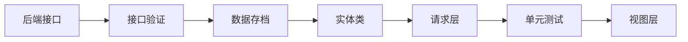

# Conversation 功能开发流程报告

> 本文档记录了 Flash IM 项目中，会话列表（Conversation）功能从 0 到 1 的完整 AI 辅助开发流程。
> 整个过程由开发者通过自然语言对话驱动，AI 负责代码实现。

## 一、开发流程总览



## 二、关键流程节点

### 1. 后端接口开发（Rust / axum）

在 `server/src/main.rs` 中定义 `/conversation` 接口，返回 20 条模拟会话数据。

关键点：
- 使用 `axum::Json` 自动序列化响应
- 数据结构：`title`、`avatar`、`last_msg`、`time`
- 头像使用 `picsum.photos` 随机图片服务

### 2. 接口验证（curl 请求）

通过 `curl` 直接请求后端接口，验证数据格式正确性。

```bash
curl -s http://192.168.1.75:9600/conversation
```

关键点：
- Windows PowerShell 中 `curl` 是 `Invoke-WebRequest` 的别名，需使用 `cmd /c curl` 调用真正的 curl
- 验证 JSON 结构符合预期后再进入前端开发

### 3. 数据存档

将接口返回数据保存为本地 JSON 文件，作为开发参考和离线调试依据。

```
docs/data/playground/conversation/list.json
```

关键点：
- 本地数据存档便于前端开发时对照字段
- 可作为 Mock 数据源，脱离后端独立开发

### 4. 实体类（Model）

```
client/lib/playground/conversation/model/conversation.dart
```

关键点：
- `fromJson` / `toJson` 双向序列化
- 字段命名转换：后端 `last_msg`（snake_case）→ 前端 `lastMsg`（camelCase）
- 使用 `const` 构造函数，不可变数据模型

### 5. 请求层（API）

```
client/lib/playground/conversation/api/conversation_api.dart
```

关键点：
- 使用 Dio 作为 HTTP 客户端
- `baseUrl` 从 `PlaygroundConfig` 读取，IP 和端口可配置
- 构造函数支持注入自定义 `Dio` 实例，便于测试时 Mock

### 6. 单元测试

```
client/test/playground/conversation/conversation_api_test.dart
```

测试覆盖：
- API 真实请求验证（集成测试）
- 数据字段非空校验
- Model 的 `fromJson` / `toJson` 正确性

```bash
flutter test test/playground/conversation/conversation_api_test.dart
# ✅ 4 tests passed
```

### 7. 视图层（View）

```
client/lib/playground/conversation/view/
├── conversation_page.dart    # 页面（FutureBuilder 异步加载）
└── conversation_tile.dart    # 单条会话组件
```

关键点：
- 参照微信会话列表 UI：头像 + 标题 + 最后消息 + 时间
- 组件拆分：页面逻辑与列表项渲染分离
- 图片加载失败有 fallback 占位

## 三、架构分层

```
playground/conversation/
├── model/              # 数据层：实体类定义
│   └── conversation.dart
├── api/                # 请求层：网络请求封装
│   └── conversation_api.dart
└── view/               # 视图层：UI 组件
    ├── conversation_page.dart
    └── conversation_tile.dart
```

遵循 Model → API → View 的单向依赖关系，各层职责清晰，可独立测试。

## 四、可配置化

```
playground/config.dart
```

IP 地址和端口集中管理，适应不同网络环境（如 Clash 代理导致 IP 变化）。

## 五、开发游乐场机制

整个 Conversation 功能开发在 `playground/` 目录下进行，与正式业务代码（`src/`）完全解耦：

- `flutter run` → 运行正式应用，不包含 playground 代码
- `flutter run -t lib/playground/main_playground.dart` → 运行游乐场

Release 打包时，playground 代码不会被编译进产物。

## 六、踩坑记录

| 问题 | 原因 | 解决方案 |
|------|------|----------|
| curl 在 PowerShell 中行为异常 | PS 的 curl 是 Invoke-WebRequest 别名 | 使用 `cmd /c curl` |
| 服务端 IP 显示为 198.18.0.1 | Clash 代理虚拟网卡优先匹配 | 过滤代理 IP，优先连局域网网关 |
| `type 'Null' is not a subtype of String` | 后端未重启，返回数据缺少新增字段 | 重启后端 / Model 字段加空安全处理 |
