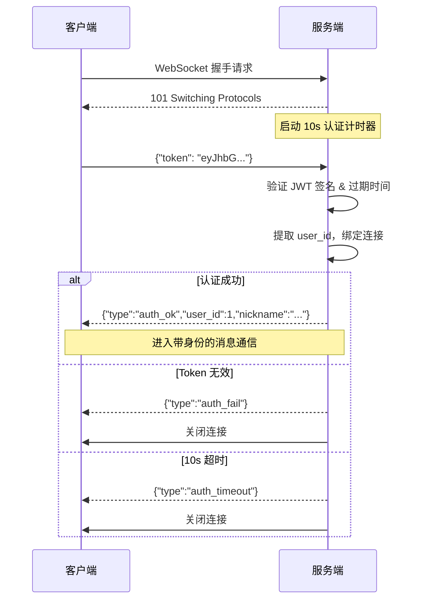
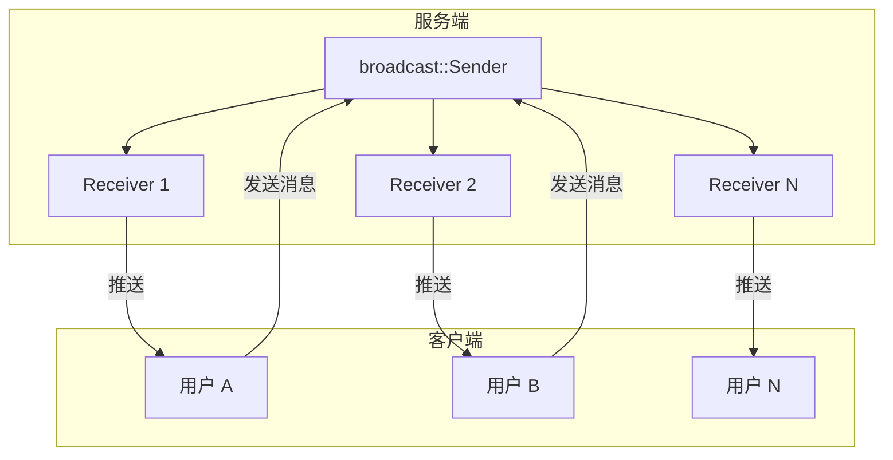
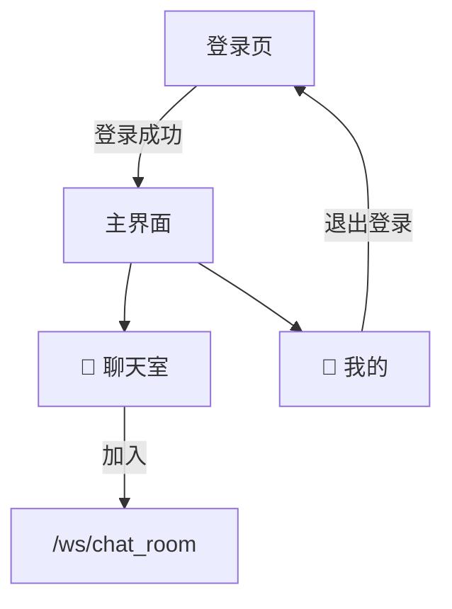
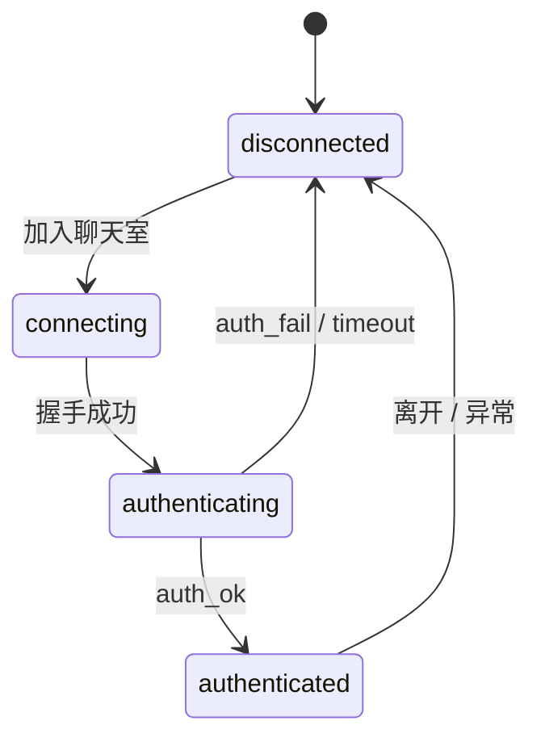
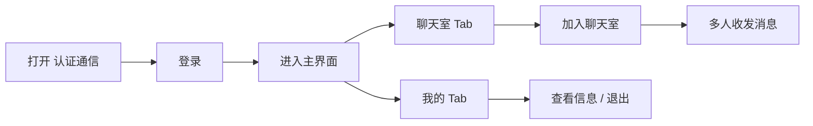

# WebSocket + JWT 认证整合 开发报告

> 模块名称：认证通信（ws_auth）  
> 日期：2026-03-15  
> 更新：增加聊天室广播 + 底部导航

---

## 一、需求背景

此前 Playground 中有两个独立模块：

| 模块 | 功能 | 缺陷 |
|------|------|------|
| 💓 心跳通信 | WebSocket 双向通信 | 匿名连接，无身份 |
| 🔐 用户认证 | HTTP 登录 + JWT | 仅 HTTP，未接入 WS |

在正式 IM 产品中，WebSocket 连接必须携带身份，且需要支持多人聊天。本次整合将两者打通，并实现聊天室广播。

---

## 二、技术方案

采用 **首消息认证（First-Message Auth）** 模式，参考 `flash_im-main` 参考项目的实现：



### 聊天室广播架构



使用 Tokio 的 `broadcast::channel` 实现多人消息广播。每个连接认证后订阅频道，发送的消息通过 `Sender` 广播给所有订阅者。

### 为什么不用 URL 参数传 Token？

`ws://host/ws?token=xxx` 会将 Token 暴露在服务器日志、代理日志中。首消息认证将 Token 放在 WebSocket 数据帧内，更安全。

---

## 三、实现清单

### 后端（Rust / Axum）

| 端点 | 功能 | 认证 |
|------|------|------|
| `/ws` | 基础 WebSocket（echo） | ❌ |
| `/ws/auth` | 认证 WebSocket（echo） | ✅ 首消息 JWT |
| `/ws/chat_room` | 聊天室广播 | ✅ 首消息 JWT |

`/ws/chat_room` 新增能力：
- `broadcast::channel` 多人消息广播
- `join` / `leave` 事件通知
- `socket.split()` 读写分离，独立 task 处理收发

消息协议：

```json
{"type":"auth_ok","user_id":1,"nickname":"13800138000"}
{"type":"message","user_id":1,"nickname":"13800138000","text":"hello"}
{"type":"join","user_id":1,"nickname":"13800138000"}
{"type":"leave","user_id":1,"nickname":"13800138000"}
```

### 前端（Flutter）

页面结构改为底部导航：



| 文件 | 说明 |
|------|------|
| `ws_auth/api/ws_auth_api.dart` | 通信层，支持 `/ws/auth` 和 `/ws/chat_room` |
| `ws_auth/view/ws_auth_page.dart` | 登录 + BottomNavigationBar（聊天室 / 我的） |

前端连接状态机：



---

## 四、目录结构

```
client/lib/playground/
├── ws_auth/
│   ├── api/
│   │   └── ws_auth_api.dart      # 支持 /ws/auth + /ws/chat_room
│   └── view/
│       └── ws_auth_page.dart     # 登录 → 底部导航（聊天室 + 我的）
└── playground_page.dart          # 入口 🔗 认证通信

server/src/
└── main.rs                       # /ws/auth + /ws/chat_room
```

---

## 五、测试验证

### 聊天室测试（多终端）

```bash
# 终端 1：用户 A 登录
curl -s -X POST http://localhost:9600/auth/sms -H "Content-Type: application/json" -d '{"phone":"13800000001"}'
curl -s -X POST http://localhost:9600/auth/login -H "Content-Type: application/json" -d '{"phone":"13800000001","code":"CODE_A"}'
# 拿到 TOKEN_A

# 终端 2：用户 B 登录
curl -s -X POST http://localhost:9600/auth/sms -H "Content-Type: application/json" -d '{"phone":"13800000002"}'
curl -s -X POST http://localhost:9600/auth/login -H "Content-Type: application/json" -d '{"phone":"13800000002","code":"CODE_B"}'
# 拿到 TOKEN_B

# 终端 1：用户 A 加入聊天室
wscat -c ws://localhost:9600/ws/chat_room
> {"token":"TOKEN_A"}
< {"type":"auth_ok",...}

# 终端 2：用户 B 加入聊天室
wscat -c ws://localhost:9600/ws/chat_room
> {"token":"TOKEN_B"}
< {"type":"auth_ok",...}
< {"type":"join",...}     # A 收到 B 加入通知

# 用户 A 发消息，B 也能收到
> hello
< {"type":"message","user_id":1,"nickname":"13800000001","text":"hello"}
```

### 前端操作流程



---

## 六、Playground 进度总览

| # | 模块 | 练习点 | 状态 |
|---|------|--------|------|
| 1 | 🎆 烟花秀 | Canvas & 粒子系统 | ✅ |
| 2 | 💬 会话列表 | HTTP 请求 & 列表渲染 | ✅ |
| 3 | 💓 心跳通信 | WebSocket 双向通信 | ✅ |
| 4 | 🔐 用户认证 | JWT 登录 & Token 鉴权 | ✅ |
| 5 | 🔗 认证通信 | WS+JWT 整合 + 聊天室广播 | ✅ |
