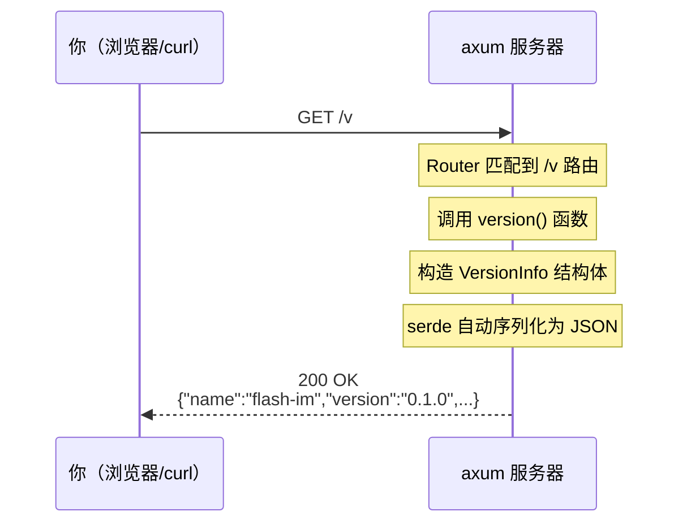

# 你的第一个 axum 接口：GET /v 版本号

> 面向 Rust 新手的保姆级指南，从零到运行只需 5 分钟

---

## 前置准备

在开始之前，确保你的电脑上已经安装了 Rust 工具链：

```bash
# 安装 Rust（如果还没有的话）
curl --proto '=https' --tlsv1.2 -sSf https://sh.rustup.rs | sh

# 验证安装
rustc --version
cargo --version
```

---

## 项目结构

```
server/
├── Cargo.toml          # 项目配置 + 依赖声明（类似 package.json）
└── src/
    └── main.rs          # 程序入口
```

就两个文件，没有更多了。

---

## 逐行解读 Cargo.toml

```toml
[package]
name = "flash-im"       # 项目名称
version = "0.1.0"       # 版本号（会被代码读取）
edition = "2024"         # Rust 版本规范

[dependencies]
axum = "0.8"                                    # Web 框架
tokio = { version = "1", features = ["full"] }  # 异步运行时
serde = { version = "1", features = ["derive"] }# 序列化框架
serde_json = "1"                                # JSON 支持
```

类比理解：
- `Cargo.toml` 就像 Node.js 的 `package.json`
- `cargo` 就像 `npm`
- `crates.io` 就像 `npmjs.com`

---

## 逐行解读 main.rs

```rust
use axum::{Router, routing::get};
use serde::Serialize;
```

- `axum::Router` — 路由器，用来定义"什么路径对应什么处理函数"
- `axum::routing::get` — 声明这是一个 GET 请求
- `serde::Serialize` — 让结构体可以自动转成 JSON

```rust
/// 系统版本信息
#[derive(Serialize)]
struct VersionInfo {
    name: &'static str,
    version: &'static str,
    rust_version: &'static str,
}
```

- `#[derive(Serialize)]` — 自动为这个结构体生成 JSON 序列化代码
- `&'static str` — 静态字符串引用，编译时就确定的文本，不需要堆分配

```rust
/// GET /v — 返回系统版本号
async fn version() -> axum::Json<VersionInfo> {
    axum::Json(VersionInfo {
        name: env!("CARGO_PKG_NAME"),
        version: env!("CARGO_PKG_VERSION"),
        rust_version: env!("CARGO_PKG_RUST_VERSION", "unknown"),
    })
}
```

- `async fn` — 异步函数，axum 的处理函数都是异步的
- `axum::Json<T>` — 返回值会自动设置 `Content-Type: application/json`
- `env!("CARGO_PKG_VERSION")` — 编译时宏，自动读取 `Cargo.toml` 中的 `version` 字段
- 这意味着你改了 `Cargo.toml` 里的版本号，接口返回值自动更新，不需要手动同步

```rust
#[tokio::main]
async fn main() {
    let app = Router::new().route("/v", get(version));

    let addr = "0.0.0.0:9600";
    println!("🚀 Flash IM server listening on http://{addr}");

    let listener = tokio::net::TcpListener::bind(addr).await.unwrap();
    axum::serve(listener, app).await.unwrap();
}
```

- `#[tokio::main]` — 启动 Tokio 异步运行时（类似 Go 的 goroutine 调度器）
- `Router::new().route("/v", get(version))` — 注册路由：GET /v → version 函数
- `TcpListener::bind` — 绑定端口，开始监听
- `axum::serve` — 启动 HTTP 服务

---

## 运行

```bash
# 进入 server 目录
cd server

# 编译并运行（首次会下载依赖，需要等一会儿）
cargo run
```

看到这行输出就说明成功了：

```
🚀 Flash IM server listening on http://0.0.0.0:9600
```

---

## 测试

打开另一个终端，用 curl 测试：

```bash
curl http://localhost:9600/v
```

你会看到类似这样的 JSON 响应：

```json
{
  "name": "flash-im",
  "version": "0.1.0",
  "rust_version": "unknown"
}
```

或者直接在浏览器打开 `http://localhost:9600/v`。

---

## 整体流程



---

## 概念对照表

如果你有其他语言的经验，这张表帮你快速建立映射：

| 概念 | Rust / axum | Node.js / Express | Go / Gin | Python / FastAPI |
|------|-------------|-------------------|----------|-----------------|
| 包管理器 | cargo | npm | go mod | pip |
| 依赖文件 | Cargo.toml | package.json | go.mod | requirements.txt |
| 路由定义 | `Router::new().route()` | `app.get()` | `r.GET()` | `@app.get()` |
| 异步运行时 | tokio | 内置 event loop | goroutine | asyncio |
| JSON 序列化 | serde | 内置 JSON | encoding/json | pydantic |
| 启动服务 | `axum::serve()` | `app.listen()` | `r.Run()` | `uvicorn.run()` |

---

## 常用 cargo 命令

```bash
cargo run          # 编译并运行
cargo build        # 只编译不运行
cargo check        # 快速检查语法（不生成二进制，比 build 快很多）
cargo build -r     # Release 模式编译（优化后的生产版本）
cargo clippy       # 代码质量检查（类似 ESLint）
cargo fmt          # 自动格式化代码
cargo add axum     # 添加依赖（类似 npm install）
```

开发时推荐用 `cargo check` 而不是 `cargo build`，速度快很多，只检查不生成二进制。

---

## 下一步

你已经有了一个能跑的 axum 服务。接下来可以：

- 添加更多路由（用户注册、登录等）
- 接入数据库（sqlx + PostgreSQL）
- 添加 WebSocket 支持（axum 内置）
- 添加中间件（日志、认证、限流）

每一步都可以在这个基础上渐进式地添加，不需要推翻重来。
