# 闪讯功能网络

> 功能不是散落的珠子，而是一张有结构、有层次、有关联的网。
> 本文档维护项目最新的功能网络全貌，随版本迭代持续更新。

最后更新：v0.0.3（消息收发）

---

## 一、功能节点编号

每个功能是网络中的一个节点，用唯一编号标识。编号规则：`{层级缩写}-{序号}`。

### 基础设施层（I）

| 编号 | 功能节点 | 模块 | 端 | 版本 | 状态 |
|------|---------|------|-----|------|------|
| I-01 | 应用状态管理 | flash-core | 后端 | v0.0.1 | ✅ |
| I-02 | 手机号登录 | flash-auth | 后端 | v0.0.1 | ✅ |
| I-03 | Token 签发与验证 | flash-auth | 后端 | v0.0.1 | ✅ |
| I-04 | 用户资料管理 | flash-user | 后端 | v0.0.1 | ✅ |
| I-05 | WebSocket 连接管理 | im-ws | 后端 | v0.0.1 | ✅ |
| I-06 | 帧协议编解码 | im-ws | 后端 | v0.0.1 | ✅ |
| I-07 | 心跳保活 | im-ws | 后端 | v0.0.1 | ✅ |
| I-08 | 在线用户管理 | im-ws (WsState) | 后端 | v0.0.3 | ✅ |
| I-09 | 帧分发器 | im-ws (dispatcher) | 后端 | v0.0.3 | ✅ |

### 领域层（D）

| 编号 | 功能节点 | 模块 | 端 | 版本 | 状态 |
|------|---------|------|-----|------|------|
| D-01 | 会话创建 | im-conversation | 后端 | v0.0.2 | ✅ |
| D-02 | 会话列表查询 | im-conversation | 后端 | v0.0.2 | ✅ |
| D-03 | 会话删除 | im-conversation | 后端 | v0.0.2 | ✅ |
| D-04 | 未读数管理 | im-conversation | 后端 | v0.0.3 | ✅ |
| D-05 | 标记已读 | im-conversation | 后端 | v0.0.3 | ✅ |
| D-06 | 消息存储 | im-message | 后端 | v0.0.3 | ✅ |
| D-07 | 序列号生成 | im-message (seq_gen) | 后端 | v0.0.3 | ✅ |
| D-08 | 消息广播 | im-message (broadcaster) | 后端 | v0.0.3 | ✅ |
| D-09 | 历史消息查询 | im-message | 后端 | v0.0.3 | ✅ |
| D-10 | 会话更新推送 | im-message (broadcaster) | 后端 | v0.0.3 | ✅ |
| D-11 | 获取单个会话详情 | im-conversation | 后端 | v0.0.3-p1 | ✅ |

### 前端基础层（F）

| 编号 | 功能节点 | 模块 | 版本 | 状态 |
|------|---------|------|------|------|
| F-01 | 登录注册页 | flash_auth | v0.0.1 | ✅ |
| F-02 | 用户会话状态 | flash_session | v0.0.1 | ✅ |
| F-03 | 启动流程框架 | flash_starter | v0.0.1 | ✅ |
| F-04 | WsClient 连接与认证 | flash_im_core | v0.0.1 | ✅ |
| F-05 | WsClient 心跳与重连 | flash_im_core | v0.0.1 | ✅ |
| F-06 | WsClient 帧分发 | flash_im_core | v0.0.3 | ✅ |
| F-07 | 共享头像组件 | flash_shared | v0.0.3 | ✅ |

### 前端业务层（P）

| 编号 | 功能节点 | 模块 | 版本 | 状态 |
|------|---------|------|------|------|
| P-01 | 会话列表展示 | flash_im_conversation | v0.0.2 | ✅ |
| P-02 | 会话列表分页加载 | flash_im_conversation | v0.0.2 | ✅ |
| P-03 | 会话实时更新 | flash_im_conversation | v0.0.3 | ✅ |
| P-04 | 未读数角标 | flash_im_conversation | v0.0.3 | ✅ |
| P-05 | 进入聊天清除未读 | flash_im_conversation | v0.0.3 | ✅ |
| P-06 | 聊天页（历史消息加载） | flash_im_chat | v0.0.3 | ✅ |
| P-07 | 消息发送（乐观更新） | flash_im_chat | v0.0.3 | ✅ |
| P-08 | 实时消息接收 | flash_im_chat | v0.0.3 | ✅ |
| P-09 | 消息状态流转 | flash_im_chat | v0.0.3 | ✅ |
| P-10 | 未知会话骨架处理 | flash_im_conversation | v0.0.3-p1 | ✅ |


---

## 二、全局功能网

### 后端依赖层级

```
Level 0: flash-core (I-01)
Level 1: flash-auth (I-02,I-03) | flash-user (I-04) | im-conversation (D-01~D-05)
Level 2: im-message (D-06~D-10) → 依赖 im-conversation
Level 3: im-ws (I-05~I-09) → 依赖 im-message
Level 4: main.rs → 组装所有模块
```

### 前端依赖层级

```
Level 0: flash_shared (F-07) | flash_starter (F-03)
Level 1: flash_auth (F-01) | flash_session (F-02) | flash_im_core (F-04~F-06)
Level 2: flash_im_conversation (P-01~P-05) → 依赖 flash_session + flash_im_core
         flash_im_chat (P-06~P-09) → 依赖 flash_im_core + flash_shared
Level 3: main.dart → 组装所有模块
```

### 全局网络图

```mermaid
graph TB
    subgraph 后端基础设施层
        I01[I-01 应用状态]
        I02[I-02 手机号登录]
        I03[I-03 Token验证]
        I04[I-04 用户资料]
        I05[I-05 WS连接]
        I08[I-08 在线用户]
        I09[I-09 帧分发器]
    end
    subgraph 后端领域层
        D01[D-01 会话创建]
        D02[D-02 会话查询]
        D03[D-03 会话删除]
        D04[D-04 未读数管理]
        D05[D-05 标记已读]
        D06[D-06 消息存储]
        D07[D-07 序列号生成]
        D08[D-08 消息广播]
        D09[D-09 历史消息]
        D10[D-10 会话更新推送]
        D11[D-11 会话详情查询]
    end
    subgraph 前端基础层
        F01[F-01 登录注册页]
        F02[F-02 用户会话]
        F03[F-03 启动流程]
        F04[F-04 WS连接认证]
        F05[F-05 心跳重连]
        F06[F-06 帧分发]
        F07[F-07 共享头像]
    end
    subgraph 前端业务层
        P01[P-01 会话列表]
        P02[P-02 分页加载]
        P03[P-03 会话实时更新]
        P04[P-04 未读角标]
        P05[P-05 清除未读]
        P06[P-06 历史消息]
        P07[P-07 消息发送]
        P08[P-08 实时接收]
        P09[P-09 状态流转]
        P10[P-10 未知会话骨架]
    end

    %% 后端：模块间依赖
    I02 --> I01
    I03 --> I01
    I04 --> I01
    I05 --> I01
    I05 --> I03
    I08 --> I05
    I09 --> I05
    D01 --> I01
    D02 --> I01
    D03 --> I01
    D06 --> D07
    D06 --> I01
    D08 -->|broadcaster trait| I08
    D10 --> I08
    D08 --> D04
    D10 --> D04
    D11 --> I01
    I09 -->|调用 service.send| D06

    %% 前端：模块间依赖
    F03 --> F01
    F03 --> F02
    F05 --> F04
    P01 --> F07
    P01 --> F06
    P02 --> P01
    P03 --> F06
    P04 --> P03
    P05 --> P01
    P06 --> F07
    P07 --> F06
    P08 --> F06
    P08 --> F07
    P09 --> P07
    P09 --> P08
    P10 --> P03
    P10 -.->|HTTP| D11

    %% 跨端：协议连接（虚线）
    F01 -.->|HTTP| I02
    F02 -.->|HTTP| I04
    F04 -.->|WebSocket| I05
    P01 -.->|HTTP| D02
    P05 -.->|HTTP| D05
    P06 -.->|HTTP| D09
```



---

## 三、存档记录

| 存档版本 | 日期 | 节点数 | 详情 |
|---------|------|--------|------|
| v0.1.0 | 2026-03-13 | 0 | [trace/v0.1.0_2026-03-13.md](trace/v0.1.0_2026-03-13.md) |
| v0.2.0 | 2026-03-15 | 0 | [trace/v0.2.0_2026-03-15.md](trace/v0.2.0_2026-03-15.md) |
| v0.3.0 | 2026-03-15 | 0 | [trace/v0.3.0_2026-03-15.md](trace/v0.3.0_2026-03-15.md) |
| v0.4.0 | 2026-03-21 | 3 | [trace/v0.4.0_2026-03-21.md](trace/v0.4.0_2026-03-21.md) |
| v0.5.0 | 2026-03-22 | 6 | [trace/v0.5.0_2026-03-22.md](trace/v0.5.0_2026-03-22.md) |
| v0.6.0 | 2026-03-26 | 8 | [trace/v0.6.0_2026-03-26.md](trace/v0.6.0_2026-03-26.md) |
| v0.7.0 | 2026-03-29 | 15 | [trace/v0.7.0_2026-03-29.md](trace/v0.7.0_2026-03-29.md) |
| v0.8.0 | 2026-03-30 | 20 | [trace/v0.8.0_2026-03-30.md](trace/v0.8.0_2026-03-30.md) |
| v0.9.0 | 2026-04-02 | 29 | [trace/v0.9.0_2026-04-02.md](trace/v0.9.0_2026-04-02.md) |
| v0.10.0 | 2026-04-04 | 35 | [trace/v0.10.0_2026-04-04.md](trace/v0.10.0_2026-04-04.md) |
| v0.10.1 | 2026-04-06 | 37 | [trace/v0.10.1_2026-04-06.md](trace/v0.10.1_2026-04-06.md) |

---

## 域文件索引

各功能域的局域网络（节点详情、边界接口、数据流向）见子文件：

| 域 | 文件 | 涉及节点 |
|----|------|---------|
| 认证与用户 | [auth.md](modules/auth.md) | I-01~I-04, F-01~F-03 |
| WebSocket 通信 | [ws.md](modules/ws.md) | I-05~I-09, F-04~F-06 |
| 会话 | [conversation.md](modules/conversation.md) | D-01~D-05, P-01~P-05 |
| 消息 | [message.md](modules/message.md) | D-06~D-10, P-06~P-09, F-07 |
