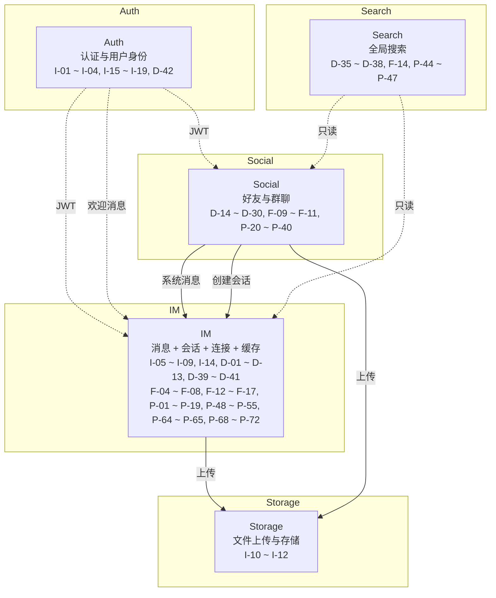
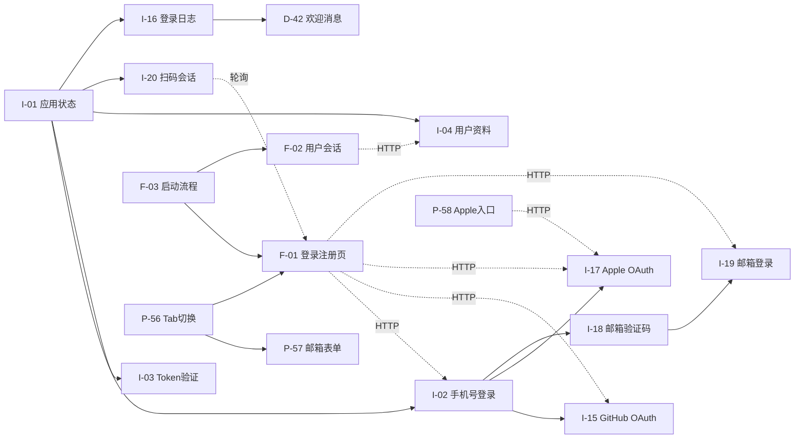
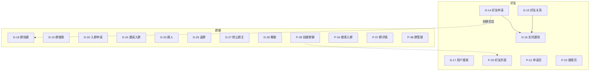
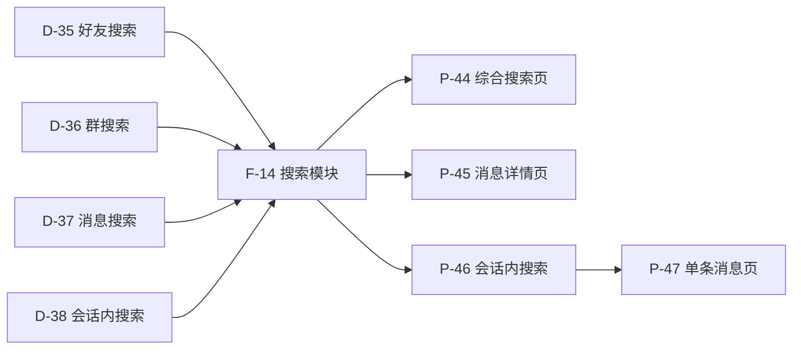
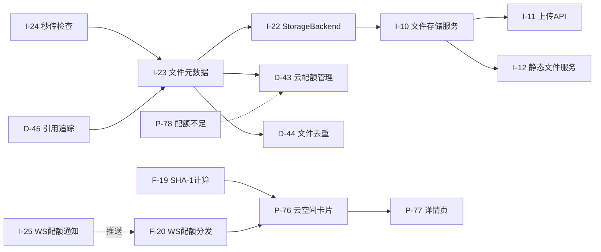
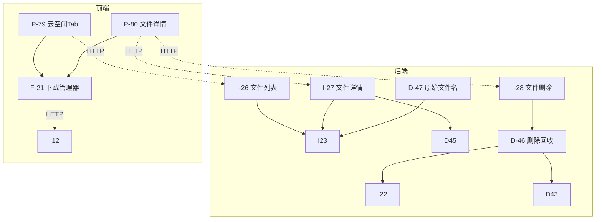

# 闪讯功能网络

> 功能不是散落的珠子，而是一张有结构、有层次、有关联的网。
> 本文档维护项目最新的功能网络全貌，随版本迭代持续更新。

最后更新：v0.37.0（云空间独立 Tab：文件列表/详情/删除 + 全局下载管理器 + 分色圆环配额 + 吸顶 Tab）

---

## 一、功能节点编号

每个功能是网络中的一个节点，用唯一编号标识。编号规则：`{层级缩写}-{序号}`。

### 基础设施层（I）

| 编号 | 功能节点 | 模块 | 端 | 版本 | 状态 |
|------|---------|------|-----|------|------|
| I-01 | 应用状态管理 | flash-core | 后端 | v0.0.1 | ✅ |
| I-02 | 手机号登录 | flash-auth | 后端 | v0.0.1 | ✅ |
| I-03 | Token 签发与验证 | flash-auth | 后端 | v0.0.1 | ✅ |
| I-04 | 用户资料管理 | flash-user | 后端 | v0.0.1 | ✅ |
| I-05 | WebSocket 连接管理 | im-ws | 后端 | v0.0.1 | ✅ |
| I-06 | 帧协议编解码 | im-ws | 后端 | v0.0.1 | ✅ |
| I-07 | 心跳保活 | im-ws | 后端 | v0.0.1 | ✅ |
| I-08 | 在线用户管理 | im-ws (WsState) | 后端 | v0.0.3 | ✅ |
| I-09 | 帧分发器 | im-ws (dispatcher) | 后端 | v0.0.3 | ✅ |
| I-10 | 文件存储服务 | app-storage (service) | 后端 | v0.0.4_media | ✅ |
| I-11 | 文件上传 API | app-storage (api) | 后端 | v0.0.4_media | ✅ |
| I-12 | 静态文件服务 | main.rs (tower-http) | 后端 | v0.0.4_media | ✅ |
| I-13 | AppError 统一错误处理 | flash-core | 后端 | v0.0.3_group | ✅ |
| I-14 | 本地数据库 | flash_im_cache (drift + SQLite) | 前端 | v0.0.1_cache | ✅ |
| I-15 | GitHub OAuth 登录 | flash-auth (oauth/github) | 后端 | v0.23.0 | ✅ |
| I-16 | 登录日志记录 | flash-auth (login_log) | 后端 | v0.23.0 | ✅ |
| I-17 | Apple OAuth 登录 | flash-auth (oauth/apple) | 后端 | v0.25.0 | ✅ |
| I-18 | 邮箱验证码发送 | flash-auth (email/sender) | 后端 | v0.25.0 | ✅ |
| I-19 | 邮箱登录 | flash-auth (handler) | 后端 | v0.25.0 | ✅ |
| I-20 | 扫码会话管理 | flash-auth (handler) | 后端 | v0.27.0 | ✅ |
| I-21 | 版本信息管理 | app-center | 后端 | v0.31.0 | ✅ |
| I-22 | StorageBackend 存储抽象 | app-storage (backend) | 后端 | v0.0.6_file_system | ✅ |
| I-23 | 文件元数据服务 | app-storage (repository+service) | 后端 | v0.0.6_file_system | ✅ |
| I-24 | 秒传检查接口 | app-storage (api) | 后端 | v0.0.6_file_system | ✅ |
| I-25 | WS 配额通知 | main.rs + im-ws (proto) | 后端 | v0.0.6_file_system | ✅ |
| I-26 | 文件列表查询接口 | app-storage (api) | 后端 | cloud/v0.0.1 | ✅ |
| I-27 | 文件详情查询接口 | app-storage (api) | 后端 | cloud/v0.0.1 | ✅ |
| I-28 | 文件删除接口 | app-storage (api) | 后端 | cloud/v0.0.1 | ✅ |

### 领域层（D）

| 编号 | 功能节点 | 模块 | 端 | 版本 | 状态 |
|------|---------|------|-----|------|------|
| D-01 | 会话创建 | im-conversation | 后端 | v0.0.2 | ✅ |
| D-02 | 会话列表查询 | im-conversation | 后端 | v0.0.2 | ✅ |
| D-03 | 会话删除 | im-conversation | 后端 | v0.0.2 | ✅ |
| D-04 | 未读数管理 | im-conversation | 后端 | v0.0.3 | ✅ |
| D-05 | 标记已读 | im-conversation | 后端 | v0.0.3 | ✅ |
| D-06 | 消息存储 | im-message | 后端 | v0.0.3 | ✅ |
| D-07 | 序列号生成 | im-message (seq_gen) | 后端 | v0.0.3 | ✅ |
| D-08 | 消息广播 | im-message (broadcaster) | 后端 | v0.0.3 | ✅ |
| D-09 | 历史消息查询 | im-message | 后端 | v0.0.3 | ✅ |
| D-10 | 会话更新推送 | im-message (broadcaster) | 后端 | v0.0.3 | ✅ |
| D-11 | 获取单个会话详情 | im-conversation | 后端 | v0.0.3-p1 | ✅ |
| D-12 | 富媒体消息存储 | im-message (models/repository) | 后端 | v0.0.4_media | ✅ |
| D-13 | 消息预览生成 | im-message (models) | 后端 | v0.0.4_media | ✅ |
| D-14 | 好友申请管理 | im-friend | 后端 | v0.0.1_friend | ✅ |
| D-15 | 好友关系管理 | im-friend | 后端 | v0.0.1_friend | ✅ |
| D-16 | 好友实时通知 | im-friend + im-ws (dispatcher) | 后端 | v0.0.1_friend | ✅ |
| D-17 | 用户搜索/资料 | flash-user | 后端 | v0.0.1_friend | ✅ |
| D-18 | 群聊创建 | im-group | 后端 | v0.0.1_group | ✅ |
| D-19 | 群搜索 | im-group | 后端 | v0.0.2_group | ✅ |
| D-20 | 入群申请 | im-group | 后端 | v0.0.2_group | ✅ |
| D-21 | 入群审批 | im-group | 后端 | v0.0.2_group | ✅ |
| D-22 | 入群通知查询 | im-group | 后端 | v0.0.2_group | ✅ |
| D-23 | 群成员查询与设置 | im-group | 后端 | v0.0.2_group | ✅ |
| D-24 | 邀请入群 | im-group | 后端 | v0.0.3_group | ✅ |
| D-25 | 踢人 | im-group | 后端 | v0.0.3_group | ✅ |
| D-26 | 退出群聊 | im-group | 后端 | v0.0.3_group | ✅ |
| D-27 | 转让群主 | im-group | 后端 | v0.0.3_group | ✅ |
| D-28 | 解散群聊 | im-group | 后端 | v0.0.3_group | ✅ |
| D-29 | 群公告 | im-group | 后端 | v0.0.3_group | ✅ |
| D-30 | 修改群名 | im-group | 后端 | v0.0.3_group | ✅ |
| D-31 | 在线状态广播 | im-ws (dispatcher) | 后端 | v0.0.1_presence | ✅ |
| D-32 | 在线列表推送 | im-ws (dispatcher) | 后端 | v0.0.1_presence | ✅ |
| D-33 | 已读回执处理 | im-ws (handler) | 后端 | v0.0.1_presence | ✅ |
| D-34 | 已读详情查询 | im-message (routes) | 后端 | v0.0.1_presence | ✅ |
| D-35 | 好友搜索 | im-friend (api) | 后端 | v0.0.1_search | ✅ |
| D-36 | 已加入群搜索 | im-conversation (routes) | 后端 | v0.0.1_search | ✅ |
| D-37 | 消息搜索 | im-message (routes) | 后端 | v0.0.1_search | ✅ |
| D-38 | 会话内消息搜索 | im-message (routes) | 后端 | v0.0.1_search | ✅ |
| D-39 | 增量消息查询 | im-message (routes) | 后端 | v0.0.1_cache | ✅ |
| D-40 | 消息撤回 | im-message (routes) | 后端 | v0.0.1_operation | ✅ |
| D-41 | 语音消息类型 | im-message (models) | 后端 | v0.22.0 | ✅ |
| D-42 | 欢迎消息 | flash-auth (welcome) | 后端 | v0.23.0 | ✅ |
| D-43 | 用户云配额管理 | app-storage (service+repository) | 后端 | v0.0.6_file_system | ✅ |
| D-44 | 文件去重（秒传） | app-storage (service) | 后端 | v0.0.6_file_system | ✅ |
| D-45 | 文件引用追踪 | im-message (service) + app-storage | 后端 | v0.0.6_file_system | ✅ |
| D-46 | 文件删除与配额回收 | app-storage (service) | 后端 | cloud/v0.0.1 | ✅ |
| D-47 | 原始文件名存储 | app-storage (service) | 后端 | cloud/v0.0.1 | ✅ |

### 前端基础层（F）

| 编号 | 功能节点 | 模块 | 版本 | 状态 |
|------|---------|------|------|------|
| F-01 | 登录注册页 | flash_auth | v0.0.1 | ✅ |
| F-02 | 用户会话状态 | flash_session | v0.0.1 | ✅ |
| F-03 | 启动流程框架 | flash_starter | v0.0.1 | ✅ |
| F-04 | WsClient 连接与认证 | flash_im_core | v0.0.1 | ✅ |
| F-05 | WsClient 心跳与重连 | flash_im_core | v0.0.1 | ✅ |
| F-06 | WsClient 帧分发 | flash_im_core | v0.0.3 | ✅ |
| F-07 | 共享头像组件 | flash_shared | v0.0.3 | ✅ |
| F-08 | 视频信息提取 | flash_im_chat (video_thumbnail_service) | v0.0.4_media | ✅ |
| F-09 | 好友WS流分发 | flash_im_core | v0.0.1_friend | ✅ |
| F-10 | 群通知WS帧分发 | flash_im_core | v0.0.2_group | ✅ |
| F-11 | GROUP_INFO_UPDATE WS 帧分发 | flash_im_core | v0.0.3_group | ✅ |
| F-12 | 在线状态 WS 帧分发 | flash_im_core | v0.0.1_presence | ✅ |
| F-13 | 已读回执 WS 帧分发 | flash_im_core | v0.0.1_presence | ✅ |
| F-14 | 搜索模块 | flash_im_search | v0.0.1_search | ✅ |
| F-15 | LocalStore | flash_im_cache (local_store) | v0.0.1_cache | ✅ |
| F-16 | SyncEngine | flash_im_cache (sync_engine) | v0.0.1_cache | ✅ |
| F-17 | MESSAGE_RECALLED WS 帧分发 | flash_im_core | v0.0.1_operation | ✅ |
| F-18 | 文件缓存管理器 | flash_im_cache (file_cache_manager) | v0.33.0 | ✅ |
| F-19 | 文件 SHA-1 计算 | flash_im_chat (file_hash) | v0.0.6_file_system | ✅ |
| F-20 | WS 配额通知分发 | flash_im_core (ws_client) | v0.0.6_file_system | ✅ |
| F-21 | 全局下载管理器 | flash_cloud (cloud_download_manager) | cloud/v0.0.1 | ✅ |

### 前端业务层（P）

| 编号 | 功能节点 | 模块 | 版本 | 状态 |
|------|---------|------|------|------|
| P-01 | 会话列表展示 | flash_im_conversation | v0.0.2 | ✅ |
| P-02 | 会话列表分页加载 | flash_im_conversation | v0.0.2 | ✅ |
| P-03 | 会话实时更新 | flash_im_conversation | v0.0.3 | ✅ |
| P-04 | 未读数角标 | flash_im_conversation | v0.0.3 | ✅ |
| P-05 | 进入聊天清除未读 | flash_im_conversation | v0.0.3 | ✅ |
| P-06 | 聊天页（历史消息加载） | flash_im_chat | v0.0.3 | ✅ |
| P-07 | 消息发送（乐观更新） | flash_im_chat | v0.0.3 | ✅ |
| P-08 | 实时消息接收 | flash_im_chat | v0.0.3 | ✅ |
| P-09 | 消息状态流转 | flash_im_chat | v0.0.3 | ✅ |
| P-10 | 未知会话骨架处理 | flash_im_conversation | v0.0.3-p1 | ✅ |
| P-11 | 功能面板 | flash_im_chat (chat_input) | v0.0.4_media | ✅ |
| P-12 | 图片消息气泡 | flash_im_chat (message_bubble) | v0.0.4_media | ✅ |
| P-13 | 视频消息气泡 | flash_im_chat (message_bubble) | v0.0.4_media | ✅ |
| P-14 | 文件消息气泡 | flash_im_chat (message_bubble) | v0.0.4_media | ✅ |
| P-15 | 图片发送流程 | flash_im_chat (chat_cubit) | v0.0.4_media | ✅ |
| P-16 | 视频发送流程 | flash_im_chat (chat_cubit) | v0.0.4_media | ✅ |
| P-17 | 文件发送流程 | flash_im_chat (chat_cubit) | v0.0.4_media | ✅ |
| P-18 | 视频播放页 | flash_im_chat (video_player_page) | v0.0.4_media | ✅ |
| P-19 | 图片全屏预览 | flash_im_chat (image_preview_page) | v0.0.4_media | ✅ |
| P-20 | 好友列表页 | flash_im_friend (friend_list_page) | v0.0.1_friend | ✅ |
| P-21 | 好友申请页 | flash_im_friend (friend_request_page) | v0.0.1_friend | ✅ |
| P-22 | 用户搜索页 | flash_im_friend (user_search_page) | v0.0.1_friend | ✅ |
| P-23 | 好友申请通知 | flash_im_friend (friend_cubit) | v0.0.1_friend | ✅ |
| P-24 | 好友详情页 | flash_im_friend (friend_detail_page) | v0.0.1_friend | ✅ |
| P-25 | 添加朋友页 | flash_im_friend (add_friend_page) | v0.0.1_friend | ✅ |
| P-26 | 陌生人资料页 | flash_im_friend (user_profile_page) | v0.0.1_friend | ✅ |
| P-27 | 扫码页 | flash_im_friend (scan_page) | v0.0.1_friend | ✅ |
| P-28 | 创建群聊页 | flash_im_group (create_group_page) | v0.0.1_group | ✅ |
| P-29 | 我的群聊页 | flash_im_group (my_groups_page) | v0.0.1_group | ✅ |
| P-31 | 单聊详情页 | flash_im_chat (private_chat_info_page) | v0.0.1_group | ✅ |
| P-32 | 群聊消息气泡适配 | flash_im_chat (message_bubble) | v0.0.1_group | ✅ |
| P-33 | 群聊会话列表适配 | flash_im_conversation (conversation_tile) | v0.0.1_group | ✅ |
| P-34 | 群搜索与入群 | flash_im_group (search_group_page) | v0.0.2_group | ✅ |
| P-35 | 群通知页 | flash_im_group (group_notifications_page) | v0.0.2_group | ✅ |
| P-36 | 群通知角标 | flash_im_group (group_notification_cubit) | v0.0.2_group | ✅ |
| P-37 | 群聊详情页 | flash_im_group (group_chat_info_page) | v0.0.2_group | ✅ |
| P-38 | 群详情页扩展 | flash_im_group (group_chat_info_page) | v0.0.3_group | ✅ |
| P-39 | 邀请入群选人页 | flash_im_group (member_picker_page) | v0.0.3_group | ✅ |
| P-40 | 群公告页 | flash_im_group (group_announcement_page) | v0.0.3_group | ✅ |
| P-41 | 在线状态展示 | flash_im_friend + flash_im_chat + flash_im_conversation | v0.0.1_presence | ✅ |
| P-42 | 已读回执展示 | flash_im_chat (message_bubble + read_receipt_detail) | v0.0.1_presence | ✅ |
| P-43 | 已读回执上报 | flash_im_chat (chat_cubit) | v0.0.1_presence | ✅ |
| P-44 | 综合搜索页 | flash_im_search (search_page) | v0.0.1_search | ✅ |
| P-45 | 消息搜索详情页 | flash_im_search (message_detail_page) | v0.0.1_search | ✅ |
| P-46 | 会话内搜索页 | flash_im_search (conversation_search_page) | v0.0.1_search | ✅ |
| P-47 | 单条消息详情页 | flash_im_search (single_message_page) | v0.0.1_search | ✅ |
| P-48 | 长按菜单 | flash_im_chat (message_action_menu) | v0.0.1_operation | ✅ |
| P-49 | 消息撤回展示 | flash_im_chat (chat_cubit) | v0.0.1_operation | ✅ |
| P-50 | 引用回复 | flash_im_chat (reply_bubble + reply_preview_bar) | v0.0.1_operation | ✅ |
| P-51 | 多选模式 | flash_im_chat (chat_cubit + chat_page) | v0.0.1_operation | ✅ |
| P-52 | 本地删除 | flash_im_chat (chat_cubit) + flash_im_cache (local_trash) | v0.0.1_operation | ✅ |
| P-53 | 删除确认弹窗 | flash_im_chat (chat_page) + tolyui_feedback_modal | v0.0.1_operation | ✅ |
| P-54 | Emoji 表情面板 | flash_im_chat (emoji_panel) | v0.22.0 | ✅ |
| P-55 | 语音消息输入 | flash_im_chat (voice_input + audio_bubble) | v0.22.0 | ✅ |
| P-56 | 隐私协议弹窗 | flash_starter (privacy_consent_dialog) | v0.24.0 | ✅ |
| P-57 | 设置页 | home/profile (settings_page) | v0.24.0 | ✅ |
| P-58 | 关于闪讯页 | home/profile (about_page) | v0.24.0 | ✅ |
| P-59 | 我的名片页 | home/profile (my_qr_code_page) | v0.24.0 | ✅ |
| P-60 | 协议查看页 | flash_auth (policy_page) | v0.24.0 | ✅ |
| P-61 | 登录页 Tab 切换 | flash_auth (login_segment_tab) | v0.25.0 | ✅ |
| P-62 | 邮箱登录表单 | flash_auth (email_login_form) | v0.25.0 | ✅ |
| P-63 | Apple 登录入口 | flash_auth (login_page) | v0.25.0 | ✅ |
| P-64 | 桌面端自适应布局 | home (desktop_layout + mobile_layout) | v0.26.0 | ✅ |
| P-65 | 桌面端会话分栏 | home (desktop_layout) + flash_im_chat | v0.26.0 | ✅ |
| P-66 | 桌面端扫码登录页 | flash_auth (qr_login_form + desktop_login_body) | v0.27.0 | ✅ |
| P-67 | 手机端扫码确认页 | flash_auth (scan_confirm_page) | v0.27.0 | ✅ |
| P-68 | 桌面端通讯录三栏 | home (desktop/contact_detail_panel) | v0.28.0 | ✅ |
| P-69 | 聊天详情侧栏 | home (desktop/chat_detail_sidebar) + flash_im_chat | v0.28.0 | ✅ |
| P-70 | 设置页三栏 | home (profile/desktop_settings_panel) | v0.28.0 | ✅ |
| P-71 | 桌面端弹窗化操作 | home (desktop/actions_mixin) + flash_shared | v0.28.0 | ✅ |
| P-72 | 意见反馈 | home (profile/feedback_page) | v0.28.0 | ✅ |
| P-73 | 版本检测与更新弹窗 | fx_updater + update_trigger | v0.31.0 | ✅ |
| P-74 | 桌面端文件操作菜单 | flash_im_chat (desktop_context_menu) | v0.33.0 | ✅ |
| P-75 | 发送大小限制 | flash_im_chat (chat_file_mixin / FileSendLimits) | v0.33.0 | ✅ |
| P-76 | 云空间卡片 | home/profile (cloud_storage_card) | v0.0.6_file_system | ✅ |
| P-77 | 云空间详情页 | home/profile (cloud_storage_page) | v0.0.6_file_system | ✅ |
| P-78 | 配额不足提示 | flash_im_chat (chat_file_mixin) | v0.0.6_file_system | ✅ |
| P-79 | 云空间 Tab 页 | flash_cloud (cloud_space_page) | cloud/v0.0.1 | ✅ |
| P-80 | 文件详情页 | flash_cloud (file_detail_page) | cloud/v0.0.1 | ✅ |


---

## 二、全局功能网

### 后端依赖层级

```
Level 0: flash-core (I-01, I-13)
Level 1: flash-auth (I-02,I-03) | flash-user (I-04,D-17) | im-conversation (D-01~D-05,D-11) | app-storage (I-10~I-12)
         im-friend (D-14~D-16) → 依赖 flash-core + im-ws + im-conversation(Option) + im-message(Option)
         im-group (D-18~D-30) → 依赖 flash-core + im-message + im-ws
Level 2: im-message (D-06~D-10,D-12~D-13) → 依赖 im-conversation
Level 3: im-ws (I-05~I-09) → 依赖 im-message
Level 4: main.rs → 组装所有模块
```

### 前端依赖层级

```
Level 0: flash_shared (F-07) | flash_starter (F-03)
Level 1: flash_auth (F-01) | flash_session (F-02) | flash_im_core (F-04~F-06,F-10~F-13)
Level 2: flash_im_cache (I-14,F-15~F-16) → 依赖 flash_im_core + drift
         flash_im_conversation (P-01~P-05,P-10) → 依赖 flash_session + flash_im_core + flash_im_cache
         flash_im_chat (F-08,P-06~P-09,P-11~P-19) → 依赖 flash_im_core + flash_shared + flash_im_cache
         flash_im_friend (F-09,P-20~P-27) → 依赖 flash_im_core + flash_shared + flash_session + flash_im_cache
         flash_im_group (P-28~P-29,P-34~P-40) → 依赖 flash_shared + flash_im_conversation + flutter_bloc
Level 3: main.dart → 组装所有模块
```

### 五域关联图


```mermaid
graph TB
    subgraph Storage
        S[Storage<br/>文件上传与存储<br/>I-10 ~ I-12]
    end
    subgraph Auth
        A[Auth<br/>认证与用户身份<br/>I-01 ~ I-04, I-15 ~ I-19, D-42]
    end
    subgraph Search
        R[Search<br/>全局搜索<br/>D-35 ~ D-38, F-14, P-44 ~ P-47]
    end
    subgraph Social
        B[Social<br/>好友与群聊<br/>D-14 ~ D-30, F-09 ~ F-11, P-20 ~ P-40]
    end
    subgraph IM
        M[IM<br/>消息 + 会话 + 连接 + 缓存<br/>I-05 ~ I-09, I-14, D-01 ~ D-13, D-39 ~ D-41<br/>F-04 ~ F-08, F-12 ~ F-17, P-01 ~ P-19, P-48 ~ P-55, P-64 ~ P-65, P-68 ~ P-72]
    end

    A -.->|JWT| M
    A -.->|JWT| B
    A -.->|欢迎消息| M
    B -->|系统消息| M
    B -->|创建会话| M
    R -.->|只读| M
    R -.->|只读| B
    M -->|上传| S
    B -->|上传| S
```

### 域间接口

| 调用方 | 被调用方 | 接口 | 方式 |
|--------|---------|------|------|
| Auth → IM | conversations + messages 表 | 欢迎消息 | 直接 SQL |
| Social → IM | MessageService.send_system | 群聊系统消息 | 方法调用 |
| Social → IM | ConversationService | 创建会话 | 方法调用 |
| IM → Storage | POST /api/upload/file | 文件上传 | HTTP |
| Search → IM | messages/conversations 表 | 搜索查询 | 只读 SQL |
| Search → Social | friends 表 | 好友搜索 | 只读 SQL |
| Auth → 所有域 | JWT token | 身份验证 | 请求头 |

> 各域内部的详细节点图见 `modules/` 下的局域网络文件。

### Auth 域


```mermaid
graph LR
    I01[I-01 应用状态] --> I02[I-02 手机号登录]
    I01 --> I03[I-03 Token验证]
    I01 --> I04[I-04 用户资料]
    I02 --> I15[I-15 GitHub OAuth]
    I02 --> I17[I-17 Apple OAuth]
    I02 --> I18[I-18 邮箱验证码]
    I18 --> I19[I-19 邮箱登录]
    I01 --> I20[I-20 扫码会话]
    I20 -.->|轮询| F01
    I01 --> I16[I-16 登录日志]
    I16 --> D42[D-42 欢迎消息]
    F01[F-01 登录注册页] -.->|HTTP| I02
    F01 -.->|HTTP| I15
    F01 -.->|HTTP| I17
    F01 -.->|HTTP| I19
    F02[F-02 用户会话] -.->|HTTP| I04
    F03[F-03 启动流程] --> F01
    F03 --> F02
    P56[P-56 Tab切换] --> P57[P-57 邮箱表单]
    P56 --> F01
    P58[P-58 Apple入口] -.->|HTTP| I17
```

### IM 域


```mermaid
graph TB
    subgraph 后端
        I05[I-05 WS连接] --> I06[I-06 帧编解码]
        I05 --> I07[I-07 心跳]
        I05 --> I08[I-08 在线用户]
        I05 --> I09[I-09 帧分发器]
        D06[D-06 消息存储] --> D07[D-07 序列号]
        D06 --> D08[D-08 广播]
        D06 --> D12[D-12 富媒体]
        D06 --> D13[D-13 预览]
        D01[D-01 会话创建]
        D02[D-02 会话查询]
        D04[D-04 未读数]
        D09[D-09 历史消息]
        D39[D-39 增量查询]
        D40[D-40 撤回]
        D41[D-41 语音类型]
    end
    subgraph 前端
        F04[F-04 WS认证] --> F05[F-05 心跳重连]
        F04 --> F06[F-06 帧分发]
        F06 --> F12[F-12 在线状态帧]
        F06 --> F13[F-13 已读回执帧]
        F06 --> F17[F-17 撤回帧]
        I14[I-14 本地DB] --> F15[F-15 LocalStore]
        F15 --> F16[F-16 SyncEngine]
        F15 --> F18[F-18 文件缓存管理器]
        P01[P-01 会话列表]
        P06[P-06 历史消息]
        P07[P-07 消息发送]
        P08[P-08 实时接收]
        P11[P-11 功能面板]
        P54[P-54 Emoji]
        P55[P-55 语音输入]
        P64[P-64 桌面端自适应布局]
        P65[P-65 桌面端会话分栏]
        P68[P-68 桌面端通讯录三栏]
        P69[P-69 聊天详情侧栏]
        P70[P-70 设置页三栏]
        P71[P-71 桌面端弹窗化操作]
        P72[P-72 意见反馈]
    end
    F04 -.->|WebSocket| I05
    P06 -.->|HTTP| D09
    P07 --> F06
```

### Social 域


```mermaid
graph TB
    subgraph 好友
        D14[D-14 好友申请] --> D16[D-16 实时通知]
        D15[D-15 好友关系] --> D16
        D17[D-17 用户搜索]
        P20[P-20 好友列表]
        P21[P-21 申请页]
        P22[P-22 搜索页]
    end
    subgraph 群聊
        D18[D-18 群创建]
        D19[D-19 群搜索]
        D20[D-20 入群申请]
        D24[D-24 邀请入群]
        D25[D-25 踢人]
        D26[D-26 退群]
        D27[D-27 转让群主]
        D28[D-28 解散]
        P28[P-28 创建群聊]
        P34[P-34 搜索入群]
        P37[P-37 群详情]
        P38[P-38 群管理]
    end
    D14 -.->|创建会话| D18
    P28 -.-> P20
```

### Search 域


```mermaid
graph LR
    D35[D-35 好友搜索] --> F14[F-14 搜索模块]
    D36[D-36 群搜索] --> F14
    D37[D-37 消息搜索] --> F14
    D38[D-38 会话内搜索] --> F14
    F14 --> P44[P-44 综合搜索页]
    F14 --> P45[P-45 消息详情页]
    F14 --> P46[P-46 会话内搜索]
    P46 --> P47[P-47 单条消息页]
```

### Storage 域


```mermaid
graph LR
    I10[I-10 文件存储服务] --> I11[I-11 上传API]
    I10 --> I12[I-12 静态文件服务]
    I22[I-22 StorageBackend] --> I10
    I23[I-23 文件元数据] --> I22
    I23 --> D43[D-43 云配额管理]
    I23 --> D44[D-44 文件去重]
    I24[I-24 秒传检查] --> I23
    I25[I-25 WS配额通知] -.->|推送| F20[F-20 WS配额分发]
    D45[D-45 引用追踪] --> I23
    F19[F-19 SHA-1计算] --> P76[P-76 云空间卡片]
    F20 --> P76
    P76 --> P77[P-77 详情页]
    P78[P-78 配额不足] -.-> D43
```

### Cloud 域


```mermaid
graph TB
    subgraph 后端
        I26[I-26 文件列表] --> I23
        I27[I-27 文件详情] --> I23
        I27 --> D45
        I28[I-28 文件删除] --> D46[D-46 删除回收]
        D46 --> I22
        D46 --> D43
        D47[D-47 原始文件名] --> I23
    end
    subgraph 前端
        F21[F-21 下载管理器] -.->|HTTP| I12
        P79[P-79 云空间Tab] -.->|HTTP| I26
        P79 --> F21
        P80[P-80 文件详情] -.->|HTTP| I27
        P80 --> F21
        P80 -.->|HTTP| I28
    end
```

---
## 三、存档记录

| 存档版本 | 日期 | 节点数 | 详情 |
|---------|------|--------|------|
| v0.1.0 | 2026-03-13 | 0 | [trace/v0.1.0_2026-03-13.md](trace/v0.1.0_2026-03-13.md) |
| v0.2.0 | 2026-03-15 | 0 | [trace/v0.2.0_2026-03-15.md](trace/v0.2.0_2026-03-15.md) |
| v0.3.0 | 2026-03-15 | 0 | [trace/v0.3.0_2026-03-15.md](trace/v0.3.0_2026-03-15.md) |
| v0.4.0 | 2026-03-21 | 3 | [trace/v0.4.0_2026-03-21.md](trace/v0.4.0_2026-03-21.md) |
| v0.5.0 | 2026-03-22 | 6 | [trace/v0.5.0_2026-03-22.md](trace/v0.5.0_2026-03-22.md) |
| v0.6.0 | 2026-03-26 | 8 | [trace/v0.6.0_2026-03-26.md](trace/v0.6.0_2026-03-26.md) |
| v0.7.0 | 2026-03-29 | 15 | [trace/v0.7.0_2026-03-29.md](trace/v0.7.0_2026-03-29.md) |
| v0.8.0 | 2026-03-30 | 20 | [trace/v0.8.0_2026-03-30.md](trace/v0.8.0_2026-03-30.md) |
| v0.9.0 | 2026-04-02 | 29 | [trace/v0.9.0_2026-04-02.md](trace/v0.9.0_2026-04-02.md) |
| v0.10.0 | 2026-04-04 | 35 | [trace/v0.10.0_2026-04-04.md](trace/v0.10.0_2026-04-04.md) |
| v0.10.1 | 2026-04-06 | 37 | [trace/v0.10.1_2026-04-06.md](trace/v0.10.1_2026-04-06.md) |
| v0.10.5 | 2026-04-06 | 42 | [trace/v0.10.5_2026-04-06.md](trace/v0.10.5_2026-04-06.md) |
| v0.11.0 | 2026-04-06 | 49 | [trace/v0.11.0_2026-04-06.md](trace/v0.11.0_2026-04-06.md) |
| v0.12.0 | 2026-04-12 | 65 | [trace/v0.12.0_2026-04-12.md](trace/v0.12.0_2026-04-12.md) |
| v0.13.0 | 2026-04-18 | 71 | [trace/v0.13.0_2026-04-18.md](trace/v0.13.0_2026-04-18.md) |
| v0.14.0 | 2026-04-19 | 81 | [trace/v0.14.0_2026-04-19.md](trace/v0.14.0_2026-04-19.md) |
| v0.15.0 | 2026-04-23 | 93 | [trace/v0.15.0_2026-04-23.md](trace/v0.15.0_2026-04-23.md) |
| v0.16.0 | 2026-04-25 | 102 | [trace/v0.16.0_2026-04-25.md](trace/v0.16.0_2026-04-25.md) |
| v0.17.0 | 2026-04-28 | 112 | [trace/v0.17.0_2026-04-28.md](trace/v0.17.0_2026-04-28.md) |
| v0.18.0 | 2026-05-01 | 116 | [trace/v0.18.0_2026-05-01.md](trace/v0.18.0_2026-05-01.md) |
| v0.19.0 | 2026-05-02 | 124 | [trace/v0.19.0_2026-05-02.md](trace/v0.19.0_2026-05-02.md) |
| v0.22.0 | 2026-05-20 | 127 | [trace/v0.22.0_2026-05-20.md](trace/v0.22.0_2026-05-20.md) |
| v0.23.0 | 2026-05-23 | 130 | [trace/v0.23.0_2026-05-23.md](trace/v0.23.0_2026-05-23.md) |
| v0.24.0 | 2026-05-24 | 135 | [trace/v0.24.0_2026-05-24.md](trace/v0.24.0_2026-05-24.md) |
| v0.25.0 | 2026-05-26 | 141 | [trace/v0.25.0_2026-05-26.md](trace/v0.25.0_2026-05-26.md) |
| v0.26.0 | 2026-05-28 | 143 | [trace/v0.26.0_2026-05-28.md](trace/v0.26.0_2026-05-28.md) |
| v0.27.0 | 2026-05-30 | 146 | [trace/v0.27.0_2026-05-30.md](trace/v0.27.0_2026-05-30.md) |
| v0.28.0 | 2026-05-31 | 151 | [trace/v0.28.0_2026-05-31.md](trace/v0.28.0_2026-05-31.md) |
| v0.29.0 | 2026-06-03 | 151 | [trace/v0.29.0_2026-06-03.md](trace/v0.29.0_2026-06-03.md) |
| v0.30.0 | 2026-06-05 | 151 | [trace/v0.30.0_2026-06-05.md](trace/v0.30.0_2026-06-05.md) |
| v0.31.0 | 2026-06-07 | 153 | [trace/v0.31.0_2026-06-07.md](trace/v0.31.0_2026-06-07.md) |
| v0.32.0 | 2026-06-09 | 153 | [trace/v0.32.0_2026-06-09.md](trace/v0.32.0_2026-06-09.md) |
| v0.33.0 | 2026-06-11 | 156 | [trace/v0.33.0_2026-06-11.md](trace/v0.33.0_2026-06-11.md) |
| v0.34.0 | 2026-06-14 | 156 | [trace/v0.34.0_2026-06-14.md](trace/v0.34.0_2026-06-14.md) |
| v0.35.0 | 2026-06-16 | 156 | [trace/v0.35.0_2026-06-16.md](trace/v0.35.0_2026-06-16.md) |
| v0.36.0 | 2026-06-17 | 167 | [trace/v0.36.0_2026-06-17.md](trace/v0.36.0_2026-06-17.md) |
| v0.37.0 | 2026-06-19 | 172 | [trace/v0.37.0_2026-06-19.md](trace/v0.37.0_2026-06-19.md) |

---

## 域文件索引

各功能域的局域网络（节点详情、边界接口、数据流向）见子文件：

| 域 | 文件 | 涉及节点 |
|----|------|---------|
| 认证与用户 | [auth.md](modules/auth.md) | I-01~I-04, F-01~F-03 |
| WebSocket 通信 | [ws.md](modules/ws.md) | I-05~I-09, F-04~F-06 |
| 会话 | [conversation.md](modules/conversation.md) | D-01~D-05, P-01~P-05 |
| 消息 | [message/server.md](modules/message/server.md) | I-10~I-12, D-06~D-10, D-12~D-13 |
| 消息（客户端） | [message/client.md](modules/message/client.md) | F-06~F-08, P-06~P-09, P-11~P-19 |
| 好友 | [friend/server.md](modules/friend/server.md) [friend/client.md](modules/friend/client.md) | D-14~D-17, F-09, P-20~P-27 |
| 群聊 | [group/server.md](modules/group/server.md) [group/client.md](modules/group/client.md) | D-18~D-30, I-13, F-10~F-11, P-28~P-29, P-31~P-40 |
| 在线状态与已读回执 | [presence/server.md](modules/presence/server.md) [presence/client.md](modules/presence/client.md) | D-31~D-34, F-12~F-13, P-41~P-43 |
| 综合搜索 | [search/server.md](modules/search/server.md) [search/client.md](modules/search/client.md) | D-35~D-38, F-14, P-44~P-47 |
| 本地缓存 | [cache/client.md](modules/cache/client.md) | I-14, D-39, F-15~F-16, F-18, P-74~P-75 |
| 消息操作 | [operation/client.md](modules/operation/client.md) | D-40, F-17, P-48~P-53 |
| 认证增强 | [auth/server.md](modules/auth/server.md) | I-15~I-16, I-20, D-42 |
| 桌面端登录 | [auth/client.md](modules/auth/client.md) | P-66~P-67 |
| 桌面端 UI | [desktop/client.md](modules/desktop/client.md) | P-64~P-72 |
| 版本更新 | [starter/server.md](modules/starter/server.md) [starter/client.md](modules/starter/client.md) | I-21, P-73 |
| 云资源存储 | [storage/server.md](modules/storage/server.md) [storage/client.md](modules/storage/client.md) | I-22~I-25, D-43~D-45, F-19~F-20, P-76~P-78 |
| 云空间管理 | [cloud/server.md](modules/cloud/server.md) [cloud/client.md](modules/cloud/client.md) | I-26~I-28, D-46~D-47, F-21, P-79~P-80 |
