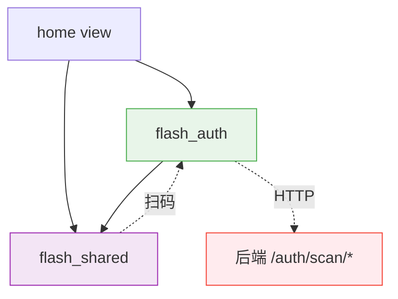
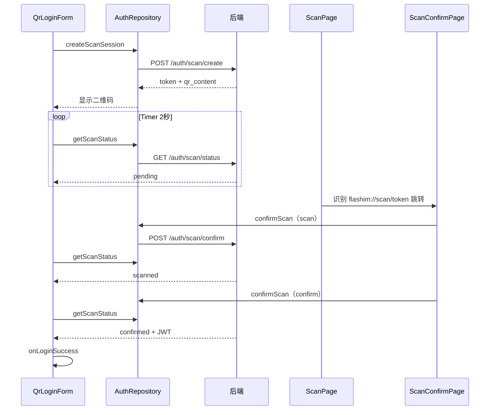

# 认证域 — 前端局域网络（桌面端扫码登录）

涉及节点：P-66 ~ P-67

---

## 一、远景：模块与依赖

> 骨骼怎么连？

### 涉及模块

| 模块 | 位置 | 职责（一句话） |
|------|------|--------------|
| flash_auth | client/modules/flash_auth/ | 登录页、登录策略、AuthRepository |
| flash_shared | client/modules/flash_shared/ | 通用扫码组件 ScanPage、WindowsButtons |
| home (view) | client/lib/src/home/view/ | 组装层，传递 onScanLogin 回调 |

### 依赖关系

### 节点详情

| 编号 | 功能节点 | 模块 | 职责 |
|------|---------|------|------|
| P-66 | 桌面端扫码登录页 | flash_auth (qr_login_form + desktop_login_body) | 二维码展示 + 轮询 + 自动登录 + 折角切换 |
| P-67 | 手机端扫码确认页 | flash_auth (scan_confirm_page) | 扫码后确认/取消 |

---

## 二、中景：数据通道与事件流

> 血液怎么流？

### 数据通道

| 通道 | 协议 | 方向 | 特点 | 例子 |
|------|------|------|------|------|
| 创建扫码会话 | HTTP | 桌面端主动 | 无需认证 | POST /auth/scan/create |
| 轮询状态 | HTTP | 桌面端主动（2秒间隔） | 无需认证 | GET /auth/scan/status |
| 扫码确认 | HTTP | 手机端主动 | 需要 JWT | POST /auth/scan/confirm |
| 取消 | HTTP | 手机端主动 | 需要 JWT | POST /auth/scan/cancel |

### 关键事件流

**场景：桌面端扫码登录**

### 边界接口

**HTTP 接口**

| 接口 | 提供节点 | 消费节点 |
|------|---------|---------|
| POST /auth/scan/create | I-20 | P-66 |
| GET /auth/scan/status | I-20 | P-66 |
| POST /auth/scan/confirm | I-20 | P-67 |
| POST /auth/scan/cancel | I-20 | P-67 |

**Dart 抽象**

| 接口 | 定义节点 | 实现节点 | 作用 |
|------|---------|---------|------|
| ScanPage.onScanLogin 回调 | flash_shared | home view | 扫到 scan 协议时通知上层路由 |
| OnLoginSuccess 回调 | flash_auth | main.dart | 登录成功后写 session + 跳转 |

---

## 三、近景：生命周期与订阅

> 神经怎么传导？

### 核心对象生命周期

| 对象 | 创建时机 | 销毁时机 | 生命跨度 |
|------|---------|---------|---------|
| QrLoginForm | 切换到扫码视图时 | 切回表单或登录成功 | 页面级 |
| Timer（轮询） | _createSession 后 | dispose 或 confirmed/expired | 页面级 |
| ScanConfirmPage | 手机扫码跳转时 | pop 返回 | 页面级 |

### 订阅关系

| 订阅者 | 监听目标 | 订阅时机 | 取消时机 | 是否成对 |
|--------|---------|---------|---------|---------|
| QrLoginForm | Timer.periodic | initState | dispose | ✅ |

---

## 四、版本演进

| 版本 | 变更 |
|------|------|
| v0.27.0 | 初始实现：桌面端扫码登录 + 手机端确认页 + ScanPage 迁移到 flash_shared |
