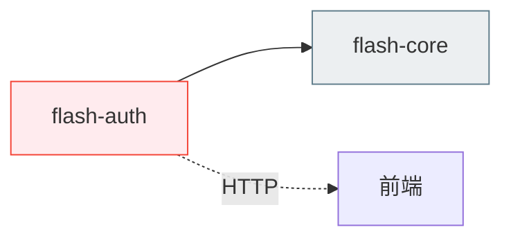
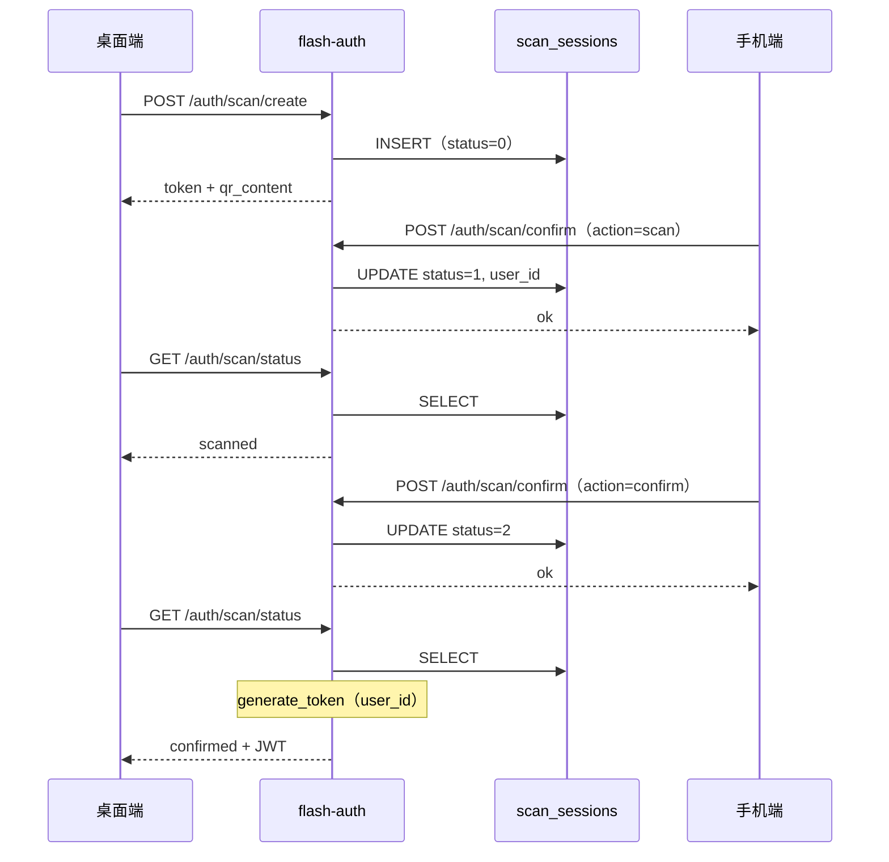

# 认证域 — 后端局域网络

涉及节点：I-15 ~ I-20, D-42

---

## 一、远景：模块与依赖

> 骨骼怎么连？

### 涉及模块

| 模块 | 位置 | 职责（一句话） |
|------|------|--------------|
| flash-auth | server/modules/flash-auth/ | 认证全流程：登录、注册、OAuth、邮箱验证码、扫码登录 |
| flash-core | server/modules/flash-core/ | JWT 验证、AppError、AppState |

### 依赖关系

### 节点详情

| 编号 | 功能节点 | 模块 | 职责 |
|------|---------|------|------|
| I-15 | GitHub OAuth 登录 | flash-auth (oauth/github) | GitHub 授权码换 token + 用户信息 |
| I-16 | 登录日志记录 | flash-auth (login_log) | 记录每次登录的 IP、设备、时间 |
| I-17 | Apple OAuth 登录 | flash-auth (oauth/apple) | Apple identity_token 验证 |
| I-18 | 邮箱验证码发送 | flash-auth (email/sender) | SMTP 发送验证码邮件 |
| I-19 | 邮箱登录 | flash-auth (handler) | 邮箱验证码/密码登录 |
| I-20 | 扫码会话管理 | flash-auth (handler) | scan_sessions 表 + 4 个接口 |
| D-42 | 欢迎消息 | flash-auth (welcome) | 首次登录发送系统欢迎消息 |

---

## 二、中景：数据通道与事件流

> 血液怎么流？

### 数据通道

| 通道 | 协议 | 方向 | 特点 | 例子 |
|------|------|------|------|------|
| 登录 | HTTP | 客户端主动 | 统一入口，type 区分方式 | POST /auth/login |
| 发送验证码 | HTTP | 客户端主动 | SMS/Email 两种通道 | POST /auth/sms, /auth/email/code |
| OAuth | HTTP | 客户端主动 | 授权码模式 | POST /auth/github, /auth/apple |
| 扫码 | HTTP | 桌面端轮询 + 手机端操作 | 无 WS，纯轮询 | /auth/scan/* |

### 关键事件流

**场景：扫码登录**

### 边界接口

**HTTP 接口**

| 接口 | 提供节点 | 消费节点 |
|------|---------|---------|
| POST /auth/scan/create | I-20 | P-66（桌面端） |
| GET /auth/scan/status | I-20 | P-66（桌面端） |
| POST /auth/scan/confirm | I-20 | P-67（手机端） |
| POST /auth/scan/cancel | I-20 | P-67（手机端） |
| POST /auth/login（type=password） | I-02 | 所有端 |
| POST /auth/sms | I-02 | 移动端 |
| POST /auth/email/code | I-18 | 所有端 |

---

## 四、版本演进

| 版本 | 变更 |
|------|------|
| v0.23.0 | GitHub OAuth + 登录日志 + 欢迎消息 |
| v0.25.0 | Apple OAuth + 邮箱验证码 + 邮箱登录 |
| v0.27.0 | 扫码登录（scan_sessions + 4接口）+ 密码登录支持闪讯ID + login 接口 AppError |
