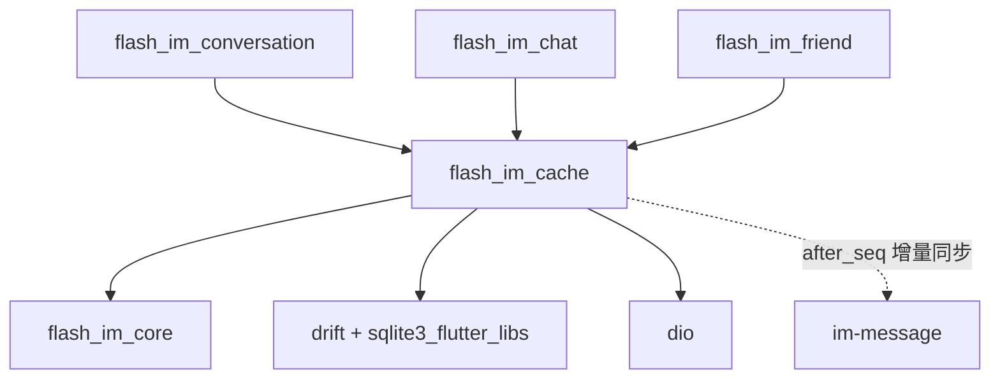
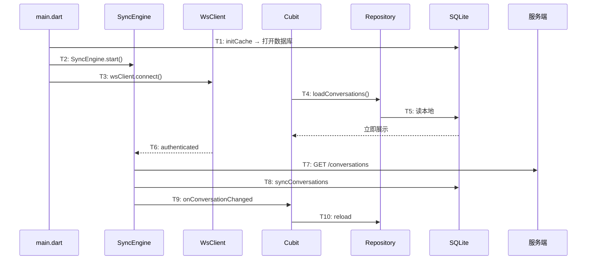
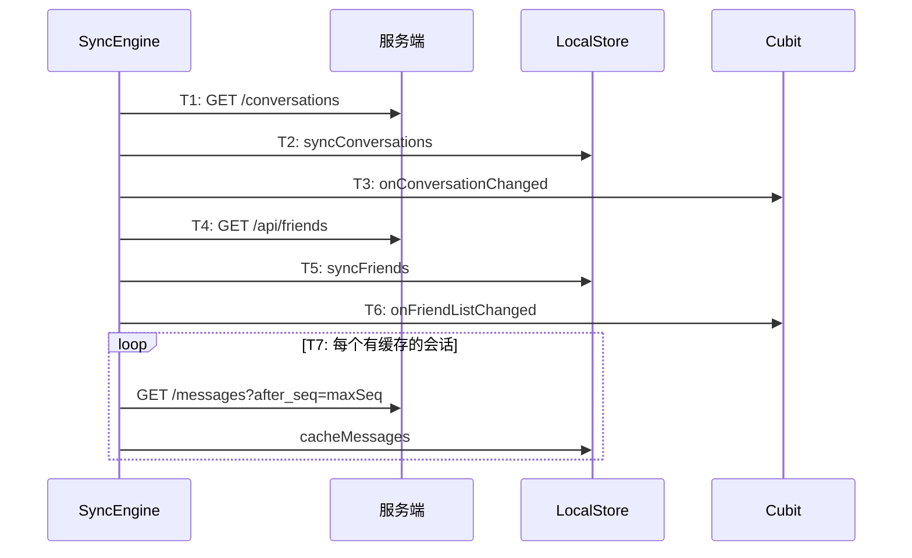

# 本地缓存 — 客户端局域网络

涉及节点：I-14, D-39, F-15~F-16

---

## 一、远景：模块与依赖

### 涉及模块

| 模块 | 位置 | 职责 |
|------|------|------|
| flash_im_cache | client/modules/flash_im_cache | 本地数据库 + 抽象接口 + drift 实现 + 同步引擎 |
| im-message | server/modules/im-message | 新增 after_seq 参数（后端唯一改动） |

### 依赖关系

### 节点详情

| 编号 | 功能节点 | 模块 | 职责 |
|------|---------|------|------|
| I-14 | 本地数据库 | flash_im_cache/drift | drift + SQLite，per-user 数据库，3 张缓存表 |
| F-15 | LocalStore | flash_im_cache/local_store | 本地存储抽象接口，定义读写契约 |
| F-16 | SyncEngine | flash_im_cache/sync_engine | WS 事件写入本地 + 重连增量同步 + 回调通知 |
| D-39 | 增量消息查询 | im-message/routes | GET /messages 新增 after_seq 参数 |

---

## 二、中景：数据通道与事件流

### 数据通道

| 通道 | 协议 | 方向 | 特点 |
|------|------|------|------|
| Repository → LocalStore | 内存 | 客户端内部 | 读取优先本地，空数据 fallback HTTP |
| SyncEngine → LocalStore | 内存 | 客户端内部 | WS 事件实时写入 + 重连批量同步 |
| SyncEngine → 服务端 | HTTP | 客户端主动 | 增量同步用 after_seq，全量同步用 limit |
| SyncEngine → Cubit | 回调 | 客户端内部 | 同步完成后通知 UI 刷新 |
| WsClient → SyncEngine | Stream | 客户端内部 | 5 个事件流（state/chat/conv/friend+/friend-） |

### 关键事件流：冷启动

### 关键事件流：重连同步

### 边界接口

**HTTP 接口**

| 接口 | 提供节点 | 消费节点 |
|------|---------|---------|
| GET /messages?after_seq=N | D-39 | F-16 (SyncEngine) |
| GET /conversations | D-02 | F-16 (SyncEngine) |
| GET /api/friends | D-15 | F-16 (SyncEngine) |

**回调接口**

| 回调 | 定义节点 | 消费节点 |
|------|---------|---------|
| onConversationChanged | F-16 (SyncEngine) | ConversationListCubit |
| onFriendListChanged | F-16 (SyncEngine) | FriendCubit |
| onMessagesChanged | F-16 (SyncEngine) | （预留） |

---

## 三、近景：生命周期与订阅

### 核心对象生命周期

| 对象 | 创建时机 | 销毁时机 | 生命跨度 |
|------|---------|---------|---------|
| DriftLocalStore | initCache（登录后） | 退出登录 | 应用级 |
| SyncEngine | initCache（登录后） | 退出登录 | 应用级 |
| AppDatabase | DriftLocalStore.open | DriftLocalStore.dispose | 应用级 |

### 订阅关系

| 订阅者 | 监听目标 | 订阅时机 | 取消时机 | 是否成对 |
|--------|---------|---------|---------|---------|
| SyncEngine | WsClient.stateStream | start() | dispose() | ✅ |
| SyncEngine | WsClient.chatMessageStream | start() | dispose() | ✅ |
| SyncEngine | WsClient.conversationUpdateStream | start() | dispose() | ✅ |
| SyncEngine | WsClient.friendAcceptedStream | start() | dispose() | ✅ |
| SyncEngine | WsClient.friendRemovedStream | start() | dispose() | ✅ |

---

## 四、版本演进

| 版本 | 变更 |
|------|------|
| v0.0.1_cache | 初始版本：drift 建表 + LocalStore 接口 + DriftLocalStore + SyncEngine + Repository 改造 |
