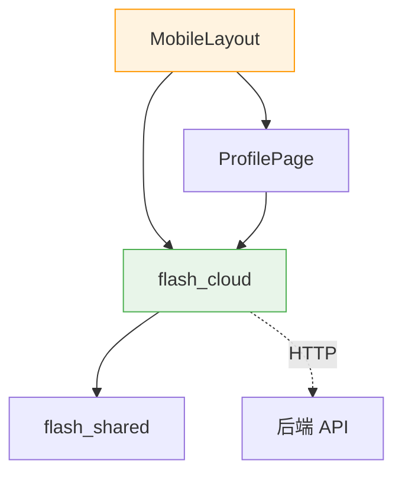
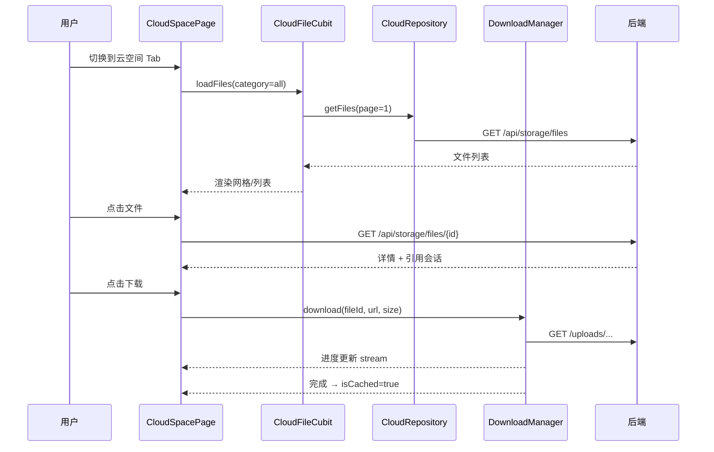

# 云空间管理 — 前端局域网络

涉及节点：F-21, P-79~P-80

---

## 一、远景：模块与依赖

### 涉及模块

| 模块 | 位置 | 职责 |
|------|------|------|
| flash_cloud | client/modules/flash_cloud/ | 云空间独立模块（data + logic + view） |
| home/profile | client/lib/src/home/profile/ | "我的"页面精简云空间卡片 |
| home/view | client/lib/src/home/view/ | MobileLayout 4 Tab 导航 |

### 依赖关系

### 节点详情

| 编号 | 功能节点 | 模块 | 职责 |
|------|---------|------|------|
| F-21 | 全局下载管理器 | flash_cloud/data/cloud_download_manager | 单例，管理下载队列/进度/状态 |
| P-79 | 云空间 Tab 页 | flash_cloud/view/cloud_space_page | 圆环配额 + 吸顶 Tab + 日期分组列表 |
| P-80 | 文件详情页 | flash_cloud/view/file_detail_page | 信息 + 缓存下载 + 引用会话 + 删除 |

---

## 二、中景：数据通道与事件流

### 数据通道

| 通道 | 协议 | 方向 | 特点 |
|------|------|------|------|
| CloudRepository.getFiles | HTTP GET | 客户端→服务端 | 分页+分类 |
| CloudRepository.getFileDetail | HTTP GET | 客户端→服务端 | 含引用会话 |
| CloudRepository.deleteFile | HTTP DELETE | 客户端→服务端 | 删除文件 |
| CloudDownloadManager | HTTP download | 客户端→服务端 | 带进度回调 |
| WS STORAGE_QUOTA_UPDATE | WS 帧 | 服务端→客户端 | 配额变更实时通知 |

### 关键事件流：浏览 + 下载 + 删除

---

## 三、近景：生命周期与订阅

### 核心对象生命周期

| 对象 | 创建时机 | 销毁时机 | 生命跨度 |
|------|---------|---------|---------|
| CloudDownloadManager | main.dart init | 不销毁 | 应用级 |
| CloudFileCubit | CloudSpacePage initState | dispose | 页面级 |
| FileDetailCubit | FileDetailPage BlocProvider create | 页面 pop | 页面级 |

### 订阅关系

| 订阅者 | 监听目标 | 订阅时机 | 取消时机 | 是否成对 |
|--------|---------|---------|---------|---------|
| FileDetailCubit | CloudDownloadManager.updateStream | 构造函数 | close() | ✅ |

---

## 四、版本演进

| 版本 | 变更 |
|------|------|
| cloud/v0.0.1 | F-21, P-79~P-80：独立 Tab + 下载管理器 + 详情页 + 吸顶 Tab |
