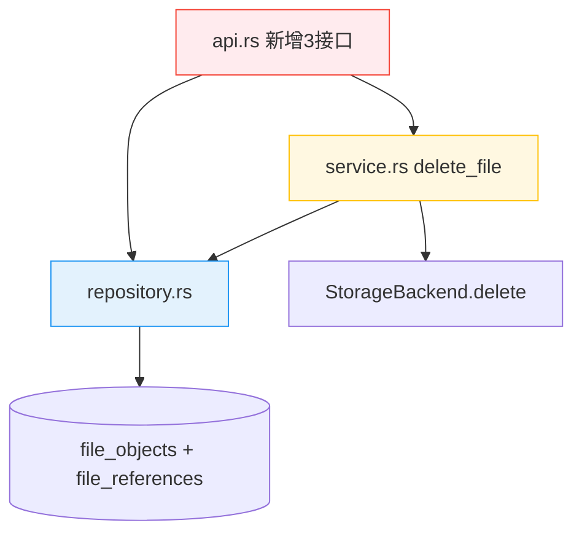
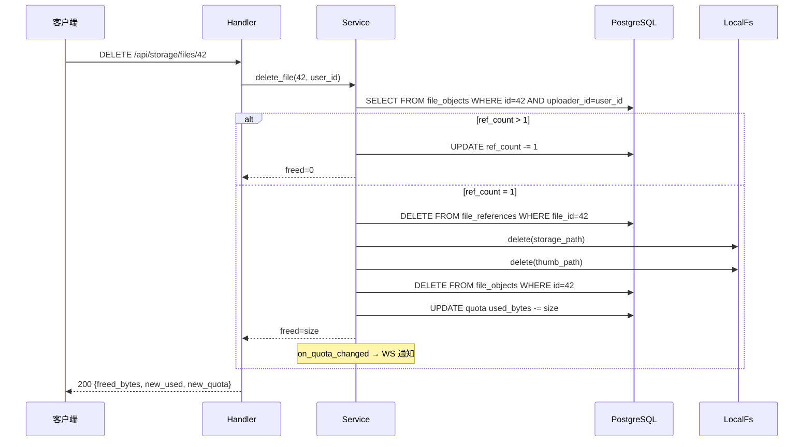

# 云空间管理 — 后端局域网络

涉及节点：I-26~I-28, D-46~D-47

---

## 一、远景：模块与依赖

### 涉及模块

| 模块 | 位置 | 职责 |
|------|------|------|
| app-storage | server/modules/app-storage/ | 文件列表/详情/删除接口 + 原始文件名 |

### 依赖关系

### 节点详情

| 编号 | 功能节点 | 模块 | 职责 |
|------|---------|------|------|
| I-26 | 文件列表查询 | api.rs | GET /api/storage/files 分页+分类+时间倒序 |
| I-27 | 文件详情查询 | api.rs | GET /api/storage/files/{id} 含引用会话名称 |
| I-28 | 文件删除 | api.rs | DELETE /api/storage/files/{id} |
| D-46 | 删除与配额回收 | service.rs | ref_count-1，归零物理删除+回收+WS通知 |
| D-47 | 原始文件名 | service.rs | 上传时存 original_name，超255截断尾部 |

---

## 二、中景：数据通道与事件流

### 数据通道

| 通道 | 协议 | 方向 | 特点 |
|------|------|------|------|
| GET /api/storage/files | HTTP | 客户端→服务端 | 分页查询 |
| GET /api/storage/files/{id} | HTTP | 客户端→服务端 | JOIN 查引用会话 |
| DELETE /api/storage/files/{id} | HTTP | 客户端→服务端 | 物理删除+配额回收 |
| WS STORAGE_QUOTA_UPDATE | WS | 服务端→客户端 | 删除后推送 |

### 关键事件流：文件删除

---

## 三、版本演进

| 版本 | 变更 |
|------|------|
| cloud/v0.0.1 | I-26~I-28, D-46~D-47：文件列表/详情/删除 + 原始文件名 + /uploads 不压缩 |
