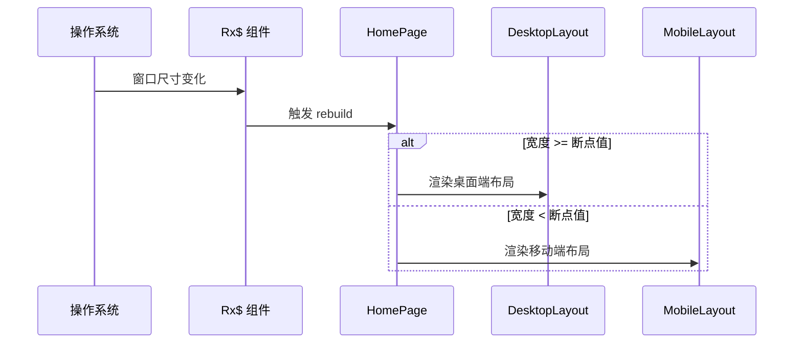
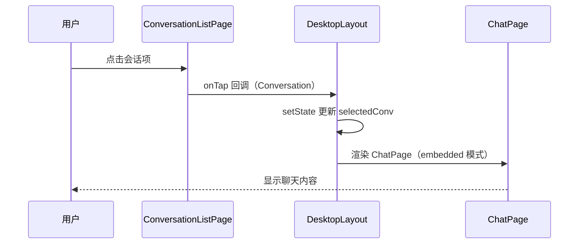
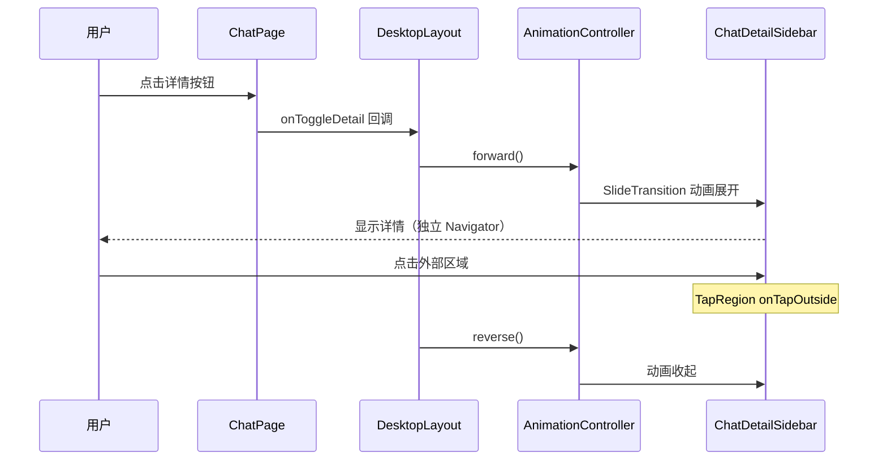
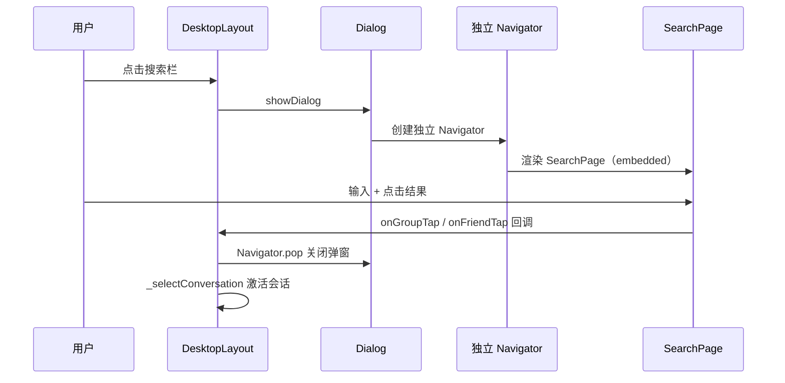
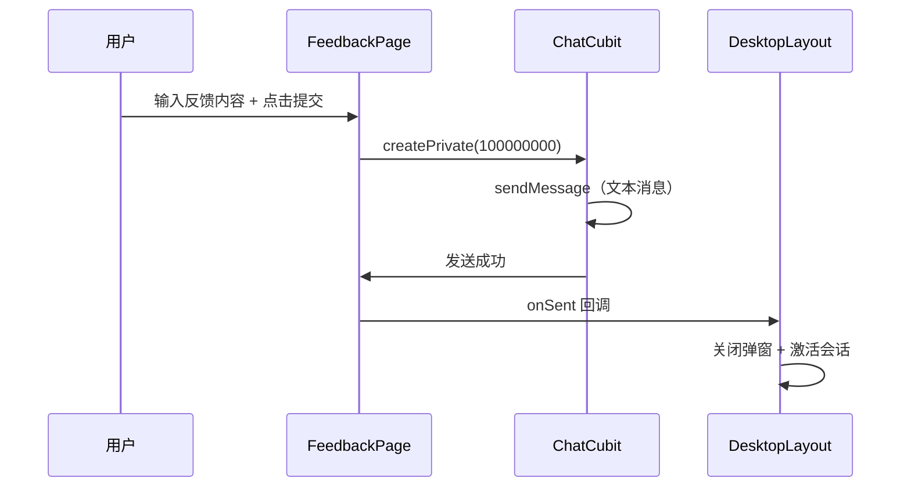

# 桌面端 UI — 前端局域网络

涉及节点：P-64 ~ P-72

---

## 一、远景：模块与依赖

> 骨骼怎么连？不打开源码，只看配置文件和目录结构就能回答。

### 涉及模块

| 模块 | 位置 | 职责（一句话） |
|------|------|--------------|
| home (view) | client/lib/src/home/view/ | HomePage 拆分为 DesktopLayout + MobileLayout，根据窗口宽度切换 |
| home (desktop/) | client/lib/src/home/view/desktop/ | 桌面端布局拆分：nav_rail + conversation_panel + chat_detail_sidebar + contact_detail_panel + actions_mixin |
| home (profile/) | client/lib/src/home/profile/ | 设置页 + 桌面端设置三栏面板 + 意见反馈页 |
| tolyui_rx_layout | 第三方包（本地路径） | 提供 Rx$ 响应式布局组件 + context.rx 断点扩展 |
| tolyui_navigation | 第三方包（本地路径） | TolyDropMenu 底部菜单弹出组件 |
| flash_im_chat | client/modules/flash_im_chat/ | ChatPage 支持 embedded 模式 + onToggleDetail 回调 |
| flash_im_conversation | client/modules/flash_im_conversation/ | ConversationListPage 支持 activeConversationId 高亮选中项 |
| flash_im_friend | client/modules/flash_im_friend/ | FriendListPage/FriendDetailPage 支持 showAppBar/embedded 参数 |
| flash_im_group | client/modules/flash_im_group/ | MyGroupsPage/GroupNotificationsPage 支持 showAppBar 参数 |
| flash_shared | client/modules/flash_shared/ | DragMoveArea + FlashImTheme + adaptivePush + UnreadBadge |
| window_manager | 第三方包 | 桌面端窗口管理（最小尺寸、标题栏隐藏） |

### 依赖关系

```mermaid
graph TB
    HP[HomePage] --> DL[DesktopLayout]
    HP --> ML[MobileLayout]
    HP --> RX[tolyui_rx_layout]
    DL --> NR[nav_rail]
    DL --> CP_PANEL[conversation_panel]
    DL --> CDS[chat_detail_sidebar]
    DL --> CDP[contact_detail_panel]
    DL --> AM[actions_mixin]
    DL --> DSP[desktop_settings_panel]
    NR --> TDM[tolyui_navigation]
    NR --> BADGE[UnreadBadge]
    AM --> AP[adaptivePush]
    AM --> FBP[feedback_page]
    DL --> CONV[flash_im_conversation]
    DL --> CHAT[flash_im_chat]
    DL --> FRIEND[flash_im_friend]
    DL --> GROUP[flash_im_group]
    DL --> SHARED[flash_shared]
    DL --> WM[window_manager]
    ML --> CONV
    ML --> CHAT

    style HP fill:#E8F5E9,stroke:#4CAF50
    style DL fill:#E8F5E9,stroke:#4CAF50
    style ML fill:#E8F5E9,stroke:#4CAF50
    style NR fill:#E8F5E9,stroke:#4CAF50
    style CP_PANEL fill:#E8F5E9,stroke:#4CAF50
    style CDS fill:#E8F5E9,stroke:#4CAF50
    style CDP fill:#E8F5E9,stroke:#4CAF50
    style AM fill:#E8F5E9,stroke:#4CAF50
    style DSP fill:#E8F5E9,stroke:#4CAF50
    style FBP fill:#E8F5E9,stroke:#4CAF50
    style RX fill:#F3E5F5,stroke:#9C27B0
    style TDM fill:#F3E5F5,stroke:#9C27B0
    style BADGE fill:#F3E5F5,stroke:#9C27B0
    style AP fill:#F3E5F5,stroke:#9C27B0
    style CONV fill:#E3F2FD,stroke:#2196F3
    style CHAT fill:#E3F2FD,stroke:#2196F3
    style FRIEND fill:#E3F2FD,stroke:#2196F3
    style GROUP fill:#E3F2FD,stroke:#2196F3
    style SHARED fill:#F3E5F5,stroke:#9C27B0
    style WM fill:#F3E5F5,stroke:#9C27B0
```

### 节点详情

| 编号 | 功能节点 | 模块 | 职责 |
|------|---------|------|------|
| P-64 | 桌面端自适应布局 | home (desktop_layout + mobile_layout) | 根据窗口宽度切换桌面端分栏/移动端底部导航布局 |
| P-65 | 桌面端会话分栏 | home (desktop_layout) + flash_im_chat | 桌面端消息 Tab 三栏（侧边栏+会话列表+聊天区），通讯录/设置两栏 |
| P-68 | 桌面端通讯录三栏 | home (desktop/contact_detail_panel) | 通讯录 Tab 右侧面板：好友详情/申请/群聊/群通知 |
| P-69 | 聊天详情侧栏 | home (desktop/chat_detail_sidebar) + flash_im_chat | 消息 Tab 聊天区右侧浮层侧滑详情面板 |
| P-70 | 设置页三栏 | home (profile/desktop_settings_panel) | "我的" Tab 左侧菜单 + 右侧内容区 |
| P-71 | 桌面端弹窗化操作 | home (desktop/actions_mixin) + flash_shared | 搜索/创建群/加好友/设置/反馈 弹窗 + 独立导航栈 |
| P-72 | 意见反馈 | home (profile/feedback_page) | 用户输入反馈内容，通过 ChatCubit 发送给闪讯团队 |

---

## 二、中景：数据通道与事件流

> 血液怎么流？

### 数据通道

| 通道 | 协议 | 方向 | 特点 | 例子 |
|------|------|------|------|------|
| 窗口宽度 | 内存 | 系统→UI | MediaQuery / Rx$ 实时响应 | 宽度变化触发布局切换 |
| 会话选中 | 内存 | UI 内部 | setState 驱动 | 点击会话列表项更新右侧聊天区 |
| 侧栏展开状态 | 内存 | UI 内部 | AnimationController + setState | 点击详情按钮触发侧栏动画 |
| 通讯录面板类型 | 内存 | UI 内部 | setState 驱动 | 点击入口项切换右侧面板 |
| 弹窗回调 | 内存 | UI 内部 | onClose/onSent 回调 | 弹窗操作完成后通知父级 |

### 关键事件流

**场景：窗口宽度变化触发布局切换**

**场景：桌面端点击会话切换聊天内容**

**场景：聊天详情侧栏展开/收起**

**场景：弹窗化搜索**

**场景：意见反馈发送**

### 边界接口

**Dart 抽象**

| 接口 | 定义节点 | 实现节点 | 作用 |
|------|---------|---------|------|
| ChatPage.embedded 参数 | flash_im_chat | DesktopLayout | 控制嵌入模式（无 AppBar、无返回按钮） |
| ChatPage.onToggleDetail 参数 | flash_im_chat | DesktopLayout | 通知父级展开/收起详情侧栏 |
| ConversationListPage.activeConversationId | flash_im_conversation | DesktopLayout | 控制选中项高亮 |
| ConversationTile.isActive | flash_im_conversation | ConversationListPage | 高亮背景色 |
| FriendDetailPage.embedded 参数 | flash_im_friend | contact_detail_panel | 桌面端嵌入模式（白色背景+居中） |
| FriendListPage.showAppBar 参数 | flash_im_friend | contact_detail_panel | 隐藏 AppBar 嵌入右侧面板 |
| PrivateChatInfoPage.showAppBar 参数 | flash_im_chat | chat_detail_sidebar | 隐藏 AppBar 嵌入侧栏 |
| GroupChatInfoPage.showAppBar 参数 | flash_im_group | chat_detail_sidebar | 隐藏 AppBar 嵌入侧栏 |
| adaptivePush | flash_shared | 全局 | 根据 context.rx 断点自动选择弹窗/push |
| UnreadBadge | flash_shared | nav_rail + mobile_layout + conversation_tile | 统一未读角标组件 |
| context.rx | tolyui_rx_layout | flash_shared + 全局 | 从 BuildContext 获取当前断点级别 |
| TolyDropMenu | tolyui_navigation | nav_rail | 底部菜单弹出 |
| FlashImTheme | flash_shared | 全局 | IM 调色主题 ThemeExtension |
| DragMoveArea | flash_shared | DesktopLayout | 桌面端窗口拖拽区域 |

---

## 三、近景：生命周期与订阅

> 桌面端布局无额外 Stream 订阅，生命周期跟随 HomePage。

### 核心对象生命周期

| 对象 | 创建时机 | 销毁时机 | 生命跨度 |
|------|---------|---------|---------|
| DesktopLayout | HomePage build 时（宽度 >= 断点） | HomePage rebuild 切换为 MobileLayout 时 | 页面级 |
| MobileLayout | HomePage build 时（宽度 < 断点） | HomePage rebuild 切换为 DesktopLayout 时 | 页面级 |
| _selectedConv | DesktopLayout initState | DesktopLayout dispose | 页面级 |
| AnimationController（侧栏） | DesktopLayout initState | DesktopLayout dispose | 页面级 |
| ChatCubit（反馈） | FeedbackPage 提交时临时创建 | 发送完成后自动释放 | 会话级 |

---

## 四、版本演进

| 版本 | 变更 |
|------|------|
| v0.26.0 | 初始实现：HomePage 拆分为 DesktopLayout + MobileLayout，三栏/两栏布局，ChatPage embedded 模式，ChatInputDesktop，窗口管理，FlashImTheme |
| v0.28.0 | 通讯录三栏（右侧面板切换）、聊天详情侧栏（浮层动画+TapRegion）、设置页三栏（DesktopSettingsPanel）、弹窗化操作（搜索/创建群/加好友/设置/反馈）、底部菜单（TolyDropMenu）、通用组件（adaptivePush+UnreadBadge+context.rx）、意见反馈、文件拆分为 desktop/ 子目录 |
