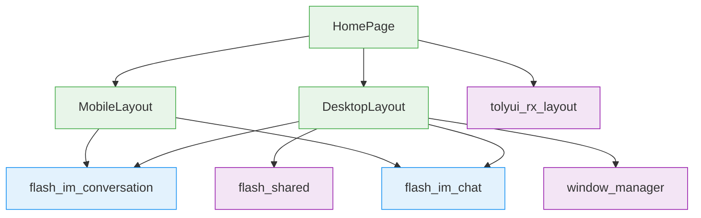
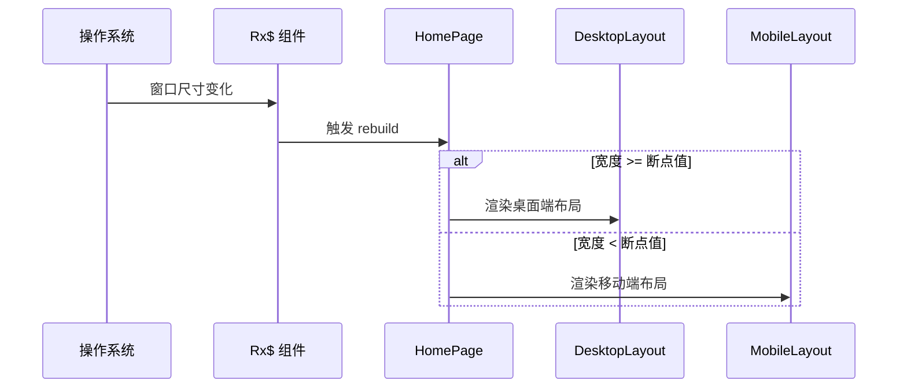
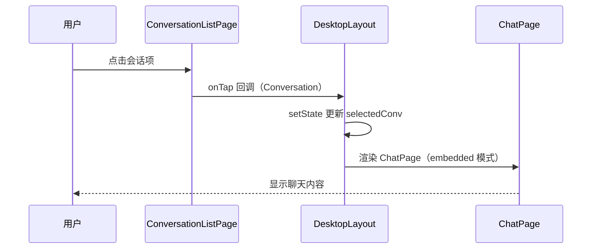

# 桌面端 UI — 前端局域网络

涉及节点：P-64 ~ P-65

---

## 一、远景：模块与依赖

> 骨骼怎么连？不打开源码，只看配置文件和目录结构就能回答。

### 涉及模块

| 模块 | 位置 | 职责（一句话） |
|------|------|--------------|
| home (view) | client/lib/src/home/view/ | HomePage 拆分为 DesktopLayout + MobileLayout，根据窗口宽度切换 |
| tolyui_rx_layout | 第三方包 | 提供 Rx$ 响应式布局组件，检测窗口宽度触发断点切换 |
| flash_im_chat | client/modules/flash_im_chat/ | ChatPage 支持 embedded 模式嵌入桌面端右侧面板 |
| flash_im_conversation | client/modules/flash_im_conversation/ | ConversationListPage 支持 activeConversationId 高亮选中项 |
| flash_shared | client/modules/flash_shared/ | DragMoveArea 拖拽区域 + FlashImTheme 调色主题 |
| window_manager | 第三方包 | 桌面端窗口管理（最小尺寸、标题栏隐藏） |

### 依赖关系

### 节点详情

| 编号 | 功能节点 | 模块 | 职责 |
|------|---------|------|------|
| P-64 | 桌面端自适应布局 | home (desktop_layout + mobile_layout) | 根据窗口宽度切换桌面端分栏/移动端底部导航布局 |
| P-65 | 桌面端会话分栏 | home (desktop_layout) + flash_im_chat | 桌面端消息 Tab 三栏（侧边栏+会话列表+聊天区），通讯录/设置两栏 |

---

## 二、中景：数据通道与事件流

> 血液怎么流？

### 数据通道

| 通道 | 协议 | 方向 | 特点 | 例子 |
|------|------|------|------|------|
| 窗口宽度 | 内存 | 系统→UI | MediaQuery / Rx$ 实时响应 | 宽度变化触发布局切换 |
| 会话选中 | 内存 | UI 内部 | setState 驱动 | 点击会话列表项更新右侧聊天区 |

### 关键事件流

**场景：窗口宽度变化触发布局切换**

**场景：桌面端点击会话切换聊天内容**

### 边界接口

**Dart 抽象**

| 接口 | 定义节点 | 实现节点 | 作用 |
|------|---------|---------|------|
| ChatPage.embedded 参数 | flash_im_chat | DesktopLayout | 控制嵌入模式（无 AppBar、无返回按钮） |
| ConversationListPage.activeConversationId | flash_im_conversation | DesktopLayout | 控制选中项高亮 |
| ConversationTile.isActive | flash_im_conversation | ConversationListPage | 高亮背景色 |
| FlashImTheme | flash_shared | 全局 | IM 调色主题 ThemeExtension |
| DragMoveArea | flash_shared | DesktopLayout | 桌面端窗口拖拽区域 |

---

## 三、近景：生命周期与订阅

> 桌面端布局无额外 Stream 订阅，生命周期跟随 HomePage。

### 核心对象生命周期

| 对象 | 创建时机 | 销毁时机 | 生命跨度 |
|------|---------|---------|---------|
| DesktopLayout | HomePage build 时（宽度 >= 断点） | HomePage rebuild 切换为 MobileLayout 时 | 页面级 |
| MobileLayout | HomePage build 时（宽度 < 断点） | HomePage rebuild 切换为 DesktopLayout 时 | 页面级 |
| _selectedConv | DesktopLayout initState | DesktopLayout dispose | 页面级 |

---

## 四、版本演进

| 版本 | 变更 |
|------|------|
| v0.26.0 | 初始实现：HomePage 拆分为 DesktopLayout + MobileLayout，三栏/两栏布局，ChatPage embedded 模式，ChatInputDesktop，窗口管理，FlashImTheme |
