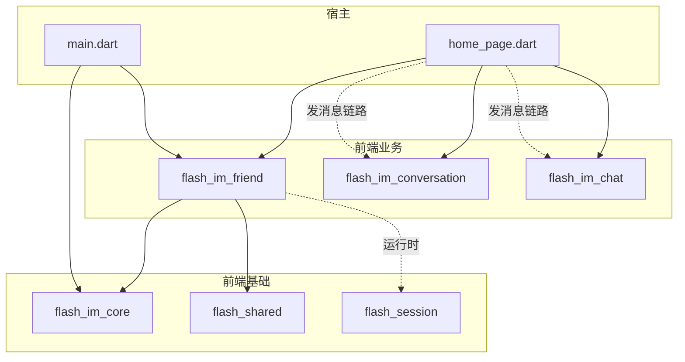
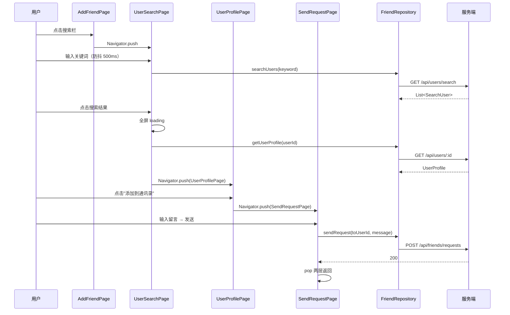
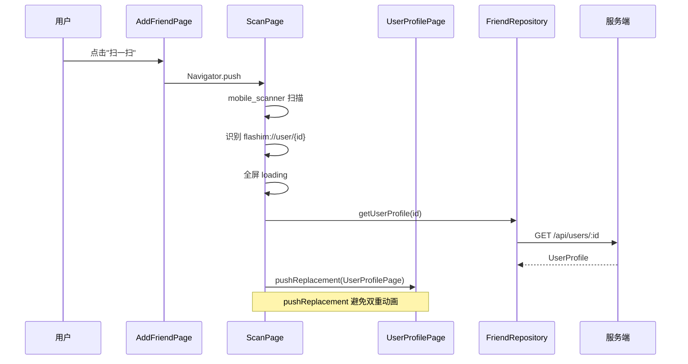
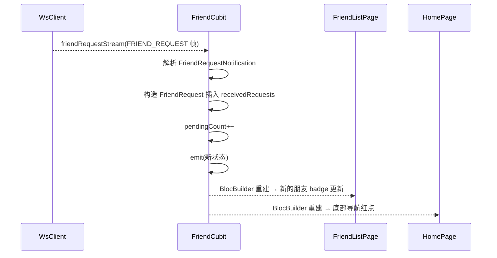
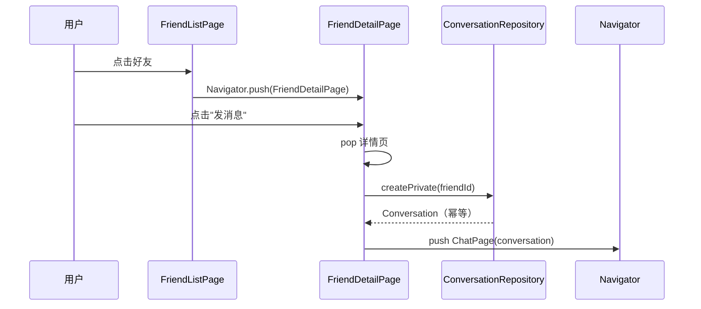

# 好友域 — 客户端局域网络

涉及节点：F-09, P-20~P-27

---

## 一、远景：模块与依赖

> 骨骼怎么连？看 pubspec.yaml 的依赖声明。

### 涉及模块

| 模块 | 位置 | 职责（一句话） |
|------|------|--------------|
| flash_im_friend | client/modules/flash_im_friend/ | 好友业务核心：通讯录列表、好友申请管理、用户搜索、扫码添加、好友详情、状态管理 |
| flash_im_core | client/modules/flash_im_core/ | WS 通信层：WsClient 新增 friendRequestStream / friendAcceptedStream / friendRemovedStream 三条分发流 |
| flash_shared | client/modules/flash_shared/ | 跨模块共享 UI：AvatarWidget、FlashSearchBar、FlashSearchInput |
| flash_session | client/modules/flash_session/ | 用户会话状态：SessionCubit 提供当前用户信息（AddFriendPage 二维码需要 userId） |
| flash_im_conversation | client/modules/flash_im_conversation/ | 会话创建：好友详情页"发消息"调用 ConversationRepository.createPrivate（幂等） |
| flash_im_chat | client/modules/flash_im_chat/ | 聊天页面：好友详情页"发消息"跳转 ChatPage |

### 依赖关系

关键设计：
- flash_im_friend 的 pubspec.yaml 只依赖 flash_im_core 和 flash_shared，不依赖 flash_im_conversation 和 flash_im_chat
- "发消息"链路由宿主（home_page.dart）编排：FriendDetailPage 回调 → ConversationRepository.createPrivate → push ChatPage
- flash_session 通过 BlocProvider 在运行时注入（AddFriendPage 读取当前用户生成二维码），pubspec 未声明直接依赖
- 三个第三方依赖：lpinyin（拼音索引）、qr_flutter（二维码生成）、mobile_scanner（摄像头扫码）

### 节点详情

| 编号 | 功能节点 | 模块 | 职责 |
|------|---------|------|------|
| F-09 | 好友WS流分发 | flash_im_core (ws_client.dart) | WsClient 新增三个 StreamController.broadcast()，_onData switch 新增三个 case，dispose 关闭三个 Controller |
| P-20 | 好友列表页 | flash_im_friend (friend_list_page.dart) | 通讯录 Tab 内容：顶部固定入口（新的朋友+badge / 群通知 / 我的群聊）+ IndexedContactList 字母索引列表 + 空状态缺省 |
| P-21 | 好友申请页 | flash_im_friend (friend_request_page.dart) | TabBar（收到的 / 我的申请），接受/拒绝操作，Dismissible 侧滑删除 |
| P-22 | 用户搜索页 | flash_im_friend (user_search_page.dart) | 独立搜索页，防抖搜索，点击结果 → 全屏 loading → GET /api/users/:id → UserProfilePage |
| P-23 | 好友申请通知 | flash_im_friend (friend_cubit.dart) | FriendCubit 监听 friendRequestStream，pendingCount++ → 通讯录 Tab 红点 + 底部导航红点 |
| P-24 | 好友详情页 | flash_im_friend (friend_detail_page.dart) | 微信风格：大头像 + 昵称 + 闪讯号 + 签名 + 底部白色行按钮（发消息 / 删除好友，fontWeight 600） |
| P-25 | 添加朋友页 | flash_im_friend (add_friend_page.dart) | 搜索入口（FlashSearchBar）+ 功能入口（扫一扫 / 创建群聊）+ 底部个人二维码（qr_flutter H级纠错 + logo 叠加） |
| P-26 | 陌生人资料页 | flash_im_friend (user_profile_page.dart) | 搜索/扫码结果展示：大头像 + 昵称 + 闪讯号 + 签名 + "添加到通讯录"蓝色文字按钮 |
| P-27 | 扫码页 | flash_im_friend (scan_page.dart) | mobile_scanner 摄像头扫描，识别 flashim://user/{id}，pushReplacement 跳转 UserProfilePage |

---

## 二、中景：数据通道与事件流

> 血液怎么流？三条 WS Stream 汇入 FriendCubit，HTTP 请求通过 FriendRepository 发出。

### 数据通道

| 通道 | 协议 | 方向 | 特点 | 例子 |
|------|------|------|------|------|
| 好友操作 | HTTP JSON | 客户端主动 | FriendRepository 封装 10 个接口调用 | sendRequest / acceptRequest / getFriends |
| 好友申请通知 | WS Protobuf 帧 | 服务端推送 | friendRequestStream → FriendCubit | 收到好友申请，pendingCount++ |
| 好友接受通知 | WS Protobuf 帧 | 服务端推送 | friendAcceptedStream → FriendCubit | 对方接受，好友列表新增 |
| 好友删除通知 | WS Protobuf 帧 | 服务端推送 | friendRemovedStream → FriendCubit | 被删除，好友列表移除 |
| 内存状态 | Cubit emit | 内部 | 纯内存操作，WS 通知不重新拉取接口 | 收到通知后直接更新本地列表 |

### 关键事件流

#### 场景 1：搜索用户并发送好友申请

#### 场景 2：扫码添加好友

#### 场景 3：收到好友申请（WS 实时通知）

#### 场景 4：好友列表 → 发消息

### 边界接口

**Protobuf 协议**（通过 flash_im_core 消费）

| 结构 | 生产节点 | 消费节点 | 说明 |
|------|---------|---------|------|
| FriendRequestNotification | 服务端 D-16 | F-09 → P-23 | request_id + from_user_id + nickname + avatar + message + created_at |
| FriendAcceptedNotification | 服务端 D-16 | F-09 → P-20 | friend_id + nickname + avatar + created_at |
| FriendRemovedNotification | 服务端 D-16 | F-09 → P-20 | friend_id |

**HTTP 接口**（通过 FriendRepository 消费）

| 接口 | 消费节点 | 说明 |
|------|---------|------|
| GET /api/users/search | P-22 | 搜索用户 |
| GET /api/users/:id | P-22, P-27 | 搜索/扫码后获取完整资料 |
| POST /api/friends/requests | P-26 → SendRequestPage | 发送好友申请 |
| GET /api/friends/requests/received | P-21 | 收到的申请列表 |
| GET /api/friends/requests/sent | P-21 | 发送的申请列表 |
| POST /api/friends/requests/:id/accept | P-21 | 接受申请 |
| POST /api/friends/requests/:id/reject | P-21 | 拒绝申请 |
| DELETE /api/friends/requests/:id | P-21 | 侧滑删除申请记录 |
| GET /api/friends | P-20 | 好友列表 |
| DELETE /api/friends/:id | P-24 | 删除好友 |

---

## 三、近景：生命周期与订阅

> 神经怎么传导？FriendCubit 是应用级对象，登录后创建，退出时销毁。

### 核心对象生命周期

| 对象 | 创建时机 | 销毁时机 | 生命跨度 |
|------|---------|---------|---------|
| WsClient | 登录后 main.dart 创建 | 退出登录时 dispose | 应用级 |
| FriendRepository | main.dart 创建（注入 Dio） | 应用退出 | 应用级 |
| FriendCubit | main.dart MultiBlocProvider 创建 | 应用退出时 close | 应用级 |
| FriendListPage | 通讯录 Tab 切换时构建 | Tab 切换离开时销毁 | Tab 级 |
| FriendRequestPage | 点击"新的朋友"时 push | 页面 pop 时销毁 | 页面级 |
| UserSearchPage | 点击搜索栏时 push | 页面 pop 时销毁 | 页面级 |
| ScanPage | 点击"扫一扫"时 push | pushReplacement 时销毁 | 页面级 |

### 订阅关系

| 订阅者 | 监听目标 | 订阅时机 | 取消时机 | 是否成对 |
|--------|---------|---------|---------|---------|
| FriendCubit._requestSub | WsClient.friendRequestStream | FriendCubit 构造函数 | FriendCubit.close() | ✅ |
| FriendCubit._acceptedSub | WsClient.friendAcceptedStream | FriendCubit 构造函数 | FriendCubit.close() | ✅ |
| FriendCubit._removedSub | WsClient.friendRemovedStream | FriendCubit 构造函数 | FriendCubit.close() | ✅ |

说明：
- FriendCubit 是长命对象（应用级），与 WsClient 同级，三个订阅在构造时建立，close 时取消
- WS 通知的三个 handler 都是纯内存操作：用通知携带的数据构造对象插入/移除本地列表，不重新拉取 HTTP 接口
- pendingCount 跨页面共享：通讯录 Tab 红点、底部导航红点、好友申请页列表，都读同一个 FriendCubit 状态
- FriendCubit 在 WsClient.connect() 之前创建，确保 Stream 订阅不丢帧

---

## 四、版本演进

| 版本 | 变更 |
|------|------|
| v0.0.1_friend | 初始：F-09, P-20~P-27。WsClient 扩展三条好友 Stream。FriendCubit 统一管理好友列表+申请+未读数+WS 通知。通讯录页（IndexedContactList 字母索引 + lpinyin）、好友申请页（TabBar + 侧滑删除）、添加朋友页（搜索+扫码+二维码）、用户搜索页（防抖+全屏 loading）、陌生人资料页、申请表单页、扫码页（mobile_scanner + pushReplacement）、好友详情页（微信风格白色行按钮） |
