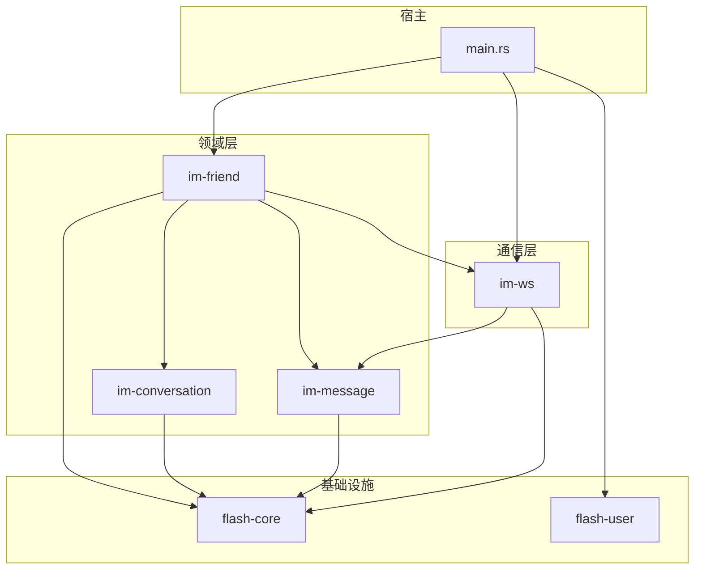
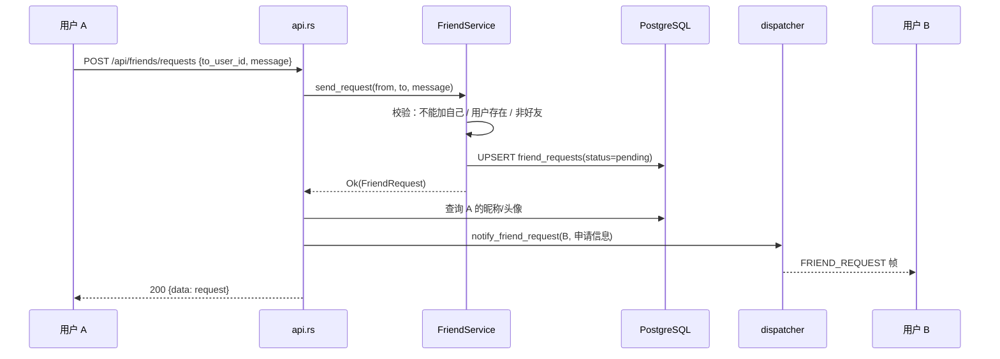
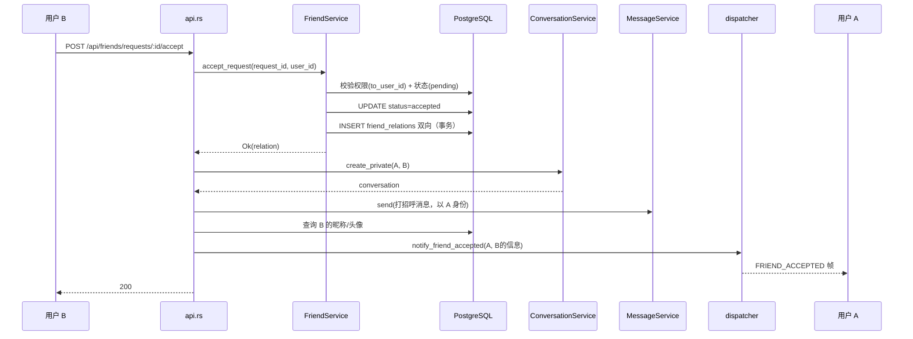
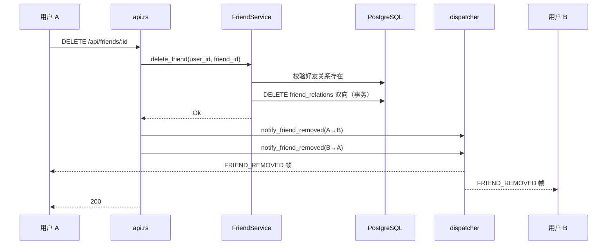

# 好友域 — 后端局域网络

涉及节点：D-14~D-17

---

## 一、远景：模块与依赖

> 骨骼怎么连？看 Cargo.toml 的依赖声明。

### 涉及模块

| 模块 | 位置 | 职责（一句话） |
|------|------|--------------|
| im-friend | server/modules/im-friend/ | 好友业务核心：申请管理（发送/接受/拒绝）、关系管理（双向存储/删除）、错误枚举 |
| flash-user | server/modules/flash-user/ | 用户搜索（昵称模糊/手机号精确/闪讯号精确）+ 用户公开资料查询 |
| im-ws | server/modules/im-ws/ | WS 通信层：dispatcher 新增三个好友通知推送方法 |
| im-conversation | server/modules/im-conversation/ | 会话创建：接受好友后 api 层调用 create_private 创建私聊会话 |
| im-message | server/modules/im-message/ | 消息发送：接受好友后 api 层调用 send 发送打招呼消息 |
| flash-core | server/modules/flash-core/ | 全局基础设施：AppState、数据库连接池、JWT 验证 |

### 依赖关系



关键设计：
- im-friend 的 Cargo.toml 直接依赖 im-conversation 和 im-message，但 api.rs 通过 `Option<Arc<...>>` 注入，测试时可不注入
- 接受好友后的连锁操作（创建会话 + 发送消息 + WS 通知）放在 api.rs 层编排，service 层只管好友领域自身的校验和数据操作
- 用户搜索放在 flash-user 而非 im-friend，因为搜索用户是通用能力
- ⚠️ im-friend 直接依赖 im-conversation 和 im-message 是为了 api 层编排接受后的连锁操作，如果后续好友域需要完全独立部署，可改为事件驱动解耦

### 节点详情

| 编号 | 功能节点 | 模块 | 职责 |
|------|---------|------|------|
| D-14 | 好友申请管理 | im-friend (service + repository) | 发送申请（upsert 覆盖旧申请）、接受（校验权限+状态）、拒绝、删除申请记录、查询收到/发送的申请。FriendError 枚举含 7 种错误：CannotAddSelf / UserNotFound / AlreadyFriends / AlreadyRequested / RequestNotFound / Forbidden / Database |
| D-15 | 好友关系管理 | im-friend (service + repository) | 双向关系创建（事务 INSERT 两条）、双向关系删除（事务 DELETE 两条）、好友列表查询（JOIN user_profiles） |
| D-16 | 好友实时通知 | im-ws (dispatcher) | 三个推送方法：notify_friend_request / notify_friend_accepted / notify_friend_removed，构造 Notification → WsFrame → send_to_user |
| D-17 | 用户搜索/资料 | flash-user (handler + routes) | GET /api/users/search（昵称 ILIKE + 手机号精确 + 闪讯号精确）、GET /api/users/:id（公开资料） |

---

## 二、中景：数据通道与事件流

> 血液怎么流？好友域有两条入站通道（HTTP 请求），三条出站通道（WS 推送）。

### 数据通道

| 通道 | 协议 | 方向 | 特点 | 例子 |
|------|------|------|------|------|
| 好友操作 | HTTP JSON | 客户端 → 服务端 | 8 个好友接口，Bearer Token 认证 | POST /api/friends/requests |
| 用户查询 | HTTP JSON | 客户端 → 服务端 | 2 个用户接口，搜索支持三种匹配 | GET /api/users/search?keyword=橘 |
| 好友通知 | WS Protobuf 帧 | 服务端 → 客户端 | 三种帧类型，携带对方昵称/头像 | FRIEND_REQUEST / FRIEND_ACCEPTED / FRIEND_REMOVED |

### 关键事件流

#### 场景 1：发送好友申请



#### 场景 2：接受好友申请（连锁操作）



#### 场景 3：删除好友



### 边界接口

**Protobuf 协议**（proto/ws.proto）

| 结构 | 生产节点 | 消费节点 | 说明 |
|------|---------|---------|------|
| FriendRequestNotification | D-16 (dispatcher) | F-09 → FriendCubit | request_id + from_user_id + nickname + avatar + message + created_at |
| FriendAcceptedNotification | D-16 (dispatcher) | F-09 → FriendCubit | friend_id + nickname + avatar + created_at |
| FriendRemovedNotification | D-16 (dispatcher) | F-09 → FriendCubit | friend_id |
| WsFrameType 枚举 | 全局共享 | dispatcher + 客户端 | FRIEND_REQUEST=7, FRIEND_ACCEPTED=8, FRIEND_REMOVED=9 |

**HTTP 接口**

| 接口 | 提供节点 | 消费节点 | 说明 |
|------|---------|---------|------|
| POST /api/friends/requests | D-14 | P-22 (发送申请) | upsert 覆盖旧申请 |
| GET /api/friends/requests/received | D-14 | P-21 (收到的申请) | 仅 pending 状态 |
| GET /api/friends/requests/sent | D-14 | P-21 (发送的申请) | 含所有状态 |
| POST /api/friends/requests/:id/accept | D-14 | P-21 (接受) | 连锁：关系+会话+消息+通知 |
| POST /api/friends/requests/:id/reject | D-14 | P-21 (拒绝) | 更新状态，不通知申请者 |
| DELETE /api/friends/requests/:id | D-14 | P-21 (删除记录) | 侧滑删除 |
| GET /api/friends | D-15 | P-20 (好友列表) | JOIN user_profiles 返回昵称/头像/签名 |
| DELETE /api/friends/:id | D-15 | P-24 (删除好友) | 双向解除 + WS 通知双方 |
| GET /api/users/search | D-17 | P-22 (搜索用户) | 昵称模糊 + 手机号精确 + 闪讯号精确 |
| GET /api/users/:id | D-17 | P-26 (用户资料) | 公开资料（昵称/头像/签名） |

### 数据库表

| 表 | 关键字段 | 说明 |
|----|---------|------|
| friend_requests | id(UUID), from_user_id, to_user_id, message, status(SMALLINT), UNIQUE(from,to) | 好友申请，upsert 语义 |
| friend_relations | user_id, friend_id, PRIMARY KEY(user_id, friend_id) | 双向存储，查询只需 WHERE user_id=$1 |

---

## 三、近景：生命周期

> 后端模块无 UI 生命周期。此处记录核心对象的创建、注入和共享关系。

### 核心对象

| 对象 | 创建位置 | 生命跨度 | 共享方式 |
|------|---------|---------|---------|
| FriendService | main.rs | 应用级 | Arc，持有 Arc\<FriendRepository\>，注入到 FriendApiState |
| FriendRepository | main.rs | 应用级 | Arc，持有 PgPool，通过 FriendService.repo() 暴露引用 |
| FriendApiState | main.rs | 应用级 | 持有 service(Arc) + dispatcher(Option\<Arc\>) + conv_service(Option\<Arc\>) + msg_service(Option\<Arc\>) |
| MessageDispatcher | main.rs（已有） | 应用级 | Arc，好友域复用已有实例，用于 WS 推送好友通知 |
| ConversationService | main.rs（好友域独立创建） | 应用级 | Arc，接受好友后调用 create_private 创建私聊会话 |
| MessageService | main.rs（已有） | 应用级 | Arc，好友域通过 Option 注入，用于接受后发送消息 |

### 注入链

```
main.rs 创建顺序（好友相关）：
  1. FriendRepository::new(db.clone())            → Arc<FriendRepository>
  2. FriendService::new(friend_repo)              → Arc<FriendService>
  3. ConversationService::new(db.clone())          → Arc（好友域独立创建，非复用会话路由的实例）
  4. FriendApiState {
       service: friend_service,
       dispatcher: Some(dispatcher),              → 复用已有 MessageDispatcher
       conv_service: Some(conv_service_for_friend),→ 独立创建
       msg_service: Some(msg_service),             → 复用已有 MessageService
     }
  5. friend_routes(friend_api_state)              → 8 个好友路由
  6. flash-user 路由新增 search + get_profile     → 2 个用户路由（随 flash_user::router() 注册）
```

---

## 四、版本演进

| 版本 | 变更 |
|------|------|
| v0.0.1_friend | 初始：D-14~D-17。好友申请 CRUD（upsert 策略）、双向好友关系（事务保证）、三种 WS 通知帧、用户搜索（三种匹配）、用户资料查询。接受好友后连锁操作：创建会话 + 发送打招呼消息 + WS 通知。数据库迁移 20260407_004_friends.sql |
