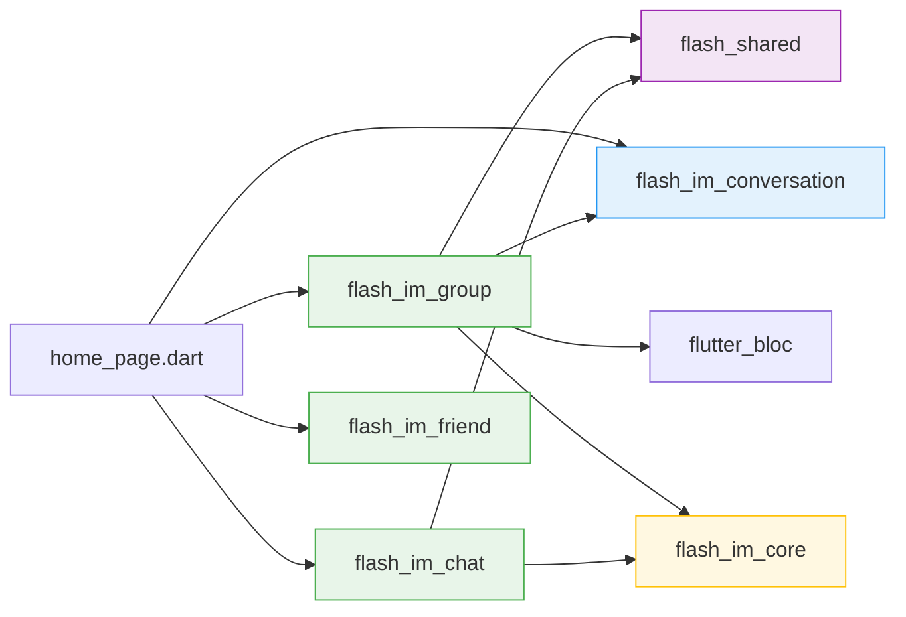
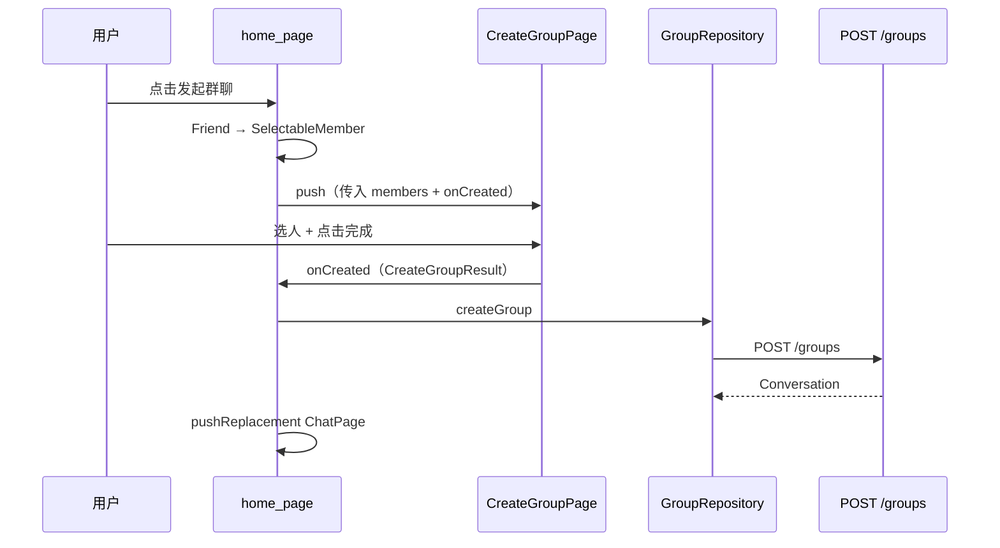
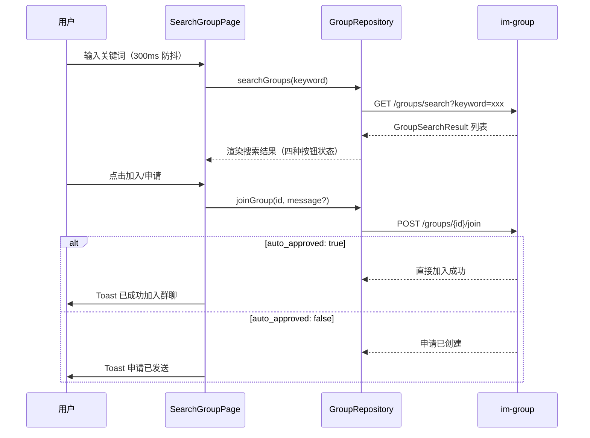
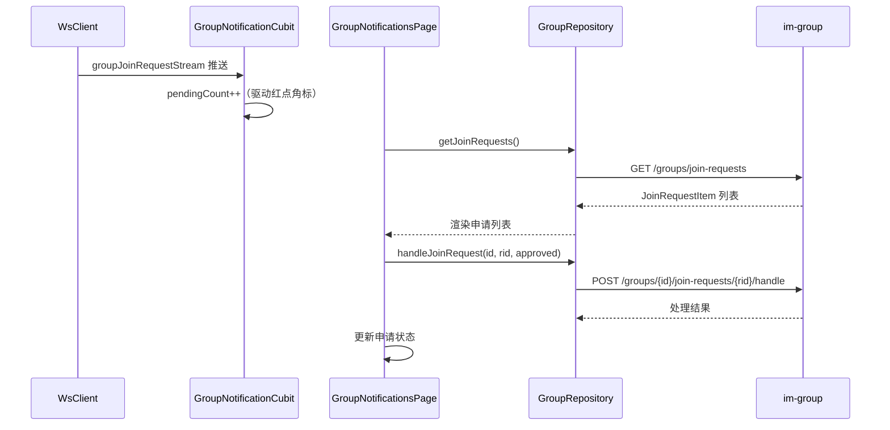
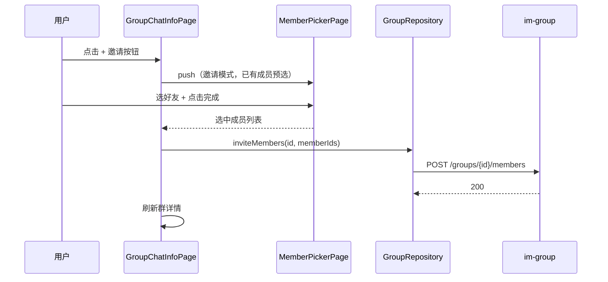
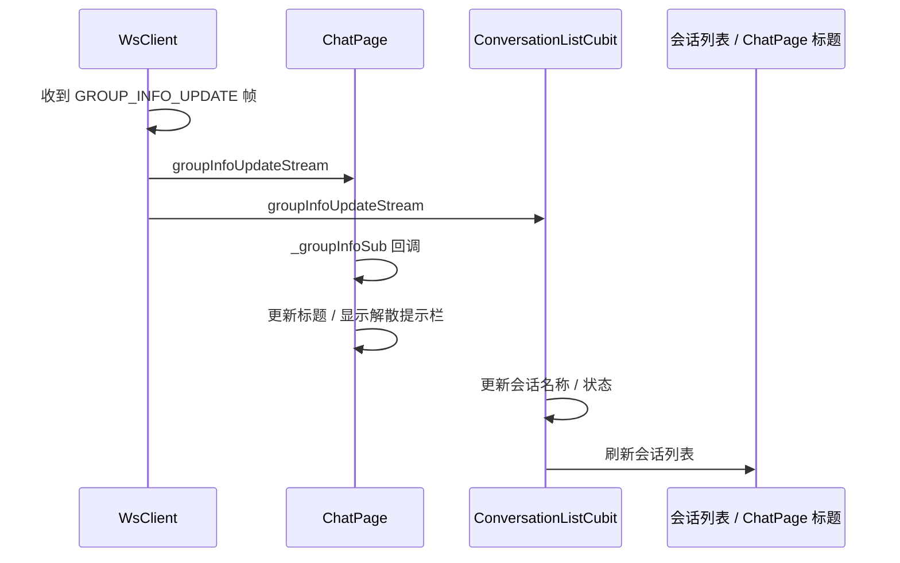

# 群聊 — 前端局域网络

涉及节点：P-28~P-29, P-31~P-40, F-10~F-11

---

## 一、远景：模块与依赖

### 涉及模块

| 模块 | 位置 | 职责 |
|------|------|------|
| flash_im_group | client/modules/flash_im_group/ | 群聊页面和数据（独立模块） |
| flash_im_chat | client/modules/flash_im_chat/ | 单聊详情页 + ChatPage 适配 + GROUP_INFO_UPDATE 监听 |
| flash_im_conversation | client/modules/flash_im_conversation/ | 会话列表 type 过滤 + 宫格头像适配 + GROUP_INFO_UPDATE 消费 |
| flash_shared | client/modules/flash_shared/ | GroupAvatarWidget + WxPopupMenuButton + MemberPickerPage + SelectableMember + PinyinUtil |
| flash_im_core | client/modules/flash_im_core/ | WsClient groupJoinRequestStream + groupInfoUpdateStream |

### 依赖关系

flash_im_group 依赖 flash_shared（共享组件 + MemberPickerPage）、flash_im_conversation（Conversation 模型 + ConversationRepository）、flash_im_core（WsClient groupJoinRequestStream + groupInfoUpdateStream）和 flutter_bloc（GroupNotificationCubit）。flash_im_chat 新增 flash_im_core 依赖（ChatPage 监听 groupInfoUpdateStream）。不依赖 flash_im_friend——好友数据通过 home_page 转换为 SelectableMember 传入。

### 节点详情

| 编号 | 功能节点 | 模块 | 职责 |
|------|---------|------|------|
| F-10 | 群通知WS帧分发 | flash_im_core | WsClient 新增 GROUP_JOIN_REQUEST 帧类型，groupJoinRequestStream 分发 |
| F-11 | GROUP_INFO_UPDATE WS 帧分发 | flash_im_core | WsClient 新增 GROUP_INFO_UPDATE 帧类型，groupInfoUpdateStream 分发 |
| P-28 | 创建群聊页 | flash_im_group | 微信风格选人 + 字母索引 + 自动群名 |
| P-29 | 我的群聊页 | flash_im_group | 群聊列表 + 本地搜索 |
| P-31 | 单聊详情页 | flash_im_chat | 对方信息 + 邀请更多人 |
| P-32 | 群聊消息气泡适配 | flash_im_chat | 系统消息居中灰色标签 |
| P-33 | 群聊会话列表适配 | flash_im_conversation | 宫格头像 + 默认群图标 |
| P-34 | 群搜索与入群 | flash_im_group | SearchGroupPage，独立搜索群聊页：远程搜索 + 四种按钮状态 + 入群对话框 |
| P-35 | 群通知页 | flash_im_group | GroupNotificationsPage，群主查看和处理入群申请列表 |
| P-36 | 群通知角标 | flash_im_group | GroupNotificationCubit 管理 pendingCount，驱动通讯录 Tab 红点 |
| P-37 | 群聊详情页 | flash_im_group | GroupChatInfoPage，完整群管理中心（成员网格 + 邀请/踢人入口 + 群公告 + 群名编辑 + 转让/解散/退群按钮 + 入群验证开关） |
| P-38 | 群详情页扩展 | flash_im_group | 完整群管理中心：邀请/踢人/退群入口 + 群公告 + 群名编辑 + 转让/解散独立按钮 |
| P-39 | 邀请入群选人页 | flash_im_group | 复用 MemberPickerPage（flash_shared），已有成员预选不可取消 |
| P-40 | 群公告页 | flash_im_group | 查看/编辑群公告，群主可发布，普通成员只读 |

### v0.0.3 新增共享组件（下沉到 flash_shared）

| 组件 | 位置 | 职责 |
|------|------|------|
| MemberPickerPage | flash_shared | 通用选人页面，支持邀请模式和移除模式 |
| SelectableMember | flash_shared | 可选成员数据模型，解耦好友/群成员数据源 |
| PinyinUtil | flash_shared | 拼音工具，支持字母索引排序 |
| EditGroupNamePage | flash_im_group | 独立的编辑群名页面 |

---

## 二、中景：数据通道与事件流

### 数据通道

| 通道 | 协议 | 方向 | 特点 |
|------|------|------|------|
| GroupRepository.createGroup | HTTP | 客户端 → POST /groups | 创建群聊 |
| ConversationRepository.getList | HTTP | 客户端 → GET /conversations?type=1 | 群聊列表 |
| GroupRepository.searchGroups | HTTP | 客户端 → GET /groups/search?keyword= | 远程搜索群聊 |
| GroupRepository.joinGroup | HTTP | 客户端 → POST /groups/{id}/join | 入群申请（分支：直接加入/创建申请） |
| GroupRepository.handleJoinRequest | HTTP | 客户端 → POST /groups/{id}/join-requests/{rid}/handle | 群主审批 |
| GroupRepository.getJoinRequests | HTTP | 客户端 → GET /groups/join-requests | 群主查询入群通知 |
| GroupRepository.getGroupDetail | HTTP | 客户端 → GET /groups/{id}/detail | 群详情（成员列表+群信息+announcement+status） |
| GroupRepository.updateGroupSettings | HTTP | 客户端 → PUT /groups/{id}/settings | 群主切换入群验证 |
| GroupRepository.inviteMembers | HTTP | 客户端 → POST /groups/{id}/members | 邀请入群 |
| GroupRepository.removeMember | HTTP | 客户端 → DELETE /groups/{id}/members/{uid} | 群主踢人 |
| GroupRepository.leaveGroup | HTTP | 客户端 → POST /groups/{id}/leave | 退出群聊 |
| GroupRepository.transferOwner | HTTP | 客户端 → PUT /groups/{id}/transfer | 转让群主 |
| GroupRepository.disbandGroup | HTTP | 客户端 → POST /groups/{id}/disband | 解散群聊 |
| GroupRepository.updateAnnouncement | HTTP | 客户端 → PUT /groups/{id}/announcement | 群公告 |
| GroupRepository.updateGroupName | HTTP | 客户端 → PUT /groups/{id} | 修改群名 |
| WsClient.groupJoinRequestStream | WS | 服务端 → 客户端 | GROUP_JOIN_REQUEST 帧实时推送 |
| WsClient.groupInfoUpdateStream | WS | 服务端 → 客户端 | GROUP_INFO_UPDATE 帧实时推送 |
| onCreated 回调 | 内存 | CreateGroupPage → home_page | 选人结果传递 |
| Friend → SelectableMember | 内存 | home_page 转换 | 模块解耦 |

### 关键事件流：创建群聊

### 关键事件流：搜索并入群

### 关键事件流：群主审批

### 关键事件流：邀请入群

### 关键事件流：GROUP_INFO_UPDATE 实时推送

### 边界接口

**HTTP 接口**

| 接口 | 消费节点 | 提供节点 |
|------|---------|---------|
| POST /groups | P-28（via GroupRepository） | D-18 |
| GET /conversations?type=1 | P-29（via ConversationRepository） | D-02 |
| GET /groups/search?keyword= | P-34（via GroupRepository） | D-19 |
| POST /groups/{id}/join | P-34（via GroupRepository） | D-20 |
| POST /groups/{id}/join-requests/{rid}/handle | P-35（via GroupRepository） | D-21 |
| GET /groups/join-requests | P-35（via GroupRepository） | D-22 |
| GET /groups/{id}/detail | P-37, P-38（via GroupRepository） | D-23 |
| PUT /groups/{id}/settings | P-37（via GroupRepository） | D-23 |
| POST /groups/{id}/members | P-39（via GroupRepository） | D-24 |
| DELETE /groups/{id}/members/{uid} | P-38（via GroupRepository） | D-25 |
| POST /groups/{id}/leave | P-38（via GroupRepository） | D-26 |
| PUT /groups/{id}/transfer | P-38（via GroupRepository） | D-27 |
| POST /groups/{id}/disband | P-38（via GroupRepository） | D-28 |
| PUT /groups/{id}/announcement | P-40（via GroupRepository） | D-29 |
| PUT /groups/{id} | P-38（via GroupRepository） | D-30 |

**WS 流**

| 流 | 消费节点 | 来源 |
|----|---------|------|
| groupJoinRequestStream | P-36（GroupNotificationCubit） | F-10（WsClient） |
| groupInfoUpdateStream | ChatPage + ConversationListCubit | F-11（WsClient） |

**Protobuf 消息**

| 消息 | 解码模块 | 消费模块 |
|------|---------|---------|
| GroupJoinRequestNotification | flash_im_core (WsClient) | flash_im_group (GroupNotificationCubit) |
| GroupInfoUpdate | flash_im_core (WsClient) | flash_im_chat (ChatPage) + flash_im_conversation (ConversationListCubit) |

---

## 三、近景：生命周期与订阅

### 核心对象生命周期

| 对象 | 创建时机 | 销毁时机 | 生命跨度 |
|------|---------|---------|---------|
| GroupRepository | main.dart 启动时 | 应用退出 | 应用级 |
| GroupNotificationCubit | home_page 创建时 | home_page 销毁时 | 应用级 |
| CreateGroupPage | push 进入 | pushReplacement 替换 | 页面级 |
| MyGroupsPage | push 进入 | pop 返回 | 页面级 |
| SearchGroupPage | push 进入 | pop 返回 | 页面级 |
| GroupNotificationsPage | push 进入 | pop 返回 | 页面级 |
| GroupChatInfoPage | push 进入 | pop 返回 | 页面级 |
| MemberPickerPage | push 进入 | pop 返回 | 页面级 |
| EditGroupNamePage | push 进入 | pop 返回 | 页面级 |

### GroupNotificationCubit 生命周期与 WS 订阅

GroupNotificationCubit 在 home_page 创建时初始化，订阅 WsClient.groupJoinRequestStream。每收到一条 GROUP_JOIN_REQUEST 帧，pendingCount 自增，驱动通讯录 Tab 红点角标更新。进入 GroupNotificationsPage 时通过 HTTP 拉取完整列表，处理申请后 pendingCount 递减。Cubit 销毁时自动 cancel StreamSubscription。

### ChatPage 的 _groupInfoSub 订阅

ChatPage 在 initState 时判断当前会话是否为群聊，若是则订阅 WsClient.groupInfoUpdateStream，过滤当前 conversationId。收到 GROUP_INFO_UPDATE 帧后：
- 群名变更：更新 AppBar 标题
- 群公告变更：刷新群公告横幅
- 解散状态：禁用输入框，显示"该群聊已解散"提示栏，隐藏右上角详情按钮

ChatPage dispose 时 cancel _groupInfoSub。

### ConversationListCubit 的 GROUP_INFO_UPDATE 消费

ConversationListCubit 订阅 groupInfoUpdateStream，收到帧后更新本地会话列表中对应会话的名称/状态，驱动 UI 刷新。

---

## 四、版本演进

| 版本 | 变更 |
|------|------|
| v0.0.1_group | 新建 flash_im_group 模块；CreateGroupPage 微信风格选人；MyGroupsPage 群聊列表；PrivateChatInfoPage 单聊详情；ChatPage/ConversationTile/MessageBubble 群聊适配 |
| v0.0.2_group | 新增 F-10, P-34~P-37：SearchGroupPage 搜索群聊页（远程搜索+四种按钮状态+入群对话框）；GroupNotificationsPage 群通知页；GroupNotificationCubit 群通知角标（WS 驱动 pendingCount）；GroupChatInfoPage 群聊详情页（成员网格+入群验证开关）；flash_im_core 扩展 groupJoinRequestStream；新增 flutter_bloc 依赖 |
| v0.0.3_group | 新增 F-11, P-38~P-40：GroupChatInfoPage 从最小版本扩展为完整群管理中心（邀请/踢人/退群/转让/解散/群公告/群名编辑）；MemberPickerPage/SelectableMember/PinyinUtil 下沉到 flash_shared；新增 EditGroupNamePage 独立编辑群名页；WsClient 新增 groupInfoUpdateStream（GROUP_INFO_UPDATE 帧分发）；ChatPage 新增 _groupInfoSub 订阅实时同步群信息；ConversationListCubit 消费 GROUP_INFO_UPDATE 更新会话列表；F-06 扩展 groupInfoUpdateStream |
