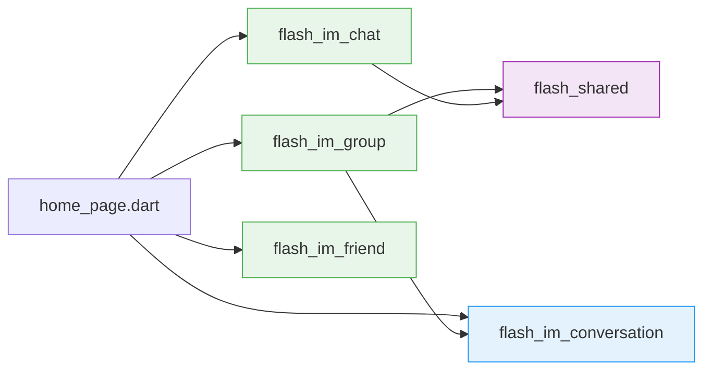
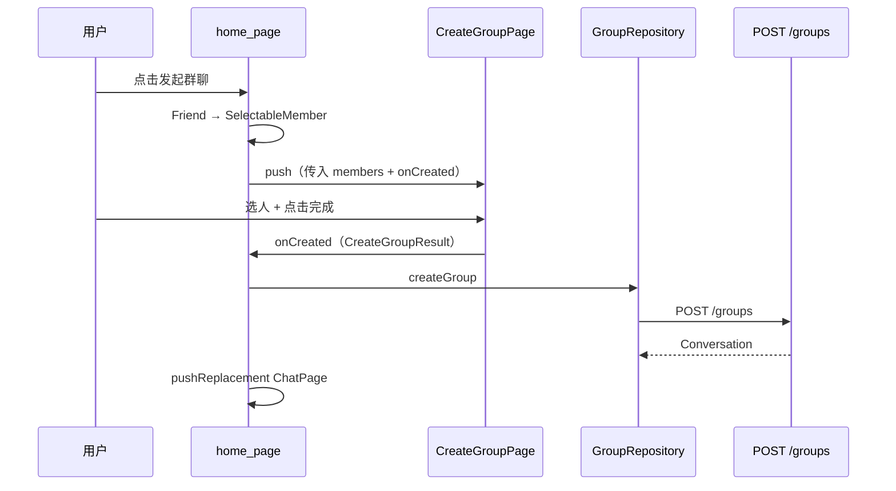

# 群聊 — 前端局域网络

涉及节点：P-28~P-29, P-31~P-33

---

## 一、远景：模块与依赖

### 涉及模块

| 模块 | 位置 | 职责 |
|------|------|------|
| flash_im_group | client/modules/flash_im_group/ | 群聊页面和数据（独立模块） |
| flash_im_chat | client/modules/flash_im_chat/ | 单聊详情页 + ChatPage 适配 |
| flash_im_conversation | client/modules/flash_im_conversation/ | 会话列表 type 过滤 + 宫格头像适配 |
| flash_shared | client/modules/flash_shared/ | GroupAvatarWidget + WxPopupMenuButton |

### 依赖关系

flash_im_group 依赖 flash_shared（共享组件）和 flash_im_conversation（Conversation 模型 + ConversationRepository）。不依赖 flash_im_friend——好友数据通过 home_page 转换为 SelectableMember 传入。

### 节点详情

| 编号 | 功能节点 | 模块 | 职责 |
|------|---------|------|------|
| P-28 | 创建群聊页 | flash_im_group | 微信风格选人 + 字母索引 + 自动群名 |
| P-29 | 我的群聊页 | flash_im_group | 群聊列表 + 本地搜索 |
| P-31 | 单聊详情页 | flash_im_chat | 对方信息 + 邀请更多人 |
| P-32 | 群聊消息气泡适配 | flash_im_chat | 系统消息居中灰色标签 |
| P-33 | 群聊会话列表适配 | flash_im_conversation | 宫格头像 + 默认群图标 |

---

## 二、中景：数据通道与事件流

### 数据通道

| 通道 | 协议 | 方向 | 特点 |
|------|------|------|------|
| GroupRepository.createGroup | HTTP | 客户端 → POST /groups | 创建群聊 |
| ConversationRepository.getList | HTTP | 客户端 → GET /conversations?type=1 | 群聊列表 |
| onCreated 回调 | 内存 | CreateGroupPage → home_page | 选人结果传递 |
| Friend → SelectableMember | 内存 | home_page 转换 | 模块解耦 |

### 关键事件流：创建群聊

### 边界接口

**HTTP 接口**

| 接口 | 消费节点 | 提供节点 |
|------|---------|---------|
| POST /groups | P-28（via GroupRepository） | D-18 |
| GET /conversations?type=1 | P-29（via ConversationRepository） | D-02 |

---

## 三、近景：生命周期与订阅

### 核心对象生命周期

| 对象 | 创建时机 | 销毁时机 | 生命跨度 |
|------|---------|---------|---------|
| GroupRepository | main.dart 启动时 | 应用退出 | 应用级 |
| CreateGroupPage | push 进入 | pushReplacement 替换 | 页面级 |
| MyGroupsPage | push 进入 | pop 返回 | 页面级 |

本版本无 Stream 订阅，无需检查 listen/cancel 配对。

---

## 四、版本演进

| 版本 | 变更 |
|------|------|
| v0.0.1_group | 新建 flash_im_group 模块；CreateGroupPage 微信风格选人；MyGroupsPage 群聊列表；PrivateChatInfoPage 单聊详情；ChatPage/ConversationTile/MessageBubble 群聊适配 |
