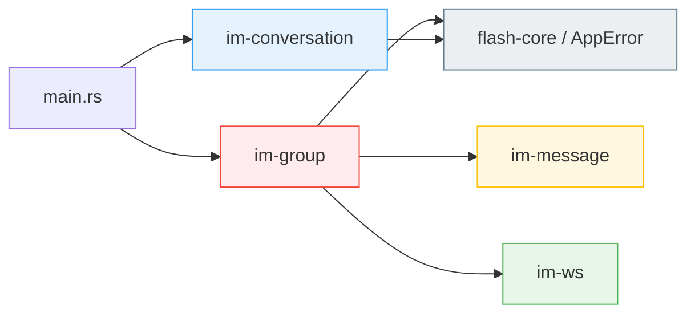
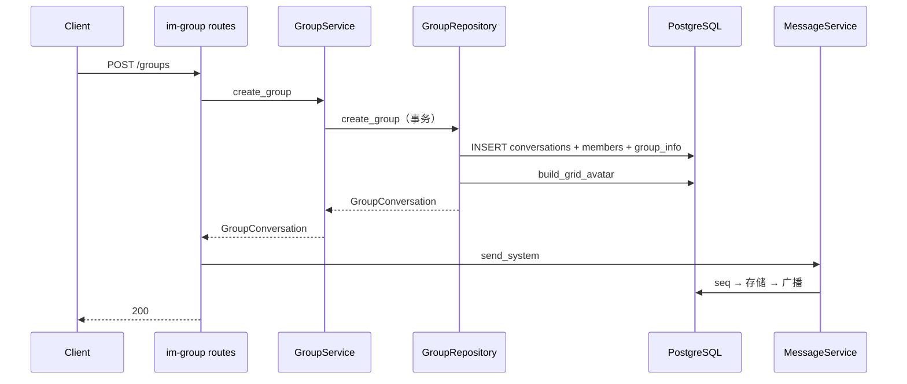
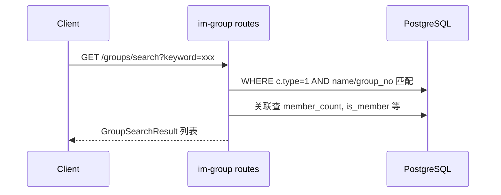
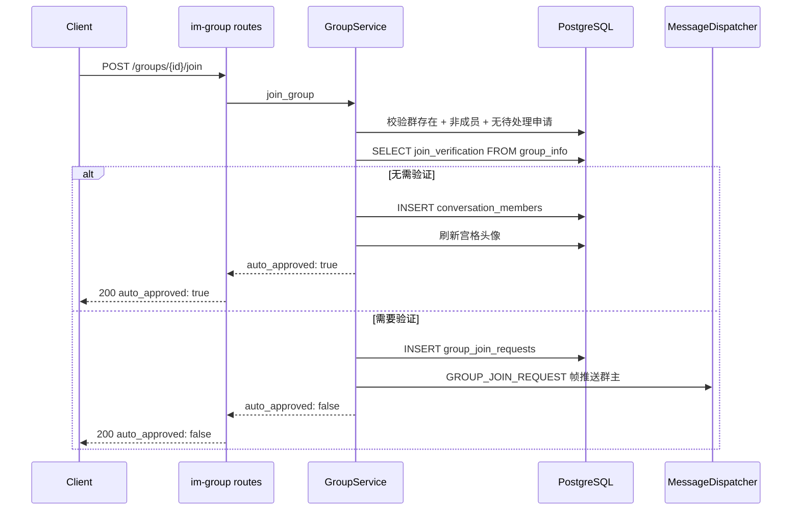
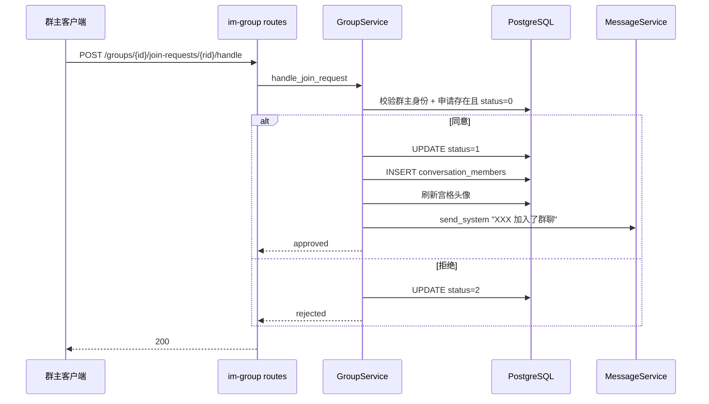
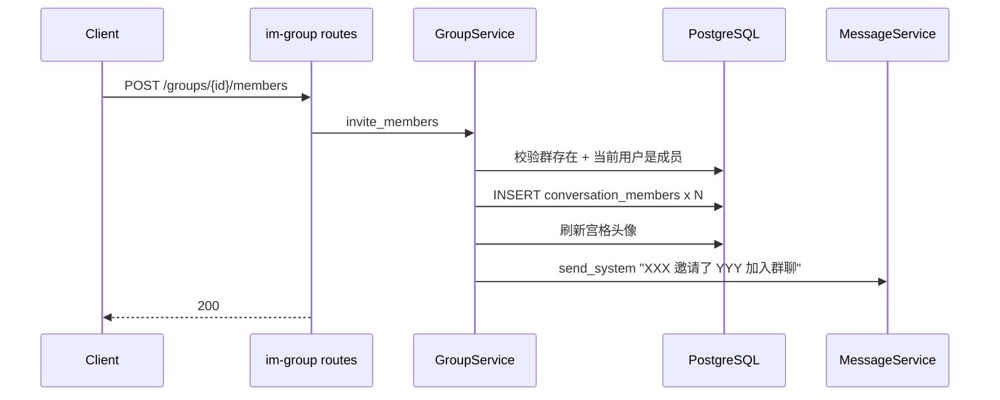
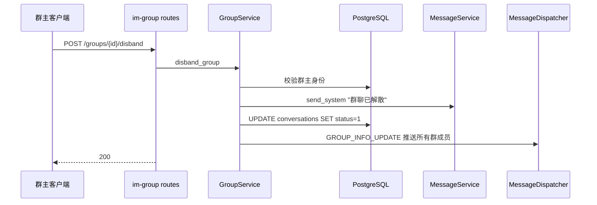
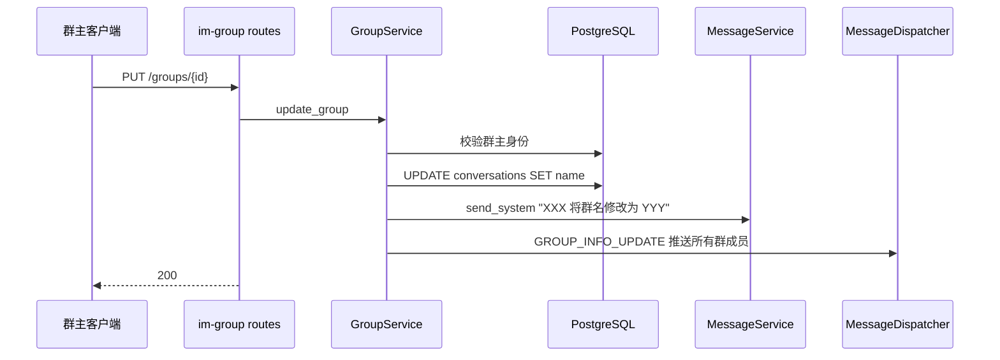

# 群聊 — 后端局域网络

涉及节点：D-18~D-30, I-13

---

## 一、远景：模块与依赖

### 涉及模块

| 模块 | 位置 | 职责 |
|------|------|------|
| im-group | server/modules/im-group/ | 群聊创建、搜索、入群申请/审批、群详情/设置、邀请/踢人/退群/转让/解散/群公告/改名（独立 crate，14 个路由） |
| im-conversation | server/modules/im-conversation/ | 会话通用能力（列表 type 过滤） |
| im-message | server/modules/im-message/ | 系统消息（send_system） |
| im-ws | server/modules/im-ws/ | WS 帧分发（GROUP_JOIN_REQUEST + GROUP_INFO_UPDATE 推送） |
| flash-core | server/modules/flash-core/ | PgPool, JWT, AppError 统一错误处理 |

### 依赖关系

im-group 依赖 flash-core（PgPool, JWT, AppError 统一错误类型）、im-message（send_system）和 im-ws（MessageDispatcher，用于 GROUP_JOIN_REQUEST / GROUP_INFO_UPDATE WS 推送）。不依赖 im-conversation，两者共享数据库表但代码独立。v0.0.3 起所有路由统一使用 AppError 替代 map_err 反模式。

### 节点详情

| 编号 | 功能节点 | 模块 | 职责 |
|------|---------|------|------|
| I-13 | AppError 统一错误处理 | flash-core | 统一错误类型 + IntoResponse，替代 map_err 反模式 |
| D-18 | 群聊创建 | im-group | POST /groups，事务创建群 + 成员 + group_info + 宫格头像 + 系统消息 |
| D-19 | 群搜索 | im-group | GET /groups/search，按群名模糊搜索或群号精确匹配，返回成员数/是否已加入/是否需验证/是否已申请 |
| D-20 | 入群申请 | im-group | POST /groups/{id}/join，无需验证直接加入，需验证创建申请 + WS 通知群主 |
| D-21 | 入群审批 | im-group | POST /groups/{id}/join-requests/{rid}/handle，群主同意或拒绝 |
| D-22 | 入群通知查询 | im-group | GET /groups/join-requests，聚合当前用户作为群主的所有入群申请 |
| D-23 | 群成员查询与设置 | im-group | GET /groups/{id}/detail 群详情（成员列表+群信息+announcement+status）+ PUT /groups/{id}/settings 群主切换入群验证 |
| D-24 | 邀请入群 | im-group | POST /groups/{id}/members，批量添加成员 + 刷新头像 + 系统消息 |
| D-25 | 踢人 | im-group | DELETE /groups/{id}/members/{uid}，群主移除成员 + 刷新头像 + 系统消息 |
| D-26 | 退出群聊 | im-group | POST /groups/{id}/leave，普通成员退出 + 刷新头像 + 系统消息 |
| D-27 | 转让群主 | im-group | PUT /groups/{id}/transfer，更新 owner_id + 系统消息 |
| D-28 | 解散群聊 | im-group | POST /groups/{id}/disband，标记 status=1 + 系统消息（不删成员和消息） |
| D-29 | 群公告 | im-group | PUT /groups/{id}/announcement，群主发布/编辑公告 + 系统消息 + GROUP_INFO_UPDATE |
| D-30 | 修改群名 | im-group | PUT /groups/{id}，群主修改群名 + 系统消息 + GROUP_INFO_UPDATE |
| D-02 | 会话列表查询（扩展） | im-conversation | GET /conversations 新增 type 过滤参数 |

---

## 二、中景：数据通道与事件流

### 数据通道

| 通道 | 协议 | 方向 | 特点 |
|------|------|------|------|
| POST /groups | HTTP | 客户端 → im-group | 创建群聊 |
| GET /conversations?type=1 | HTTP | 客户端 → im-conversation | 群聊列表过滤 |
| GET /groups/search?keyword= | HTTP | 客户端 → im-group | 群搜索（模糊群名/精确群号） |
| POST /groups/{id}/join | HTTP | 客户端 → im-group | 入群申请（分支：直接加入/创建申请） |
| POST /groups/{id}/join-requests/{rid}/handle | HTTP | 客户端 → im-group | 群主审批入群申请 |
| GET /groups/join-requests | HTTP | 客户端 → im-group | 群主查询入群通知列表 |
| GET /groups/{id}/detail | HTTP | 客户端 → im-group | 群详情（成员列表+群信息+announcement+status） |
| PUT /groups/{id}/settings | HTTP | 客户端 → im-group | 群主切换入群验证开关 |
| POST /groups/{id}/members | HTTP | 客户端 → im-group | 邀请入群，批量添加成员 |
| DELETE /groups/{id}/members/{uid} | HTTP | 客户端 → im-group | 群主踢人 |
| POST /groups/{id}/leave | HTTP | 客户端 → im-group | 普通成员退出群聊 |
| PUT /groups/{id}/transfer | HTTP | 客户端 → im-group | 群主转让 |
| POST /groups/{id}/disband | HTTP | 客户端 → im-group | 群主解散群聊 |
| PUT /groups/{id}/announcement | HTTP | 客户端 → im-group | 群主发布/编辑群公告 |
| PUT /groups/{id} | HTTP | 客户端 → im-group | 群主修改群名 |
| GROUP_JOIN_REQUEST | WS | im-group → im-ws → 群主客户端 | 入群申请实时推送 |
| GROUP_INFO_UPDATE | WS | im-group → im-ws → 所有群成员 | 群信息变更实时推送（改名/改公告/解散） |
| send_system | 内部调用 | im-group → im-message | 系统消息走完整消息链路 |

### 关键事件流：创建群聊

### 关键事件流：搜索群聊

### 关键事件流：入群申请（分支逻辑）

### 关键事件流：群主审批

### 关键事件流：邀请入群

### 关键事件流：解散群聊

### 关键事件流：修改群名（含 GROUP_INFO_UPDATE）

### 边界接口

**HTTP 接口**

| 接口 | 提供节点 | 消费节点 |
|------|---------|---------|
| POST /groups | D-18 | P-28 |
| GET /conversations?type=1 | D-02 | P-29 |
| GET /groups/search?keyword= | D-19 | P-34 |
| POST /groups/{id}/join | D-20 | P-34 |
| POST /groups/{id}/join-requests/{rid}/handle | D-21 | P-35 |
| GET /groups/join-requests | D-22 | P-35 |
| GET /groups/{id}/detail | D-23 | P-37, P-38 |
| PUT /groups/{id}/settings | D-23 | P-37 |
| POST /groups/{id}/members | D-24 | P-39 |
| DELETE /groups/{id}/members/{uid} | D-25 | P-38 |
| POST /groups/{id}/leave | D-26 | P-38 |
| PUT /groups/{id}/transfer | D-27 | P-38 |
| POST /groups/{id}/disband | D-28 | P-38 |
| PUT /groups/{id}/announcement | D-29 | P-40 |
| PUT /groups/{id} | D-30 | P-38 |

**WS 帧**

| 帧类型 | 产生节点 | 消费节点 |
|--------|---------|---------|
| GROUP_JOIN_REQUEST | D-20 | F-10 → P-36 |
| GROUP_INFO_UPDATE | D-29, D-30, D-28 | F-11 → P-38, P-03 |

**Protobuf 消息**

| 消息 | 定义模块 | 消费模块 |
|------|---------|---------|
| GroupJoinRequestNotification | im-ws (proto) | flash_im_core (WsClient) |
| GroupInfoUpdate | im-ws (proto) | flash_im_core (WsClient) |

---

## 三、版本演进

| 版本 | 变更 |
|------|------|
| v0.0.1_group | 新建 im-group crate，POST /groups 创建群聊；im-conversation 扩展 type 过滤 |
| v0.0.2_group | 新增 D-19~D-23：群搜索/入群申请/入群审批/入群通知查询/群详情与设置；新增 GROUP_JOIN_REQUEST WS 帧推送；新增 group_join_requests 表和 group_no 字段；im-group 新增 im-ws 依赖 |
| v0.0.3_group | 新增 D-24~D-30, I-13：邀请入群/踢人/退群/转让群主/解散群聊/群公告/修改群名 7 个接口（路由从 7 扩展到 14）；新增 flash-core AppError 统一错误处理；新增 GROUP_INFO_UPDATE WS 帧（改名/改公告/解散时推送所有群成员）；D-23 扩展返回 announcement + status 字段 |
