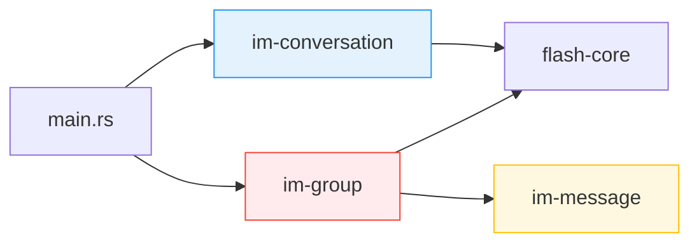
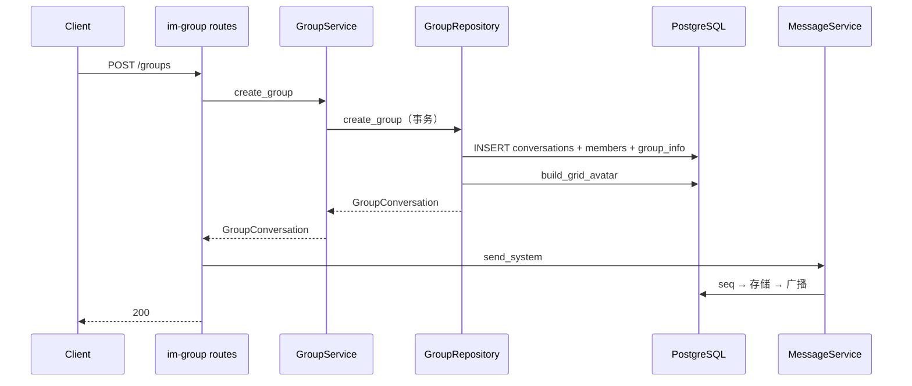

# 群聊 — 后端局域网络

涉及节点：D-18（群聊创建）、D-02 扩展（type 过滤）

---

## 一、远景：模块与依赖

### 涉及模块

| 模块 | 位置 | 职责 |
|------|------|------|
| im-group | server/modules/im-group/ | 群聊创建（独立 crate） |
| im-conversation | server/modules/im-conversation/ | 会话通用能力（列表 type 过滤） |
| im-message | server/modules/im-message/ | 系统消息（send_system） |

### 依赖关系

im-group 依赖 flash-core（PgPool, JWT）和 im-message（send_system）。不依赖 im-conversation，两者共享数据库表但代码独立。

### 节点详情

| 编号 | 功能节点 | 模块 | 职责 |
|------|---------|------|------|
| D-18 | 群聊创建 | im-group | POST /groups，事务创建群 + 成员 + group_info + 宫格头像 + 系统消息 |
| D-02 | 会话列表查询（扩展） | im-conversation | GET /conversations 新增 type 过滤参数 |

---

## 二、中景：数据通道与事件流

### 数据通道

| 通道 | 协议 | 方向 | 特点 |
|------|------|------|------|
| POST /groups | HTTP | 客户端 → im-group | 创建群聊 |
| GET /conversations?type=1 | HTTP | 客户端 → im-conversation | 群聊列表过滤 |
| send_system | 内部调用 | im-group → im-message | 系统消息走完整消息链路 |

### 关键事件流：创建群聊

### 边界接口

**HTTP 接口**

| 接口 | 提供节点 | 消费节点 |
|------|---------|---------|
| POST /groups | D-18 | P-28 |
| GET /conversations?type=1 | D-02 | P-29 |

---

## 三、版本演进

| 版本 | 变更 |
|------|------|
| v0.0.1_group | 新建 im-group crate，POST /groups 创建群聊；im-conversation 扩展 type 过滤 |
