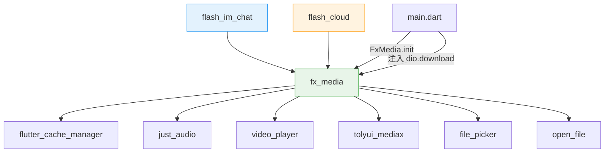
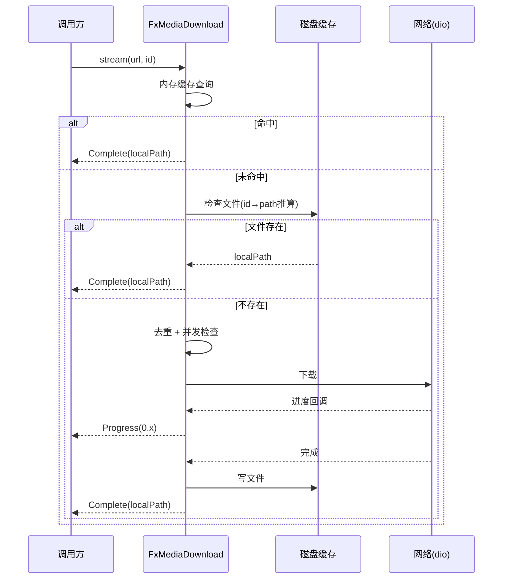
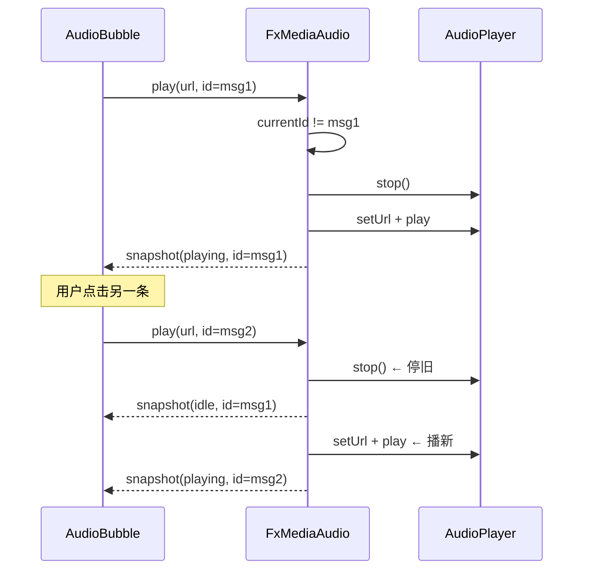

# 统一媒体管理 — 前端局域网络

涉及节点：F-22~F-26, P-81

---

## 一、远景：模块与依赖

### 涉及模块

| 模块 | 位置 | 职责 |
|------|------|------|
| fx_media | client/packages/fx_media/ | 通用媒体管理包（下载/缓存/音频/视频/图片/文件操作） |
| flash_im_chat | client/modules/flash_im_chat/ | 聊天模块，消费 FxMedia API |
| flash_cloud | client/modules/flash_cloud/ | 云空间模块，消费 FxMedia API |

### 依赖关系

### 节点详情

| 编号 | 功能节点 | 模块 | 职责 |
|------|---------|------|------|
| F-22 | 统一下载管理 | fx_media/src/download/ | 队列 + 并发控制(5) + id 去重 + 进度流 + 磁盘缓存恢复 |
| F-23 | 全局音频播放器 | fx_media/src/audio/ | 播新停旧单例 AudioPlayer + snapshotStream 状态流 |
| F-24 | 图片缓存 Widget | fx_media/src/image/ | CachedNetworkImage 渲染 + onCached 路径回调 + 全屏预览入口 |
| F-25 | 视频播放页 | fx_media/src/video/ | 全屏视频播放（网络 URL + 本地文件） |
| F-26 | 文件操作工具 | fx_media/src/file/ | 系统打开 / 另存为 / 打开文件夹（跨平台） |
| P-81 | 云空间媒体预览 | flash_cloud/view/file_detail_page | 视频点击播放、图片点击全屏、音频点击播放/暂停 |

---

## 二、中景：数据通道与事件流

### 数据通道

| 通道 | 协议 | 方向 | 特点 |
|------|------|------|------|
| FxMedia.download.stream | HTTP download（注入） | 客户端→服务端 | 并发队列 + 进度流 |
| FxMedia.download.get | HTTP download（注入） | 客户端→服务端 | 无进度，只返回最终路径 |
| FxMedia.audio.snapshotStream | 本地事件流 | 播放器→UI | 播放状态 + 进度 |
| FxMedia.image.cached (onCached) | 本地回调 | 缓存层→业务层 | 图片落盘后通知路径 |
| FxDownloadFunction | typedef 注入 | fx_media→dio | 解耦 HTTP 实现 |

### 关键事件流：统一下载

### 关键事件流：音频播新停旧

---

## 三、近景：生命周期与订阅

### 核心对象生命周期

| 对象 | 创建时机 | 销毁时机 | 生命跨度 |
|------|---------|---------|---------|
| FxMediaDownload | FxMedia.init()（main.dart） | 不销毁 | 应用级 |
| FxMediaAudio | FxMedia.init()（main.dart） | 不销毁 | 应用级 |
| FxMediaImage | FxMedia.init()（main.dart） | 不销毁 | 应用级 |
| FxMediaVideo | FxMedia.init()（main.dart） | 不销毁 | 应用级 |
| FxMediaFile | FxMedia.init()（main.dart） | 不销毁 | 应用级 |
| AudioPlayer（内部） | FxMediaAudio 构造 | FxMediaAudio.dispose | 应用级 |

### 订阅关系

| 订阅者 | 监听目标 | 订阅时机 | 取消时机 | 是否成对 |
|--------|---------|---------|---------|---------|
| AudioBubble | FxMedia.audio.snapshotStream | initState | dispose | ✅ |
| FileDetailCubit | FxMedia.download.stream | downloadToLocal() | close() | ✅ |
| ChatFileMixin | FxMedia.download.stream | downloadFile() | 完成/错误 | ✅ |
| FxCachedImage | CacheManager 回调 | didChangeDependencies | dispose | ✅ |

### 迁移映射

| 旧 API | 新 API |
|--------|--------|
| CloudDownloadManager().download() | FxMedia.download.stream() |
| FileCacheManagerImpl.getFile() | FxMedia.download.get() |
| AudioPlayer (AudioBubble 内部) | FxMedia.audio.play/pause/stop |
| ChatMediaHandler.openImage → Navigator.push | FxMedia.image.preview() |
| VideoPlayerPage (flash_im_chat) | FxMedia.video.open/openFile |
| Process.start / open_file (ChatMediaHandler) | FxMedia.file.open/saveAs/openFolder |

---

## 四、版本演进

| 版本 | 变更 |
|------|------|
| media/v0.0.1 | F-22~F-26, P-81：新建 fx_media 包 + 迁移 chat/cloud + 云空间媒体预览 |
