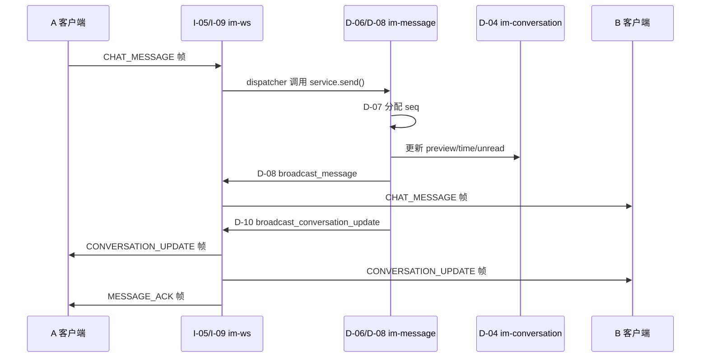
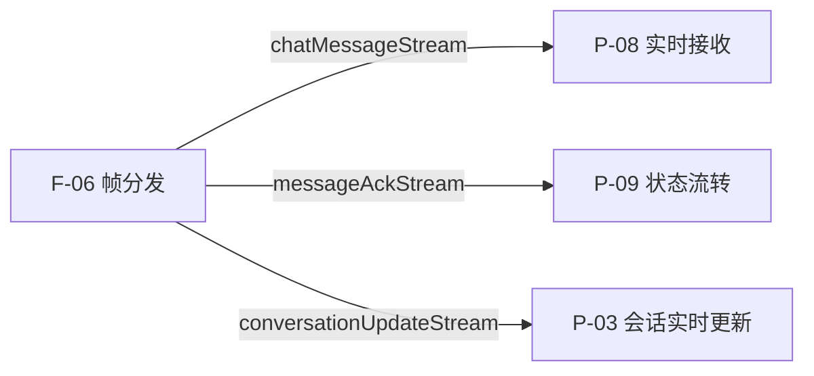

# 消息域 — 局域网络

涉及节点：D-06~D-10, P-06~P-09, F-07

---

## 节点详情

| 编号 | 功能节点 | 模块 | 端 | 职责 |
|------|---------|------|-----|------|
| D-06 | 消息存储 | im-message | 后端 | 验证、存储消息到 messages 表 |
| D-07 | 序列号生成 | im-message (seq_gen) | 后端 | conversation_seq 原子递增，保证 seq 唯一有序 |
| D-08 | 消息广播 | im-message (broadcaster) | 后端 | 通过 MessageBroadcaster trait 推送 ChatMessage 帧 |
| D-09 | 历史消息查询 | im-message | 后端 | GET /conversations/:id/messages，基于 seq 分页 |
| D-10 | 会话更新推送 | im-message (broadcaster) | 后端 | 推送 ConversationUpdate 帧（含 total_unread） |
| F-07 | 共享头像组件 | flash_shared | 前端 | AvatarWidget，跨模块共享 |
| P-06 | 历史消息加载 | flash_im_chat | 前端 | HTTP 拉取 + reverse ListView + shrinkWrap 切换 |
| P-07 | 消息发送 | flash_im_chat | 前端 | 乐观更新 + WS 发送 + 10s 超时 |
| P-08 | 实时接收 | flash_im_chat | 前端 | 监听 chatMessageStream，过滤/去重/追加 |
| P-09 | 状态流转 | flash_im_chat | 前端 | sending → sent / failed |

---

## 边界接口

### Protobuf 协议

| 文件 | 结构 | 消费节点 |
|------|------|---------|
| message.proto | ChatMessage | D-08, P-08 |
| message.proto | SendMessageRequest | P-07, I-09 |
| message.proto | MessageAck | I-09, P-09 |
| message.proto | ConversationUpdate | D-10, P-03 |

### HTTP 接口

| 接口 | 提供节点 | 消费节点 |
|------|---------|---------|
| GET /conversations/:id/messages | D-09 | P-06 |

### Rust trait

| trait | 定义节点 | 实现节点 | 作用 |
|-------|---------|---------|------|
| MessageBroadcaster | D-08 | I-08 (WsBroadcaster) | 解耦存储和推送 |

---

## 数据流向

### 消息发送（A → B）

### 前端帧消费

---

## 版本演进

| 版本 | 变更 |
|------|------|
| v0.0.3 | 初始：D-06~D-10, P-06~P-09, F-07 |
