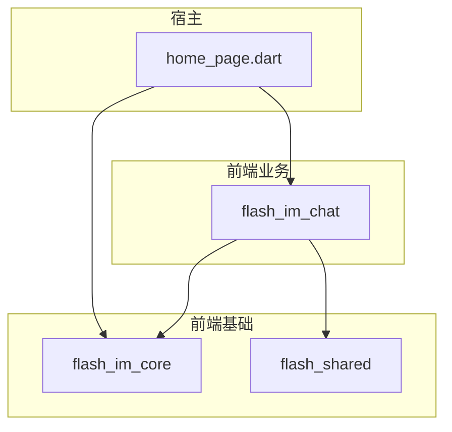
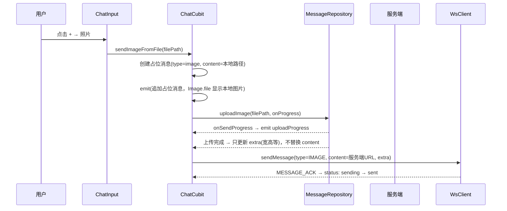
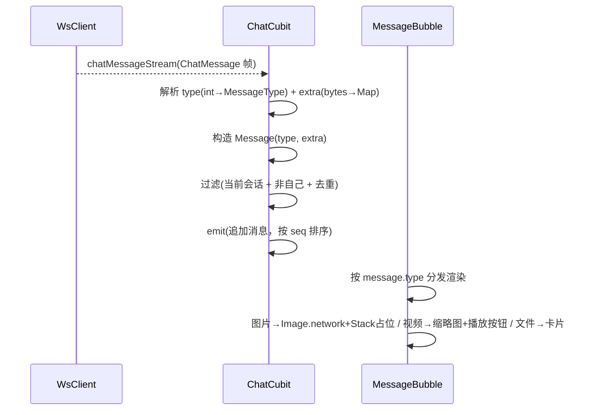
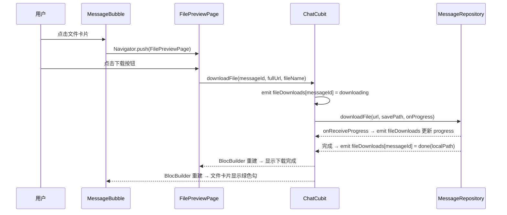

# 消息域 — 客户端局域网络

涉及节点：F-06~F-08, P-06~P-18

---

## 一、远景：模块与依赖

> 骨骼怎么连？看 pubspec.yaml 的依赖声明。

### 涉及模块

| 模块 | 位置 | 职责（一句话） |
|------|------|--------------|
| flash_im_chat | client/modules/flash_im_chat/ | 聊天页面：消息列表、发送（文本/图片/视频/文件）、接收、历史加载、预览/播放/下载 |
| flash_im_core | client/modules/flash_im_core/ | WS 通信层：连接管理、帧编解码、帧分发（chatMessageStream/messageAckStream） |
| flash_shared | client/modules/flash_shared/ | 跨模块共享 UI：AvatarWidget |

### 依赖关系

关键设计：
- flash_im_chat 依赖 flash_im_core（WsClient + Protobuf）和 flash_shared（AvatarWidget）
- flash_im_chat 不依赖 flash_im_conversation（两个业务模块平级独立）
- 宿主（home_page.dart）负责创建 ChatCubit 并注入 WsClient/MessageRepository

### 节点详情

| 编号 | 功能节点 | 模块 | 职责 |
|------|---------|------|------|
| F-06 | WsClient 帧分发 | flash_im_core | 按帧类型分发到 chatMessageStream / messageAckStream / conversationUpdateStream |
| F-07 | 共享头像组件 | flash_shared | AvatarWidget：identicon / 网络图片 / 占位自动切换 |
| F-08 | 视频信息提取 | flash_im_chat (video_thumbnail_service.dart) | VideoThumbnailService：fc_native_video_thumbnail 提取首帧 + video_player 提取时长和宽高 |
| P-06 | 历史消息加载 | flash_im_chat (chat_cubit.dart) | HTTP 拉取 + reverse ListView + shrinkWrap 动态切换 |
| P-07 | 文本消息发送 | flash_im_chat (chat_cubit.dart) | 乐观更新 + WS 发帧 + 10s 超时标记 failed |
| P-08 | 实时接收 | flash_im_chat (chat_cubit.dart) | 监听 chatMessageStream，解析 type/extra，过滤/去重/追加 |
| P-09 | 状态流转 | flash_im_chat (chat_cubit.dart) | 监听 messageAckStream，匹配 pending 更新 sending → sent |
| P-10 | 功能面板 | flash_im_chat (chat_input.dart) | 输入框"+"按钮，弹出 2×2 网格面板：照片/拍照/视频/文件 |
| P-11 | 图片消息气泡 | flash_im_chat (message_bubble.dart) | 本地/网络图片自适应，extra 宽高等比占位，上传蒙层 |
| P-12 | 视频消息气泡 | flash_im_chat (message_bubble.dart) | 缩略图 + 播放按钮 + 时长，extra 宽高等比占位 |
| P-13 | 文件消息气泡 | flash_im_chat (message_bubble.dart) | 文件卡片（文件名+大小+类型图标），下载状态/进度背景填充 |
| P-14 | 图片发送流程 | flash_im_chat (chat_cubit.dart) | 占位消息(本地路径) → 上传 → 只更新 extra → WS 发送(服务端URL) → ACK |
| P-15 | 视频发送流程 | flash_im_chat (chat_cubit.dart) | 提取缩略图+时长+宽高 → 占位消息(本地缩略图) → 上传(含宽高) → 更新 extra → WS 发送 → ACK |
| P-16 | 文件发送流程 | flash_im_chat (chat_cubit.dart) | 读取本地文件大小 → 占位消息 → 上传 → 更新 content+extra → WS 发送 → ACK |
| P-17 | 视频播放页 | flash_im_chat (video_player_page.dart) | video_player 全屏播放，暂停/进度拖动 |
| P-18 | 图片全屏预览 | flash_im_chat (image_preview_page.dart) | InteractiveViewer 缩放/平移 |

---

## 二、中景：数据通道与事件流

> 血液怎么流？三条通道汇入 ChatCubit，统一 emit 给 UI。

### 数据通道

| 通道 | 协议 | 方向 | 特点 | 例子 |
|------|------|------|------|------|
| HTTP 历史查询 | JSON | 客户端主动 | 拉取历史消息，基于 seq 分页 | GET /conversations/:id/messages |
| HTTP 文件上传 | multipart | 客户端主动 | 上传图片/视频/文件，onSendProgress 回调 | POST /api/upload/image |
| HTTP 文件下载 | binary | 客户端主动 | dio.download，onReceiveProgress 回调 | GET /uploads/file/... |
| WS 消息发送 | Protobuf 帧 | 客户端主动 | CHAT_MESSAGE 帧，含 type/content/extra | 发送图片消息 |
| WS 消息接收 | Protobuf 帧 | 服务端推送 | chatMessageStream，ChatCubit 监听 | 对方发来新消息 |
| WS ACK | Protobuf 帧 | 服务端推送 | messageAckStream，ChatCubit 监听 | 消息确认 |
| 内存状态 | Cubit emit | 内部 | 乐观更新，纯内存 | 点发送后消息立刻上屏 |

### 关键事件流

#### 场景 1：发送图片消息

#### 场景 2：接收富媒体消息

#### 场景 3：文件下载

### 边界接口

**Protobuf 协议**（通过 flash_im_core 消费）

| 结构 | 生产节点 | 消费节点 | 说明 |
|------|---------|---------|------|
| SendMessageRequest | P-07/P-14~P-16 | 服务端 dispatcher | type + content + extra(bytes) + client_id |
| ChatMessage | 服务端 broadcaster | P-08 | 接收消息，解析 type/extra |
| MessageAck | 服务端 dispatcher | P-09 | message_id + seq |
| MessageType 枚举 | 全局共享 | P-14~P-16, P-08 | TEXT=0, IMAGE=1, VIDEO=2, FILE=3 |

**HTTP 接口**（通过 MessageRepository 消费）

| 接口 | 消费节点 | 说明 |
|------|---------|------|
| GET /conversations/:id/messages | P-06 | 历史消息查询 |
| POST /api/upload/image | P-14 | 图片上传 |
| POST /api/upload/video | P-15 | 视频上传（含缩略图+元数据） |
| POST /api/upload/file | P-16 | 文件上传 |
| GET /uploads/{path} | P-11/P-12/P-17/P-18 | 静态文件访问（图片/视频/缩略图） |

---

## 三、近景：生命周期与订阅

> 神经怎么传导？ChatCubit 是页面级对象，打开聊天页创建，关闭时销毁。

### 核心对象生命周期

| 对象 | 创建时机 | 销毁时机 | 生命跨度 |
|------|---------|---------|---------|
| WsClient | 登录后 main.dart 创建 | 退出登录时 dispose | 应用级 |
| MessageRepository | main.dart 创建 | 应用退出 | 应用级 |
| ChatCubit | 点击会话进入聊天页时 BlocProvider 创建 | 聊天页关闭时 close | 页面级 |
| VideoPlayerController | VideoPlayerPage initState | VideoPlayerPage dispose | 页面级 |

### 订阅关系

| 订阅者 | 监听目标 | 订阅时机 | 取消时机 | 是否成对 |
|--------|---------|---------|---------|---------|
| ChatCubit._chatMessageSub | WsClient.chatMessageStream | ChatCubit 构造函数 | ChatCubit.close() | ✅ |
| ChatCubit._messageAckSub | WsClient.messageAckStream | ChatCubit 构造函数 | ChatCubit.close() | ✅ |

说明：
- ChatCubit 是短命对象（页面级），WsClient 是长命对象（应用级）
- 每次打开聊天页创建新的 ChatCubit，订阅 WsClient 的 Stream
- 关闭聊天页时 ChatCubit.close() 取消两个订阅，避免内存泄漏
- fileDownloads Map 随 ChatCubit 销毁而丢失（下次进入重新初始化为空，符合设计：进入界面后重新初始化）

---

## 四、版本演进

| 版本 | 变更 |
|------|------|
| v0.0.3 | 初始：P-06~P-09, F-06~F-07。文本消息完整链路（发送、接收、历史加载、乐观更新、ACK） |
| v0.0.4_media | 新增 F-08（VideoThumbnailService）、P-10~P-18。Message 模型扩展 type/extra，ChatInput 功能面板，MessageBubble 多类型渲染（图片/视频/文件），图片全屏预览，视频播放页，文件预览+下载页。ChatState 新增 uploadProgress + fileDownloads。WsClient.sendMessage 支持 type/extra。自己发的图片/视频始终显示本地文件。文件气泡下载状态由 ChatCubit 管理 |
