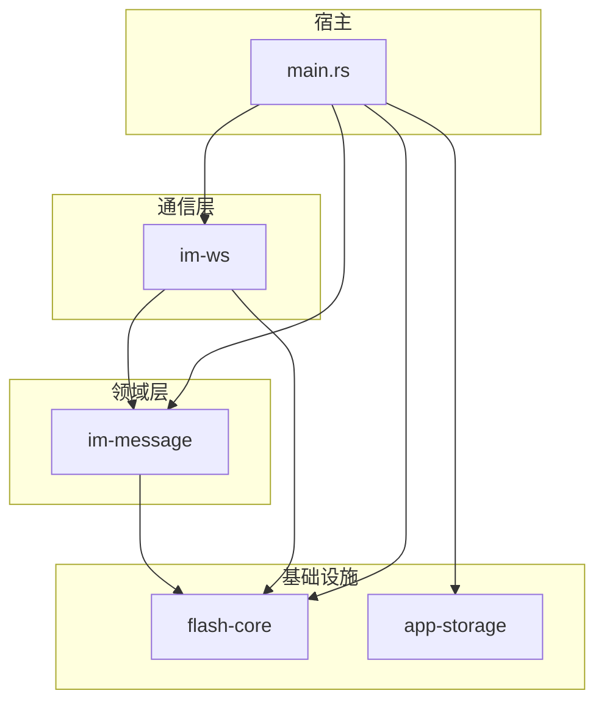
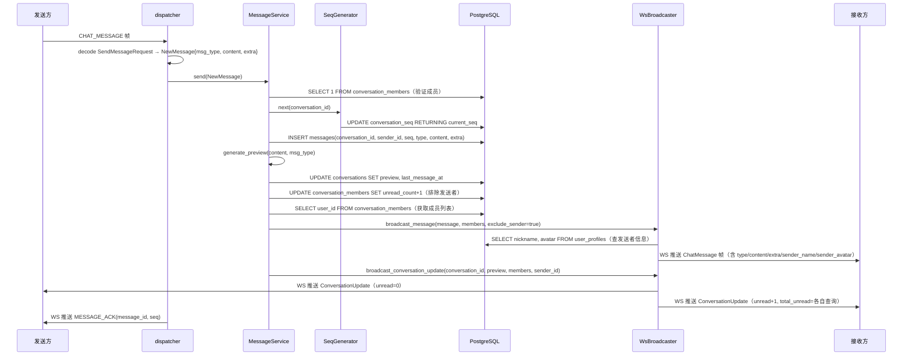
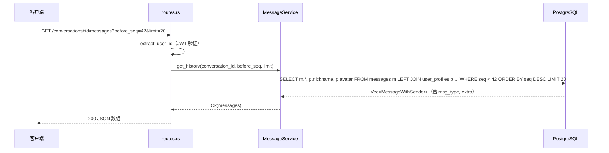
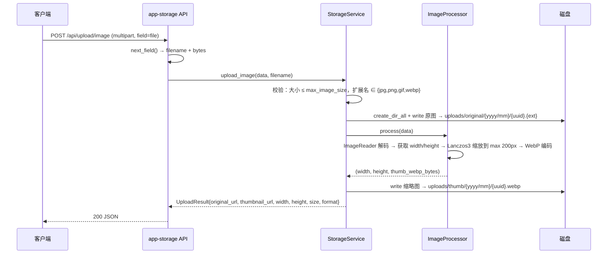

# 消息域 — 后端局域网络

涉及节点：I-10~I-12, D-06~D-12

---

## 一、远景：模块与依赖

> 骨骼怎么连？看 Cargo.toml 的依赖声明。

### 涉及模块

| 模块 | 位置 | 职责（一句话） |
|------|------|--------------|
| im-message | server/modules/im-message/ | 消息业务核心：存储、seq 生成、预览生成、历史查询、MessageBroadcaster trait 定义 |
| im-ws | server/modules/im-ws/ | WebSocket 通信层：帧分发(dispatcher)、广播实现(broadcaster)、在线状态管理(WsState) |
| app-storage | server/modules/app-storage/ | 文件存储基础设施：图片/视频/文件上传、图片缩略图生成(webp)、上传 API 路由 |
| flash-core | server/modules/flash-core/ | 全局基础设施：AppState、数据库连接池、JWT 验证 |

### 依赖关系



关键设计：
- im-message 定义 `MessageBroadcaster` trait，im-ws 实现它（WsBroadcaster）。im-message 不依赖 im-ws，通过 trait 解耦
- app-storage 完全独立，不依赖任何 IM 业务模块。main.rs 负责注册其路由
- im-ws 依赖 im-message（dispatcher 调用 MessageService），单向依赖

### 节点详情

| 编号 | 功能节点 | 模块 | 职责 |
|------|---------|------|------|
| I-10 | 文件存储服务 | app-storage (service.rs) | StorageService：本地磁盘存储 + ImageProcessor 缩略图生成(webp)，配置通过环境变量 |
| I-11 | 文件上传 API | app-storage (api.rs) | POST /api/upload/image、/video、/file，multipart 解析 + 格式/大小校验 |
| I-12 | 静态文件服务 | main.rs (tower-http) | ServeDir 挂载 uploads/，GET /uploads/{path} 直接返回文件 |
| D-06 | 消息存储 | im-message (service.rs) | send()：验证成员 → seq → INSERT messages(type, content, extra) → 更新会话预览 → 广播 |
| D-07 | 序列号生成 | im-message (seq.rs) | SeqGenerator：conversation_seq 原子递增 UPDATE...RETURNING，并发安全 |
| D-08 | 消息广播 | im-ws (broadcaster.rs) | WsBroadcaster：查询发送者信息 → 构造 ChatMessage 帧（含 extra）→ 推送给接收方 |
| D-09 | 历史消息查询 | im-message (routes.rs) | GET /conversations/:id/messages?before_seq=&limit=，关联 user_profiles 返回 MessageWithSender |
| D-10 | 会话更新推送 | im-ws (broadcaster.rs) | 推送 ConversationUpdate 帧：preview/time/unread_count/total_unread，每个成员各自的 total_unread 不同 |
| D-11 | 富媒体消息存储 | im-message (models.rs, repository.rs) | NewMessage 支持 msg_type + extra，INSERT 写入 type/extra 列 |
| D-12 | 消息预览生成 | im-message (models.rs) | generate_preview()：type=1→"[图片]"，type=2→"[视频]"，type=3→"[文件]"，其他→文本截断50字 |

---

## 二、中景：数据通道与事件流

> 血液怎么流？后端有三条入站通道，两条出站通道。

### 数据通道

| 通道 | 协议 | 方向 | 特点 | 例子 |
|------|------|------|------|------|
| 文件上传 | HTTP multipart | 客户端 → 服务端 | 大文件，有 body 大小限制（图片10MB，视频/文件50MB） | POST /api/upload/image |
| 消息发送 | WS Protobuf 帧 | 客户端 → 服务端 | CHAT_MESSAGE 帧，含 type/content/extra | 发送文本/图片/视频/文件消息 |
| 历史查询 | HTTP JSON | 客户端 → 服务端 | 基于 seq 分页，返回 MessageWithSender（含 sender_name/avatar） | GET /messages?before_seq=42 |
| 消息广播 | WS Protobuf 帧 | 服务端 → 客户端 | ChatMessage 帧推送给接收方，ConversationUpdate 帧推送给所有成员 | 对方收到新消息 |
| 静态文件 | HTTP | 客户端 → 服务端 | tower-http ServeDir 直接返回磁盘文件 | GET /uploads/original/2026/04/uuid.jpg |

### 关键事件流

#### 场景 1：消息发送全链路（文本/图片/视频/文件通用）

无论消息类型，WS 链路完全相同。区别只在 NewMessage 的 msg_type/extra 字段和 generate_preview 的返回值。



#### 场景 2：历史消息查询



#### 场景 3：文件上传（以图片为例）



视频上传：客户端提供 video + thumbnail + duration_ms/width/height，服务端只做存储（不处理视频）。
文件上传：服务端只做存储，无格式白名单限制。

### 边界接口

**Protobuf 协议**（proto/message.proto）

| 结构 | 生产节点 | 消费节点 | 说明 |
|------|---------|---------|------|
| MessageType 枚举 | 全局共享 | dispatcher, broadcaster, 客户端 | TEXT=0, IMAGE=1, VIDEO=2, FILE=3 |
| SendMessageRequest | 客户端 | dispatcher (D-06) | conversation_id + type + content + extra(bytes) + client_id |
| ChatMessage | broadcaster (D-08) | 客户端 | 完整消息：id/conv/sender/seq/type/content/extra/status/created_at/sender_name/avatar |
| MessageAck | dispatcher | 客户端 | message_id + seq |
| ConversationUpdate | broadcaster (D-10) | 客户端 | conversation_id + preview + last_message_at + unread_count + total_unread |

**HTTP 接口**

| 接口 | 提供节点 | 消费节点 | 说明 |
|------|---------|---------|------|
| GET /conversations/:id/messages | D-09 | 客户端 | 历史消息查询，before_seq 分页，返回 MessageWithSender JSON |
| POST /api/upload/image | I-11 | 客户端 | 图片上传，返回 original_url/thumbnail_url/width/height/size/format |
| POST /api/upload/video | I-11 | 客户端 | 视频上传（video+thumbnail+metadata），返回 video_url/thumbnail_url/duration_ms/width/height/file_size |
| POST /api/upload/file | I-11 | 客户端 | 文件上传，返回 file_url/file_name/file_size/file_type |
| GET /uploads/{path} | I-12 | 客户端 | 静态文件访问 |

**Rust trait**

| 接口 | 定义模块 | 实现模块 | 作用 |
|------|---------|---------|------|
| MessageBroadcaster | im-message (broadcast.rs) | im-ws (broadcaster.rs) | 两个方法：broadcast_message + broadcast_conversation_update。解耦消息存储和 WS 推送 |

### 数据库表

| 表 | 关键字段 | 说明 |
|----|---------|------|
| messages | id(UUID), conversation_id, sender_id, seq, type(SMALLINT), content(TEXT), extra(JSONB), status, created_at | 消息主表，type 区分消息类型，extra 存媒体元数据 |
| conversation_seq | conversation_id(PK), current_seq | 每会话独立序列号，原子递增 |

---

## 三、近景：生命周期

> 后端模块无 UI 生命周期。此处记录核心对象的创建、注入和共享关系。

### 核心对象

| 对象 | 创建位置 | 生命跨度 | 共享方式 |
|------|---------|---------|---------|
| StorageService | main.rs | 应用级 | Arc，注入到 storage_routes（with_state） |
| MessageService | main.rs | 应用级 | Arc，持有 repo/seq_gen/db/broadcaster，注入到 im-message router + dispatcher |
| WsBroadcaster | main.rs | 应用级 | Arc，实现 MessageBroadcaster trait，注入到 MessageService |
| MessageDispatcher | main.rs | 应用级 | Arc，持有 MessageService + WsState，注入到 WsHandlerState |
| WsState | main.rs | 应用级 | Arc，在线用户连接管理，被 dispatcher 和 broadcaster 共享 |
| SeqGenerator | MessageService 内部 | 应用级 | 非 Arc，MessageService 私有，外部不可访问 |
| MessageRepository | MessageService 内部 | 应用级 | 非 Arc，MessageService 私有 |
| ImageProcessor | StorageService 内部 | 应用级 | Clone，StorageService 私有 |

### 注入链

```
main.rs 创建顺序：
  1. db (PgPool)
  2. WsState::new()
  3. WsBroadcaster::new(ws_state, db)           → Arc<dyn MessageBroadcaster>
  4. MessageService::new(db, broadcaster)        → Arc<MessageService>
  5. MessageDispatcher::new(msg_service, ws_state) → Arc<MessageDispatcher>
  6. StorageService::new(StorageConfig::from_env()) → Arc<StorageService>

注入到 Router：
  im_message::router(msg_service)    → GET /conversations/:id/messages
  storage_routes(storage)            → POST /api/upload/*
  ws_handler(ws_handler_state)       → /ws/im（内部用 dispatcher 处理 CHAT_MESSAGE 帧）
  ServeDir("uploads")                → GET /uploads/*
```

---

## 四、版本演进

| 版本 | 变更 |
|------|------|
| v0.0.3 | 初始：D-06~D-10。文本消息完整链路：存储、seq 原子递增、ACK、ChatMessage 广播、ConversationUpdate 推送、历史消息 HTTP 查询（before_seq 分页） |
| v0.0.4_media | 新增 I-10~I-12（app-storage 文件上传 + 静态文件服务）、D-11（NewMessage 扩展 msg_type/extra，repository INSERT 写入 type/extra）、D-12（generate_preview 按类型生成预览）。proto MessageType 扩展 IMAGE=1, VIDEO=2, FILE=3。dispatcher 传递 type/extra，broadcaster 传递 extra 实际值 |
