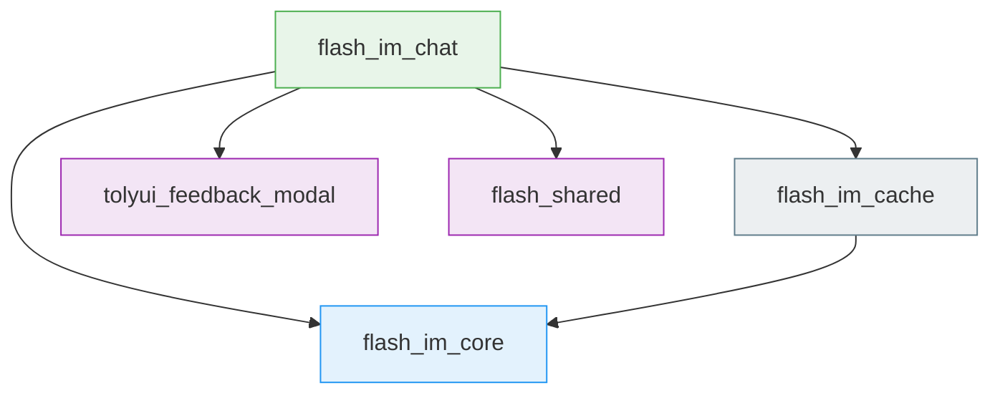
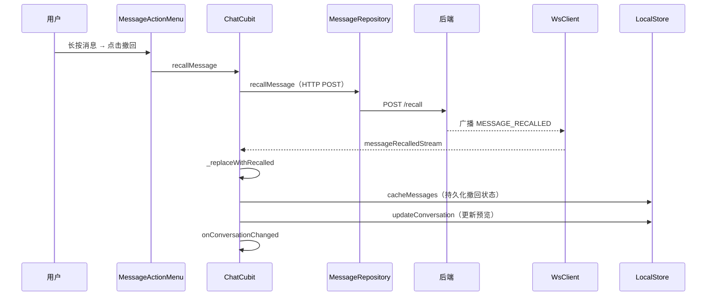
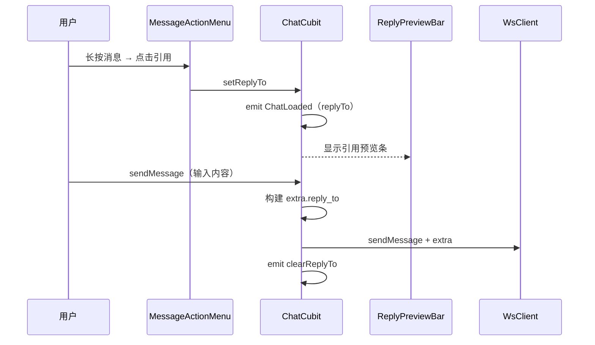
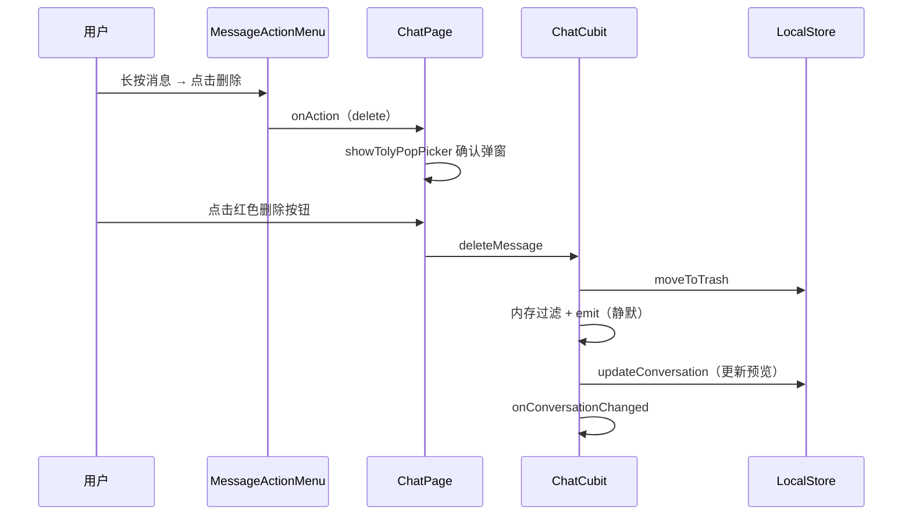
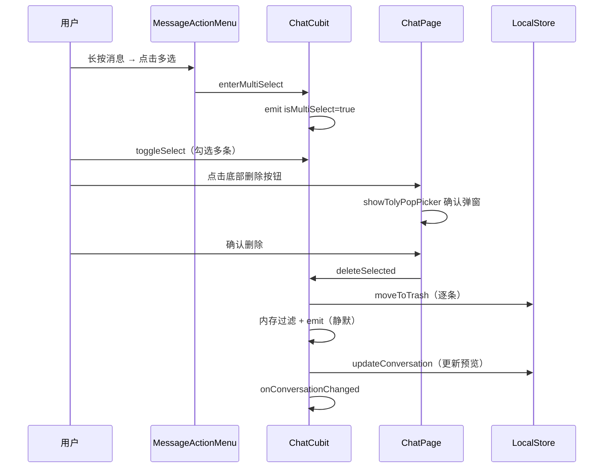

# 消息操作 — 客户端局域网络

涉及节点：D-40, F-17, P-48~P-53

---

## 一、远景：模块与依赖

> 骨骼怎么连？不打开源码，只看配置文件和目录结构就能回答。

### 涉及模块

| 模块 | 位置 | 职责（一句话） |
|------|------|--------------|
| flash_im_chat | `client/modules/flash_im_chat/` | 聊天页面、消息气泡、长按菜单、多选模式、删除确认弹窗 |
| flash_im_core | `client/modules/flash_im_core/` | WsClient 新增 messageRecalledStream 帧分发 |
| flash_im_cache | `client/modules/flash_im_cache/` | local_trash 回收站表、LocalStore 扩展 moveToTrash 等方法 |
| tolyui_feedback_modal | pub.dev（^0.0.1） | 底部确认弹窗组件 showTolyPopPicker |

### 依赖关系

所有依赖方向合理，无平级互依赖。tolyui_feedback_modal 是外部 pub 包，仅 flash_im_chat 依赖。

### 节点详情

| 编号 | 功能节点 | 模块 | 职责 |
|------|---------|------|------|
| D-40 | 消息撤回 | im-message（后端） | POST /recall + WS 广播 MESSAGE_RECALLED |
| F-17 | MESSAGE_RECALLED WS 帧分发 | flash_im_core | WsClient 新增 messageRecalledStream |
| P-48 | 长按菜单 | flash_im_chat | 微信风格 Overlay 气泡菜单，动态过滤菜单项 |
| P-49 | 消息撤回展示 | flash_im_chat | 撤回提示替换 + 本地缓存持久化 |
| P-50 | 引用回复 | flash_im_chat | ReplyBubble + ReplyPreviewBar + extra.reply_to |
| P-51 | 多选模式 | flash_im_chat | isMultiSelect 状态切换 + 勾选框 + 底部操作栏 |
| P-52 | 本地删除 | flash_im_chat + flash_im_cache | local_trash 回收站 + 静默移除 + 会话预览同步 |
| P-53 | 删除确认弹窗 | flash_im_chat | showTolyPopPicker 底部弹窗，红色删除按钮 |

---

## 二、中景：数据通道与事件流

> 血液怎么流？找 Repository（HTTP 入口）、找 Stream（WS 入口）、找 emit（状态出口）。

### 数据通道

| 通道 | 协议 | 方向 | 特点 | 例子 |
|------|------|------|------|------|
| 撤回请求 | HTTP | 客户端主动 | POST 请求，后端校验后广播 | recallMessage |
| MESSAGE_RECALLED 帧 | WS | 服务端推送 | 实时通知所有会话成员 | messageRecalledStream |
| 引用回复 extra | WS | 客户端主动 | 复用 CHAT_MESSAGE 帧的 extra 字段 | sendMessage |
| 本地回收站 | 内存+SQLite | 内部 | moveToTrash 写入 local_trash 表 | deleteMessage |
| 会话预览同步 | 内存+SQLite | 内部 | updateConversation + onConversationChanged 回调 | _syncConversationPreview |

### 关键事件流

#### 场景 1：消息撤回

#### 场景 2：引用回复

#### 场景 3：本地删除（单条）

#### 场景 4：多选批量删除

### 边界接口

**Protobuf 协议**

| 结构 | 文件 | 生产节点 | 消费节点 |
|------|------|---------|---------|
| MessageRecalled | proto/message.proto | D-40（后端） | F-17 → P-49 |
| WsFrameType.MESSAGE_RECALLED | proto/ws.proto | D-40（后端） | F-17 |

**HTTP 接口**

| 接口 | 提供节点 | 消费节点 |
|------|---------|---------|
| POST /conversations/{conv_id}/messages/{msg_id}/recall | D-40 | P-49（ChatCubit.recallMessage） |

**Dart 抽象**

| 接口 | 定义节点 | 实现节点 | 作用 |
|------|---------|---------|------|
| LocalStore.moveToTrash | F-15 | flash_im_cache（DriftLocalStore） | 消息移入本地回收站 |
| LocalStore.getTrashIds | F-15 | flash_im_cache（DriftLocalStore） | 读取时过滤已删除消息 |
| LocalStore.updateConversation | F-15 | flash_im_cache（DriftLocalStore） | 更新会话最后消息预览 |
| VoidCallback onConversationChanged | P-52 | home_page.dart 注入 | 通知会话列表刷新 |

---

## 三、近景：生命周期与订阅

> 神经怎么传导？找 listen 和 cancel，看它们是不是成对的。

### 核心对象生命周期

| 对象 | 创建时机 | 销毁时机 | 生命跨度 |
|------|---------|---------|---------|
| ChatCubit | 进入聊天页（BlocProvider.create） | 退出聊天页（BlocProvider 自动 close） | 页面级 |
| MessageActionMenu（OverlayEntry） | 长按消息气泡 | 点击菜单项或点击遮罩 | 交互级 |
| ReplyPreviewBar | ChatLoaded.replyTo != null 时渲染 | clearReplyTo 或发送消息后 | 交互级 |
| 确认弹窗（showTolyPopPicker） | 点击删除菜单项 | 点击确认或取消 | 交互级 |

### 订阅关系

| 订阅者 | 监听目标 | 订阅时机 | 取消时机 | 是否成对 |
|--------|---------|---------|---------|---------|
| ChatCubit._messageRecalledSub | WsClient.messageRecalledStream | 构造函数 | close() | ✅ |
| ChatCubit._chatMessageSub | WsClient.chatMessageStream | 构造函数 | close() | ✅ |
| ChatCubit._messageAckSub | WsClient.messageAckStream | 构造函数 | close() | ✅ |
| ChatCubit._readReceiptSub | WsClient.readReceiptStream | 构造函数 | close() | ✅ |
| ChatPage._groupInfoSub | WsClient.groupInfoUpdateStream | initState | dispose | ✅ |
| ChatPage._onlineSub | WsClient.userOnlineStream | initState | dispose | ✅ |
| ChatPage._offlineSub | WsClient.userOfflineStream | initState | dispose | ✅ |

所有订阅均成对，无泄漏风险。

---

## 四、版本演进

| 版本 | 变更 |
|------|------|
| v0.0.1_operation | 初始版本：长按菜单、消息撤回、引用回复、本地删除、多选模式、删除确认弹窗、会话预览同步、撤回本地持久化 |
