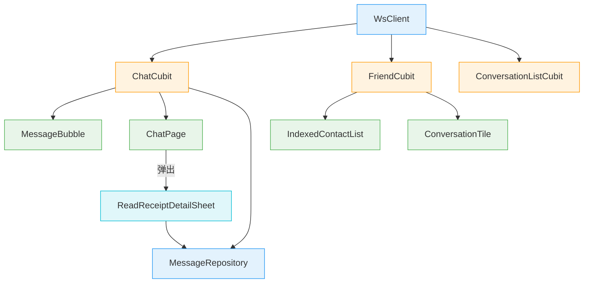

# 在线状态与已读回执 — 客户端局域网络

涉及节点：F-12 ~ F-13、P-41 ~ P-43，扩展 F-06

---

## 一、远景：模块与依赖

### 涉及模块

| 模块 | 位置 | 职责 |
|------|------|------|
| flash_im_core | client/modules/flash_im_core/ | WsClient 新增 4 个 Stream + 在线状态集合 + sendReadReceipt |
| flash_im_chat | client/modules/flash_im_chat/ | ChatCubit 已读上报/监听 + MessageBubble 已读标记 + ReadReceiptDetailSheet |
| flash_im_conversation | client/modules/flash_im_conversation/ | ConversationListCubit 活跃会话不累加未读 + ConversationTile 单聊在线绿点 |
| flash_im_friend | client/modules/flash_im_friend/ | FriendCubit 在线状态监听 + 好友列表绿点 |

### 依赖关系

### 节点详情

| 编号 | 功能节点 | 模块 | 职责 |
|------|---------|------|------|
| F-12 | 在线状态 WS 帧分发 | flash_im_core/ws_client | userOnlineStream / userOfflineStream / onlineListStream + _onlineUserIds 集合 |
| F-13 | 已读回执 WS 帧分发 | flash_im_core/ws_client | readReceiptStream + sendReadReceipt 方法 |
| P-41 | 在线状态展示 | flash_im_friend + flash_im_chat + flash_im_conversation | 好友列表绿点 + 会话列表单聊绿点 + ChatPage AppBar 在线/离线 |
| P-42 | 已读回执展示 | flash_im_chat | MessageBubble 已读标记 + ReadReceiptDetailSheet 群聊已读详情 |
| P-43 | 已读回执上报 | flash_im_chat/chat_cubit | 进入聊天页/收到新消息时自动上报（1 秒防抖） |

---

## 二、中景：数据通道与事件流

### 数据通道

| 通道 | 协议 | 方向 | 特点 |
|------|------|------|------|
| userOnlineStream | WS → Stream | 服务端推送 | 好友上线通知 |
| userOfflineStream | WS → Stream | 服务端推送 | 好友下线通知 |
| onlineListStream | WS → Stream | 服务端推送 | 认证后在线好友列表 |
| readReceiptStream | WS → Stream | 服务端推送 | 对方已读通知 |
| sendReadReceipt | WS | 客户端主动 | 上报已读位置（1 秒防抖） |
| getReadSeq | HTTP | 客户端主动 | 进入聊天页获取初始已读位置 |
| getReadStatus | HTTP | 客户端主动 | 群聊已读详情弹窗数据 |

---

## 三、近景：生命周期与订阅

### 核心对象生命周期

| 对象 | 创建时机 | 销毁时机 | 生命跨度 |
|------|---------|---------|---------|
| WsClient._onlineUserIds | WS 连接建立 | WS 断连时清空 | 应用级 |
| ChatCubit._peerReadSeq | ChatCubit 创建 | ChatCubit close | 页面级 |
| ChatCubit._membersReadSeq | ChatCubit 创建 | ChatCubit close | 页面级 |
| ChatCubit._readReceiptTimer | _reportReadSeq 调用 | ChatCubit close | 页面级 |
| FriendCubit.onlineIds | FriendCubit 创建 | FriendCubit close | 应用级 |
| ConversationListCubit._activeConversationId | setActiveConversation 调用 | clearActiveConversation 调用 | 会话级 |

### 订阅关系

| 订阅者 | 监听目标 | 订阅时机 | 取消时机 | 是否成对 |
|--------|---------|---------|---------|---------|
| ChatCubit | readReceiptStream | 构造函数 | close | ✅ |
| FriendCubit | userOnlineStream | 构造函数 | close | ✅ |
| FriendCubit | userOfflineStream | 构造函数 | close | ✅ |
| FriendCubit | onlineListStream | 构造函数 | close | ✅ |
| ChatPage | userOnlineStream | initState | dispose | ✅ |
| ChatPage | userOfflineStream | initState | dispose | ✅ |
| ConversationListCubit | conversationUpdateStream | 构造函数 | close | ✅ |

---

## 四、版本演进

| 版本 | 变更 |
|------|------|
| v0.0.1_presence | 初始实现：WsClient 4 个新 Stream + 在线状态集合，ChatCubit 已读上报防抖 + readSeqVersion Equatable 修复，MessageBubble 已读标记，ReadReceiptDetailSheet，好友列表绿点 + 会话列表绿点，ChatPage 在线状态，ConversationListCubit 活跃会话不累加未读 |
