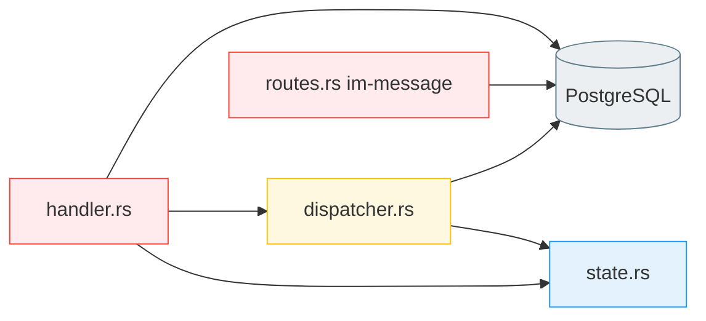
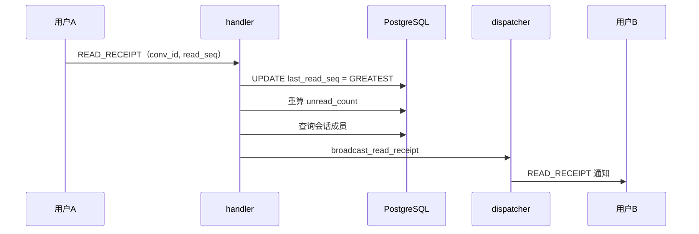

# 在线状态与已读回执 — 后端局域网络

涉及节点：D-31 ~ D-34，扩展 I-08、I-09

---

## 一、远景：模块与依赖

### 涉及模块

| 模块 | 位置 | 职责 |
|------|------|------|
| im-ws | server/modules/im-ws/ | WS 连接管理、帧分发、在线状态广播、已读回执处理 |
| im-message | server/modules/im-message/ | 已读详情查询接口（GET /read-seq、GET /read-status） |

### 依赖关系

### 节点详情

| 编号 | 功能节点 | 模块 | 职责 |
|------|---------|------|------|
| D-31 | 在线状态广播 | im-ws/dispatcher | 首次上线广播 USER_ONLINE，完全下线广播 USER_OFFLINE，只通知在线好友 |
| D-32 | 在线列表推送 | im-ws/dispatcher | 认证成功后推送 ONLINE_LIST（在线好友列表） |
| D-33 | 已读回执处理 | im-ws/handler | 接收 READ_RECEIPT 帧，更新 last_read_seq，重算 unread_count，通知对方 |
| D-34 | 已读详情查询 | im-message/routes | GET /read-seq 返回成员已读位置，GET /read-status 返回已读/未读成员列表 |

---

## 二、中景：数据通道与事件流

### 数据通道

| 通道 | 协议 | 方向 | 特点 |
|------|------|------|------|
| USER_ONLINE/OFFLINE | WS | 服务端推送 | 只推给在线好友，查 friend_relations 取交集 |
| ONLINE_LIST | WS | 服务端推送 | 认证后一次性推送，只含在线好友 |
| READ_RECEIPT（上报） | WS | 客户端主动 | 客户端上报已读位置 |
| READ_RECEIPT（通知） | WS | 服务端推送 | 通知会话其他成员 |
| GET /read-seq | HTTP | 客户端主动 | 进入聊天页时调一次 |
| GET /read-status | HTTP | 客户端主动 | 点击"N人已读"时调 |

### 关键事件流：已读回执

### 边界接口

**Protobuf 协议**

| 结构 | 文件 | 生产节点 | 消费节点 |
|------|------|---------|---------|
| UserStatusNotification | message.proto | D-31 | F-12 |
| OnlineListNotification | message.proto | D-32 | F-12 |
| ReadReceiptRequest | message.proto | P-43 | D-33 |
| ReadReceiptNotification | message.proto | D-33 | F-13 |

**HTTP 接口**

| 接口 | 提供节点 | 消费节点 |
|------|---------|---------|
| GET /conversations/{id}/read-seq | D-34 | P-43 |
| GET /conversations/{id}/messages/{mid}/read-status | D-34 | P-42 |

---

## 四、版本演进

| 版本 | 变更 |
|------|------|
| v0.0.1_presence | 初始实现：多端连接、在线状态广播（好友范围）、已读回执处理、已读详情查询 |
