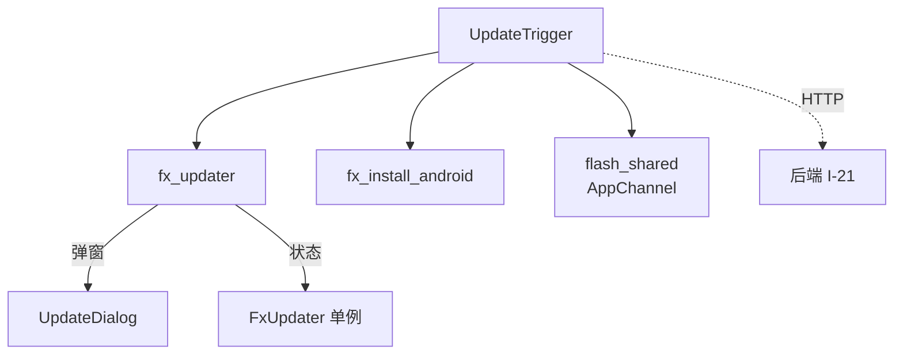
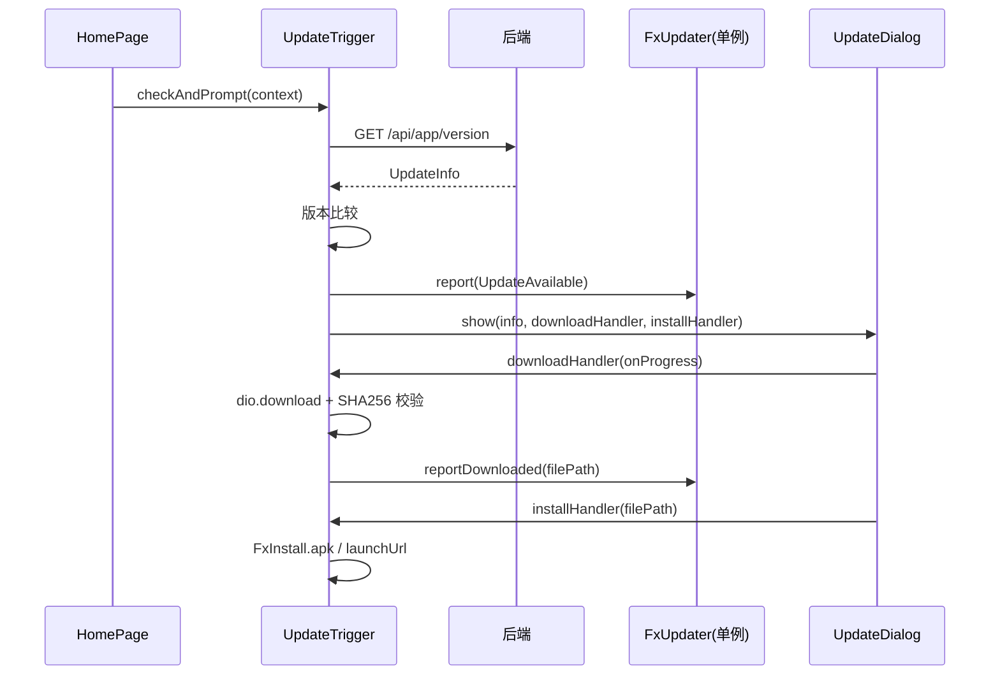

# 版本更新 — 前端局域网络

涉及节点：P-73

---

## 一、远景：模块与依赖

### 涉及模块

| 模块 | 位置 | 职责（一句话） |
|------|------|--------------|
| fx_updater | client/packages/fx_updater/ | 通用更新框架：版本比较 + 检查器 + 弹窗 + 全局状态（pub 包） |
| fx_install_android | client/packages/fx_install_android/ | Android APK 安装 Plugin：自带 FileProvider + 权限检测（pub 包） |
| UpdateTrigger | client/lib/src/update/ | 闪讯胶水层：注入 fetch + 下载 + SHA256 校验 + 平台策略分发 |
| flash_shared | client/modules/flash_shared/ | 提供 AppChannel 渠道标识 |

### 依赖关系

### 节点详情

| 编号 | 功能节点 | 模块 | 职责 |
|------|---------|------|------|
| P-73 | 版本检测与更新弹窗 | fx_updater + UpdateTrigger | 启动时检测 → 版本比较 → 弹窗 → 下载/校验/安装 or 跳转商店 |

---

## 二、中景：数据通道与事件流

### 数据通道

| 通道 | 协议 | 方向 | 特点 |
|------|------|------|------|
| GET /api/app/version | HTTP | 客户端主动 | 启动时静默请求，失败不打扰用户 |
| dio.download | HTTP | 客户端主动 | 下载安装包，带进度回调 |
| FxUpdater.stream | 内存 Stream | 内部 | 状态变更流，驱动红点/弹窗/进度 |

### 关键事件流

### 边界接口

**HTTP 接口**

| 接口 | 提供节点 | 消费节点 |
|------|---------|---------|
| GET /api/app/version | I-21 | P-73 (UpdateTrigger._fetchFromServer) |

**Dart 抽象**

| 接口 | 定义节点 | 实现节点 | 作用 |
|------|---------|---------|------|
| FetchUpdateInfo 回调 | fx_updater | UpdateTrigger | 依赖倒置：框架不绑网络库 |

---

## 三、近景：生命周期与订阅

### 核心对象生命周期

| 对象 | 创建时机 | 销毁时机 | 生命跨度 |
|------|---------|---------|---------|
| FxUpdater | 首次访问单例 | 永不销毁 | 应用级 |
| UpdateTrigger | 首页 initState | 方法调用结束 | 临时 |
| UpdateDialog | 有更新时 show | 用户关闭/安装完成 | 页面级 |

### 订阅关系

| 订阅者 | 监听目标 | 订阅时机 | 取消时机 | 是否成对 |
|--------|---------|---------|---------|---------|
| UpdateBadge | FxUpdater.stream | build | 组件销毁 | ✅ StreamBuilder 自动管理 |
| UpdateDialog | FxUpdater.progressStream | initState | dispose | ✅ |
| 设置页 | FxUpdater.stream | build | 组件销毁 | ✅ StreamBuilder 自动管理 |

---

## 四、版本演进

| 版本 | 变更 |
|------|------|
| v0.31.0 | 初始实现：fx_updater + fx_install_android + UpdateTrigger + 渠道策略 |
