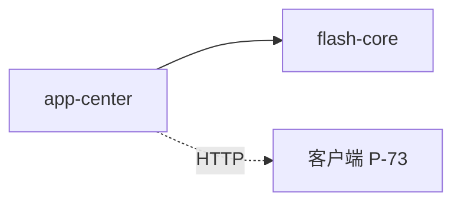
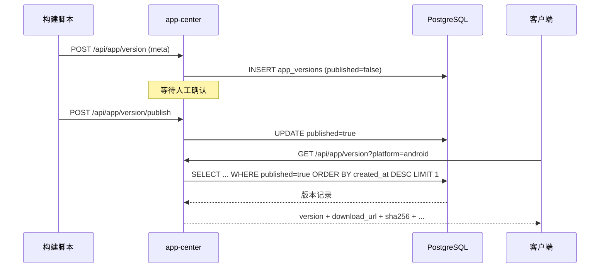

# 版本更新 — 后端局域网络

涉及节点：I-21

---

## 一、远景：模块与依赖

### 涉及模块

| 模块 | 位置 | 职责（一句话） |
|------|------|--------------|
| app-center | server/modules/app-center/ | 应用版本管理：CRUD + 发布控制 + 查询接口 |
| flash-core | server/modules/flash-core/ | 提供 AppState（db pool）+ AppError |

### 依赖关系

### 节点详情

| 编号 | 功能节点 | 模块 | 职责 |
|------|---------|------|------|
| I-21 | 版本信息管理 | app-center | apps 表 + app_versions 表 + 9 个路由（查询/创建/更新/删除/发布/撤回） |

---

## 二、中景：数据通道与事件流

### 数据通道

| 通道 | 协议 | 方向 | 特点 |
|------|------|------|------|
| GET /api/app/version | HTTP | 客户端主动 | 按 app_id + platform 查最新已发布版本 |
| POST /api/app/version | HTTP | 脚本主动 | 创建版本记录（published=false） |
| POST /api/app/version/publish | HTTP | 人工确认 | 发布版本（published=true） |

### 关键事件流

### 边界接口

**HTTP 接口**

| 接口 | 提供节点 | 消费节点 |
|------|---------|---------|
| GET /api/app/version | I-21 | P-73 |
| POST /api/app/version | I-21 | upload/update.py |
| POST /api/app/version/publish | I-21 | Web 管理器 / curl |

---

## 四、版本演进

| 版本 | 变更 |
|------|------|
| v0.31.0 | 初始实现：apps + app_versions 两表、9 个路由、published 发布控制 |
