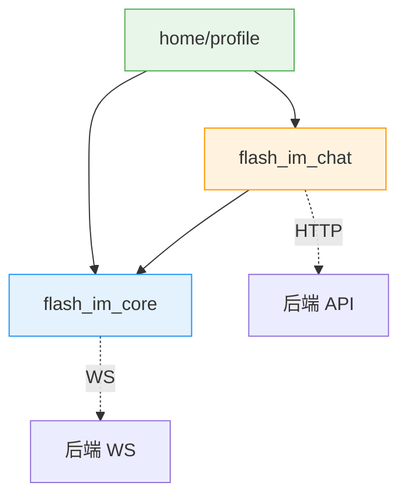
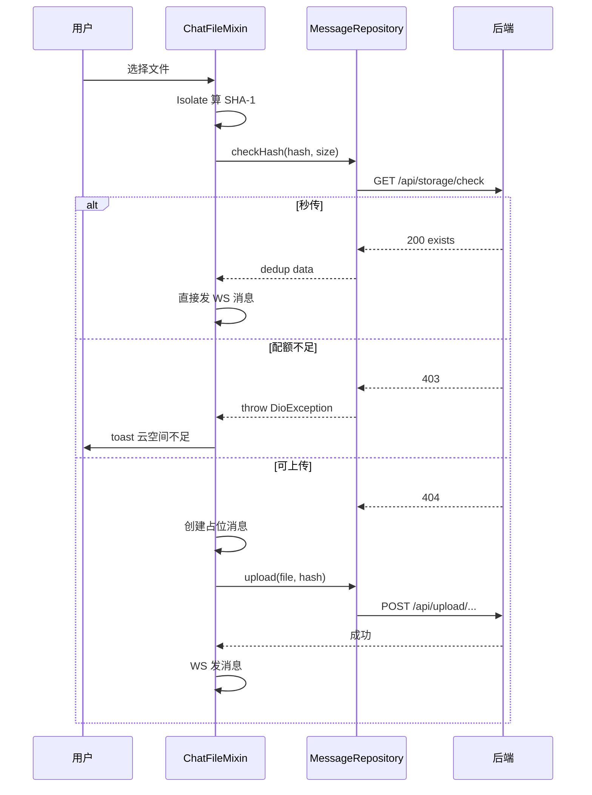

# 云资源存储 — 前端局域网络

涉及节点：F-19~F-20, P-76~P-78

---

## 一、远景：模块与依赖

### 涉及模块

| 模块 | 位置 | 职责 |
|------|------|------|
| flash_im_chat | client/modules/flash_im_chat/ | file_hash + _preUploadCheck + 配额错误处理 |
| flash_im_core | client/modules/flash_im_core/ | WsClient storageQuotaStream |
| home/profile | client/lib/src/home/profile/ | 云空间 UI（卡片 + 详情页 + Cubit + Repository） |

### 依赖关系

### 节点详情

| 编号 | 功能节点 | 模块 | 职责 |
|------|---------|------|------|
| F-19 | SHA-1 计算 | flash_im_chat/data/file_hash | Isolate.run 计算文件 hash |
| F-20 | WS 配额分发 | flash_im_core/ws_client | storageQuotaStream 广播 |
| P-76 | 云空间卡片 | home/profile/cloud_storage_card | 分色进度条（蓝/黄/红/绿） |
| P-77 | 云空间详情页 | home/profile/cloud_storage_page | 圆环图 + 分类列表 |
| P-78 | 配额不足提示 | flash_im_chat/chat_file_mixin | _handleQuotaError → toast |

---

## 二、中景：数据通道与事件流

### 数据通道

| 通道 | 协议 | 方向 | 特点 |
|------|------|------|------|
| checkHash(hash, size) | HTTP GET | 客户端→服务端 | 秒传+配额预检，在上传前 |
| uploadImage/Video/File | HTTP POST multipart | 客户端→服务端 | 带 hash 字段 |
| getQuota() | HTTP GET | 客户端→服务端 | 配额查询 |
| storageQuotaStream | WS 帧 | 服务端→客户端 | 实时更新配额显示 |

### 关键事件流：发送媒体消息

---

## 三、近景：生命周期与订阅

### 核心对象生命周期

| 对象 | 创建时机 | 销毁时机 | 生命跨度 |
|------|---------|---------|---------|
| StorageQuotaCubit | ProfilePage 构建时 | ProfilePage dispose | 页面级 |
| storageQuotaStream | WsClient 连接后 | WsClient close | 应用级 |

### 订阅关系

| 订阅者 | 监听目标 | 订阅时机 | 取消时机 | 是否成对 |
|--------|---------|---------|---------|---------|
| StorageQuotaCubit | storageQuotaStream | 构造函数 | close() | ✅ |

---

## 四、版本演进

| 版本 | 变更 |
|------|------|
| v0.0.6_file_system | F-19~F-20, P-76~P-78：SHA-1 计算 + 秒传预检 + 云空间 UI + WS 实时更新 |
