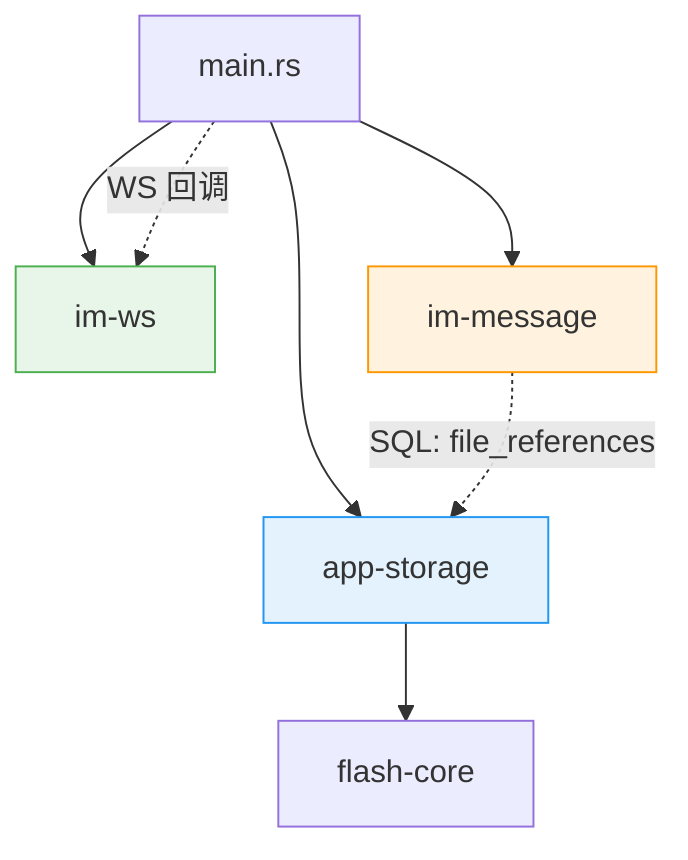
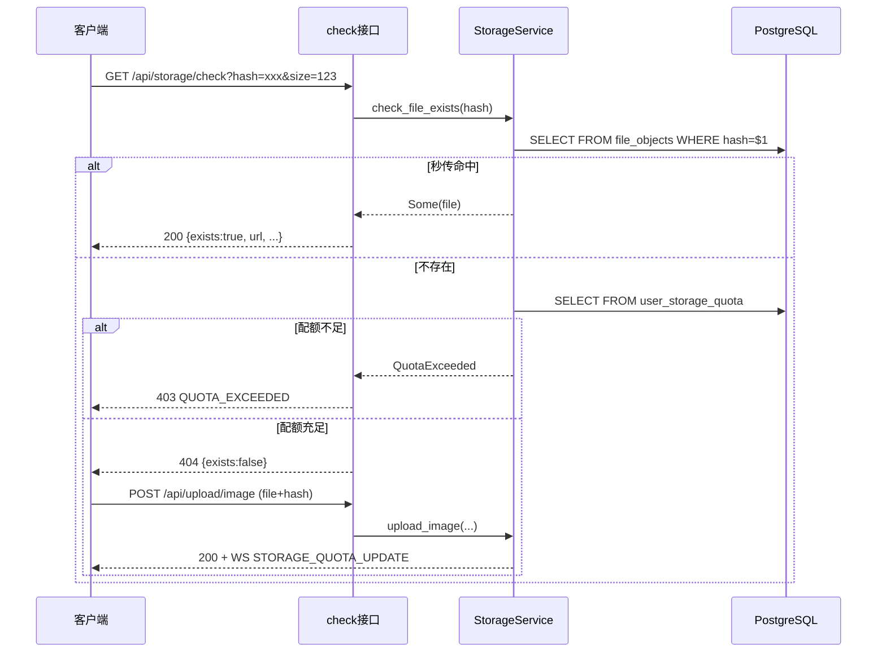

# 云资源存储 — 后端局域网络

涉及节点：I-10~I-12, I-22~I-25, D-43~D-45

---

## 一、远景：模块与依赖

### 涉及模块

| 模块 | 位置 | 职责 |
|------|------|------|
| app-storage | server/modules/app-storage/ | 文件上传、存储、去重、配额管理 |
| im-message | server/modules/im-message/ | 消息发送时写入 file_references |
| im-ws (proto) | server/modules/im-ws/src/generated/ | STORAGE_QUOTA_UPDATE 帧定义 |
| main.rs | server/src/main.rs | 组装 StorageService + 注入 WS 回调 |

### 依赖关系

### 节点详情

| 编号 | 功能节点 | 模块 | 职责 |
|------|---------|------|------|
| I-10 | 文件存储服务 | app-storage/service | 上传编排（校验→去重→存储→记录→扣配额） |
| I-11 | 文件上传 API | app-storage/api | 3 个上传 handler + 配额查询 + 秒传检查 |
| I-12 | 静态文件服务 | main.rs (ServeDir) | /uploads/ 目录对外访问 |
| I-22 | StorageBackend | app-storage/backend | trait 抽象，LocalFs 实现 |
| I-23 | 文件元数据服务 | app-storage/repository | file_objects CRUD |
| I-24 | 秒传检查接口 | app-storage/api | GET /api/storage/check |
| I-25 | WS 配额通知 | main.rs | on_quota_changed 回调 → tokio::spawn 推帧 |
| D-43 | 用户云配额 | app-storage/service | check_quota + update_quota_used |
| D-44 | 文件去重 | app-storage/service | check_dedup(hash) → ref_count+1 |
| D-45 | 引用追踪 | im-message/service | record_file_reference → file_references 表 |

---

## 二、中景：数据通道与事件流

### 数据通道

| 通道 | 协议 | 方向 | 特点 |
|------|------|------|------|
| POST /api/upload/{type} | HTTP multipart | 客户端→服务端 | 文件体+hash |
| GET /api/storage/check | HTTP GET | 客户端→服务端 | 轻量预检，无文件体 |
| GET /api/storage/quota | HTTP GET | 客户端→服务端 | 配额查询 |
| STORAGE_QUOTA_UPDATE | WS 帧 | 服务端→客户端 | 上传成功后推送 |
| /uploads/{path} | HTTP GET (ServeDir) | 客户端→服务端 | 静态文件下载 |

### 关键事件流：两步秒传 + 配额预检

---

## 三、版本演进

| 版本 | 变更 |
|------|------|
| v0.0.4_media | I-10~I-12：初始文件存储（无去重、无配额、ServeDir） |
| v0.0.6_file_system | I-22~I-25, D-43~D-45：StorageBackend 抽象 + 去重 + 配额 + 引用追踪 + WS 通知 |
