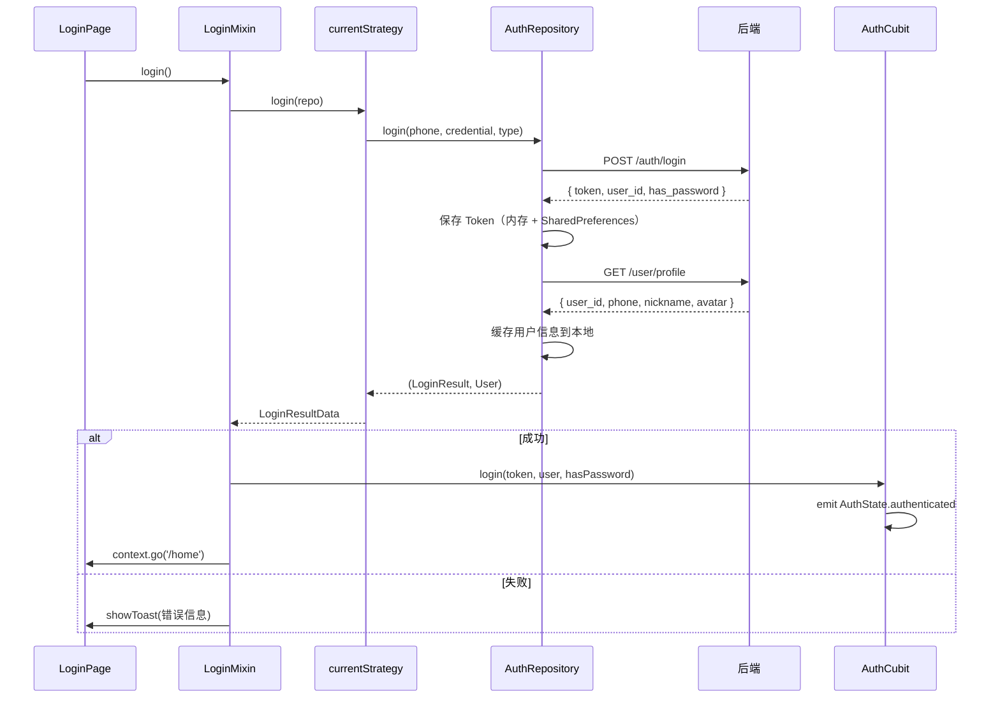
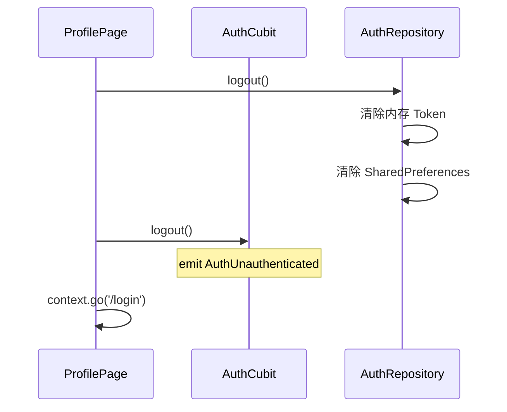

# Auth 模块 — Client 设计报告

## 1. 目标

- 手机号验证码登录（登录即注册）
- 密码登录
- Token 持久化 + Dio 拦截器自动注入
- 登录成功后获取用户信息，缓存到本地（供 starter 下次启动读取）
- 底部三 Tab 主页（消息、通讯录、我的）
- "我的"页面展示用户信息 + 设置密码 + 退出登录
- 首次登录未设密码时弹出引导

---

## 2. 现状分析

### 已有基础

- **starter 模块**已完成：闪屏页 → 读取本地缓存 → 通过 `onStartupComplete` 回调通知外部 → 跳转
- **AuthCubit** 已存在（`auth/logic/auth/`），提供 `applyStartupSnapshot` / `login` / `logout`，挂在 App 顶层
- **User 模型**在 `domain/model/user.dart`，含 `toJson` / `fromJson`，各模块共用
- **go_router** 管理路由，`/` 闪屏页、`/login` 登录页、`/home` 主页
- **LoginPage** 和 **HomePage** 当前为文本占位
- playground 中已验证接口可用性（验证码登录、密码登录、获取 profile）
- Dio、shared_preferences、flutter_bloc、equatable、oktoast 依赖均已安装

### 后端接口（已就绪）

```
POST /auth/sms          → { code, message }
POST /auth/login        → { token, user_id, has_password }
POST /auth/password     → { message }
GET  /user/profile      → { user_id, phone, nickname, avatar }
```

登录请求通过 `type` 字段区分方式：
- `{ phone, type: "sms", credential: "验证码" }`
- `{ phone, type: "password", credential: "密码" }`

---

## 3. 数据模型与接口

### 数据模型

`LoginResult` — 登录接口返回：

```dart
class LoginResult {
  final String token;
  final int userId;
  final bool hasPassword;
}
```

`User` — 已存在于 `domain/model/user.dart`，复用：

```dart
class User {
  final int userId;
  final String phone;
  final String nickname;
  final String avatar;
}
```

### 页面级状态

登录页不使用状态管理框架，采用 `StatefulWidget` + `LoginMixin` + 策略对象模式：

- `LoginStrategy` — 抽象基类，约束所有登录方式的共性：`isValid`、`login(repo)`、`dispose()`
- `LoginMixin` — 挂在 LoginPage 的 State 上，管理共享状态（agreed、isLoading、mode），通过 `currentStrategy` 指针调度登录
- `SmsLoginStrategy extends LoginStrategy` — 验证码登录策略，持有 phoneCtrl、codeCtrl、countdown，提供 sendSms()
- `PasswordLoginStrategy extends LoginStrategy` — 密码登录策略，持有 accountCtrl（手机号/用户名/邮箱）、passwordCtrl

登录模式通过增强枚举定义：

```dart
enum LoginMode {
  sms('sms'),
  password('password');

  final String value;
  const LoginMode(this.value);
}
```

LoginMixin 同时持有所有策略实例，切换模式只是切换 `currentStrategy` 指针，各策略状态互不丢失。`login()` 调用统一委托给 `currentStrategy.login(repo)`，新增登录方式只需实现 `LoginStrategy` 即可接入。

### 接口契约（客户端视角）

| 方法 | 路径 | 说明 |
|------|------|------|
| POST | /auth/sms | 发送验证码 |
| POST | /auth/login | 统一登录（短信/密码） |
| POST | /auth/password | 设置密码（需 Token） |
| GET | /user/profile | 获取用户信息（需 Token） |

Token 通过 `Authorization: Bearer xxx` 注入，由 Dio 拦截器自动处理。

### 本地缓存策略

登录成功后，将以下数据写入 SharedPreferences，供 starter 下次启动时读取：

| Key | 类型 | 说明 |
|-----|------|------|
| `auth_token` | String | JWT Token |
| `user_info` | String (JSON) | User 序列化 JSON |
| `has_password` | bool | 是否已设置密码 |

退出登录时清除以上所有 Key。

---

## 4. 核心流程

### 状态管理职责分离

- `AuthCubit`（应用级）— 挂在 App 顶层，管理全局认证状态。starter 通过回调注入启动快照，登录/退出通过方法调用
- `LoginMixin` + 策略对象（页面级）— 仅在 LoginPage 内使用，管理表单交互。不使用状态管理框架，`setState` 驱动 UI 刷新

```
LoginStrategy（抽象基类）
├── isValid → 当前输入是否满足登录条件
├── login(repo) → 执行登录，返回统一结果
├── dispose() → 释放资源

LoginMixin（持有 + 调度）
├── agreed、isLoading、mode
├── smsStrategy: SmsLoginStrategy
├── passwordStrategy: PasswordLoginStrategy
├── currentStrategy → 当前激活的策略
├── login() → currentStrategy.login(repo) → AuthCubit.login → go('/home')
├── toggleMode() → 切换 mode

SmsLoginStrategy extends LoginStrategy（独立对象）
├── phoneCtrl、codeCtrl、countdown
├── sendSms()、login(repo)、isValid、dispose()

PasswordLoginStrategy extends LoginStrategy（独立对象）
├── accountCtrl（手机号/用户名/邮箱）、passwordCtrl
├── login(repo)、isValid、dispose()
```

### 登录流程



### Token 管理策略

- 登录成功后 `AuthRepository` 同时写入内存和 SharedPreferences
- Dio 拦截器从 `AuthRepository` 读取内存中的 Token，自动注入 Header
- 退出登录时清除内存 + SharedPreferences（token、user_info、has_password）
- 收到 401 响应时拦截器通过 `onUnauthorized` 回调通知外部

### 退出登录流程



### UI 线框

登录页（参考游乐场风格）：

```
┌─────────────────────────────┐
│                          ✕  │
│                             │
│        FLASH IM             │
│      连接此刻，不止于此。     │
│                             │
│  +86 │ 请输入手机号          │
│  ─────────────────────────  │
│  验证码 │ 请输入验证码  获取  │  ← 验证码模式
│  ─────────────────────────  │
│                             │
│  ☐ 登录即代表您同意《用户协议》│
│    和《隐私政策》            │
│                             │
│  ┌─────────────────────┐    │
│  │       登  录         │    │
│  └─────────────────────┘    │
│                             │
│      使用密码登录 →          │  ← 切换入口
└─────────────────────────────┘
```

密码模式时，第二行变为密码输入框，底部切换文字变为"使用验证码登录 →"。

### 登录按钮状态

登录按钮根据表单校验状态动态切换样式：

| 条件 | 按钮样式 | 可点击 |
|------|---------|--------|
| 未勾选协议 | 灰色边线（OutlinedButton） | ✕ |
| 验证码模式：手机号不合法 或 验证码为空 | 灰色边线 | ✕ |
| 密码模式：账号为空 或 密码为空 | 灰色边线 | ✕ |
| 校验通过 + 已勾选协议 | 蓝色实心（ElevatedButton） | ✓ |

手机号合法：11 位数字，以 1 开头。验证码：非空。密码：非空（长度校验由后端处理）。

主页（三 Tab）：

```
┌─────────────────────────────┐
│                             │
│       （Tab 内容区）         │
│                             │
├─────────────────────────────┤
│  💬 消息  │  📇 通讯录  │ 👤 我的 │
└─────────────────────────────┘
```

"我的"页面（微信风格列表布局）：

```
┌─────────────────────────────┐
│  [AppBar: 我]  (#EDEDED)     │
├─────────────────────────────┤
│  [头像]  昵称                │  ← 圆角矩形头像 + 昵称 + ID + chevron_right
│          ID: 123         >  │
├─────────────────────────────┤
│  📱 手机号        138****0001│  ← 白色条目行
├─────────────────────────────┤
│  🔒 设置密码              >  │  ← hasPassword ? "修改密码" : "设置密码"
│                             │    点击跳转独立页面 SetPasswordPage
├─────────────────────────────┤
│         退出登录             │  ← 红色文字，居中
└─────────────────────────────┘
```

密码设置页面（独立页面，非弹窗）：

```
┌─────────────────────────────┐
│  ←    设置密码               │  ← 白色 AppBar
│                             │
│  为账号设置一个密码           │
│                             │
│  请输入密码（至少6位）        │
│  ─────────────────────────  │
│                             │
│  ┌─────────────────────┐    │
│  │       确  认         │    │  ← 同登录按钮风格：灰色/蓝色切换
│  └─────────────────────┘    │
└─────────────────────────────┘
```

---

## 5. 项目结构与技术决策

### 项目结构

```
client/lib/src/
├── app.dart                            # FlashApp（已有）
├── router.dart                         # GoRouter 路由配置（已有）
├── config.dart                         # 全局配置（服务器地址）— 新建
│
├── domain/
│   └── model/
│       └── user.dart                   # User 模型（已有）
│
├── network/
│   └── http_client.dart                # Dio 单例 + Token 拦截器 — 新建
│
├── auth/
│   ├── data/
│   │   ├── model/
│   │   │   └── login_result.dart       # LoginResult 数据模型 — 新建
│   │   └── repository/
│   │       └── auth_repository.dart    # 认证仓库（API + Token 持久化）— 新建
│   ├── logic/
│   │   ├── auth/
│   │   │   ├── auth_cubit.dart         # 全局认证状态（已有，需扩展 onPasswordSet）
│   │   │   └── auth_state.dart         # AuthState（已有）
│   │   └── login/
│   │       ├── login_mixin.dart        # 登录页逻辑 Mixin — 新建
│   │       └── strategy/
│   │           ├── login_strategy.dart          # 登录策略抽象基类 — 新建
│   │           ├── sms_login_strategy.dart      # 验证码登录策略 — 新建
│   │           └── password_login_strategy.dart  # 密码登录策略 — 新建
│   └── view/
│       ├── login_page.dart             # 登录页（页面组装）— 重写
│       └── components/
│           ├── action_button.dart      # ActionButton — 启用/禁用态按钮
│           ├── agreement_row.dart      # AgreementRow — 协议勾选行
│           ├── labeled_input.dart      # LabeledInput — 带标签的底线输入行
│           ├── sms_login_form.dart     # SmsLoginForm — 验证码表单
│           └── password_login_form.dart # PasswordLoginForm — 密码表单
│
├── home/
│   ├── view/
│   │   └── home_page.dart              # 三 Tab 主页（已有占位，需重写）
│   └── profile/
│       ├── profile_page.dart           # "我的"页面（微信风格列表布局）— 新建
│       └── set_password_page.dart      # 密码设置独立页面 — 新建
│
└── starter/                            # （已完成，不动）
```

### 职责划分

```
View → Logic (LoginMixin + Strategy) → Data (AuthRepository)
                                              ↓
                                        Network (Dio)
```

- `View` — 纯 UI，LoginPage 通过 `with LoginMixin` 获取状态和方法，`setState` 驱动刷新。视图组件拆分到 `view/components/`，LoginPage 只做组装
- `View/Components` — 独立的 UI 组件，按职能拆分：表单（SmsLoginForm / PasswordLoginForm）、通用控件（ActionButton / LabeledInput / AgreementRow）
- `Logic` — LoginMixin 管理共享状态和登录调度，策略对象管理各登录方式的输入和校验
- `Data` — AuthRepository 封装 API 调用 + Token 持久化 + 用户信息缓存
- `Network` — Dio 单例 + 拦截器，自动注入 Token，401 回调通知
- `AuthCubit` — 应用级，不直接调用 AuthRepository，由 LoginMixin / ProfilePage 在登录成功/退出时调用

依赖方向：View → Logic → Data → Network，单向。
AuthCubit 不依赖 AuthRepository，由 View/Logic 层桥接。

### 技术决策

| 决策 | 方案 | 理由 |
|------|------|------|
| 全局认证状态 | AuthCubit（flutter_bloc） | 应用级状态，需跨组件共享，Cubit 合适 |
| 登录页状态 | StatefulWidget + Mixin + 策略对象 | 页面级状态，无共享需求，不需要状态管理框架 |
| 多登录方式 | 策略模式（抽象基类 + 组合） | LoginStrategy 约束共性（login/isValid/dispose），各策略独立实现，LoginMixin 通过 currentStrategy 调度 |
| Token 持久化 | SharedPreferences | 轻量 KV 存储，与 starter 共用缓存 Key |
| HTTP 客户端 | Dio + 拦截器 | 拦截器机制成熟，已在 playground 验证 |
| 路由 | go_router（已有） | 登录成功后 context.go('/home')，退出后 context.go('/login') |
| 用户信息缓存 | 登录时写入 SharedPreferences | 供 starter 下次启动时直接读取，零网络依赖 |
| 视图组件化 | LoginPage 拆分为独立组件（components/） | 单一职责，LoginPage 只做组装；ActionButton、LabeledInput 可跨页面复用 |

---

## 6. 暂不实现

| 功能 | 理由 |
|------|------|
| 自动刷新 Token（Refresh Token） | 后端暂未支持 |
| 密码找回 | 后续加，需要短信验证 + 重置流程 |
| 多语言 | 后续统一处理 |
| 消息列表、通讯录 | 留白占位，等 IM 模块开发时实现 |
| 401 自动跳转登录 | 先预留回调机制，后续接入 |
