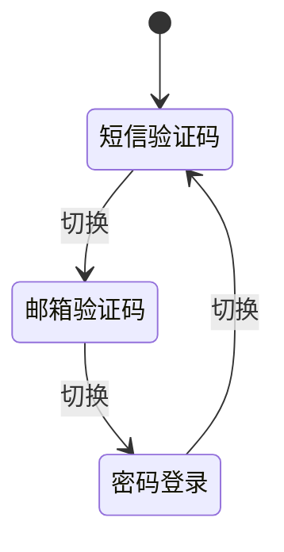
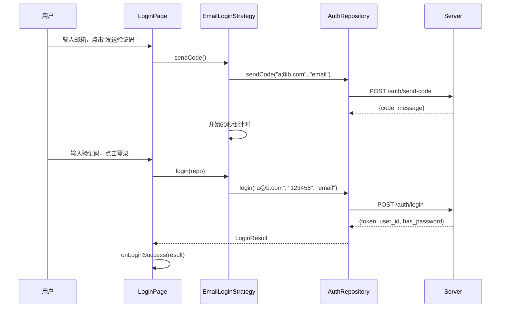

# auth — 客户端设计报告

> 关联设计：[auth v0.0.2 服务端](../server/design.md) | [session v0.0.1 客户端](../../../session/v0.0.1/client/design.md)

## 1. 目标

- 新增邮箱验证码登录（与短信验证码对称的 UI 和策略）
- 密码登录支持邮箱/手机号/用户ID 作为账号输入
- 剔除用户相关内容（LoginResult 不再携带 user 相关字段，由组装层处理）
- AuthRepository 接口适配服务端 v0.0.2 的新 API

## 2. 现状分析

### 已有能力

| 能力 | 说明 |
|------|------|
| 短信验证码登录 | SmsLoginStrategy + SmsLoginForm |
| 密码登录 | PasswordLoginStrategy + PasswordLoginForm |
| 策略模式 | LoginStrategy 抽象 + LoginMixin 统一调度 |
| 模块隔离 | flash_auth 是独立 package，barrel file 只导出 AuthRepository / LoginResult / LoginPage |

### 存在的问题

| 问题 | 说明 |
|------|------|
| 无邮箱验证码登录 | 缺少 EmailLoginStrategy 和对应表单 |
| 密码登录只有手机号输入 | PasswordLoginForm 的 hint 和校验都假设是手机号 |
| AuthRepository.sendSms 只支持短信 | 需要统一为 sendCode(target, channel) |
| AuthRepository.login 的 phone 参数 | 需要改为 account，与服务端对齐 |
| LoginPage 只有两种模式切换 | sms ↔ password，需要加入 email 模式 |

## 3. 数据模型与接口

### LoginResult（不变）

```dart
class LoginResult {
  final String token;
  final int userId;
  final bool hasPassword;
}
```

### AuthRepository 接口变更

```dart
class AuthRepository {
  /// 发送验证码（短信或邮箱）
  /// channel: 'sms' | 'email'
  Future<String> sendCode(String target, String channel);

  /// 统一登录
  /// account: 手机号、邮箱或用户ID
  /// type: 'sms' | 'email' | 'password'
  Future<LoginResult> login(String account, String credential, String type);
}
```

| 决策 | 理由 |
|------|------|
| `sendSms` → `sendCode` | 统一短信和邮箱验证码发送 |
| `phone` 参数 → `account` | 语义更准确，兼容多种账号标识 |
| API 路径 `/auth/sms` → `/auth/send-code` | 与服务端对齐 |

## 4. 核心流程

### 4.1 登录模式切换



用户在三种登录模式间循环切换，底部切换按钮文案：
- 短信验证码模式 → "使用邮箱验证码登录 →"
- 邮箱验证码模式 → "使用密码登录 →"
- 密码登录模式 → "使用短信验证码登录 →"

### 4.2 邮箱验证码登录流程



### 4.3 密码登录（支持多账号类型）

密码登录的 account 输入框不再限制为手机号格式。用户可以输入：
- 手机号：`13800138000`
- 邮箱：`user@example.com`
- 用户ID：`42`

客户端不做类型判断，直接将 account 原样传给服务端，由服务端识别。

## 5. 项目结构与技术决策

### 项目结构

```
client/modules/flash_auth/
├── pubspec.yaml
└── lib/
    ├── flash_auth.dart                    # barrel file
    └── src/
        ├── data/
        │   ├── auth_repository.dart       # sendCode(), login()
        │   └── login_result.dart          # LoginResult
        ├── logic/
        │   └── login/
        │       ├── login_mixin.dart       # 三模式调度（sms/email/password）
        │       └── strategy/
        │           ├── login_strategy.dart     # 抽象基类
        │           ├── sms_login_strategy.dart # 短信验证码策略
        │           ├── email_login_strategy.dart  # 新增：邮箱验证码策略
        │           └── password_login_strategy.dart # 密码策略
        └── view/
            ├── login_page.dart            # 主页面
            └── components/
                ├── sms_login_form.dart     # 短信表单
                ├── email_login_form.dart   # 新增：邮箱表单
                ├── password_login_form.dart # 密码表单（移除手机号限制）
                ├── agreement_row.dart      # 协议勾选
                └── action_button.dart      # 登录按钮
```

### 职责划分

```
LoginPage（View）
  ├── LoginMixin（逻辑调度）
  │     ├── SmsLoginStrategy      → AuthRepository.sendCode + login
  │     ├── EmailLoginStrategy    → AuthRepository.sendCode + login
  │     └── PasswordLoginStrategy → AuthRepository.login
  └── 表单组件（纯 UI）
        ├── SmsLoginForm
        ├── EmailLoginForm
        └── PasswordLoginForm
```

- LoginPage 只负责 UI 组装和模式切换
- LoginMixin 持有三个策略实例，根据当前模式委派
- 每个 Strategy 封装自己的 Controller 和校验逻辑
- AuthRepository 是纯网络层，不持有状态

### 技术决策

| 决策 | 方案 | 理由 |
|------|------|------|
| EmailLoginStrategy 独立类 | 不复用 SmsLoginStrategy | 邮箱校验规则不同（含@），输入框 hint 不同，未来可能有不同的 UI 行为 |
| LoginMode 新增 email 枚举 | `enum LoginMode { sms, email, password }` | 三种模式循环切换 |
| 密码登录不校验 account 格式 | 只检查非空 | 类型识别交给服务端，客户端不做假设 |
| 邮箱格式校验 | 简单的 `contains('@')` | 不用复杂正则，服务端会做最终校验 |

### 依赖清单

| 依赖 | 用途 | 已有/需新增 |
|------|------|------------|
| dio | HTTP 请求 | 已有 |
| oktoast | Toast 提示 | 已有 |
| shared_preferences | Token 本地存储 | 已有 |
| flutter_bloc | 状态管理 | 已有 |
| equatable | 值对象比较 | 已有 |

## 6. 暂不实现

| 功能 | 理由 |
|------|------|
| 邮箱绑定/解绑 | 属于用户模块，非认证 |
| 记住登录账号 | 体验优化，后续版本 |
| 登录方式智能推荐 | 如"上次使用邮箱登录"提示，后续版本 |
| 输入框实时格式化 | 如手机号自动加空格 `138 0013 8000`，非核心 |
| 第三方登录按钮 | 微信/Google 登录，auth_credentials 已预留，本版本不做 |
