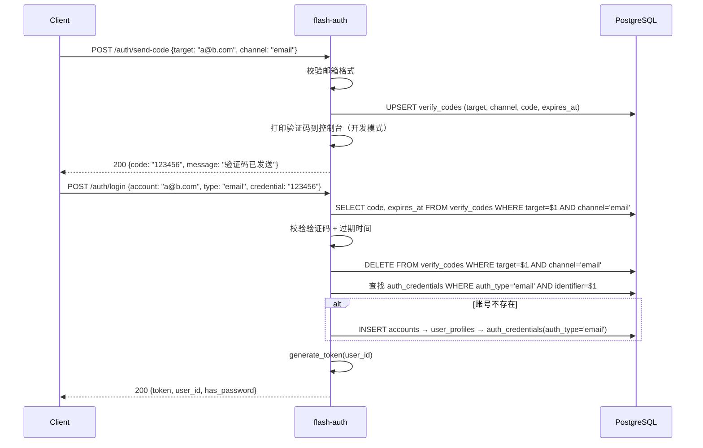
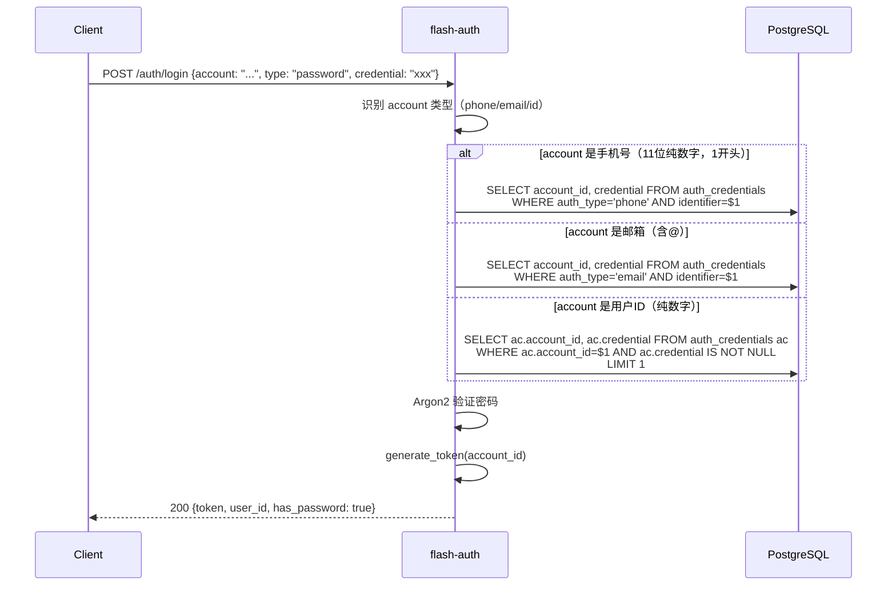

# auth — 服务端设计报告

> 关联设计：[auth v0.0.2 客户端](../client/design.md) | [session v0.0.1 客户端](../../../session/v0.0.1/client/design.md)

## 1. 目标

- 新增邮箱验证码登录（登录即注册，与短信验证码对称）
- 支持「邮箱 / 手机号 / 用户ID + 密码」三种密码登录方式
- 将 `set_password` 接口从 flash-auth 移出（它是用户行为，不是认证行为）
- 统一验证码表，短信和邮箱共用一张 `verify_codes` 表

## 2. 现状分析

### 已有能力

| 能力 | 说明 |
|------|------|
| 短信验证码登录 | `POST /auth/sms` 发码 + `POST /auth/login` type=sms |
| 手机号+密码登录 | `POST /auth/login` type=password |
| 设置密码 | `POST /auth/password`（需 Token） |
| 自动注册 | 验证码登录时，账号不存在自动创建 accounts + user_profiles + auth_credentials |
| JWT | flash-core 提供 verify_token，flash-auth 内部 generate_token |

### 存在的问题

| 问题 | 说明 |
|------|------|
| 无邮箱登录 | auth_credentials 表已预留 `auth_type='email'`，但无对应接口和验证码逻辑 |
| 密码登录只认手机号 | `login_with_password` 硬编码 `auth_type = 'phone'`，无法用邮箱或 ID 登录 |
| sms_codes 表只服务短信 | 邮箱验证码需要类似机制，应统一为通用验证码表 |
| set_password 放在 flash-auth | 设置密码是用户行为（修改自己的凭据），不是认证行为，应移至 flash-user |
| LoginRequest.phone 字段名 | 字段名为 `phone`，但实际应支持多种账号标识 |

### 数据库就绪情况

- `auth_credentials` 表的 `auth_type` 已支持 `'email'`，`UNIQUE(auth_type, identifier)` 约束已就位
- `sms_codes` 表需要重构为通用验证码表

## 3. 数据模型与接口

### 数据模型变更

#### 新增：verify_codes 表（替代 sms_codes）

```sql
-- 通用验证码表（短信 + 邮箱共用）
CREATE TABLE verify_codes (
    target     VARCHAR(100) NOT NULL,   -- 手机号或邮箱
    channel    VARCHAR(10)  NOT NULL,   -- 'sms' | 'email'
    code       VARCHAR(6)   NOT NULL,
    expires_at TIMESTAMPTZ  NOT NULL,
    created_at TIMESTAMPTZ  NOT NULL DEFAULT NOW(),

    PRIMARY KEY (target, channel)
);
```

| 决策 | 理由 |
|------|------|
| 用 `(target, channel)` 复合主键 | 同一手机号/邮箱在不同渠道可以有独立验证码 |
| 删除 sms_codes 表 | verify_codes 完全覆盖其功能 |
| target 用 VARCHAR(100) | 兼容手机号（11位）和邮箱（较长） |

#### 不变的表

- `accounts`：无变更
- `auth_credentials`：无结构变更，新增 `auth_type='email'` 的数据行（邮箱注册时自动创建）
- `user_profiles`：无变更

### 接口契约

#### 接口总览

| 方法 | 路径 | 说明 | 变更 |
|------|------|------|------|
| POST | `/auth/send-code` | 发送验证码（短信/邮箱） | 新增，替代 `/auth/sms` |
| POST | `/auth/login` | 统一登录 | 重构请求体 |
| ~~POST~~ | ~~`/auth/sms`~~ | ~~发送短信验证码~~ | 废弃 |
| ~~POST~~ | ~~`/auth/password`~~ | ~~设置密码~~ | 移至 flash-user |


#### POST /auth/send-code — 发送验证码

```json
// 请求
{
    "target": "13800138000",     // 手机号或邮箱
    "channel": "sms"             // "sms" | "email"
}

// 成功响应 200
{
    "code": "123456",            // 开发环境直接返回，生产环境不返回
    "message": "验证码已发送"
}

// 错误响应
// 400 — target 格式不合法
// 429 — 发送过于频繁（同一 target+channel 60秒内只能发一次）
// 500 — 内部错误
```

#### POST /auth/login — 统一登录

```json
// 请求 — 验证码登录
{
    "account": "13800138000",    // 手机号或邮箱
    "type": "sms",               // "sms" | "email"
    "credential": "123456"       // 验证码
}

// 请求 — 密码登录
{
    "account": "13800138000",    // 手机号、邮箱或用户ID
    "type": "password",          // "password"
    "credential": "mypassword"   // 密码
}

// 成功响应 200
{
    "token": "eyJhbGciOiJIUzI1NiJ9...",
    "user_id": 42,
    "has_password": true
}

// 错误响应
// 400 — 请求格式错误
// 401 — 验证码错误/过期、密码错误、账号不存在
// 500 — 内部错误
```

| 决策 | 理由 |
|------|------|
| `phone` 字段改名为 `account` | 语义更准确，兼容手机号/邮箱/ID |
| `type` 新增 `"email"` 枚举值 | 与 `"sms"` 对称，表示邮箱验证码登录 |
| 密码登录自动识别 account 类型 | 纯数字11位→手机号，含@→邮箱，纯数字非11位→用户ID |

## 4. 核心流程

### 4.1 邮箱验证码登录（新增）



### 4.2 密码登录（重构：支持多账号类型）



### 4.3 短信验证码登录（重构：使用 verify_codes）

与现有逻辑相同，仅将 `sms_codes` 表替换为 `verify_codes`，`channel='sms'`。

## 5. 项目结构与技术决策

### 项目结构

```
server/modules/flash-auth/
├── Cargo.toml
└── src/
    ├── lib.rs              # pub fn router() — 唯一公开 API
    ├── routes.rs           # 路由注册：/auth/send-code, /auth/login
    ├── handler.rs          # send_code(), login() — 删除 set_password
    ├── jwt.rs              # generate_token() — 内部使用
    └── model.rs            # 请求/响应结构体
```

### 职责划分

| 变更 | 说明 |
|------|------|
| `send_sms` → `send_code` | 统一处理短信和邮箱验证码 |
| `login` 重构 | LoginType 新增 Email 枚举，密码登录支持多账号类型 |
| `set_password` 移除 | 从 flash-auth 删除，接口保留在主 binary 或未来独立 crate，客户端由 flash_session 调用 |
| `validate_phone` → `validate_target` | 根据 channel 校验手机号或邮箱格式 |

### 技术决策

| 决策 | 方案 | 理由 |
|------|------|------|
| 邮箱发送 | 开发阶段仅打印到控制台 | 与短信验证码一致，生产环境再接入 SMTP |
| 账号类型识别 | 服务端根据格式自动判断 | 客户端不需要传 account_type，减少耦合 |
| verify_codes 替代 sms_codes | 统一表结构 + 复合主键 | 避免为每种渠道建一张表 |
| 频率限制 | 同一 target+channel 60秒内不可重复发送 | 通过 created_at 字段判断，无需额外表 |

### 依赖清单

| 依赖 | 用途 | 已有/需新增 |
|------|------|------------|
| flash-core | AppState, verify_token, jwt_secret | 已有 |
| axum | HTTP 框架 | 已有 |
| sqlx | 数据库操作 | 已有 |
| argon2 | 密码哈希 | 已有 |
| jsonwebtoken | JWT 生成 | 已有 |
| chrono | 时间处理 | 已有 |
| rand | 验证码生成 | 已有 |

## 6. 暂不实现

| 功能 | 理由 |
|------|------|
| 真实邮件发送（SMTP） | 开发阶段用控制台打印，生产环境再接入 |
| 真实短信发送 | 同上 |
| set_password 接口 | 从 flash-auth 删除，由客户端 flash_session 模块通过独立接口调用 |
| 微信/Google 第三方登录 | auth_credentials 表已预留 auth_type，但本版本不实现 |
| 登录日志/审计 | 暂不需要 |
| 账号绑定（手机号绑定邮箱） | 属于用户模块的功能，非认证 |
| Token 刷新机制 | 当前 7 天过期，暂够用 |
