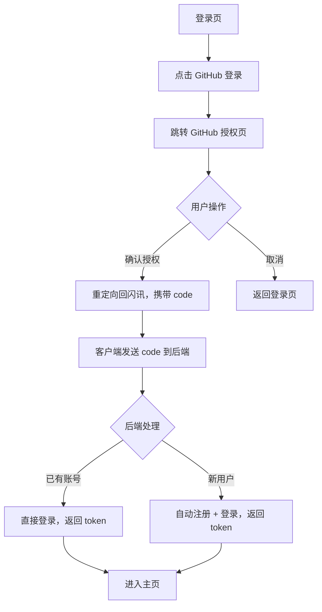
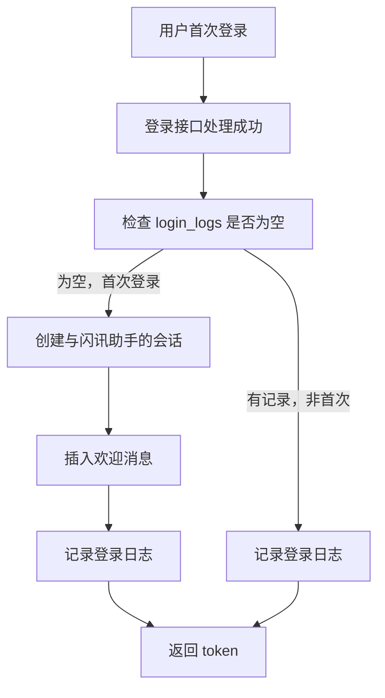
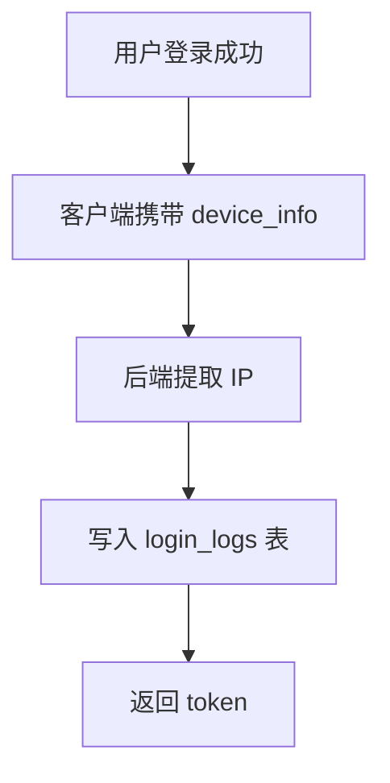
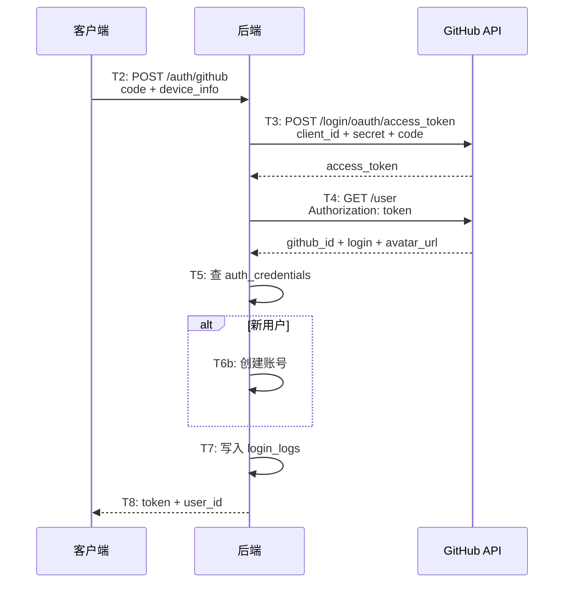

# 认证增强 — 功能分析

## 概述

对认证系统进行三项增强：新增 GitHub OAuth 登录、记录每次登录的设备信息、首次登录时自动发送欢迎消息。GitHub 登录让用户无需手机号即可使用闪讯；登录记录为后续的设备管理和安全审计打基础；欢迎消息让新用户有一个友好的初始体验。

## 一、交互链

### 场景 1：GitHub 登录

**用户故事**：作为用户，我想用 GitHub 账号登录闪讯，以便不需要手机号也能使用。

用户在登录页看到"GitHub 登录"按钮，点击后跳转到 GitHub 授权页面。用户在 GitHub 页面确认授权后，浏览器重定向回闪讯，携带授权码。客户端将授权码发送给后端，后端用授权码换取 GitHub access_token，获取用户信息（昵称、头像、GitHub ID），完成登录或自动注册。



### 场景 2：首次登录欢迎消息

**用户故事**：作为新注册用户，我想在首次登录后看到一条欢迎消息，以便知道闪讯可以正常使用。

用户首次登录成功后（不管是手机号还是 GitHub），WS 连接建立时，系统检测到该用户没有登录记录，自动创建一个与"闪讯助手"的会话，并发送一条欢迎消息。用户在会话列表中看到这个会话，点进去能看到欢迎内容。



### 场景 3：登录记录

**用户故事**：作为系统管理者，我想记录每次用户登录的设备信息，以便后续做安全审计和设备管理。

每次用户登录成功（手机号或 GitHub），后端记录一条登录日志：IP、平台、设备名、设备 ID、客户端版本号。客户端在登录请求中携带设备信息。



## 二、逻辑树

### 事件流：GitHub OAuth 登录

| 时刻 | 事件 | 处理 | 产生的新事件 |
|------|------|------|-------------|
| T0 | 用户点击 GitHub 登录 | 客户端构造 OAuth URL，打开浏览器 | 浏览器跳转 |
| T1 | 用户在 GitHub 确认授权 | GitHub 重定向到回调 URL，携带 code | 客户端拿到 code |
| T2 | 客户端发送 code 到后端 | POST /auth/github {code, device_info} | 后端处理 |
| T3 | 后端用 code 换 access_token | POST https://github.com/login/oauth/access_token | 拿到 token |
| T4 | 后端用 token 获取用户信息 | GET https://api.github.com/user | 拿到 github_id + login + avatar_url |
| T5 | 查 auth_credentials 表 | WHERE auth_type='github' AND identifier=github_id | 判断新旧用户 |
| T6a | 已有账号 | 直接取 account_id | 登录成功 |
| T6b | 新用户 | 创建 account + user_profile + auth_credential | 注册成功 |
| T7 | 记录登录日志 | INSERT login_logs | — |
| T8 | 签发 JWT | generate_token(account_id) | 返回 token |



### 事件流：首次登录欢迎消息

| 时刻 | 事件 | 处理 | 产生的新事件 |
|------|------|------|-------------|
| T0 | 登录成功 | 签发 JWT 前 | — |
| T1 | 检查 login_logs | SELECT 1 FROM login_logs WHERE account_id=$1 LIMIT 1 | 判断首次 |
| T2 | 首次登录 | 创建会话（type=0, 成员=[0, user_id]） | 会话创建 |
| T3 | 发送欢迎消息 | INSERT messages（直接 SQL） | 消息写入 |
| T4 | 记录登录日志 | INSERT login_logs | — |

### 状态流转

| 实体 | 触发事件 | 前状态 | 后状态 |
|------|---------|--------|--------|
| GitHub 用户 | 首次授权 | 不存在 | auth_credentials 新增记录（auth_type=github） |
| 登录日志 | 每次登录 | — | login_logs 新增一条记录 |
| 欢迎会话 | 首次登录 | 不存在 | conversations 新增 + messages 新增 |

## 三、功能编号与网络定位

### 本次新增节点

| 编号 | 功能节点 | 层级 | 简介 |
|------|---------|------|------|
| I-15 | GitHub OAuth 登录 | 基础设施 | 后端 OAuth 流程：code 换 token → 获取用户信息 → 登录/注册 |
| I-16 | 登录日志记录 | 基础设施 | 每次登录写入 login_logs（IP、平台、设备） |
| D-42 | 欢迎消息 | 领域 | 首次登录时创建与闪讯助手的会话并发送消息 |

注：系统用户（id=0 系统通知）和闪讯团队（id=100000000）是种子数据，不分配编号。欢迎消息由闪讯团队发送。

### 前置依赖

| 依赖节点 | 依赖方式 | 是否已有 |
|----------|---------|---------|
| I-02 手机号登录 | 复用 find_or_create_user 模式 | ✅ 已有 |
| I-03 Token 签发 | 复用 generate_token | ✅ 已有 |
| auth_credentials 表 | auth_type='github' 新增记录 | ✅ 表已有，新增类型 |
| im-message MessageService | send_system 发送欢迎消息 | ✅ 已有 |
| im-ws handler | 首次上线检测触发点 | ✅ 已有 is_first 逻辑 |
| GitHub OAuth App | client_id + client_secret | ❌ 需在 GitHub 注册 |

### 边界接口

| 接口/协议 | 定义方 | 消费方 | 说明 |
|-----------|--------|--------|------|
| POST /auth/github | flash-auth | 前端 | 接收 code + device_info，返回 token |
| POST /auth/send-code（修改） | flash-auth | 前端 | 请求体新增可选 device_info |
| POST /auth/login（修改） | flash-auth | 前端 | 请求体新增可选 device_info |
| GitHub OAuth API | GitHub | flash-auth | code→token→user_info |
| login_logs 表 | flash-auth | 后续设备管理功能 | 登录记录存储 |

## 四、结论

- 开发顺序：系统用户种子数据 → 登录日志表 → GitHub OAuth → 欢迎消息
- 复杂度集中在 GitHub OAuth（外部 API 调用、错误处理、网络超时）
- 欢迎消息的触发点放在 WS handler 的 is_first 分支，不需要改 flash-auth 的依赖
- 登录记录的 device_info 由客户端传递，IP 由后端从请求头提取
- 暂不实现：登录设备管理页面（踢掉其他设备）、异地登录提醒、GitHub 解绑

### 开发前准备

**1. 注册 GitHub OAuth App**

前往 [GitHub Settings > Developer settings > OAuth Apps](https://github.com/settings/developers) 创建：

| 配置项 | 填什么 | 说明 |
|--------|--------|------|
| Application name | 闪讯 IM | 用户在授权页看到的应用名 |
| Homepage URL | `http://82.157.176.209:9600` | 纯展示用，用户可以点击了解你的应用，GitHub 不验证它，填什么都行 |
| Authorization callback URL | `http://localhost/callback` | 用户授权后 GitHub 把浏览器重定向到这个地址（URL 后面带 `?code=xxx`）。我们用 WebView 拦截方式，客户端监听到这个 URL 出现就提取 code，浏览器不会真的加载这个页面，所以填 localhost 就行 |

创建后获取 `Client ID` 和 `Client Secret`，写入后端 `.env`：

```env
GITHUB_CLIENT_ID=xxx
GITHUB_CLIENT_SECRET=xxx
```

> **OAuth 流程简述**：客户端在 WebView 里打开 GitHub 授权页 → 用户点"Authorize" → GitHub 把浏览器重定向到 callback URL（带 code 参数）→ 客户端拦截这个 URL，提取 code → 客户端把 code 发给我们的后端 → 后端拿 code 去 GitHub 换 access_token → 后端用 token 调 GitHub API 获取用户信息 → 完成登录。整个过程 GitHub 不需要连接我们的服务器，是我们的后端主动请求 GitHub。

**2. OAuth 回调方式：WebView 内嵌**

客户端在 app 内打开 WebView 加载 GitHub 授权页，监听 URL 变化，拦截回调 URL 中的 code 参数。不跳出 app，体验更流畅。

**3. 客户端 device_info 采集**

| 依赖 | 用途 |
|------|------|
| `device_info_plus` | 获取设备名（如 Pixel 7）、平台（android/ios/windows） |
| `package_info_plus` | 获取 app 版本号 |
| SharedPreferences | 存储 device_id（首次生成 UUID 后固定） |

**4. 服务端 .env 新增**

```env
GITHUB_CLIENT_ID=你的client_id
GITHUB_CLIENT_SECRET=你的client_secret
```
