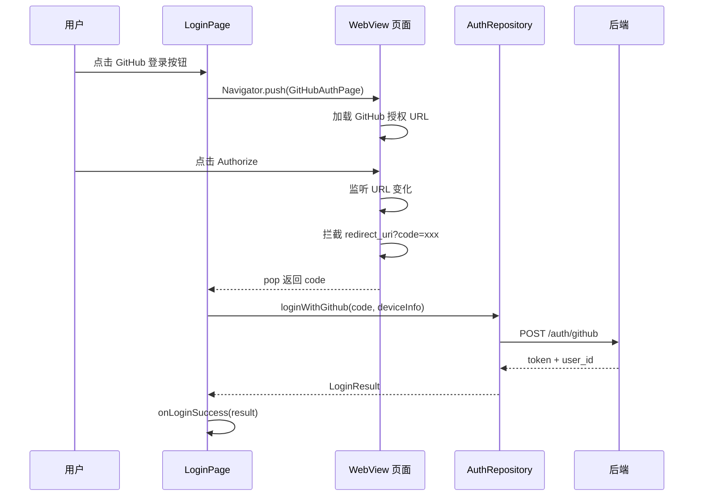

# 认证增强 — 客户端设计报告

> 关联设计：[auth v0.0.3 server](../server/design.md) | [GitHub OAuth 接入指南](../github_oauth.md)

## 1. 目标

- 登录页新增 GitHub 登录按钮
- WebView 内嵌 GitHub 授权页，拦截回调拿 code
- 登录请求携带 device_info（平台、设备名、设备 ID、版本号）
- 登录成功后正常进入主页（欢迎消息由后端自动创建，前端无需额外处理）
- AvatarWidget 支持特殊头像：`identicon:system`（蓝底铃铛）、`identicon:team`（蓝底闪电）
- 输入栏优化：有文字时加号隐藏、发送按钮显示

## 2. 现状分析

### 已有能力

- 手机号 + 验证码登录
- 密码登录
- AuthRepository 封装 Dio 请求
- LoginPage 支持验证码/密码模式切换
- LoginMixin 管理登录状态

### 存在的问题

| 问题 | 影响 |
|------|------|
| 只有手机号登录 | 海外用户或不想暴露手机号的用户无法使用 |
| 登录请求不带设备信息 | 后端无法记录登录日志 |

## 3. 数据模型与接口

### 客户端数据模型

```dart
/// 设备信息
class DeviceInfo {
  final String? platform;
  final String? deviceName;
  final String? deviceId;
  final String? appVersion;

  Map<String, dynamic> toJson() => {
    'platform': platform,
    'device_name': deviceName,
    'device_id': deviceId,
    'app_version': appVersion,
  };
}
```

### 接口调用

**POST /auth/github**

```dart
Future<LoginResult> loginWithGithub(String code, DeviceInfo deviceInfo) async {
  final res = await _dio.post('/auth/github', data: {
    'code': code,
    'device_info': deviceInfo.toJson(),
  });
  final result = LoginResult.fromJson(res.data);
  await _saveToken(result.token);
  return result;
}
```

**POST /auth/login（修改：加 device_info）**

```dart
Future<LoginResult> login(String phone, String credential, String type, DeviceInfo deviceInfo) async {
  final res = await _dio.post('/auth/login', data: {
    'phone': phone,
    'type': type,
    'credential': credential,
    'device_info': deviceInfo.toJson(),
  });
  ...
}
```

## 4. 核心流程

### GitHub 登录流程



## 5. 项目结构与技术决策

### 项目结构

```
flash_auth/lib/src/
├── data/
│   ├── auth_repository.dart    ← 修改：新增 loginWithGithub + login 加 deviceInfo
│   ├── device_info.dart        ← 新增：DeviceInfo 类 + 采集方法
│   └── login_result.dart       ← 不变
├── logic/
│   └── login/
│       └── login_mixin.dart    ← 修改：新增 loginWithGithub 方法
├── view/
│   ├── login_page.dart         ← 修改：底部加 GitHub 登录按钮
│   ├── github_auth_page.dart   ← 新增：WebView 授权页
│   └── components/             ← 不变
```

### 职责划分

```
LoginPage（UI）
  ├── 展示 GitHub 登录按钮
  └── 跳转 GitHubAuthPage，拿到 code 后调 loginWithGithub

GitHubAuthPage（UI）
  ├── WebView 加载授权 URL
  ├── 监听 URL 变化，拦截 code
  └── pop 返回 code

AuthRepository（数据层）
  ├── loginWithGithub(code, deviceInfo) → POST /auth/github
  └── login(phone, credential, type, deviceInfo) → POST /auth/login

DeviceInfo（工具）
  └── collect() → 采集当前设备信息
```

### 技术决策

| 决策 | 方案 | 理由 |
|------|------|------|
| WebView 包 | `webview_flutter` ^4.0.0 | Flutter 官方维护，稳定 |
| 设备信息采集 | `device_info_plus` ^11.0.0 | 获取设备名、平台 |
| App 版本号 | `package_info_plus` ^8.0.0 | 获取版本号 |
| Device ID | SharedPreferences 存 UUID | 首次生成后固定，不依赖硬件 ID |
| GitHub Client ID | 硬编码在客户端 | Client ID 是公开的，不需要保密 |

### 第三方依赖

| 依赖 | 用途 | 已有/需新增 |
|------|------|-----------|
| webview_flutter | WebView 内嵌浏览器 | ❌ 需新增 |
| device_info_plus | 设备名、平台 | ❌ 需新增 |
| package_info_plus | App 版本号 | ❌ 需新增 |
| uuid | 生成 device_id | ❌ 需新增 |
| shared_preferences | 存储 device_id | ✅ 已有 |
| dio | HTTP 请求 | ✅ 已有 |

## 6. 验收标准

| 验收条件 | 验收方式 |
|----------|----------|
| 登录页显示 GitHub 登录按钮 | 视觉确认 |
| 点击后打开 WebView 显示 GitHub 授权页 | 手动操作 |
| 授权后自动拦截 code 并关闭 WebView | 手动操作 |
| GitHub 登录成功进入主页 | 手动操作 |
| 手机号登录仍正常工作 | 手动操作 |
| `flutter analyze` 零 issue | 命令行 |

## 7. 暂不实现

| 功能 | 理由 |
|------|------|
| 登录记录查看页面 | 后续版本加 |
| GitHub 账号解绑 | 需要设计多账号策略 |
| 登录页 loading 动画优化 | 非核心 |
| 多账号切换 | 复杂度高，后续版本 |
