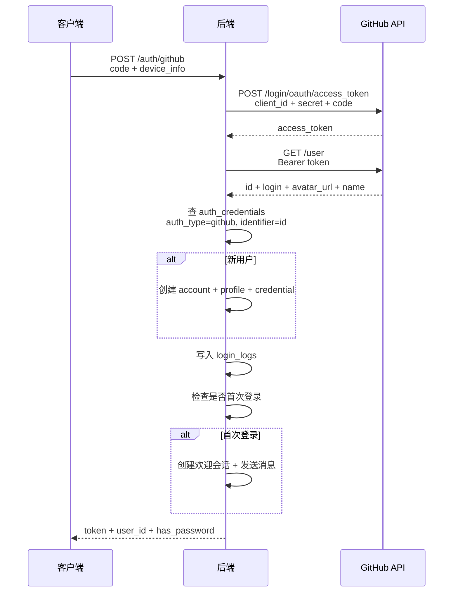
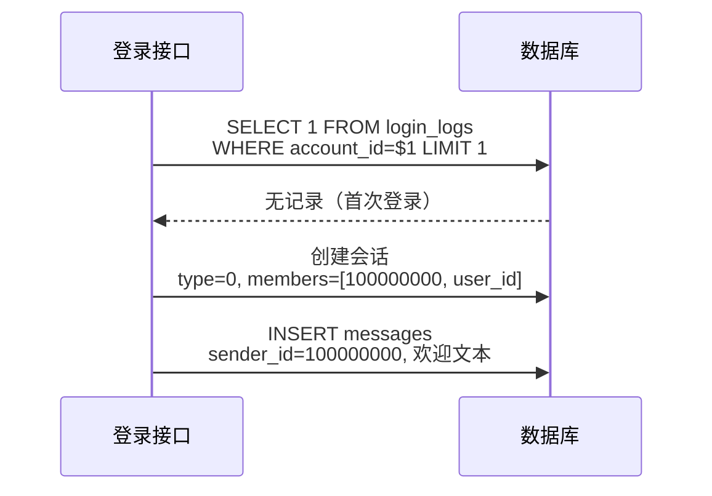

# 认证增强 — 服务端设计报告

> 关联设计：[auth v0.0.3 analysis](../analysis.md) | [GitHub OAuth 接入指南](../github_oauth.md)

## 1. 目标

- 新增 GitHub OAuth 登录接口
- 每次登录记录设备信息（IP、平台、设备名、设备 ID、版本号）
- 创建系统用户（id=0 闪讯助手）
- 用户首次登录时自动创建欢迎会话并发送消息

## 2. 现状分析

### 已有能力

- 手机号 + 验证码登录（登录即注册）
- 密码登录
- JWT 签发
- auth_credentials 表支持多种 auth_type（phone/email/wechat/google/github）
- im-message 的 send_system 方法可发送系统消息
- im-ws handler 有 is_first 判断（首次上线）

### 存在的问题

| 问题 | 影响 |
|------|------|
| 只有手机号登录 | 海外用户或不想暴露手机号的用户无法使用 |
| 无登录记录 | 无法做安全审计、设备管理 |
| 新用户无引导 | 注册后会话列表为空，不知道能干什么 |

## 3. 数据模型与接口

### 数据模型

**新建表：login_logs**

```sql
CREATE TABLE login_logs (
    id          BIGSERIAL    PRIMARY KEY,
    account_id  BIGINT       NOT NULL REFERENCES accounts(id),
    login_at    TIMESTAMPTZ  NOT NULL DEFAULT NOW(),
    ip          VARCHAR(45),
    platform    VARCHAR(20),
    device_name VARCHAR(100),
    device_id   VARCHAR(100),
    app_version VARCHAR(20)
);

CREATE INDEX idx_login_logs_account ON login_logs(account_id);
CREATE INDEX idx_login_logs_time ON login_logs(login_at DESC);
```

**种子数据：系统用户**

```sql
-- 系统通知（id=0）：群聊系统消息的 sender_id
INSERT INTO accounts (id, status) VALUES (0, 0) ON CONFLICT DO NOTHING;
INSERT INTO user_profiles (account_id, nickname, avatar, signature)
VALUES (0, '系统通知', 'identicon:system', '系统消息')
ON CONFLICT DO NOTHING;

-- 闪讯团队（id=100000000）：欢迎消息发送者
INSERT INTO accounts (id, status) VALUES (100000000, 0) ON CONFLICT DO NOTHING;
INSERT INTO user_profiles (account_id, nickname, avatar, signature)
VALUES (100000000, '闪讯团队', 'identicon:team', '闪讯官方团队')
ON CONFLICT DO NOTHING;

SELECT setval('accounts_id_seq', GREATEST((SELECT MAX(id) FROM accounts WHERE id < 100000000), 1));
```

| 决策 | 方案 | 理由 |
|------|------|------|
| login_logs 独立表 | 不在 accounts 加字段 | 追加写入不影响 accounts 更新频率，后续可做设备管理 |
| 系统通知 id=0 | 手动插入 | 用于群聊系统消息（"XXX 加入了群聊"），自增序列从 1 开始不会占用 |
| 闪讯团队 id=100000000 | 手动插入 | 欢迎消息发送者，作为正式用户可以聊天 |
| IP 由后端提取 | 不信任客户端传的 IP | 从请求头 X-Forwarded-For 或连接地址提取 |

### 接口契约

**POST /auth/github — GitHub 登录**

```json
// Request
{
  "code": "abc123def456",
  "device_info": {
    "platform": "android",
    "device_name": "Pixel 7",
    "device_id": "uuid-xxx",
    "app_version": "1.0.0"
  }
}

// Response 200
{
  "token": "eyJ...",
  "user_id": 42,
  "has_password": false
}

// Error 401 — code 无效或过期
// Error 502 — GitHub API 不可达
```

**POST /auth/login — 修改：新增 device_info 字段**

```json
// Request（新增可选字段）
{
  "phone": "13800000001",
  "type": "sms",
  "credential": "123456",
  "device_info": {
    "platform": "android",
    "device_name": "Pixel 7",
    "device_id": "uuid-xxx",
    "app_version": "1.0.0"
  }
}
```

**GET /auth/login-logs — 查询登录记录（可选，暂不实现前端页面）**

```json
// Response 200
{
  "logs": [
    {
      "login_at": "2026-05-23T10:00:00Z",
      "ip": "82.157.176.209",
      "platform": "android",
      "device_name": "Pixel 7"
    }
  ]
}
```

## 4. 核心流程

### GitHub OAuth 登录



### 欢迎消息触发



## 5. 项目结构与技术决策

### 项目结构

```
server/modules/flash-auth/src/
├── handler.rs          ← 修改：新增 oauth_login 统一入口，login 加 device_info
├── oauth/
│   ├── mod.rs          ← 新增：OAuthProvider trait + OAuthUserInfo 定义
│   └── github.rs       ← 新增：GitHubProvider 实现
├── login_log.rs        ← 新增：登录日志记录
├── welcome.rs          ← 新增：欢迎消息（创建会话 + 发消息）
├── model.rs            ← 修改：新增 OAuthLoginRequest、DeviceInfo
├── routes.rs           ← 修改：新增 /auth/github 路由
├── jwt.rs              ← 不变
└── lib.rs              ← 修改：导出新模块

server/migrations/
└── 20260523_010_login_logs.sql  ← 新增：login_logs 表 + 系统用户种子数据
```

### 职责划分

```
routes.rs（路由注册）
  └── handler.rs（请求处理）
        ├── oauth/mod.rs（OAuthProvider trait 定义）
        │     └── github.rs（GitHubProvider：换 token + 获取用户信息）
        ├── login_log.rs（写入登录日志）
        └── welcome.rs（首次登录欢迎消息）
```

**OAuthProvider trait**：

```rust
/// 第三方登录提供商返回的用户信息
pub struct OAuthUserInfo {
    pub provider: String,       // "github" / "google" / "apple"
    pub provider_id: String,    // 第三方平台的用户唯一 ID
    pub nickname: String,       // 显示名
    pub avatar: Option<String>, // 头像 URL
}

/// 第三方登录提供商接口
#[async_trait]
pub trait OAuthProvider: Send + Sync {
    /// 用授权码换取 access_token
    async fn exchange_token(&self, code: &str) -> Result<String, AppError>;
    /// 用 token 获取用户信息
    async fn get_user_info(&self, token: &str) -> Result<OAuthUserInfo, AppError>;
}
```

**handler 统一流程**：

```rust
async fn oauth_login(provider: &dyn OAuthProvider, code: &str, device_info: &DeviceInfo, db: &PgPool) -> Result<LoginResponse, AppError> {
    // 1. 换 token
    let token = provider.exchange_token(code).await?;
    // 2. 获取用户信息
    let info = provider.get_user_info(&token).await?;
    // 3. 查/建账号（复用 find_or_create_by_oauth）
    let (account_id, is_new) = find_or_create_by_oauth(db, &info).await?;
    // 4. 记录登录日志
    record_login(db, account_id, device_info).await?;
    // 5. 首次登录发欢迎消息
    if is_new { send_welcome(db, account_id).await?; }
    // 6. 签发 JWT
    Ok(LoginResponse { token: generate_token(account_id), user_id: account_id, has_password: false })
}
```

未来加 Google/Apple 只需：
1. 新建 `oauth/google.rs`，实现 `OAuthProvider` trait
2. `routes.rs` 加一行路由

handler 逻辑零改动。

- `oauth/mod.rs` 定义 trait 和公共结构体，不包含任何具体提供商逻辑
- `oauth/github.rs` 只负责和 GitHub API 通信
- `login_log.rs` 只负责写入一条日志记录
- `welcome.rs` 只负责判断首次 + 创建会话 + 发消息（直接用 SQL，不依赖 im-message）
- `handler.rs` 编排流程，调用 trait 方法

### 技术决策

| 决策 | 方案 | 理由 |
|------|------|------|
| HTTP 客户端 | `reqwest` | Rust 生态最成熟的 HTTP 客户端，支持 async |
| OAuth 抽象 | `OAuthProvider` trait | 统一流程，加新提供商只需实现 trait，handler 零改动 |
| 欢迎消息方式 | 直接 SQL | flash-auth 不能依赖 im-message（会循环依赖），用 SQL 手动处理 seq 和消息插入 |
| IP 提取 | axum ConnectInfo + X-Forwarded-For | 直连取 ConnectInfo，Nginx 代理取 header |
| GitHub API 超时 | 10 秒 | 国内访问 GitHub 偶尔慢，超时后返回 502 |
| async_trait | `async-trait` crate | trait 中的 async 方法需要它 |

### 第三方依赖

| 依赖 | 用途 | 已有/需新增 |
|------|------|-----------|
| reqwest | HTTP 客户端（请求 GitHub API） | ❌ 需新增 |
| async-trait | trait 中使用 async 方法 | ❌ 需新增 |
| serde_json | JSON 解析 | ✅ 已有（workspace） |

### .env 新增配置

```env
GITHUB_CLIENT_ID=xxx
GITHUB_CLIENT_SECRET=xxx
```

## 6. 验收标准

| 验收条件 | 验收方式 |
|----------|----------|
| `cargo build` 编译通过 | 命令行 |
| `cargo clippy` 无新增 warning | 命令行 |
| GitHub 登录：有效 code 返回 token | API 测试 |
| GitHub 登录：无效 code 返回 401 | API 测试 |
| GitHub 登录：新用户自动注册 | 数据库查看 auth_credentials |
| 登录记录：每次登录写入 login_logs | 数据库查看 |
| 首次登录：自动创建欢迎会话 | 数据库查看 conversations + messages |
| 非首次登录：不重复创建 | 多次登录后只有一个欢迎会话 |
| 系统用户存在 | `SELECT * FROM user_profiles WHERE account_id=0` |

## 7. 暂不实现

| 功能 | 理由 |
|------|------|
| 登录记录查询接口的前端页面 | 后端接口可以先做，前端页面后续版本加 |
| GitHub 解绑 | 需要设计多账号绑定策略，复杂度高 |
| 手机号 + GitHub 账号合并 | 同上 |
| PKCE 安全增强 | 移动端 WebView 方式下 PKCE 不是必须的，后续可加 |
| 异地登录提醒 | 需要 IP 地理位置库，后续版本 |
