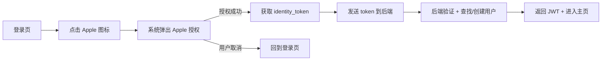
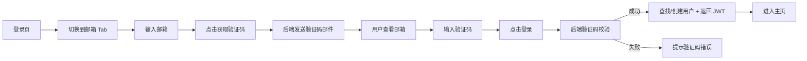
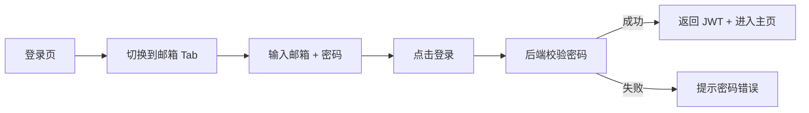
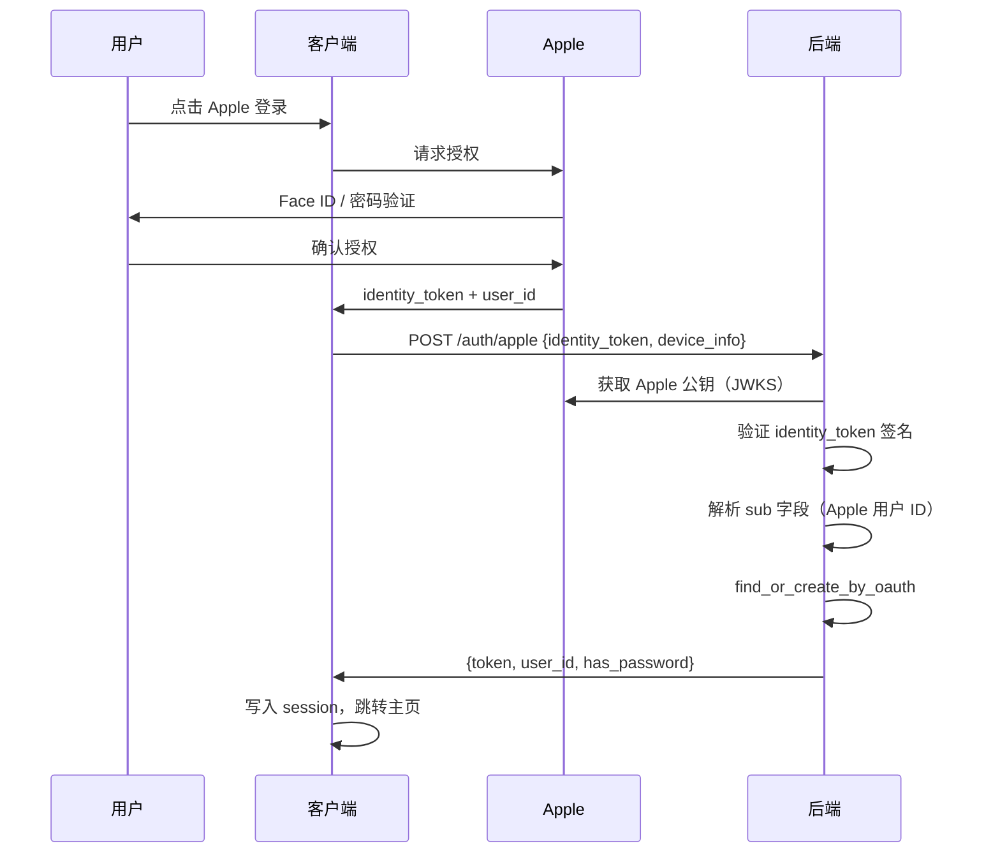
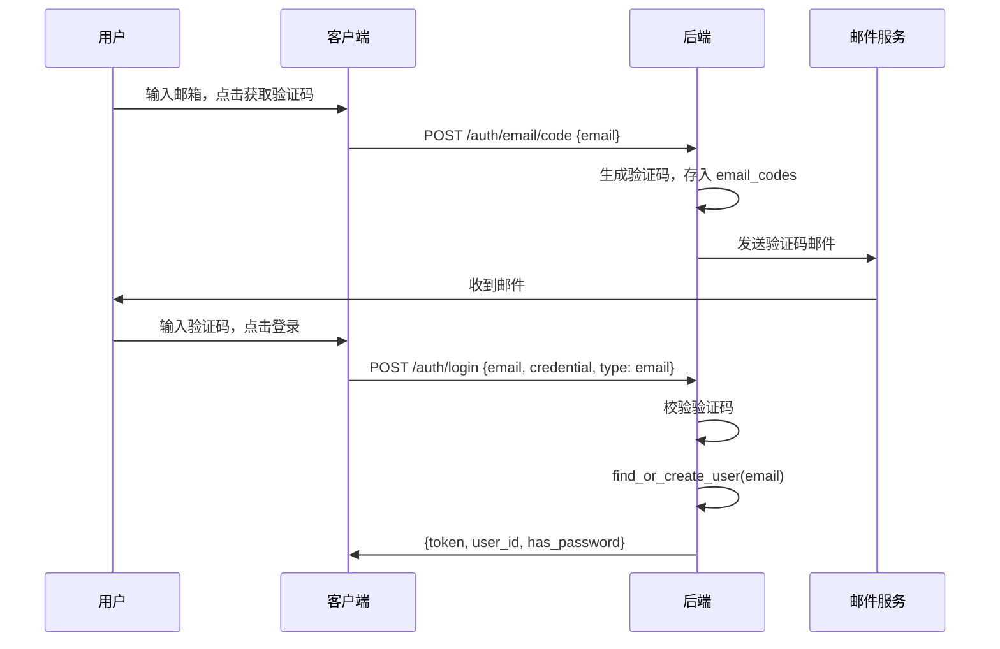

# 认证增强（Apple 登录 + 邮箱登录）— 功能分析

## 概述

在 v0.23.0 已有短信登录、密码登录、GitHub OAuth 的基础上，新增两种登录方式：

1. **Apple 登录**：iOS 上架 App Store 的硬性要求（如果提供了第三方登录，必须同时提供 Sign in with Apple）
2. **邮箱登录**：通过邮箱 + 验证码登录，覆盖没有中国手机号的海外用户

---

## 一、交互链

### 场景 1：Apple 登录

**用户故事**：作为 iOS 用户，我想用 Apple ID 一键登录闪讯，以便不需要输入手机号或密码。

用户在登录页底部"其他登录方式"区域看到 Apple 图标，点击后系统弹出 Apple 授权面板（Face ID / Touch ID / 密码），授权成功后自动登录进入主页。

### 场景 2：邮箱验证码登录

**用户故事**：作为海外用户，我想用邮箱接收验证码登录闪讯，以便不需要中国手机号。

用户在登录页切换到"邮箱"Tab，输入邮箱地址，点击"获取验证码"，收到邮件后输入 6 位验证码，点击登录。首次登录自动注册。

### 场景 3：邮箱密码登录

**用户故事**：作为已设置密码的邮箱用户，我想用邮箱 + 密码直接登录，不用每次等验证码。

用户在登录页切换到"邮箱"Tab，输入邮箱和密码，点击登录。

---

## 二、逻辑树

### 事件流：Apple 登录

| 时刻 | 事件 | 处理 | 产生的新事件 |
|------|------|------|-------------|
| T1 | 用户点击 Apple 登录 | 调用 sign_in_with_apple 插件 | 系统弹出授权面板 |
| T2 | 用户授权成功 | 插件返回 AuthorizationCredential（含 identityToken） | 前端发起 POST /auth/apple |
| T3 | 后端收到 identity_token | 验证 JWT 签名（Apple 公钥）+ 解析 sub（用户唯一 ID） | 查找/创建用户 |
| T4 | 用户存在 | 直接签发 JWT | 返回 LoginResponse |
| T4' | 用户不存在 | 创建 account + profile + credential（provider=apple） | 发送欢迎消息 + 返回 LoginResponse |
| T5 | 前端收到 token | 写入 session + 跳转主页 | — |

### 事件流：邮箱验证码登录

| 时刻 | 事件 | 处理 | 产生的新事件 |
|------|------|------|-------------|
| T1 | 用户输入邮箱，点击获取验证码 | 前端发起 POST /auth/email/code | — |
| T2 | 后端收到请求 | 生成 6 位验证码，存入 email_codes 表，发送邮件 | 邮件发出 |
| T3 | 用户输入验证码，点击登录 | 前端发起 POST /auth/login {email, credential, type: email} | — |
| T4 | 后端校验验证码 | 查 email_codes 表，比对 code + 过期时间 | 验证通过/失败 |
| T5 | 验证通过 | find_or_create_user（以 email 为 identifier） | 返回 LoginResponse |
| T5' | 验证失败 | 返回 401 | 前端提示错误 |

### 状态流转

| 实体 | 触发事件 | 前状态 | 后状态 |
|------|---------|--------|--------|
| 用户账号 | Apple 首次授权 | 不存在 | 已创建（provider=apple） |
| 用户账号 | Apple 再次登录 | 已存在 | 不变（直接签发 token） |
| 用户账号 | 邮箱首次验证码登录 | 不存在 | 已创建（auth_type=email） |
| 用户账号 | 邮箱再次登录 | 已存在 | 不变 |
| verify_codes | 发送验证码 | 无/旧记录 | 新验证码（status=0，5 分钟有效） |
| verify_codes | 验证成功 | status=0 | status=1（已使用） |

---

## 三、功能编号与网络定位

### 本次新增节点

| 编号 | 功能节点 | 层级 | 简介 |
|------|---------|------|------|
| I-17 | Apple OAuth 登录 | 基础设施 | Apple identity_token 验证 + 用户创建 |
| I-18 | 邮箱验证码发送 | 基础设施 | 生成验证码 + SMTP 发送邮件 + verify_codes 表 |
| I-19 | 邮箱登录 | 基础设施 | 邮箱验证码/密码登录 + 自动注册 |

### 前置依赖

| 依赖节点 | 依赖方式 | 是否已有 |
|----------|---------|---------|
| I-03 Token 签发 | 调接口（generate_token） | ✅ |
| I-15 GitHub OAuth | 复用 OAuthProvider trait + find_or_create_by_oauth | ✅ |
| I-16 登录日志 | 调接口（record_login） | ✅ |
| D-42 欢迎消息 | 调接口（send_welcome） | ✅ |

### 边界接口

| 接口/协议 | 定义方 | 消费方 | 说明 |
|-----------|--------|--------|------|
| POST /auth/apple | 后端 | 前端 | Apple OAuth 登录 |
| POST /auth/email/code | 后端 | 前端 | 发送邮箱验证码 |
| POST /auth/login（type=email） | 后端 | 前端 | 邮箱验证码/密码登录 |
| OAuthProvider trait | flash-auth | apple.rs | Apple 实现 |
| SMTP 邮件发送 | 外部服务（如 QQ 邮箱 SMTP） | flash-auth | 发送验证码邮件 |
| sign_in_with_apple 插件 | pub.dev | 前端 | iOS/Android Apple 登录 SDK |

---

## 四、结论

### 开发顺序建议

1. **后端邮箱登录**（I-18 + I-19）— 不依赖外部 SDK，可以先跑通
2. **后端 Apple 登录**（I-17）— 需要 Apple 公钥验证逻辑
3. **前端邮箱登录** — 复用现有 LoginMixin 模式，加一个 Tab
4. **前端 Apple 登录** — 引入 sign_in_with_apple 插件

### 复杂度集中点

- **Apple token 验证**：需要从 Apple JWKS 端点获取公钥，验证 identity_token 的 JWT 签名。可用 `jsonwebtoken` crate 实现
- **SMTP 邮件发送**：需要配置 SMTP 服务器（QQ 邮箱 / Gmail），可用 `lettre` crate
- **前端登录页改造**：当前是手机号 Tab，需要加邮箱 Tab，LoginMixin 需要扩展

### 暂不实现

- 邮箱绑定（已有手机号用户绑定邮箱）— 后续版本
- Apple 登录的 Android 端支持 — Apple 官方不提供 Android SDK，需要 Web 方式实现，复杂度高，暂不做
- 邮箱找回密码 — 后续版本
