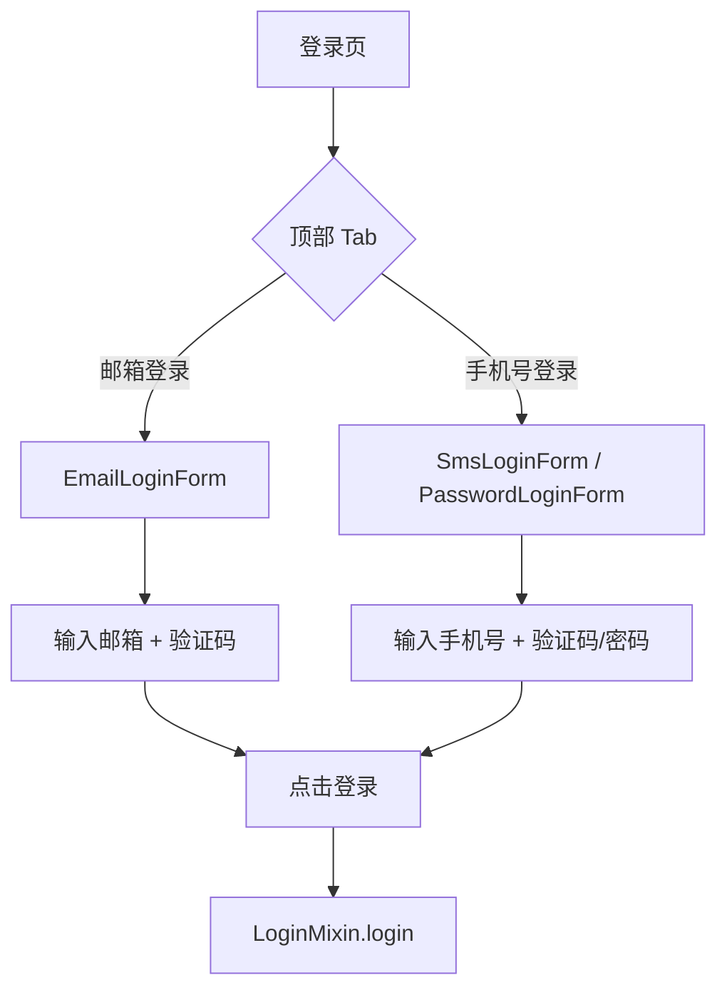
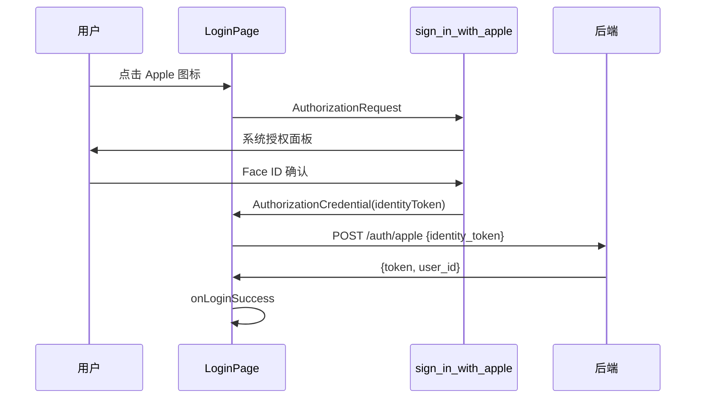

# 认证增强（Apple 登录 + 邮箱登录）— 前端设计报告

> 关联设计：[auth v0.0.4 后端设计](../server/design.md) | [auth v0.0.4 接口文档](../api/email_auth/doc/00_link.md)

## 1. 目标

- 登录页顶部增加 Tab 切换：「邮箱登录」|「手机号登录」
- 邮箱 Tab 下支持验证码登录和密码登录（复用底部"其他登录方式"切换）
- 底部"其他登录方式"增加 Apple 登录图标（仅 iOS 显示）
- Apple 登录使用 sign_in_with_apple 插件

## 2. 现状分析

### 已有能力

| 能力 | 位置 | 说明 |
|------|------|------|
| LoginMixin | login_mixin.dart | 管理 mode（sms/password）、agreed、isLoading |
| SmsLoginStrategy | strategy/sms_login_strategy.dart | 手机号 + 验证码 |
| PasswordLoginStrategy | strategy/password_login_strategy.dart | 手机号 + 密码 |
| LoginPage | login_page.dart | 表单 + 协议 + 登录按钮 + 其他方式 |
| SmsLoginForm | components/sms_login_form.dart | 手机号输入 + 验证码输入 |
| PasswordLoginForm | components/password_login_form.dart | 手机号 + 密码输入 |
| AuthRepository | data/auth_repository.dart | sendSms + login + loginWithGithub |

### 需要新增/修改

| 改动 | 说明 |
|------|------|
| 顶部 Tab | 「邮箱登录」「手机号登录」两个 Tab |
| EmailLoginForm | 邮箱 + 验证码表单（类似 SmsLoginForm） |
| EmailLoginStrategy | 邮箱验证码策略（sendEmailCode + login type=email） |
| LoginMixin 扩展 | 新增 emailStrategy + Tab 状态 |
| AuthRepository 扩展 | 新增 sendEmailCode 方法 |
| Apple 登录 | sign_in_with_apple 插件 + loginWithApple 方法 |

## 3. 数据模型与接口

### 前端调用的接口

| 接口 | 方法 | 说明 |
|------|------|------|
| POST /auth/email/code | AuthRepository.sendEmailCode(email) | 发送邮箱验证码 |
| POST /auth/login | AuthRepository.login(email, code, 'email') | 邮箱验证码/密码登录 |
| POST /auth/apple | AuthRepository.loginWithApple(identityToken) | Apple 登录 |

### 新增 Strategy

```dart
class EmailLoginStrategy extends LoginStrategy {
  final TextEditingController emailCtrl;
  final TextEditingController codeCtrl;
  int countdown = 0;

  bool get isEmailValid; // 包含 @ 和 .
  bool get isValid;      // email 有效 + code 非空
  bool get canSendCode;  // countdown <= 0

  Future<void> sendCode();  // 调用 AuthRepository.sendEmailCode
  Future<LoginResult> login(AuthRepository repo, {DeviceInfo? deviceInfo});
}
```

## 4. 核心流程

### 登录页 Tab 切换



### Tab 与 Mode 的关系

| Tab | 默认 Mode | 底部切换 |
|-----|-----------|---------|
| 邮箱登录 | email（验证码） | 切换为密码登录（复用 PasswordLoginForm，但 identifier 改为邮箱） |
| 手机号登录 | sms（验证码） | 切换为密码登录 |

简化方案：底部"其他登录方式"里的"密码登录/验证码登录"切换保持不变，Tab 切换时重置 mode。

### Apple 登录流程



## 5. 项目结构与技术决策

### 新增/修改文件

```
client/modules/flash_auth/lib/src/
├── logic/login/
│   ├── login_mixin.dart              # 修改：新增 Tab 状态 + emailStrategy
│   └── strategy/
│       └── email_login_strategy.dart  # 新建：邮箱验证码策略
├── view/
│   ├── login_page.dart               # 修改：顶部 Tab + Apple 图标
│   └── components/
│       └── email_login_form.dart      # 新建：邮箱 + 验证码表单
└── data/
    └── auth_repository.dart           # 修改：新增 sendEmailCode + loginWithApple
```

### 技术决策

| 决策 | 方案 | 理由 |
|------|------|------|
| Tab 实现 | 自定义 Row + GestureDetector + 下划线指示器 | 轻量，不需要 TabBar + TabBarView 的重量级方案 |
| 邮箱表单 | 新建 EmailLoginForm（类似 SmsLoginForm） | 输入框不同（邮箱 vs 手机号），独立组件更清晰 |
| Apple 登录 | sign_in_with_apple 插件 | Flutter 官方推荐，iOS 原生集成 |
| Tab 状态 | LoginMixin 新增 enum LoginTab { email, phone } | 和 LoginMode 独立，Tab 控制大类，Mode 控制子类 |

### 新增依赖

| 依赖 | 用途 | 版本 |
|------|------|------|
| sign_in_with_apple | Apple 登录 SDK | ^6.1.0 |

## 6. 验收标准

| 验收条件 | 验收方式 |
|----------|----------|
| 编译通过 | `flutter analyze` 零错误 |
| Tab 切换正常 | 点击「邮箱登录」「手机号登录」切换表单 |
| 邮箱验证码发送 | 输入邮箱，点击获取验证码，toast 提示成功 |
| 邮箱验证码登录 | 输入验证码，点击登录，进入主页 |
| 频率限制提示 | 60 秒内重复点击，toast 提示 |
| Apple 登录（iOS） | 点击 Apple 图标，系统弹窗授权，登录成功 |
| 协议校验 | 未勾选时点击获取验证码/Apple 登录，toast 提示 |

## 7. 暂不实现

| 功能 | 理由 |
|------|------|
| 邮箱密码登录的独立表单 | 复用底部"密码登录"切换，phone 字段传邮箱即可 |
| Apple 登录 Android 端 | Apple 不提供 Android SDK，需要 Web 方式，复杂度高 |
| 邮箱 Tab 下的密码模式独立表单 | 当前 PasswordLoginForm 的 phone 字段可以传邮箱，无需新建 |
