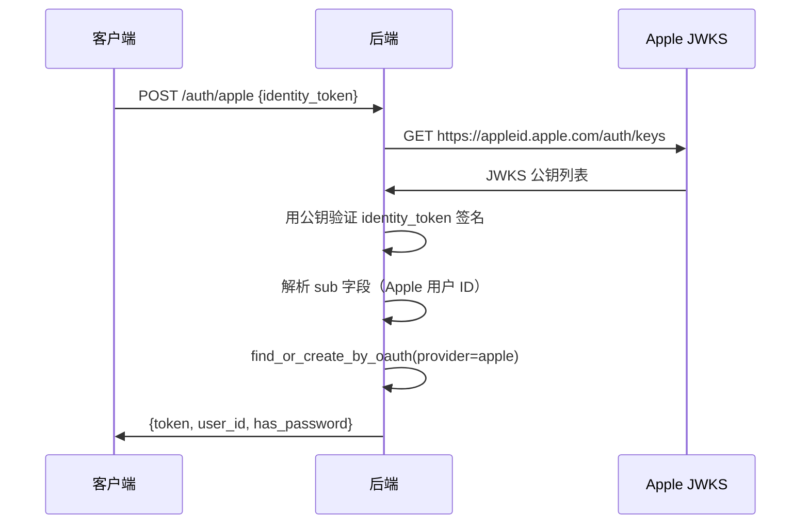
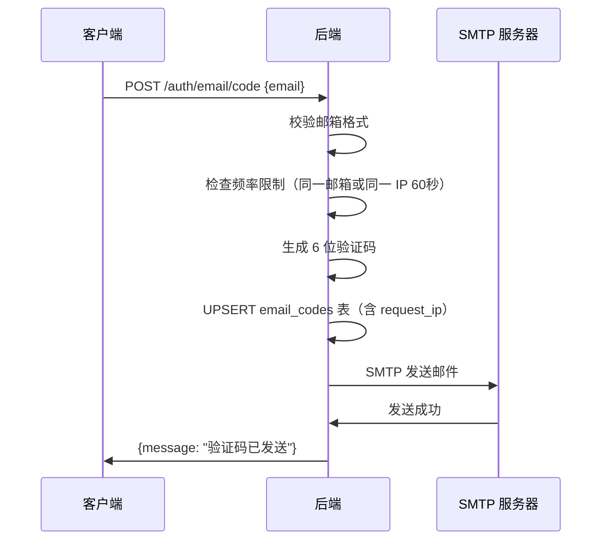
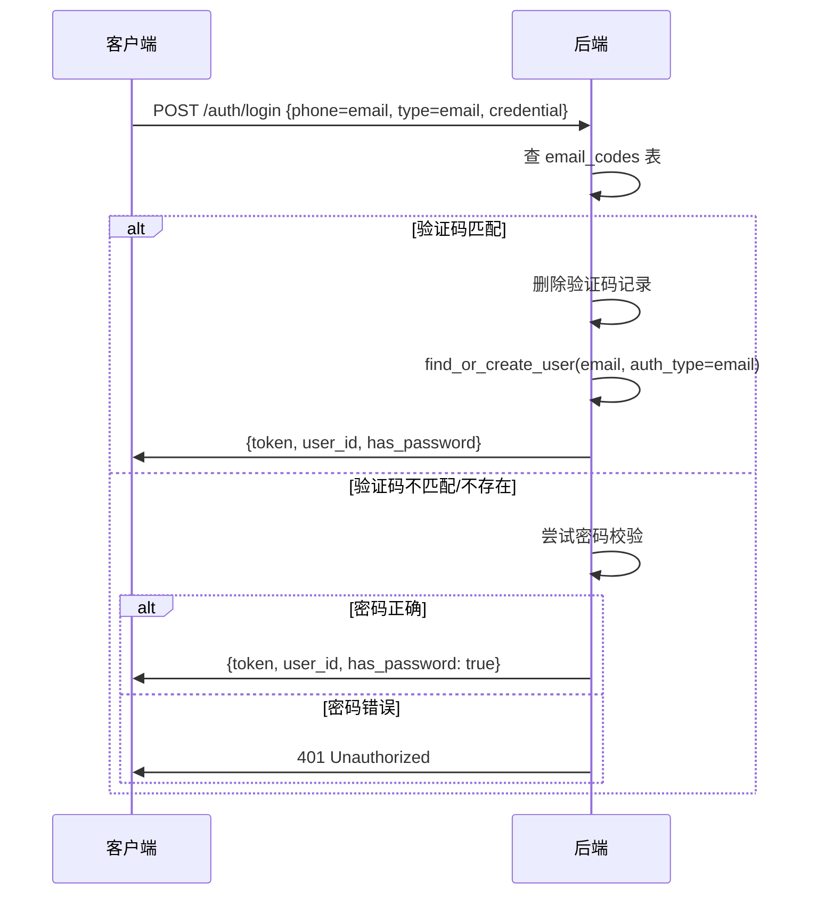

# 认证增强（Apple 登录 + 邮箱登录）— 后端设计报告

> 关联设计：[auth v0.0.4 分析](../analysis.md)

## 1. 目标

- 新增 Apple OAuth 登录（复用 OAuthProvider trait）
- 新增邮箱验证码发送（SMTP）
- 新增邮箱验证码登录 + 邮箱密码登录（复用现有 login 流程）
- 支持 `EMAIL_ENV=debug` 模式（开发时不真正发邮件）

## 2. 现状分析

### 已有能力

| 能力 | 模块 | 说明 |
|------|------|------|
| OAuthProvider trait | flash-auth/oauth | 定义 exchange_token + get_user_info |
| find_or_create_by_oauth | flash-auth/oauth | OAuth 用户查找/创建 |
| GitHub OAuth | flash-auth/oauth/github | 已实现的 OAuth 提供商 |
| 统一登录接口 | POST /auth/login | 支持 sms + password 两种 type |
| 短信验证码 | POST /auth/sms | 生成验证码存入 sms_codes 表 |
| 登录日志 | login_log | 记录设备信息和 IP |
| 欢迎消息 | welcome | 首次登录发送 |

### 需要新增

| 能力 | 说明 |
|------|------|
| Apple OAuth Provider | 验证 identity_token（JWT 签名验证） |
| 邮件发送器 | SMTP 发送验证码邮件 |
| 邮箱验证码存储 | email_codes 表 |
| 邮箱登录 | 扩展 LoginType 支持 email |
| 频率限制 | 同一邮箱 60 秒内只能发一次 |

## 3. 数据模型与接口

### 数据模型

#### email_codes 表（新建）

```sql
CREATE TABLE IF NOT EXISTS verify_codes (
    identifier  VARCHAR(255) NOT NULL,
    channel     VARCHAR(10) NOT NULL,
    scene       VARCHAR(20) NOT NULL DEFAULT 'login',
    code        VARCHAR(6) NOT NULL,
    status      SMALLINT NOT NULL DEFAULT 0,
    expires_at  TIMESTAMPTZ NOT NULL,
    request_ip  VARCHAR(45),
    sender      VARCHAR(255),
    created_at  TIMESTAMPTZ NOT NULL DEFAULT NOW(),
    PRIMARY KEY (identifier, channel, scene)
);
```

| 决策 | 理由 |
|------|------|
| 统一 verify_codes 表替代 sms_codes + email_codes | 避免每种验证方式建一张表，结构完全重复 |
| channel 区分通道（sms/email） | 同一 identifier 不同通道各自独立 |
| scene 区分场景（login/reset_password/bind） | 同一邮箱不同场景互不干扰 |
| status（0=待验证 1=已使用 2=已过期） | 不删除记录，保留审计轨迹 |
| sender 记录发送方邮箱 | 统计每日发送量，便于多邮箱切换 |
| 有效期 5 分钟 | 安全性与用户体验的平衡 |
| request_ip 记录请求来源 | 用于 IP 维度频率限制 |

#### auth_credentials 表（已有，无需修改）

邮箱登录复用现有 `auth_credentials` 表：
- `auth_type = 'email'`，`identifier = 邮箱地址`
- `auth_type = 'apple'`，`identifier = Apple sub（用户唯一 ID）`

### 接口契约

#### 接口一览

| 方法 | 路径 | 说明 |
|------|------|------|
| POST | /auth/apple | Apple OAuth 登录 |
| POST | /auth/email/code | 发送邮箱验证码 |
| POST | /auth/login | 统一登录（扩展 type=email） |

#### POST /auth/apple

请求：
```json
{
  "identity_token": "eyJhbGciOiJSUzI1NiI...",
  "device_info": { "platform": "ios", "device_name": "iPhone 15" }
}
```

响应（200）：
```json
{
  "token": "jwt...",
  "user_id": 12345,
  "has_password": false
}
```

错误：
- 401：identity_token 无效或验证失败

#### POST /auth/email/code

请求：
```json
{
  "email": "user@example.com"
}
```

响应（200）：
```json
{
  "message": "验证码已发送"
}
```

debug 模式额外返回（方便开发调试）：
```json
{
  "code": "123456",
  "message": "验证码已发送(debug)"
}
```

错误：
- 400：邮箱格式无效
- 429：发送过于频繁（同一邮箱或同一 IP 60 秒内已发送）

#### POST /auth/login（扩展）

新增 `type: "email"`：
```json
{
  "phone": "user@example.com",
  "type": "email",
  "credential": "123456",
  "device_info": {}
}
```

| 决策 | 理由 |
|------|------|
| 复用 phone 字段传邮箱 | 避免改动 LoginRequest 结构，前端也只需改传值 |
| type=email 时 credential 可以是验证码或密码 | 后端先查验证码表，没有再尝试密码校验 |

> 后续如果觉得 phone 字段语义不清，可以重命名为 identifier，但当前阶段保持兼容。

## 4. 核心流程

### Apple 登录流程



验证逻辑：
1. 从 Apple JWKS 端点获取公钥（可缓存）
2. 用 `jsonwebtoken` crate 验证 identity_token 的 RS256 签名
3. 校验 iss = `https://appleid.apple.com`
4. 校验 aud = 你的 Bundle ID（`com.toly1994.flashIm`）
5. 提取 sub 字段作为 provider_id

### 邮箱验证码发送流程



### 邮箱登录流程



## 5. 项目结构与技术决策

### 新增/修改文件

```
server/modules/flash-auth/src/
├── oauth/
│   ├── mod.rs              # 修改：pub mod apple
│   ├── github.rs           # 不变
│   └── apple.rs            # 新建：Apple OAuth Provider
├── email/
│   ├── mod.rs              # 新建：模块入口
│   └── sender.rs           # 新建：SMTP 邮件发送器
├── handler.rs              # 修改：新增 apple_login + send_email_code + 扩展 login
├── model.rs                # 修改：扩展 LoginType + 新增 EmailCodeRequest + AppleLoginRequest
└── routes.rs               # 修改：新增路由

server/migrations/
└── 20260524_011_email_codes.sql  # 新建：email_codes 表

server/.env                 # 修改：新增 SMTP + Apple 配置
```

### 技术决策

| 决策 | 方案 | 理由 |
|------|------|------|
| 邮件发送 | lettre crate | Rust 生态最成熟的 SMTP 库，支持 TLS |
| Apple token 验证 | jsonwebtoken crate（已有） | 项目已依赖，直接用 RS256 验证 |
| Apple 公钥获取 | reqwest 请求 JWKS | 项目已依赖 reqwest |
| 验证码存储 | email_codes 表（同 sms_codes 模式） | 保持一致性 |
| debug 模式 | EMAIL_ENV 环境变量 | 开发时不依赖真实 SMTP |

### 新增依赖

| 依赖 | 用途 | 版本 |
|------|------|------|
| lettre | SMTP 邮件发送 | 0.11 |

### 环境变量新增

```env
# 邮箱验证码
EMAIL_ENV=debug
EMAIL_USERNAME=1981462002@qq.com
EMAIL_PASSWORD=your_smtp_auth_code
EMAIL_SMTP_HOST=smtp.qq.com

# Apple 登录
APPLE_BUNDLE_ID=com.toly1994.flashIm
```

## 6. 验收标准

| 验收条件 | 验收方式 |
|----------|----------|
| 编译通过 | `cargo build` |
| email_codes 表创建成功 | 数据库迁移 |
| 邮箱验证码发送（debug 模式） | POST /auth/email/code 返回 code |
| 邮箱验证码发送（release 模式） | 收到邮件 |
| 邮箱验证码登录成功 | POST /auth/login type=email 返回 token |
| 邮箱密码登录成功 | 设置密码后用密码登录 |
| 频率限制生效 | 60 秒内重复请求返回 429 |
| Apple 登录成功 | POST /auth/apple 返回 token |
| 首次登录发欢迎消息 | 新用户收到闪讯团队消息 |
| 登录日志记录 | login_logs 表有记录 |

## 7. 暂不实现

| 功能 | 理由 |
|------|------|
| 邮箱绑定（已有用户绑定邮箱） | 需要设计绑定流程和冲突处理，后续版本 |
| 邮箱找回密码 | 需要独立的重置密码流程，后续版本 |
| Apple 公钥缓存 | 首版每次请求 JWKS，后续可加 TTL 缓存 |
| 邮件模板美化 | 首版纯文本，后续可用 HTML 模板 |
