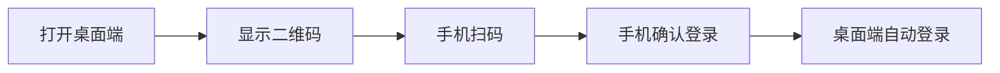
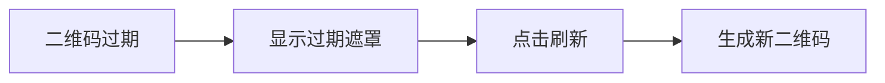
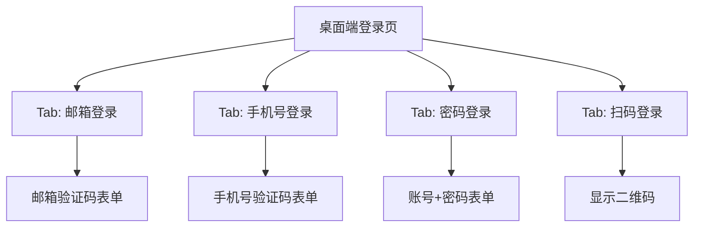
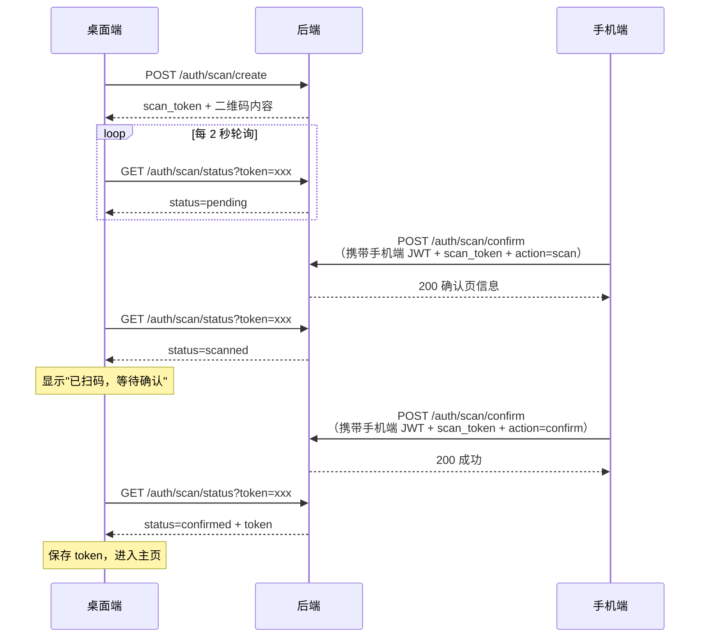
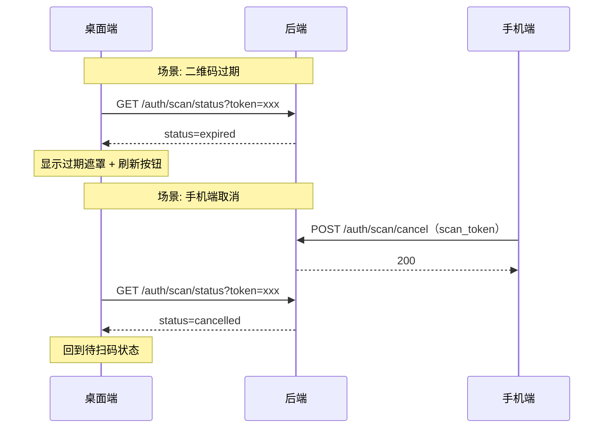

# 桌面端扫码登录 — 功能分析

## 概述

桌面端（Windows/macOS）登录体验优化：去除三方登录入口（GitHub/Apple），新增手机扫码登录。用户在桌面端看到二维码，用已登录的手机端扫码确认，桌面端自动完成登录。

---

## 一、交互链

### 场景 1：桌面端扫码登录

**用户故事**：作为桌面端用户，我想用手机扫码快速登录，以便不用输入账号密码。

用户打开桌面端闪讯，登录页显示二维码（默认 Tab）。用户打开手机端闪讯，进入扫一扫页面，扫描桌面端二维码。手机端弹出确认页面，显示"即将登录桌面端"，用户点击确认。桌面端二维码消失，自动进入主页。

### 场景 2：二维码过期刷新

**用户故事**：作为桌面端用户，我想在二维码过期后能一键刷新，以便重新扫码。

二维码有效期 5 分钟。过期后桌面端显示"二维码已过期"遮罩和刷新按钮。用户点击刷新，生成新二维码。

### 场景 3：桌面端登录页布局

**用户故事**：作为桌面端用户，我想看到简洁的登录界面，按需选择登录方式。

桌面端登录页提供四个 Tab：邮箱登录、手机号登录（如果平台支持短信）、密码登录、扫码登录。移除 GitHub 和 Apple 登录入口。移动端登录页保持不变。

---

## 二、逻辑树

### 事件流：扫码登录全流程

| 时刻 | 事件 | 处理 | 产生的新事件 |
|------|------|------|-------------|
| T1 | 桌面端请求二维码 | 后端生成 scan_token（UUID），存入 scan_sessions 表，状态=pending，有效期 5 分钟 | 返回 scan_token + 二维码内容 |
| T2 | 桌面端开始轮询 | 每 2 秒 GET /auth/scan/status?token=xxx | - |
| T3 | 手机端扫码 | 后端校验 scan_token 有效且状态=pending，更新状态=scanned，记录 user_id | 返回确认页信息 |
| T4 | 桌面端轮询感知 | 状态变为 scanned | 桌面端显示"已扫码，等待确认" |
| T5 | 手机端确认登录 | 后端校验状态=scanned，生成 JWT token，更新状态=confirmed | 返回成功 |
| T6 | 桌面端轮询感知 | 状态变为 confirmed，响应中携带 token | 桌面端保存 token，进入主页 |

### 事件流：异常场景

| 时刻 | 事件 | 处理 | 产生的新事件 |
|------|------|------|-------------|
| T-err1 | 二维码过期（5 分钟） | 轮询返回 expired | 桌面端显示过期遮罩 |
| T-err2 | 手机端扫码但不确认 | 超时后 scan_session 过期 | 桌面端显示过期 |
| T-err3 | 手机端取消确认 | 后端更新状态=cancelled | 桌面端回到待扫码状态 |

### 状态流转

| 实体 | 触发事件 | 前状态 | 后状态 |
|------|---------|--------|--------|
| scan_session | 桌面端请求二维码 | 不存在 | pending |
| scan_session | 手机端扫码 | pending | scanned |
| scan_session | 手机端确认 | scanned | confirmed |
| scan_session | 手机端取消 | scanned | cancelled |
| scan_session | 超时 | pending/scanned | expired |
| 桌面端 UI | 收到 scanned | 显示二维码 | 显示"已扫码" |
| 桌面端 UI | 收到 confirmed + token | 显示"已扫码" | 进入主页 |
| 桌面端 UI | 收到 expired | 显示二维码 | 显示过期遮罩 |
| 桌面端 UI | 收到 cancelled | 显示"已扫码" | 回到显示二维码 |

---

## 三、功能编号与网络定位

### 本次新增节点

| 编号 | 功能节点 | 层级 | 简介 |
|------|---------|------|------|
| I-20 | 扫码会话管理 | 基础设施层 | 后端 scan_sessions 表 + 生成/查询/确认接口 |
| P-66 | 桌面端扫码登录页 | 前端业务层 | 桌面端二维码展示 + 轮询状态 + 自动登录 |
| P-67 | 手机端扫码确认页 | 前端业务层 | 手机扫码后的确认/取消交互 |

### 前置依赖

| 依赖节点 | 依赖方式 | 是否已有 |
|----------|---------|---------|
| I-03 Token 签发与验证 | 确认后签发 JWT | ✅ |
| F-01 登录注册页 | 桌面端登录页改造 | ✅ |
| P-27 扫码页 | 手机端扫码入口复用 | ✅ |

### 边界接口

| 接口/协议 | 定义方 | 消费方 | 说明 |
|-----------|--------|--------|------|
| POST /auth/scan/create | flash-auth | 桌面端 | 生成 scan_token，返回二维码内容 |
| GET /auth/scan/status | flash-auth | 桌面端 | 轮询扫码状态 |
| POST /auth/scan/confirm | flash-auth | 手机端 | 扫码 + 确认登录（需携带手机端 JWT） |
| POST /auth/scan/cancel | flash-auth | 手机端 | 扫码后取消 |
| scan_sessions 表 | flash-auth | 内部 | scan_token, user_id, status, expires_at |

### 二维码协议设计

手机端通过二维码内容的 URL scheme 前缀区分场景：

| 场景 | 二维码内容格式 | 手机端路由 |
|------|--------------|-----------|
| 添加好友 | `flashim://user/{user_id}` | 跳转用户资料页 |
| 扫码登录 | `flashim://scan/{scan_token}` | 跳转登录确认页 |

手机端扫码后解析 scheme，根据路径前缀分发到对应页面。

---

## 四、结论

### 开发顺序

1. 后端：scan_sessions 表 + 4 个接口（create/status/confirm/cancel）
2. 桌面端：登录页改造（去三方登录 + 扫码 Tab + 二维码展示 + 轮询）
3. 手机端：扫码确认页（扫码后跳转确认页 + 调用 confirm 接口）

### 复杂度集中点

- 轮询 vs WS 推送的选择：轮询实现简单但有延迟，WS 推送实时但桌面端未登录时没有 WS 连接。**建议用 HTTP 轮询**，因为扫码场景发生在登录前，此时没有 WS 连接。
- 二维码内容设计：包含 scan_token，手机端扫码后解析 scheme 路由到确认页。

### 暂不实现

- 扫码登录的设备信息记录（后续可加）
- 多端同时扫码冲突处理（scan_token 一对一，天然互斥）
