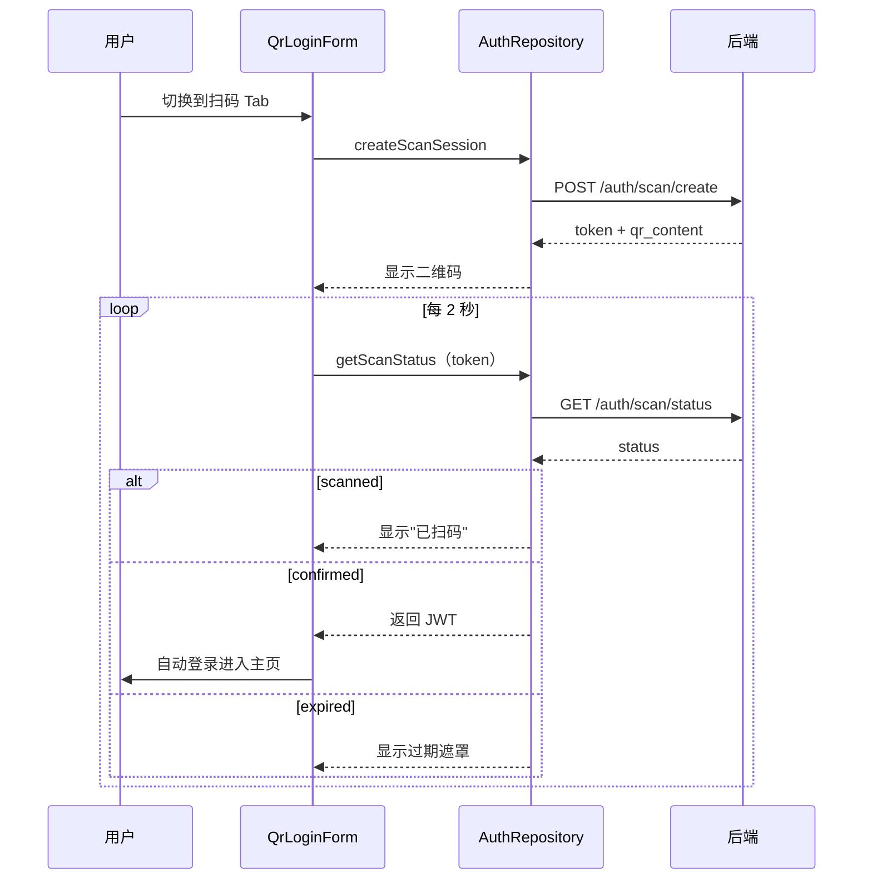
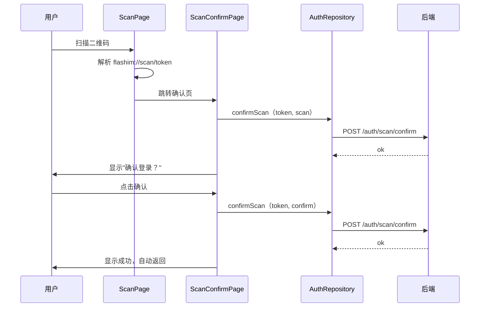

# Auth — 前端设计报告（桌面端扫码登录）

> 关联设计：[auth v0.0.5 server design](../server/design.md) | [auth v0.0.5 analysis](../analysis.md)

## 1. 目标

- 桌面端登录页改为四 Tab：邮箱登录、手机号登录（如果支持）、密码登录、扫码登录
- 桌面端去除三方登录入口（GitHub/Apple）
- 新增扫码登录 Tab：展示二维码 + 轮询状态 + 自动登录
- 手机端扫码页支持识别 `flashim://scan/{token}` 格式，跳转确认页
- 新增扫码确认页：显示确认/取消按钮

## 2. 现状分析

### 已有能力

- `LoginPage`：支持 `enableSMS` 参数控制 Tab 显示
- `LoginSegmentTab`：iOS 风格 Segment 切换，当前两个 Tab（邮箱/手机号）
- `LoginMixin`：管理 Tab 切换、登录策略、加载状态
- `AuthRepository`：封装认证 HTTP 请求（dio）
- `ScanPage`（flash_im_friend 模块）：扫码识别 `flashim://user/{id}` 跳转用户资料页
- 二维码生成：需新增依赖 `qr_flutter`

### 存在的问题

- 桌面端和移动端共用同一个 LoginPage，无法区分布局
- 扫码页只识别 `flashim://user/{id}`，不支持 `flashim://scan/{token}`
- 没有扫码确认页

## 3. 数据模型与接口

### 状态类型

```dart
/// 扫码登录状态
enum ScanLoginStatus { idle, pending, scanned, confirmed, expired, cancelled, error }

/// 扫码登录状态数据
class ScanLoginState {
  final ScanLoginStatus status;
  final String? scanToken;
  final String? qrContent;
  final DateTime? expiresAt;
  final String? errorMessage;
}
```

### Repository 新增方法

```dart
// AuthRepository 新增：
Future<ScanCreateResult> createScanSession();
Future<ScanStatusResult> getScanStatus(String token);
Future<void> confirmScan(String scanToken, String action);
Future<void> cancelScan(String scanToken);
```

### 接口调用

| 方法 | 接口 | 说明 |
|------|------|------|
| createScanSession | POST /auth/scan/create | 桌面端创建会话 |
| getScanStatus | GET /auth/scan/status?token=xxx | 桌面端轮询 |
| confirmScan | POST /auth/scan/confirm | 手机端扫码/确认 |
| cancelScan | POST /auth/scan/cancel | 手机端取消 |

## 4. 核心流程

### 桌面端扫码登录流程



### 手机端扫码确认流程



## 5. 项目结构与技术决策

### 项目结构

```
client/modules/flash_auth/lib/src/
├── data/
│   └── auth_repository.dart          # 修改：新增 4 个扫码方法
├── logic/
│   └── login/
│       └── login_mixin.dart          # 修改：LoginTab 枚举新增 scan/password
├── view/
│   ├── login_page.dart               # 修改：桌面端四 Tab + 去三方登录
│   ├── components/
│   │   ├── login_segment_tab.dart    # 修改：支持四 Tab
│   │   ├── qr_login_form.dart        # 新建：二维码展示 + 轮询 + 状态切换
│   │   └── other_login_row.dart      # 修改：桌面端隐藏三方登录
│   └── ...

client/modules/flash_im_friend/lib/src/
├── view/
│   ├── scan_page.dart                # 修改：支持 flashim://scan/{token} 路由
│   └── scan_confirm_page.dart        # 新建：扫码确认页
```

### 职责划分

| 文件 | 职责 |
|------|------|
| qr_login_form.dart | 纯 UI：二维码展示、状态文字、过期遮罩、刷新按钮。轮询逻辑内聚在此组件（Timer） |
| auth_repository.dart | 数据层：HTTP 请求封装 |
| login_mixin.dart | 状态管理：Tab 切换逻辑 |
| scan_confirm_page.dart | 纯 UI：确认/取消按钮 + 调用 repository |
| scan_page.dart | 路由分发：根据 scheme 跳转不同页面 |

### 技术决策

| 决策 | 方案 | 理由 |
|------|------|------|
| 二维码生成 | qr_flutter 包 | Flutter 生态最成熟的 QR 生成库 |
| 轮询实现 | Timer.periodic（2 秒） | 简单可靠，组件 dispose 时取消 |
| 桌面端判断 | `Platform.isWindows \|\| Platform.isMacOS \|\| Platform.isLinux` | 区分桌面端和移动端布局 |
| Tab 数量 | 桌面端四 Tab，移动端保持不变 | 桌面端不支持三方登录，用扫码替代 |
| scheme | `flashim://scan/{token}` | 与现有 `flashim://user/{id}` 保持一致前缀 |

### 第三方依赖

| 依赖 | 用途 | 已有/需新增 |
|------|------|------------|
| qr_flutter | 生成二维码 Widget | 需新增 |
| mobile_scanner | 扫码（已有） | 已有（flash_im_friend） |
| dio | HTTP 请求 | 已有 |
| dart:async (Timer) | 轮询 | 内置 |

## 6. 验收标准

| 验收条件 | 验收方式 |
|----------|----------|
| flutter analyze 零错误 | `flutter analyze` |
| 桌面端登录页显示四 Tab | Windows/macOS 运行查看 |
| 桌面端无三方登录按钮 | 视觉确认 |
| 扫码 Tab 显示二维码 | 视觉确认 |
| 手机扫码后桌面端显示"已扫码" | 双端联调 |
| 手机确认后桌面端自动登录 | 双端联调 |
| 二维码过期后显示刷新按钮 | 等待 5 分钟 |
| 手机取消后桌面端回到二维码 | 双端联调 |

## 7. 暂不实现

| 功能 | 理由 |
|------|------|
| 桌面端动画过渡 | 先保证功能正确，后续优化 |
| 扫码登录记住设备 | 后续版本 |
| 二维码倒计时显示 | 简化实现，过期后直接显示刷新 |
