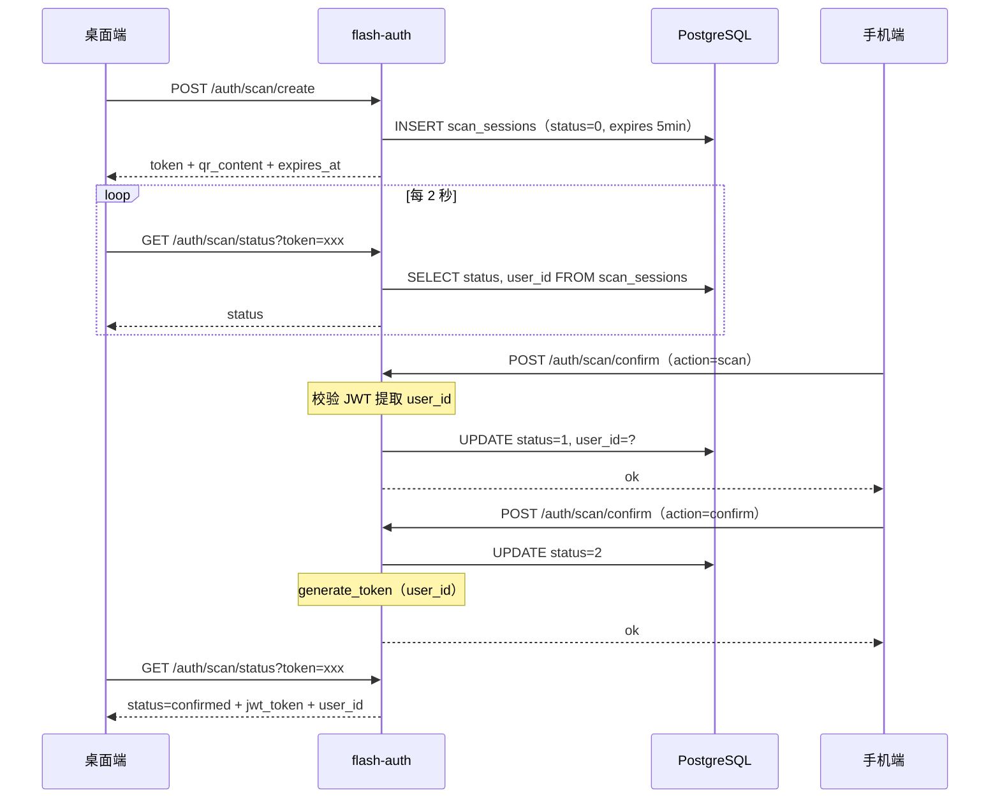

# Auth — 后端设计报告（扫码登录）

> 关联设计：[auth v0.0.5 analysis](../analysis.md)

## 1. 目标

- 新增扫码登录会话管理：创建、查询状态、确认、取消
- 桌面端通过 HTTP 轮询获取扫码状态
- 手机端通过已有 JWT 鉴权后确认登录，为桌面端签发 token

## 2. 现状分析

- flash-auth 模块已有：手机号登录、邮箱登录、GitHub OAuth、Apple OAuth
- JWT 签发（`generate_token`）和验证（`extract_user_id`）已就绪
- 路由注册模式：`routes.rs` 中集中注册，handler 函数在 `handler.rs`
- 数据库：PostgreSQL，sqlx 直接查询

## 3. 数据模型与接口

### 数据模型

```sql
CREATE TABLE IF NOT EXISTS scan_sessions (
    token       VARCHAR(36) PRIMARY KEY,        -- UUID
    status      SMALLINT NOT NULL DEFAULT 0,    -- 0=pending 1=scanned 2=confirmed 3=cancelled
    user_id     BIGINT,                         -- 扫码用户 ID（scanned 后填入）
    expires_at  TIMESTAMPTZ NOT NULL,
    created_at  TIMESTAMPTZ NOT NULL DEFAULT NOW()
);
```

| 决策 | 理由 |
|------|------|
| token 用 UUID 做主键 | 无序、不可猜测、无需自增 |
| status 用 SMALLINT | 状态有限（4 种），节省空间 |
| 不建索引 | 单条主键查询，无需额外索引 |
| 有效期 5 分钟 | 安全性与用户体验的平衡 |

### 接口契约

#### POST /auth/scan/create

创建扫码会话，返回二维码内容。

请求：无 body

响应：
```json
{
  "token": "550e8400-e29b-41d4-a716-446655440000",
  "qr_content": "flash://scan/550e8400-e29b-41d4-a716-446655440000",
  "expires_at": "2026-05-28T12:05:00Z"
}
```

#### GET /auth/scan/status?token=xxx

桌面端轮询扫码状态。

响应（根据状态不同）：
```json
// pending
{ "status": "pending" }

// scanned
{ "status": "scanned" }

// confirmed — 携带 token
{ "status": "confirmed", "token": "jwt...", "user_id": 123 }

// expired
{ "status": "expired" }

// cancelled
{ "status": "cancelled" }
```

错误：
- 400：token 参数缺失
- 404：token 不存在

#### POST /auth/scan/confirm

手机端扫码/确认。需要 Authorization header（手机端 JWT）。

请求：
```json
{
  "scan_token": "550e8400-e29b-41d4-a716-446655440000",
  "action": "scan"  // "scan" 或 "confirm"
}
```

响应：
```json
{ "message": "ok" }
```

逻辑：
- action=scan：校验 token 状态为 pending，更新为 scanned，记录 user_id
- action=confirm：校验 token 状态为 scanned 且 user_id 匹配，更新为 confirmed，为桌面端生成 JWT

错误：
- 401：未携带有效 JWT
- 400：scan_token 无效或已过期
- 409：状态不匹配（如已被其他人扫码）

#### POST /auth/scan/cancel

手机端取消。需要 Authorization header。

请求：
```json
{
  "scan_token": "550e8400-e29b-41d4-a716-446655440000"
}
```

响应：
```json
{ "message": "ok" }
```

逻辑：校验 token 状态为 scanned 且 user_id 匹配，更新为 cancelled。

## 4. 核心流程



## 5. 项目结构与技术决策

### 项目结构

```
server/modules/flash-auth/src/
├── handler.rs          # 修改：新增 scan_create, scan_status, scan_confirm, scan_cancel
├── model.rs            # 修改：新增 Scan 相关请求/响应结构体
├── routes.rs           # 修改：注册 4 个新路由
├── jwt.rs              # 不变
├── ...
server/migrations/
└── 20260528_013_scan_sessions.sql   # 新建：建表
```

### 技术决策

| 决策 | 方案 | 理由 |
|------|------|------|
| 通信方式 | HTTP 轮询 | 扫码发生在登录前，无 WS 连接 |
| token 生成 | uuid crate | Rust 生态标准 UUID 库 |
| 过期检测 | 查询时判断 expires_at | 无需后台定时任务，简单可靠 |
| handler 组织 | 直接加在 handler.rs | 4 个函数不多，不需要拆文件 |

### 第三方依赖

| 依赖 | 用途 | 已有/需新增 |
|------|------|------------|
| uuid | 生成 scan_token | 需新增 |
| axum | 路由 + 提取器 | 已有 |
| sqlx | 数据库操作 | 已有 |
| chrono | 时间处理 | 已有 |

## 6. 验收标准

| 验收条件 | 验收方式 |
|----------|----------|
| 编译通过 | `cargo build` |
| create 接口返回有效 token 和二维码内容 | curl 测试 |
| status 接口正确返回各状态 | curl 测试 |
| confirm（action=scan）更新状态为 scanned | curl + 数据库查询 |
| confirm（action=confirm）签发 JWT 并更新状态 | curl 测试 |
| cancel 接口正确回退状态 | curl 测试 |
| 过期 token 返回 expired | 等待 5 分钟后 curl |
| 未授权请求返回 401 | curl 不带 JWT |

## 7. 暂不实现

| 功能 | 理由 |
|------|------|
| 设备信息记录 | 后续版本可在 scan_sessions 加 device_info 列 |
| 过期会话清理 | 数据量小，暂不需要定时清理 |
| WS 推送扫码状态 | 登录前无 WS 连接，轮询足够 |
