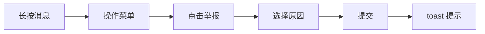
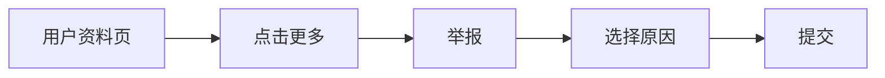
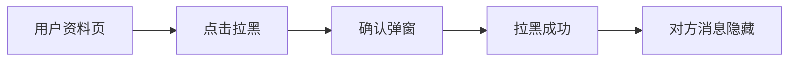
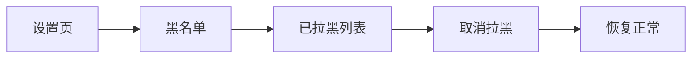
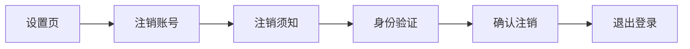

# iOS 合规：UGC 安全 + 账号注销 — 功能分析

## 概述

Apple 审核拒绝（2026-06-10），涉及三条条款：

1. **Guideline 1.2** — UGC 安全：缺少举报、拉黑、内容过滤机制
2. **Guideline 5.1.1(v)** — 账号注销：不能只引导发邮件，必须应用内直接完成
3. **Guideline 2.3.6** — 年龄分级：需在 App Store Connect 勾选 "User-Generated Content"（纯后台配置，不涉及代码）

本次迭代解决条款 1 和 2 的代码需求，条款 3 仅需 App Store Connect 后台操作。

---

## 一、交互链

### 场景 1：举报消息

**用户故事**：作为闪讯用户，我看到不当内容时，可以长按消息进行举报，让平台处理。

长按消息 → 弹出操作菜单 → 点击「举报」→ 选择举报原因（色情/暴力/骚扰/诈骗/其他）→ 可选补充说明 → 提交 → toast "举报已提交" → 服务端记录。

### 场景 2：举报用户

**用户故事**：作为闪讯用户，我在对方资料页可以举报该用户。

打开用户资料页 → 点击右上角「...」→ 选择「举报」→ 选择原因 → 提交。

### 场景 3：拉黑用户

**用户故事**：作为闪讯用户，我可以拉黑某人，拉黑后看不到对方消息，对方也无法给我发消息。

用户资料页 → 点击「...」→ 选择「拉黑」→ 确认弹窗 → 拉黑成功 → 对方消息从我的列表中隐藏。

### 场景 4：取消拉黑

**用户故事**：作为闪讯用户，我可以在设置中查看黑名单并取消拉黑。

设置 → 黑名单 → 列出已拉黑用户 → 点击「取消拉黑」→ 恢复正常。

### 场景 5：账号注销

**用户故事**：作为闪讯用户，我可以在设置中直接注销账号，无需发邮件。

设置 → 注销账号 → 阅读注销须知 → 输入密码/验证码确认身份 → 点击"确认注销" → 服务端直接删除数据 → 自动退出登录。

### 场景 6：用户协议展示

**用户故事**：Apple 要求注册前展示用户协议/EULA，明确 UGC 规范。

注册页/登录页底部 → 显示「注册即表示同意《用户协议》和《隐私政策》」→ 可点击查看全文。

> 当前已有隐私协议弹窗（P-56），需确认是否含 UGC 条款。如不含需补充。

---

## 二、逻辑树

### 事件流：举报

| 时刻 | 事件 | 处理 | 产生的新事件 |
|------|------|------|-------------|
| T1 | 用户点击举报 | 弹出举报原因选择 Sheet | UI 事件 |
| T2 | 提交举报 | POST /api/reports | HTTP 请求 |
| T3 | 服务端接收 | 写入 reports 表（reporter_id, target_type, target_id, reason, description, status=pending） | 数据库写入 |
| T4 | 返回成功 | toast "举报已提交，我们会在 24 小时内处理" | UI 反馈 |

### 事件流：拉黑

| 时刻 | 事件 | 处理 | 产生的新事件 |
|------|------|------|-------------|
| T1 | 用户点击拉黑 | 确认弹窗 | UI 事件 |
| T2 | 确认拉黑 | POST /api/blocks | HTTP 请求 |
| T3 | 服务端处理 | 写入 user_blocks 表 + 解除好友关系（可选） | 数据库写入 |
| T4 | 返回成功 | 本地隐藏该用户的消息/会话 | 状态更新 |
| T5 | 对方发消息 | 服务端检查 block 关系 → 拒绝投递 | 消息拦截 |

### 事件流：账号注销

| 时刻 | 事件 | 处理 | 产生的新事件 |
|------|------|------|-------------|
| T1 | 点击注销 | 展示注销须知页面 | UI 事件 |
| T2 | 身份验证 | 输入密码/验证码确认 | 校验请求 |
| T3 | 确认注销 | POST /api/account/delete | HTTP 请求 |
| T4 | 服务端处理 | 删除用户相关数据 + 标记 accounts.status=2 | 数据清理 |
| T5 | 返回成功 | 清除本地数据 + token → 跳转登录页 | 登出流程 |

### 状态流转

| 实体 | 触发事件 | 前状态 | 后状态 |
|------|---------|--------|--------|
| 举报记录 | 用户提交 | — | pending |
| 举报记录 | 管理员处理 | pending | resolved / rejected |
| 拉黑关系 | 用户拉黑 | — | blocked |
| 拉黑关系 | 取消拉黑 | blocked | — (删除记录) |
| 用户账号 | 注销请求 | active | deleted |

---

## 三、功能编号与网络定位

### 本次新增节点

| 编号 | 功能节点 | 层级 | 模块 | 简介 |
|------|---------|------|------|------|
| D-43 | 举报系统 | 后端领域 | flash-user (reports) | 举报消息/用户，存储举报记录 |
| D-44 | 拉黑系统 | 后端领域 | flash-user (blocks) | 拉黑/取消拉黑 + 消息投递拦截 |
| D-45 | 账号注销 | 后端领域 | flash-auth (account) | 软删除 + 7 天后真删 + 撤销机制 |
| P-76 | 举报页面 | 前端业务 | flash_im_chat + flash_im_friend | 举报原因选择 + 提交 |
| P-77 | 拉黑功能 | 前端业务 | flash_im_friend (user_profile) | 拉黑/取消拉黑 + 黑名单页 |
| P-78 | 账号注销页 | 前端业务 | home/profile (delete_account) | 注销须知 + 身份验证 + 确认 |

### 前置依赖

| 依赖节点 | 依赖方式 | 是否已有 |
|----------|---------|---------|
| I-02 手机号登录 | 身份验证（密码校验） | ✅ |
| I-19 邮箱登录 | 身份验证（验证码） | ✅ |
| I-05 WS 连接管理 | 拉黑后消息拦截 | ✅ (需扩展 dispatcher 逻辑) |
| D-06 消息存储 | 拉黑后拒绝存储 | ✅ (需加 block 检查) |
| D-15 好友关系 | 拉黑时解除好友 | ✅ |
| P-48 长按菜单 | 加「举报」选项 | ✅ |
| P-57 设置页 | 加「黑名单」「注销账号」入口 | ✅ |

### 边界接口

| 接口 | 定义方 | 消费方 | 说明 |
|------|--------|--------|------|
| POST /api/reports | D-43 | P-76 | 提交举报 |
| GET /api/reports（管理端） | D-43 | 后台面板 | 查看举报列表（本期暂不做 UI） |
| POST /api/blocks | D-44 | P-77 | 拉黑用户 |
| DELETE /api/blocks/{userId} | D-44 | P-77 | 取消拉黑 |
| GET /api/blocks | D-44 | P-77 | 获取黑名单列表 |
| POST /api/account/delete | D-45 | P-78 | 发起注销 |
| POST /api/account/cancel-delete | D-45 | P-78 | 撤销注销（重新登录时） |

---

## 四、结论

- **开发顺序**：
  1. 后端：reports 表 + blocks 表 + account 软删除接口
  2. 后端：消息投递增加 block 检查
  3. 前端：举报页面（复用长按菜单 + 新增 Sheet）
  4. 前端：拉黑功能（资料页 + 黑名单页）
  5. 前端：注销账号页（替换现有"发邮件"逻辑）
  6. 用户协议补充 UGC 条款
  7. App Store Connect 勾选 "User-Generated Content"

- **复杂度集中点**：
  - 拉黑后消息拦截：需要在 WS dispatcher 和 message service 两处加检查
  - 注销后数据清理：涉及 messages / conversations / friends / groups 多表关联删除
  - 7 天撤销机制：需要定时任务或登录时检查

- **暂不实现**：
  - 管理后台举报审核 UI（通过数据库直接处理，24h 响应）
  - 内容自动过滤（敏感词）——后续版本可加
  - 拉黑后删除历史消息（只隐藏不删除，取消拉黑后恢复）
  - 注销后即时删除（保留 7 天冷静期）

- **Apple 审核录屏要求**：
  - 展示 EULA / 用户协议（注册前可见）
  - 展示举报流程（长按消息 → 举报 → 选原因 → 提交）
  - 展示拉黑流程（资料页 → 拉黑 → 确认）
