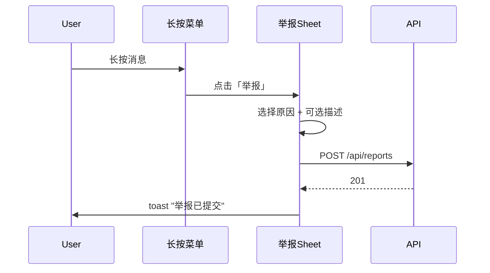
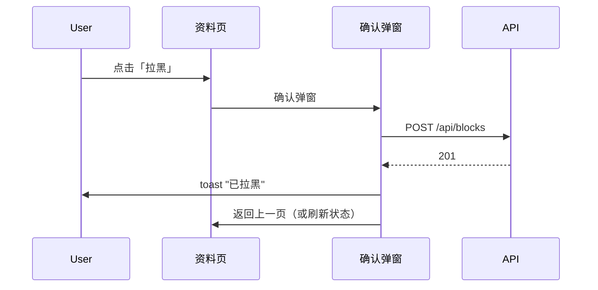
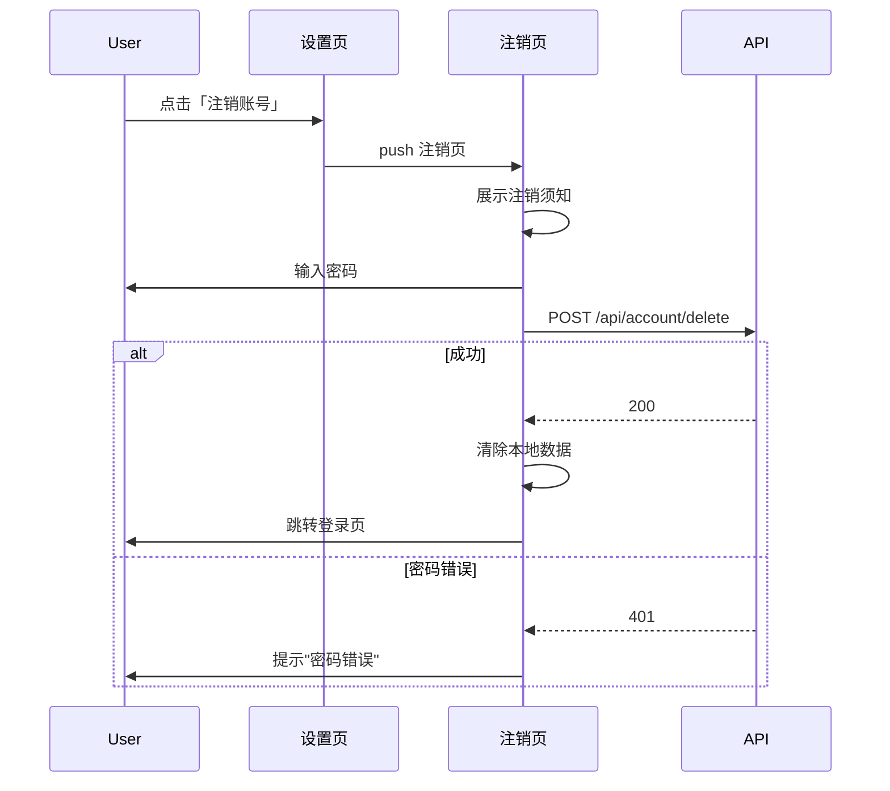

# iOS 合规 — 前端设计报告

> 关联设计：[auth v0.0.6 分析](../analysis.md) | [auth v0.0.6 后端](../server/design.md)

## 1. 目标

- 举报功能：长按消息菜单 + 用户资料页增加「举报」入口，提交举报原因
- 拉黑功能：用户资料页「拉黑」按钮 + 设置页「黑名单」管理
- 账号注销：设置页「注销账号」改为应用内直接完成（密码验证 → 确认 → 退出）
- 用户协议：补充 UGC 相关条款，确保注册前可见

## 2. 现状分析

| 能力 | 位置 | 状态 |
|------|------|------|
| 长按菜单 / 右键菜单 | flash_im_chat (message_action_menu / desktop_context_menu) | ✅ 已有 |
| 设置页 | home/profile/settings_page.dart | ✅ 已有 |
| 注销入口 | settings_page._confirmDeleteAccount | ✅ 已有（仅提示发邮件） |
| 单聊详情页 | flash_im_chat/private_chat_info_page | ✅ 已有（无举报/拉黑） |
| 用户资料页 | flash_im_friend/user_profile_page | ✅ 已有（无举报/拉黑） |
| 隐私协议弹窗 | flash_starter (P-56) | ✅ 已有 |
| 协议查看页 | flash_auth (policy_page) | ✅ 已有 |

## 3. 数据模型与接口

### 客户端模型

```dart
/// 举报原因枚举
enum ReportReason {
  pornography(0, '色情低俗'),
  violence(1, '暴力恐怖'),
  harassment(2, '骚扰辱骂'),
  fraud(3, '诈骗信息'),
  other(4, '其他');

  final int value;
  final String label;
  const ReportReason(this.value, this.label);
}

/// 举报目标类型
enum ReportTargetType {
  message(0),
  user(1);

  final int value;
  const ReportTargetType(this.value);
}

/// 黑名单用户
class BlockedUser {
  final String userId;
  final String nickname;
  final String? avatar;
  final DateTime blockedAt;
}
```

### 接口消费

| 接口 | 用途 | 调用方 |
|------|------|--------|
| POST /api/reports | 提交举报 | 举报 Sheet |
| POST /api/blocks | 拉黑用户 | 资料页 |
| DELETE /api/blocks/{id} | 取消拉黑 | 黑名单页 |
| GET /api/blocks | 查询黑名单 | 黑名单页 |
| GET /api/blocks/check?user_id=X | 检查是否已拉黑 | 资料页 |
| POST /api/account/delete | 账号注销 | 注销页 |

## 4. 核心流程

### 流程 1：举报消息



### 流程 2：拉黑用户



### 流程 3：账号注销



## 5. 项目结构与技术决策

### 项目结构

```
client/modules/flash_im_chat/lib/src/view/
├── message_action_menu.dart     # [修改] MenuAction 加 report
├── desktop_context_menu.dart    # [修改] 加 report 菜单项
├── chat_page.dart               # [修改] handleMenuAction 加 report case
└── report_sheet.dart            # [新增] 举报原因选择 BottomSheet

client/modules/flash_im_friend/lib/src/
├── view/
│   ├── user_profile_page.dart   # [修改] 加「举报」「拉黑」按钮
│   └── block_list_page.dart     # [新增] 黑名单页面
└── data/
    └── block_repository.dart    # [新增] 拉黑相关 API 调用

client/modules/flash_im_chat/lib/src/view/
└── private_chat_info_page.dart  # [修改] 加「举报」「拉黑」入口

client/lib/src/home/profile/
├── settings_page.dart           # [修改] 加「黑名单」入口 + 修改注销逻辑
└── delete_account_page.dart     # [新增] 注销账号独立页面
```

### 职责划分

```
举报 Sheet (View)
    ↓ 调用 Repository
BlockRepository / ReportRepository (Data)
    ↓ HTTP 请求
后端 /api/reports, /api/blocks
```

- 举报 Sheet 是全局复用的 BottomSheet，从 chat_page 和 user_profile_page 均可调起
- 拉黑操作在 BlockRepository 中完成，结果通知 UI 刷新
- 注销页面独立为 `delete_account_page.dart`，包含须知 + 密码输入 + 确认按钮

### 技术决策

| 决策 | 方案 | 理由 |
|------|------|------|
| 举报 UI | BottomSheet + RadioListTile | 移动端标准操作，桌面端用 Dialog |
| 拉黑后本地处理 | 隐藏会话但不删除 | 取消拉黑后可恢复 |
| 注销确认方式 | 输入密码 | 比验证码更直接，无短信成本 |
| 无密码用户注销 | 先跳转设置密码页 | 确保有验证手段 |
| 黑名单页位置 | 设置页入口 | 微信同模式，用户可预期 |

### 第三方依赖

无需新增依赖，复用已有：dio、flutter_bloc、flash_shared。

## 6. 验收标准

| 验收条件 | 验收方式 |
|----------|----------|
| 编译通过 | `flutter analyze` 无 error |
| 长按消息可举报 | 长按 → 菜单出现「举报」→ 选原因 → 提交成功 |
| 用户资料页可举报 | 资料页 → 「...」→ 举报 → 成功 |
| 拉黑用户 | 资料页 → 拉黑 → 确认 → 对方消息不再收到 |
| 取消拉黑 | 设置 → 黑名单 → 取消拉黑 → 恢复 |
| 注销账号 | 设置 → 注销 → 输密码 → 确认 → 退出到登录页 |
| 用户协议可见 | 登录页底部可点击查看协议，包含 UGC 条款 |
| 录屏可通过审核 | EULA + 举报 + 拉黑流程完整展示 |

## 7. 暂不实现

| 功能 | 理由 |
|------|------|
| 举报后立即隐藏该消息 | Apple 说"remove from feed"指管理员处理后移除，非用户侧即时移除 |
| 拉黑后删除历史消息 | 只隐藏会话，取消拉黑可恢复 |
| 群聊内举报/拉黑 | 本期聚焦私聊，群聊后续迭代 |
| 无密码用户验证码注销 | 先要求设置密码，降低复杂度 |
| 注销倒计时 UI | 注销后直接退出，无冷静期 |
