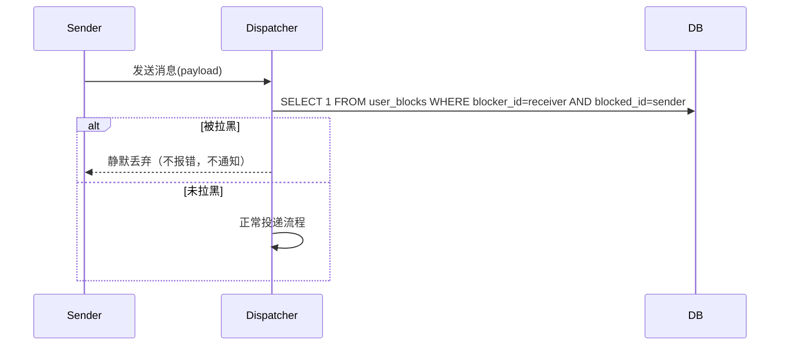
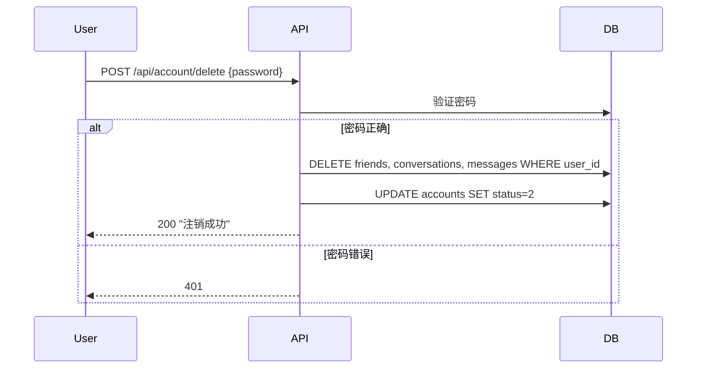
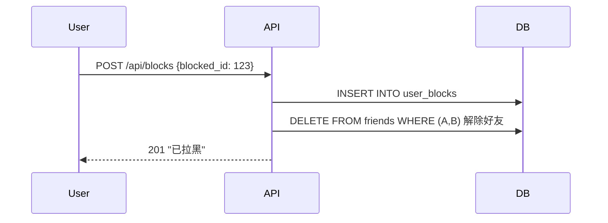

# iOS 合规 — 后端设计报告

> 关联设计：[auth v0.0.6 分析](../analysis.md) | [auth v0.0.6 前端](../client/design.md)

## 1. 目标

- 举报接口：用户可举报消息或用户，记录到 reports 表
- 拉黑接口：拉黑/取消拉黑/查询黑名单
- 拉黑拦截：消息投递时检查 block 关系，被拉黑则拒绝
- 账号注销接口：验证密码后直接删除用户数据 + 标记 status=2

## 2. 现状分析

| 能力 | 状态 |
|------|------|
| accounts 表有 status 字段 | ✅ 已有（0=正常） |
| auth_credentials 表 | ✅ 已有 |
| flash-user 模块（用户资料） | ✅ 已有 |
| flash-auth 模块（登录认证） | ✅ 已有 |
| im-ws dispatcher（消息投递） | ✅ 已有，需扩展 |
| 举报/拉黑相关表 | ❌ 无 |
| 账号注销流程 | ❌ 无 |

## 3. 数据模型与接口

### 数据模型

#### reports 表

```sql
CREATE TABLE reports (
    id BIGSERIAL PRIMARY KEY,
    reporter_id BIGINT NOT NULL,
    target_type SMALLINT NOT NULL,       -- 0=消息, 1=用户
    target_id VARCHAR(64) NOT NULL,      -- 消息ID 或 用户ID
    reason SMALLINT NOT NULL,            -- 0=色情, 1=暴力, 2=骚扰, 3=诈骗, 4=其他
    description TEXT,
    status SMALLINT NOT NULL DEFAULT 0,  -- 0=pending, 1=resolved, 2=rejected
    created_at TIMESTAMPTZ NOT NULL DEFAULT NOW(),
    resolved_at TIMESTAMPTZ
);
CREATE INDEX idx_reports_status ON reports(status);
```

#### user_blocks 表

```sql
CREATE TABLE user_blocks (
    id BIGSERIAL PRIMARY KEY,
    blocker_id BIGINT NOT NULL,
    blocked_id BIGINT NOT NULL,
    created_at TIMESTAMPTZ NOT NULL DEFAULT NOW(),
    UNIQUE(blocker_id, blocked_id)
);
CREATE INDEX idx_blocks_blocker ON user_blocks(blocker_id);
CREATE INDEX idx_blocks_blocked ON user_blocks(blocked_id);
```

#### accounts 表 status 扩展

| status | 含义 |
|--------|------|
| 0 | 正常 |
| 2 | 已注销（数据已清理） |

| 决策 | 理由 |
|------|------|
| 直接删除，不做冷静期 | 用户不可能误触（需输密码确认），简化实现 |
| reports 不关联外键 | target_id 可能是消息 ID（UUID）或用户 ID（BIGINT），用 VARCHAR 统一 |
| block 检查放 dispatcher | 最早拦截点，消息不落库不广播 |

### 接口契约

#### 举报

```
POST /api/reports
```

请求：
```json
{
  "target_type": 0,
  "target_id": "msg-uuid-xxx",
  "reason": 2,
  "description": "骚扰信息"
}
```

响应 201：
```json
{ "message": "举报已提交" }
```

#### 拉黑

```
POST /api/blocks
```

请求：
```json
{ "blocked_id": 123 }
```

响应 201：
```json
{ "message": "已拉黑" }
```

---

```
DELETE /api/blocks/{blocked_id}
```

响应 200：
```json
{ "message": "已取消拉黑" }
```

---

```
GET /api/blocks
```

响应 200：
```json
{
  "data": [
    { "user_id": "123", "nickname": "张三", "avatar": "/uploads/...", "blocked_at": "2026-06-11T..." }
  ]
}
```

#### 拉黑检查（内部）

```
GET /api/blocks/check?user_id={id}
```

响应 200：
```json
{ "is_blocked": true }
```

> 此接口供 dispatcher 内部调用或直接 SQL 查询。

#### 账号注销

```
POST /api/account/delete
```

请求：
```json
{ "password": "xxx" }
```

响应 200：
```json
{ "message": "注销成功" }
```

错误：
- 401：密码错误
- 400：未设置密码（需先绑定）

## 4. 核心流程

### 流程 1：消息投递 block 检查



设计选择：被拉黑时**静默丢弃**，发送方无感知。不返回错误，不通知发送方被拉黑（避免隐私泄露）。

### 流程 2：账号注销



### 流程 3：拉黑



## 5. 项目结构与技术决策

### 项目结构

```
server/modules/flash-user/src/
├── handler.rs          # 现有：profile, search
├── routes.rs           # 现有 + 新增 report/block 路由
├── model.rs            # 现有 + 新增请求/响应结构体
├── report_handler.rs   # [新增] 举报接口处理
└── block_handler.rs    # [新增] 拉黑接口处理

server/modules/flash-auth/src/
├── handler.rs          # 现有登录 + 新增注销时 status 检查
├── routes.rs           # 新增 /api/account/delete, /api/account/cancel-delete
└── account_handler.rs  # [新增] 注销处理

server/modules/im-ws/src/
└── dispatcher.rs       # 修改：handle_chat_message 前加 block 检查

server/migrations/
└── 20260611_015_compliance.sql  # [新增] reports + user_blocks + accounts 扩展
```

### 技术决策

| 决策 | 方案 | 理由 |
|------|------|------|
| 举报/拉黑放 flash-user | 用户维度操作，不属于 IM 消息域 | 职责归属清晰 |
| 注销放 flash-auth | 认证生命周期管理 | 与登录同域 |
| block 检查位置 | dispatcher.handle_chat_message 入口 | 最早拦截，不落库不广播 |
| 静默丢弃 | 不返回错误码 | Apple 要求"remove from feed instantly"，但不暴露被拉黑 |
| 直接删除不做冷静期 | 需输密码确认，不可能误触 | 简化流程 |
| 密码验证注销 | 无密码用户需先绑定 | 防止未授权操作 |

## 6. 验收标准

| 验收条件 | 验收方式 |
|----------|----------|
| 编译通过 | `cargo build` |
| 举报接口可用 | curl POST /api/reports → 201 |
| 拉黑接口可用 | curl POST /api/blocks → 201 |
| 取消拉黑可用 | curl DELETE /api/blocks/123 → 200 |
| 黑名单查询 | curl GET /api/blocks → 列表 |
| 拉黑后消息拦截 | A 拉黑 B → B 发消息给 A → A 收不到 |
| 注销接口可用 | curl POST /api/account/delete → 200 |
| 注销后无法登录 | status=1 时 login 自动撤销并提示 |
| 数据库迁移 | reports + user_blocks 表存在 |

## 7. 暂不实现

| 功能 | 理由 |
|------|------|
| 管理后台举报审核 UI | 通过直接操作数据库处理，24h 响应 |
| 敏感词自动过滤 | 后续版本加，当前手动审核 |
| 定时任务真删数据 | 先实现软删除，真删通过手动 SQL 或 cron job |
| 群聊 block 检查 | 本期只拦截私聊消息，群聊后续处理 |
| 举报通知管理员 | 先用数据库轮询，后续加 webhook/邮件 |
