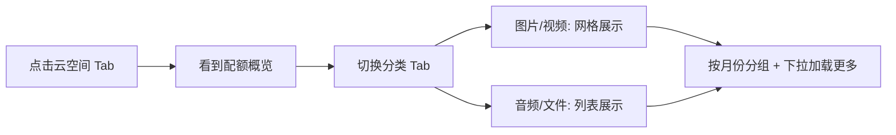
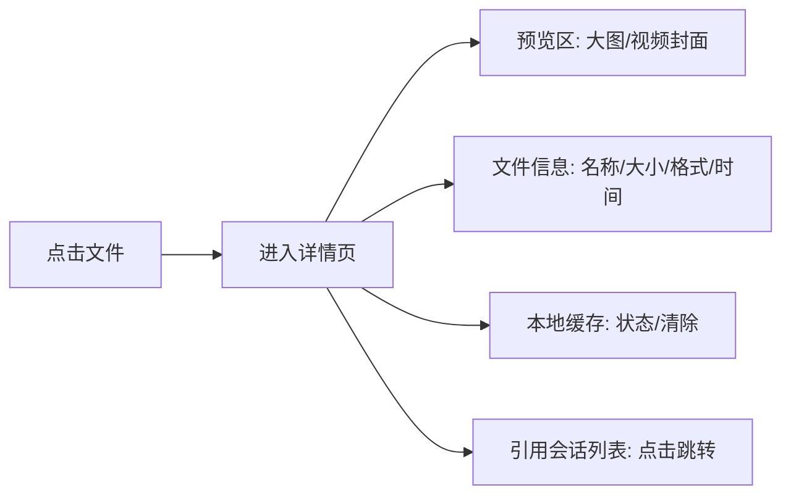
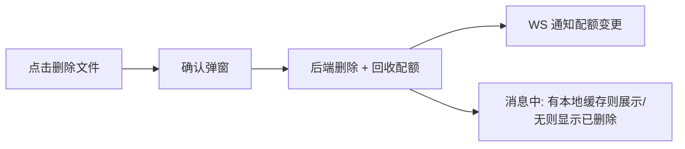
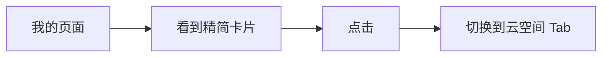

# 云空间 Tab — 功能分析

## 概述

将云空间从"我的"页面的卡片升级为底部导航的独立 Tab，提供完整的文件浏览、详情查看、本地缓存管理、引用追踪和文件删除能力。用户可以直观管理自己的云端资源。

前置依赖：[v0.0.6 云资源管理系统](../../im/core/v0.0.6_file_system/analysis.md)

---

## 一、交互链

### 场景 1：浏览云空间文件

**用户故事**：作为用户，我想在独立的 Tab 中浏览我所有的云端文件，按类型分类查看。

用户点击底部"云空间"Tab，看到顶部配额概览卡片（已用/总量 + 分色进度条），下方是分类 Tab（全部/图片/视频/音频/文件）。切换分类后，内容区展示对应类型的文件：图片/视频以 3 列网格展示缩略图，音频/文件以列表展示。文件按月份分组，最新的在前。

### 场景 2：查看文件详情

**用户故事**：作为用户，我想点击某个文件查看完整信息，包括预览、文件属性、本地缓存状态和被哪些会话使用。

用户在文件列表中点击某个文件，进入详情页。顶部显示大图预览（图片/视频封面），中间是文件信息卡片（名称、大小、格式、上传时间），接着是本地缓存状态卡片（是否缓存、缓存大小、清除按钮），最后是引用会话列表（点击可跳转到对应会话）。

### 场景 3：清除本地缓存

**用户故事**：作为用户，我想清除某个文件的本地缓存来节省手机存储，但不影响云端。

用户在文件详情页看到"本地缓存"区域显示"✅ 已缓存 2.1MB"，点击"清除"按钮，弹出确认，确认后本地缓存被删除，状态变为"❌ 未缓存"。云端文件不受影响。

### 场景 4：删除云端文件

**用户故事**：作为用户，我想删除不需要的云端文件来释放云空间配额。

用户在详情页底部点击"删除文件释放 x MB 空间"，弹出确认弹窗提示"删除后消息中将无法查看此文件"。确认后，后端 ref_count-1，若归零则物理删除文件 + 回收配额。消息中该文件显示"资源已删除"占位（如果本地有缓存则仍展示本地缓存）。

### 场景 5：从"我的"页面快捷进入

**用户故事**：作为用户，我想在"我的"页面仍能快速看到云空间概况并跳转。

"我的"页面保留精简版云空间卡片（仅一行：云朵图标 + "云空间" + 已用/总量 + 箭头），点击跳转到云空间 Tab。

---

## 二、逻辑树

### 事件流：加载文件列表

| 时刻 | 事件 | 处理 | 产生的新事件 |
|------|------|------|-------------|
| T0 | 用户进入云空间 Tab | 触发加载 | — |
| T1 | GET /api/storage/files?category=all&page=1&limit=20 | 后端查询 file_objects WHERE uploader_id = user_id，按 created_at DESC 分页 | — |
| T2 | 返回文件列表 | 前端按 created_at 的年月分组渲染 | — |
| T3 | 用户下拉加载更多 | page += 1，追加到列表 | — |
| T4 | 用户切换分类 Tab | category 变更，重置 page=1 重新加载 | — |

### 事件流：查看文件详情

| 时刻 | 事件 | 处理 | 产生的新事件 |
|------|------|------|-------------|
| T0 | 用户点击文件 | 获取 file_id | — |
| T1 | GET /api/storage/files/{id} | 后端查 file_objects + JOIN messages 查引用会话 | — |
| T2 | 返回详情 | 包含：文件信息 + 引用会话列表（conversation_id + 会话名称 + 类型） | — |
| T3 | 前端检查本地缓存 | 通过 FileCacheManager 查本地是否有该 URL 的缓存 | — |
| T4 | 渲染详情页 | 预览 + 信息 + 缓存状态 + 会话列表 | — |

### 事件流：删除云端文件

| 时刻 | 事件 | 处理 | 产生的新事件 |
|------|------|------|-------------|
| T0 | 用户点击删除 | 弹出确认弹窗 | — |
| T1 | 确认删除 | DELETE /api/storage/files/{id} | — |
| T2 | 后端处理 | ref_count-1；若归零：物理删除文件 + 扣减 quota used_bytes | — |
| T3 | 返回成功 | 触发 WS STORAGE_QUOTA_UPDATE 通知 | 前端刷新列表 + 配额 |
| T4 | 消息气泡渲染 | 检查 file URL 是否可访问；不可访问时检查本地缓存；无缓存显示"资源已删除" | — |

### 状态流转

| 实体 | 触发事件 | 前状态 | 后状态 |
|------|---------|--------|--------|
| file_objects | DELETE 接口 | ref_count=N (N>1) | ref_count=N-1 |
| file_objects | DELETE 接口 | ref_count=1 | 物理删除记录 + 文件 |
| user_storage_quota | 文件物理删除 | used=X | used=X-file_size |
| 本地缓存 | 用户点击清除 | 已缓存 | 未缓存 |
| 消息气泡 | 文件被删除 + 无本地缓存 | 正常展示 | 显示"资源已删除" |
| 消息气泡 | 文件被删除 + 有本地缓存 | 正常展示 | 仍展示本地缓存 |

---

## 三、功能编号与网络定位

### 本次新增节点

| 编号 | 功能节点 | 层级 | 简介 |
|------|---------|------|------|
| I-26 | 文件列表查询接口 | 基础设施 | GET /api/storage/files 分页+分类+排序 |
| I-27 | 文件详情查询接口 | 基础设施 | GET /api/storage/files/{id} 含引用会话 |
| I-28 | 文件删除接口 | 基础设施 | DELETE /api/storage/files/{id} ref_count-1 + 物理删除 + 配额回收 |
| D-46 | 文件删除与配额回收 | 领域 | 删除逻辑：ref_count 归零 → 删文件 + 删记录 + 回收 quota |
| D-47 | 原始文件名存储 | 领域 | file_objects.original_name，上传时保存，超 255 字符截断尾部 |
| P-79 | 云空间 Tab 页 | 前端业务 | 底部导航第 4 Tab，分色圆环配额 + 吸顶分类 Tab + 文件网格/列表（日期分组） |
| P-80 | 文件详情页 | 前端业务 | 预览 + 信息 + 本地缓存（下载进度/清除/复制路径）+ 引用会话 + 删除 |
| P-81 | 资源已删除占位 | 前端业务 | 消息气泡中文件不可访问时的降级展示（下版本） |
| F-21 | 全局下载管理器 | 前端基础 | CloudDownloadManager 单例，管理下载队列/进度/状态 |

### 前置依赖

| 依赖节点 | 依赖方式 | 是否已有 |
|----------|---------|---------|
| I-22 StorageBackend | 文件物理删除 | ✅ |
| I-23 文件元数据服务 | file_objects CRUD | ✅ |
| I-25 WS 配额通知 | 删除后推送配额变更 | ✅ |
| D-43 用户云配额 | 回收 used_bytes | ✅ |
| D-45 文件引用追踪 | file_references 查询引用会话 | ✅ |
| F-18 文件缓存管理器 | 查询/清除本地缓存 | ✅ |
| P-76 云空间卡片 | "我的"页面精简保留 | ✅ 需精简 |

### 边界接口

| 接口/协议 | 定义方 | 消费方 | 敏感度 |
|-----------|--------|--------|--------|
| GET /api/storage/files | I-26 | P-79（文件列表） | 低（只读，需鉴权） |
| GET /api/storage/files/{id} | I-27 | P-80（文件详情） | 低（只读） |
| DELETE /api/storage/files/{id} | I-28 | P-80（删除按钮） | 高（写操作，需确认） |
| WS STORAGE_QUOTA_UPDATE | I-25 | P-79（刷新配额） | 低 |

---

## 四、结论

### 开发顺序建议

1. **I-26 / I-27 / I-28 后端三个新接口** — 纯数据查询+删除，无复杂依赖
2. **P-79 云空间 Tab 页** — 底部导航改造 + 配额概览 + 文件列表
3. **P-80 文件详情页** — 预览 + 信息 + 缓存 + 引用 + 删除
4. **P-81 消息气泡降级** — 文件不可访问时的"资源已删除"展示
5. **P-76 精简** — "我的"页面卡片简化为一行入口

### 复杂度集中点

- **文件列表性能**：大量文件时的分页加载 + 缩略图懒加载
- **本地缓存状态判断**：需要和 FileCacheManager 配合查询某个 URL 是否有本地缓存
- **消息气泡降级**：文件 URL 404 时的检测和降级渲染逻辑

### 暂不实现

- **批量删除** — 先做单个删除，批量操作下版本
- **桌面端适配** — 先做移动端
- **付费扩容入口** — 付费系统未设计
- **文件搜索** — 列表暂时只按时间排序，不支持搜索
- **文件预览** — 图片全屏/视频播放/音频播放/文件打开，下版本（cloud/v0.0.2）
- **消息气泡"资源已删除"降级** — 下版本
