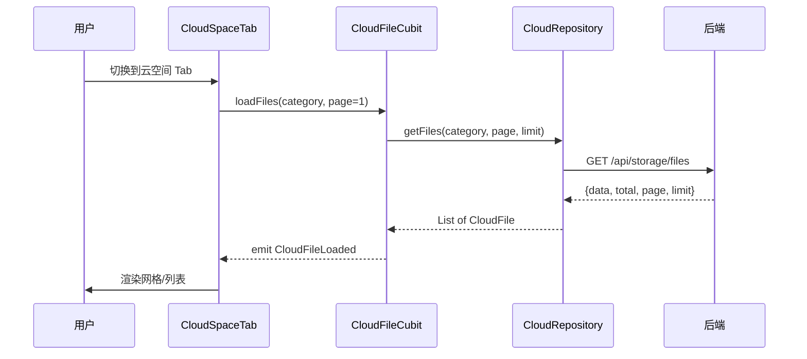
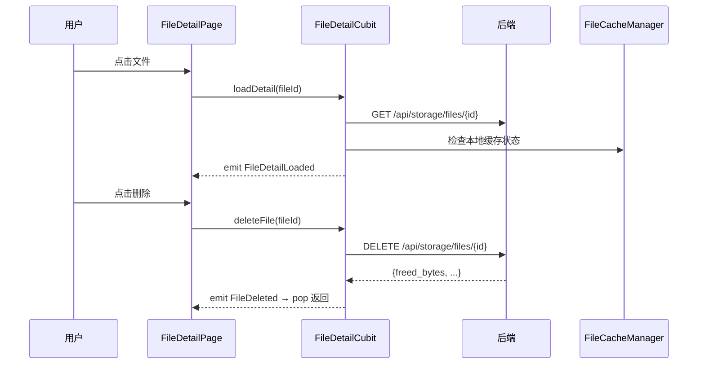

# 云空间 Tab — 客户端设计报告

> 关联设计：[云空间后端 v0.0.1](../server/design.md) | [v0.0.6 客户端](../../../im/core/v0.0.6_file_system/client/design.md)

## 1. 目标

- 底部导航新增第 4 个 Tab "云空间"（消息 / 通讯录 / 云空间 / 我）
- 云空间 Tab 页：配额概览 + 分类 Tab + 文件网格/列表（按月分组、分页加载）
- 文件详情页：预览 + 文件信息 + 本地缓存状态 + 引用会话列表 + 删除
- "我的"页面云空间卡片精简为一行快捷入口
- 消息气泡降级：文件 URL 不可访问时显示"资源已删除"

## 2. 现状分析

### 已有能力

- `StorageRepository` + `StorageQuotaCubit`：配额查询 + WS 实时更新（v0.0.6）
- `CloudStorageCard` + `CloudStoragePage`：卡片 + 详情页（v0.0.6，本次重构）
- `FileCacheManager`：本地缓存查询/清除
- 底部导航 3 Tab（MobileLayout）

### 需要新建

- `flash_cloud` 模块：云空间独立模块
- 文件列表页（Tab 页主体）
- 文件详情页（全新设计）
- 底部导航改为 4 Tab

## 3. 数据模型与接口

### 客户端数据类

```dart
/// 文件列表项
class CloudFile {
  final int id;
  final String url;
  final String? thumbUrl;
  final int size;
  final String mimeType;
  final String mimeCategory;
  final int? width;
  final int? height;
  final int? durationMs;
  final String? originalName;
  final int refCount;
  final DateTime createdAt;
}

/// 文件详情（含引用会话）
class CloudFileDetail {
  final CloudFile file;
  final List<FileConversationRef> conversations;
}

/// 引用会话
class FileConversationRef {
  final String conversationId;
  final String conversationName;
  final int conversationType;
  final String? avatar;
  final int messageCount;
}
```

### 调用的后端接口

| 接口 | 用途 |
|------|------|
| GET /api/storage/files?category&page&limit | 文件列表 |
| GET /api/storage/files/{id} | 文件详情 |
| DELETE /api/storage/files/{id} | 删除文件 |
| GET /api/storage/quota | 配额查询（已有） |
| WS STORAGE_QUOTA_UPDATE | 实时配额通知（已有） |

## 4. 核心流程

### 云空间 Tab 加载



### 文件详情 + 删除



## 5. 项目结构与技术决策

### 项目结构

```
client/modules/flash_cloud/
├── pubspec.yaml
└── lib/
    ├── flash_cloud.dart                   # barrel export
    └── src/
        ├── data/
        │   ├── cloud_file.dart            # CloudFile / CloudFileDetail 数据类
        │   └── cloud_repository.dart      # API 调用
        ├── logic/
        │   ├── cloud_file_cubit.dart      # 文件列表状态管理
        │   └── file_detail_cubit.dart     # 文件详情状态管理
        └── view/
            ├── cloud_space_page.dart      # Tab 页主体（配额 + 分类 + 列表）
            ├── cloud_quota_header.dart    # 配额概览卡片
            ├── cloud_file_grid.dart       # 图片/视频网格组件
            ├── cloud_file_list.dart       # 音频/文件列表组件
            └── file_detail_page.dart      # 文件详情页

client/lib/src/home/
├── view/mobile_layout.dart                # 修改：4 Tab 导航
└── profile/
    ├── profile_page.dart                  # 修改：精简云空间卡片
    └── cloud_storage_card.dart            # 修改：精简为一行
```

### 职责划分

```
MobileLayout (导航)
  └── CloudSpacePage (Tab 页)
        ├── CloudQuotaHeader (配额概览)
        ├── CategoryTabs (分类切换)
        └── CloudFileCubit (状态)
              ├── CloudFileGrid (图片/视频)
              └── CloudFileList (音频/文件)

FileDetailPage (详情)
  └── FileDetailCubit (状态)
        ├── 预览区
        ├── 文件信息
        ├── 缓存状态
        └── 引用会话列表
```

### 技术决策

| 决策 | 方案 | 理由 |
|------|------|------|
| 模块化 | 新建 `flash_cloud` module | 云空间是独立域，和 IM 聊天无关 |
| 文件列表 | Cubit + 分页加载 | 简单状态，下拉加载更多 |
| 网格/列表切换 | 按 category 决定展示方式 | 图片/视频用网格视觉密度高，音频/文件需要文件名用列表 |
| Tab 位置 | 第 3 个（通讯录和我之间） | 使用频率介于通讯录和我之间 |
| 配额卡片 | 分色圆环（CustomPaint）+ 图例 | 直观展示各类型占比 |
| Tab 吸顶 | CustomScrollView + SliverPersistentHeader(pinned) | 配额卡片可滑走，Tab 固定 |
| 文件分组 | 按日期分组（yyyy-MM-dd）| 比按月更精确 |
| 下载管理 | CloudDownloadManager 全局单例 | 退出详情页进度不丢失，多文件可同时下载 |
| 确认弹框 | showTolyPopPicker（底部弹出 action sheet） | 全 App 统一交互风格 |
| "我的"卡片 | 一行 tile + 底部 3px 分色进度条，点击切换 Tab | 精简，不再 push 新页面 |

### 第三方依赖

| 依赖 | 用途 | 已有/需新增 |
|------|------|------------|
| flutter_bloc | 状态管理 | ✅ 已有 |
| dio | HTTP 请求 | ✅ 已有 |
| cached_network_image | 缩略图加载 | ✅ 已有 |
| flash_im_cache | FileCacheManager | ✅ 已有 |
| flash_shared | AvatarWidget | ✅ 已有 |

## 6. 验收标准

| 验收条件 | 验收方式 |
|----------|----------|
| 底部导航显示 4 个 Tab | 手动验证 |
| 云空间 Tab 显示配额 + 文件列表 | 手动验证 |
| 切换分类正确筛选 | 切换到"图片"只显示图片 |
| 下拉加载更多 | 文件多时下拉出现新数据 |
| 点击文件进入详情页 | 手动验证 |
| 详情页显示缓存状态 | 已缓存/未缓存正确 |
| 详情页显示引用会话 | 数据与后端一致 |
| 点击删除后文件消失 + 配额回收 | 手动验证 |
| "我的"页面精简卡片可跳转 | 手动验证 |
| flutter analyze 0 errors | 编译验证 |

## 7. 暂不实现

| 功能 | 理由 |
|------|------|
| 桌面端适配 | 先做移动端 |
| 批量选择/删除 | 先做单个操作 |
| 文件搜索 | 列表暂只按时间排序 |
| 文件预览（全屏图片/视频播放/音频播放/文件打开） | 需要跨模块复用预览组件，下版本（cloud/v0.0.2） |
| 消息气泡"资源已删除"降级 | 改动面较大，下版本处理 |
