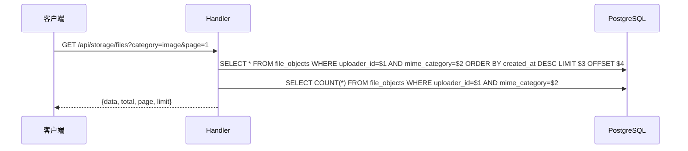
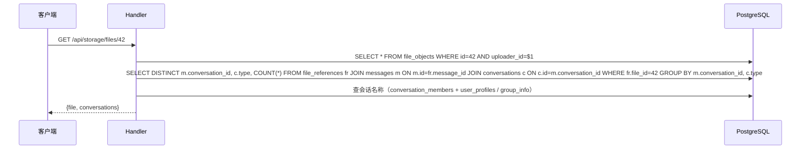
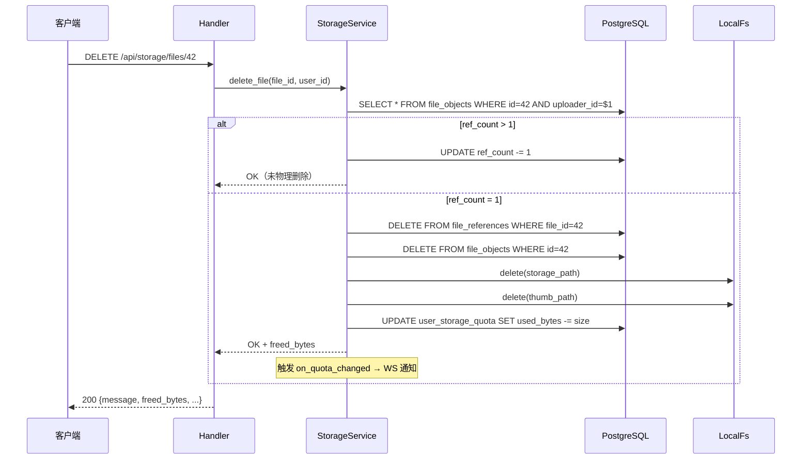

# 云空间 Tab — 服务端设计报告

> 关联设计：[v0.0.6 云资源管理系统](../../../im/core/v0.0.6_file_system/server/design.md)

## 1. 目标

- 新增文件列表查询接口（分页 + 分类筛选 + 时间倒序）
- 新增文件详情接口（含引用会话列表）
- 新增文件删除接口（ref_count-1 → 归零物理删除 + 配额回收 + WS 通知）
- `file_objects` 表新增 `original_name` 字段，上传时存储原始文件名（超 255 字符截断尾部）

## 2. 现状分析

### 已有能力

- `file_objects` 表：存储所有文件元数据
- `file_references` 表：记录文件被哪些消息引用
- `user_storage_quota` 表：配额管理
- `StorageBackend.delete(path)` 方法：物理删除
- WS `STORAGE_QUOTA_UPDATE` 推送机制

### 需要新增

- 3 个 HTTP 接口（list / detail / delete）
- repository 层新增对应查询方法
- service 层新增删除编排逻辑

## 3. 数据模型与接口

### 数据模型

无新建表。查询涉及的表：

- `file_objects`（主查询，新增 `original_name VARCHAR(255)` 字段存原始文件名）
- `file_references` + `messages` + `conversations`（查引用会话）
- `user_storage_quota`（删除时回收）

### 接口契约

#### GET /api/storage/files

分页查询用户的文件列表。

请求参数（query string）：
- `category`：可选，image / video / audio / file，不传为全部
- `page`：页码，默认 1
- `limit`：每页条数，默认 20，最大 50

响应 200：
```json
{
  "data": [
    {
      "id": 42,
      "hash": "ca44be7e...",
      "storage_path": "original/2026/06/uuid.jpg",
      "url": "/uploads/original/2026/06/uuid.jpg",
      "thumb_url": "/uploads/thumb/2026/06/uuid.webp",
      "size": 2048000,
      "mime_type": "image/jpeg",
      "mime_category": "image",
      "width": 1920,
      "height": 1080,
      "duration_ms": null,
      "ref_count": 3,
      "created_at": "2026-06-17T14:32:00Z"
    }
  ],
  "total": 156,
  "page": 1,
  "limit": 20
}
```

#### GET /api/storage/files/{id}

查询文件详情，含引用的会话列表。

响应 200：
```json
{
  "file": {
    "id": 42,
    "hash": "ca44be7e...",
    "url": "/uploads/original/2026/06/uuid.jpg",
    "thumb_url": "/uploads/thumb/2026/06/uuid.webp",
    "size": 2048000,
    "mime_type": "image/jpeg",
    "mime_category": "image",
    "width": 1920,
    "height": 1080,
    "duration_ms": null,
    "ref_count": 3,
    "created_at": "2026-06-17T14:32:00Z"
  },
  "conversations": [
    {
      "conversation_id": "5cf31a40-...",
      "conversation_name": "张三",
      "conversation_type": 0,
      "avatar": "identicon:2",
      "message_count": 2
    },
    {
      "conversation_id": "a1b2c3d4-...",
      "conversation_name": "项目群",
      "conversation_type": 1,
      "avatar": "grid:...",
      "message_count": 1
    }
  ]
}
```

#### DELETE /api/storage/files/{id}

删除文件。ref_count-1，归零时物理删除。

响应 200：
```json
{
  "message": "文件已删除",
  "freed_bytes": 2048000,
  "new_used_bytes": 41257957,
  "new_quota_bytes": 104857600
}
```

响应 403（不是该用户上传的）：
```json
{
  "error": "无权删除此文件",
  "status": 403
}
```

响应 404（文件不存在）：
```json
{
  "error": "文件不存在",
  "status": 404
}
```

## 4. 核心流程

### 文件列表查询



### 文件详情 + 引用会话



### 文件删除



## 5. 项目结构与技术决策

### 变更文件

```
server/modules/app-storage/src/
├── api.rs          # 修改：新增 3 个 handler + 路由
├── repository.rs   # 修改：新增查询方法
├── service.rs      # 修改：新增 delete_file 方法
└── model.rs        # 修改：新增响应结构体
```

### 技术决策

| 决策 | 方案 | 理由 |
|------|------|------|
| 分页方式 | OFFSET + LIMIT | 文件数不会特别大（配额 100MB 限制），offset 足够 |
| 引用会话查询 | JOIN file_references + messages + conversations | 一次查询获取所有引用信息 |
| 删除策略 | ref_count=1 时物理删除 | 只有一个引用（当前用户），删除后无人需要 |
| 会话名称获取 | 单聊取对方昵称，群聊取群名 | 复用现有的会话命名逻辑 |
| 静态文件 Content-Length | /uploads 不走 CompressionLayer | 压缩会移除 Content-Length，导致下载进度无法计算 |

### 第三方依赖

无新增依赖。

## 6. 验收标准

| 验收条件 | 验收方式 |
|----------|----------|
| GET /api/storage/files 返回分页列表 | curl 测试 |
| category 筛选正确 | 传 image 只返回图片 |
| GET /api/storage/files/{id} 返回详情 + 会话列表 | curl 测试 |
| DELETE 后 ref_count 正确减 1 | 查表验证 |
| ref_count 归零后文件被物理删除 | 检查磁盘 |
| 删除后配额回收 | 查 user_storage_quota |
| 删除后 WS 推送配额变更 | 日志验证 |
| 非本人文件返回 403 | curl 测试 |

## 7. 暂不实现

| 功能 | 理由 |
|------|------|
| 批量删除 | 先做单个，批量下版本 |
| 文件搜索 | 列表暂只支持分类筛选 |
| 回收站 | 删除即永久，后续考虑 |
