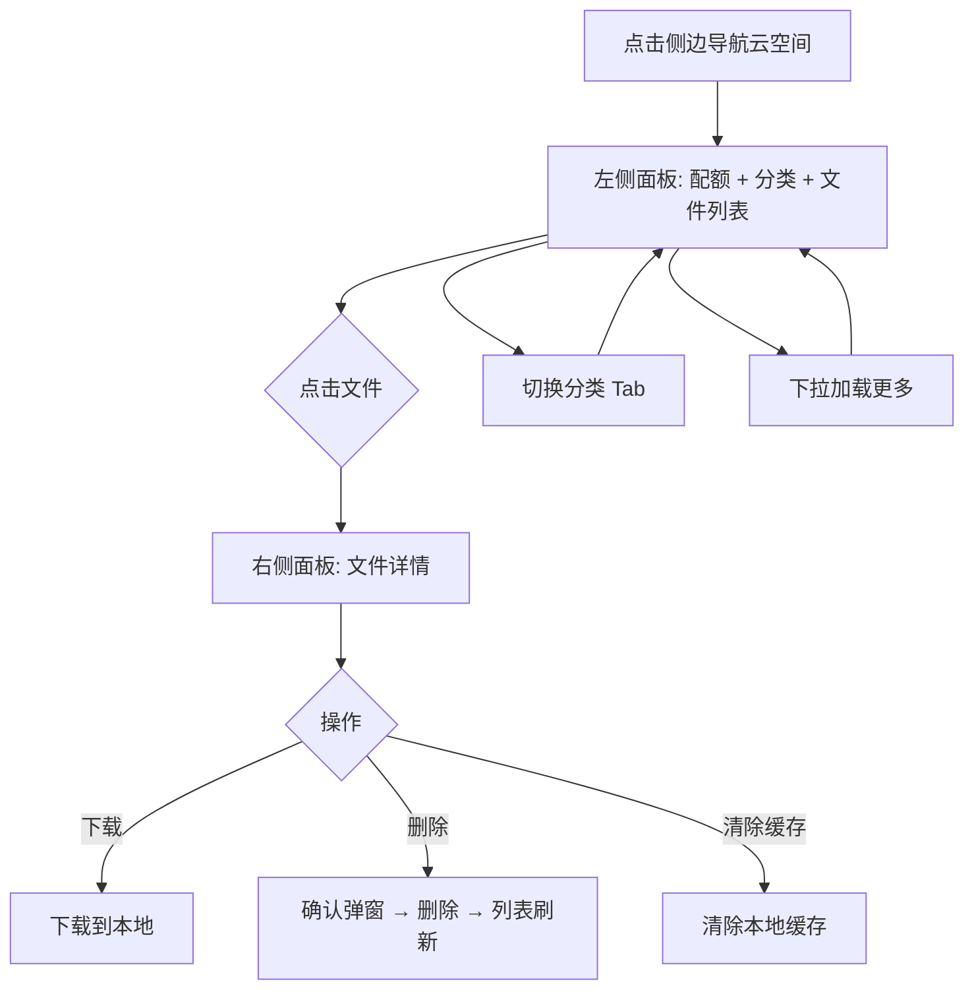
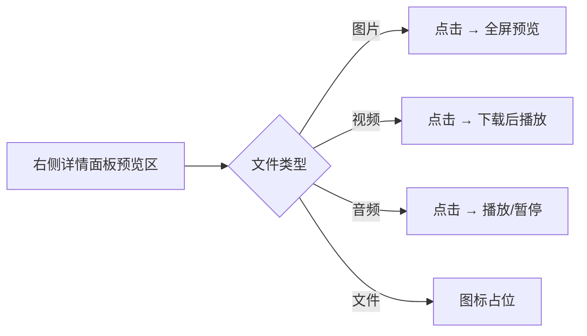
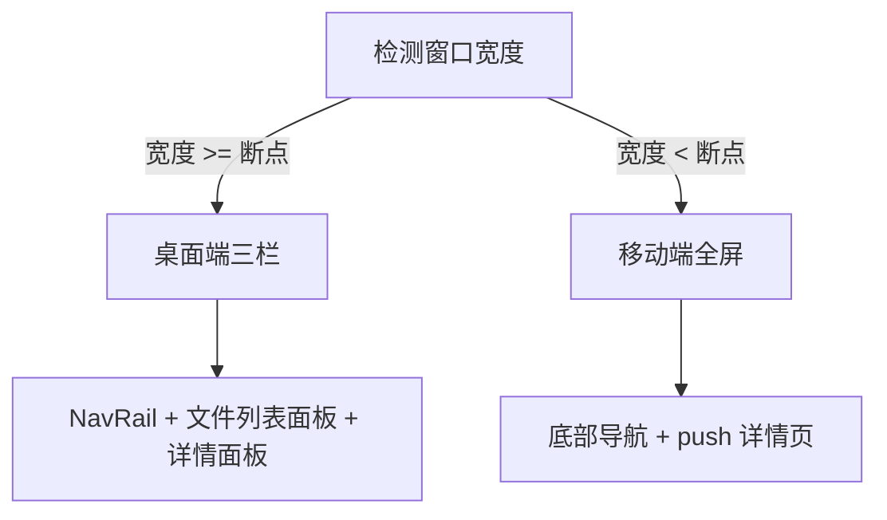

# 云空间桌面端 UI 适配 — 功能分析

## 概述

将移动端已完成的云空间 Tab（配额概览 + 分类浏览 + 文件详情）适配到桌面端三栏布局。桌面端用户无需全屏跳转即可完成文件浏览和详情查看，保持与消息/通讯录 Tab 一致的交互体验。

纯前端改动，无后端接口变更。

前置版本：[cloud/v0.0.1](../v0.0.1/analysis.md)

---

## 一、交互链

### 场景 1：桌面端浏览云空间文件

**用户故事**：作为桌面端用户，我想在侧边导航切换到云空间 Tab 后，左侧看到文件列表，右侧看到选中文件的详情，以便不跳转页面就能管理云端资源。

用户点击侧边导航栏第 3 个图标（云空间），左侧面板显示配额概览 + 分类 Tab + 文件网格/列表。点击某个文件后，右侧面板展示该文件的详情（预览 + 信息 + 缓存状态 + 引用会话 + 删除按钮）。

### 场景 2：桌面端文件详情预览

**用户故事**：作为桌面端用户，我想在右侧详情面板中直接预览图片、播放音频、播放视频，以便快速确认文件内容。

用户在右侧详情面板看到文件预览区：
- 图片：点击预览区打开全屏图片查看
- 视频：点击预览区下载后播放
- 音频：点击播放/暂停按钮在线播放

### 场景 3：窗口尺寸自适应

**用户故事**：作为用户，我想在缩小窗口时自动切换为移动端的全屏跳转式云空间，以便在不同窗口大小下都能正常使用。

窗口宽度 >= 断点值时显示桌面端三栏布局；< 断点值时退回移动端全屏布局（底部导航 + push 跳转详情页）。CloudSpacePage 和 FileDetailPage 组件在两端共享复用，仅布局容器不同。

### 场景 4：未选中文件时的空白占位

**用户故事**：作为桌面端用户，我刚切换到云空间 Tab 但还没选择任何文件时，右侧应显示友好的空白引导。

右侧面板显示一个图标和提示文字"选择一个文件查看详情"，与消息 Tab 未选中会话时的体验一致。

---

## 二、逻辑树

### 事件流：桌面端云空间浏览

| 时刻 | 事件 | 处理 | 产生的新事件 |
|------|------|------|-------------|
| T1 | 用户点击 NavRail 云空间图标 | DesktopLayout setState _navIndex=3 | 渲染云空间三栏 |
| T2 | CloudFileCubit 初始化 | loadFiles(category='all', page=1) → GET /api/storage/files | 文件列表加载完成 |
| T3 | 用户点击某个文件 | DesktopLayout setState _selectedFileId | 右侧面板切换为详情 |
| T4 | FileDetailCubit 加载详情 | loadDetail(fileId) → GET /api/storage/files/{id} + 检查本地缓存 | 详情渲染完成 |
| T5 | 用户切换分类 Tab | CloudFileCubit.switchCategory(category) | 重置列表 + 清除选中状态 |
| T6 | 用户下拉加载更多 | CloudFileCubit.loadMore() → page+1 | 追加文件到列表 |
| T7 | WS STORAGE_QUOTA_UPDATE | 监听 wsClient.storageQuotaStream | 刷新配额 + 文件列表 |

### 事件流：桌面端文件删除

| 时刻 | 事件 | 处理 | 产生的新事件 |
|------|------|------|-------------|
| T1 | 用户在详情面板点击删除 | 弹出确认弹窗 | — |
| T2 | 用户确认删除 | FileDetailCubit.deleteFile(id) → DELETE /api/storage/files/{id} | 返回成功 |
| T3 | 删除成功 | emit FileDetailStatus.deleted | 通知父级 |
| T4 | DesktopLayout 收到回调 | CloudFileCubit.removeFile(id) + setState _selectedFileId=null | 列表刷新 + 右侧回到空白 |
| T5 | WS 配额通知到达 | 配额数据刷新 | 配额卡片更新 |

### 状态流转

| 实体 | 触发事件 | 前状态 | 后状态 |
|------|---------|--------|--------|
| DesktopLayout._navIndex | 点击云空间图标 | 0/1/2 | 3 |
| DesktopLayout._selectedFileId | 点击文件 | null | fileId |
| DesktopLayout._selectedFileId | 切换分类/删除文件 | fileId | null |
| 右侧面板 | _selectedFileId 变化 | 空白占位 | FileDetailPanel |
| 右侧面板 | _selectedFileId=null | FileDetailPanel | 空白占位 |
| CloudFileCubit.state.category | 切换分类 Tab | 旧分类 | 新分类 |

---

## 三、功能编号与网络定位

### 本次新增节点

| 编号 | 功能节点 | 层级 | 简介 |
|------|---------|------|------|
| P-82 | 桌面端云空间三栏 | 前端业务层 | NavRail 增加云空间入口 + 左侧文件列表面板 + 右侧文件详情面板 |

> 本次为移动端已有功能（P-79/P-80）的桌面端布局适配，核心组件复用，仅新增桌面端布局容器和交互差异处理。

### 前置依赖

| 依赖节点 | 依赖方式 | 是否已有 |
|----------|---------|---------|
| P-79 云空间 Tab 页 | 复用 CloudFileCubit + 文件列表组件 | ✅ |
| P-80 文件详情页 | 复用 FileDetailCubit + 详情 UI | ✅ |
| P-64 桌面端自适应布局 | 复用 DesktopLayout 框架 + Rx$ | ✅ |
| P-65 桌面端会话分栏 | 参考三栏布局模式 | ✅ |
| F-22 统一下载管理 | 详情页下载能力 | ✅ |
| F-24 图片缓存 Widget | 缩略图展示 | ✅ |

### 边界接口

| 接口/协议 | 定义方 | 消费方 | 说明 |
|-----------|--------|--------|------|
| CloudSpacePage（embedded 模式） | flash_cloud | DesktopLayout | 桌面端不显示 AppBar，不 push 详情页 |
| FileDetailPage（embedded 模式） | flash_cloud | DesktopLayout | 桌面端内嵌右侧面板，不显示 AppBar |
| DesktopNavRail 新增第 4 项 | home/desktop | DesktopLayout | 云空间图标 + _navIndex=3 |
| onFileTap 回调 | CloudSpacePage | DesktopLayout | 桌面端点击文件通知父级，而非 push 页面 |
| onDeleted 回调 | FileDetailPage | DesktopLayout | 删除后清除选中状态 |

---

## 四、结论

### 开发顺序建议

1. DesktopNavRail 增加云空间导航项（第 4 项）
2. DesktopLayout 增加 _navIndex==3 分支，渲染云空间三栏
3. CloudSpacePage 增加 `embedded` 参数 + `onFileTap` 回调（桌面端不 push 详情页）
4. FileDetailPage 增加 `showAppBar` 参数（桌面端不显示 AppBar）
5. 桌面端右侧面板容器（空白占位 + FileDetailPage 嵌入）
6. 配额卡片在宽屏下的布局微调（可选）

### 复杂度集中点

- **CloudSpacePage 双模式**：需要让同一组件在移动端 push 详情页、桌面端回调通知父级。通过 `onFileTap` 可选回调实现——有回调时走回调，无回调时走 push。
- **FileDetailPage 嵌入模式**：详情页当前有 Scaffold + AppBar，嵌入时需要去掉。通过 `showAppBar` 参数控制。
- **详情页状态同步**：文件删除后需要同时更新左侧列表和右侧面板状态，通过回调链（onDeleted → removeFile + clearSelection）。

### 界面兼容设计

- CloudSpacePage 和 FileDetailPage 本身不做平台判断，由外层容器（MobileLayout / DesktopLayout）决定布局方式
- 组件通过可选参数（embedded / showAppBar / onFileTap）区分两种模式，而非 `if (isDesktop)` 硬判断
- 移动端逻辑完全不受影响

### 暂不实现

- 文件列表网格列数自适应（桌面端宽屏可以 4~5 列）— 下版本
- 右侧面板宽度可拖拽调整 — 不做
- 文件拖拽上传 — 不做
- 桌面端右键文件弹出操作菜单 — 下版本
