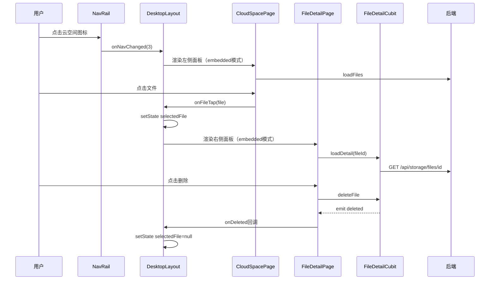
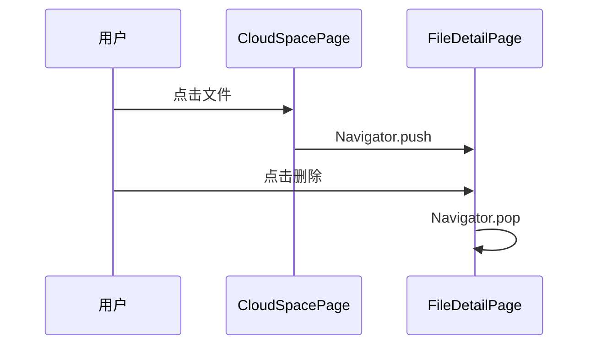

# 云空间桌面端 UI 适配 — 前端设计报告

> 关联设计：[cloud v0.0.1 客户端](../../v0.0.1/client/design.md) | [desktop v0.0.1](../../../ui/desktop/v0.0.1/analysis.md)

## 1. 目标

- 桌面端 NavRail 增加云空间导航项（第 4 项：消息/通讯录/云空间/我的）
- 桌面端云空间 Tab 三栏布局：左侧文件列表面板 + 右侧文件详情面板
- CloudSpacePage 增加嵌入模式（桌面端不显示 AppBar，文件点击走回调而非 push）
- FileDetailPage 增加嵌入模式（桌面端内嵌右侧面板，不显示 AppBar，删除走回调而非 pop）
- 移动端逻辑零影响

## 2. 现状分析

### 已有能力

| 能力 | 状态 | 模块 |
|------|------|------|
| 云空间 Tab 主体（配额 + 分类 + 网格/列表） | ✅ | flash_cloud / CloudSpacePage |
| 文件详情页（预览 + 信息 + 缓存 + 引用 + 删除） | ✅ | flash_cloud / FileDetailPage |
| 桌面端三栏框架（NavRail + 内容区） | ✅ | home/desktop/desktop_layout.dart |
| 桌面端通讯录三栏（选中 → 右侧面板） | ✅ | home/desktop/contact_detail_panel.dart |
| NavRail 3 项导航 | ✅ 需扩展为 4 项 | home/desktop/nav_rail.dart |
| MobileLayout 4 Tab 导航（含云空间） | ✅ 无需改动 | home/mobile_layout.dart |

### 问题

- DesktopLayout 的 NavRail 只有 3 项，缺少云空间入口
- CloudSpacePage 的文件点击直接 `Navigator.push`，桌面端需要通知父级在右侧面板展示
- FileDetailPage 有 Scaffold + AppBar，嵌入右侧面板时需要去掉

## 3. 核心流程

### 桌面端云空间交互



### 移动端云空间（不变）



## 4. 项目结构与技术决策

### 改动文件清单

| 文件 | 操作 | 职责变更 |
|------|------|----------|
| `client/lib/src/home/view/desktop/nav_rail.dart` | 修改 | 增加第 4 项云空间图标 |
| `client/lib/src/home/view/desktop/desktop_layout.dart` | 修改 | _navIndex==3 渲染云空间三栏 |
| `client/lib/src/home/view/desktop/cloud_detail_panel.dart` | 新建 | 桌面端右侧文件详情面板容器（空白占位 + FileDetailPage 嵌入） |
| `client/modules/flash_cloud/lib/src/view/cloud_space_page.dart` | 修改 | 增加 `onFileTap` 可选回调 + `showAppBar` 参数 |
| `client/modules/flash_cloud/lib/src/view/file_detail_page.dart` | 修改 | 增加 `showAppBar` 参数（默认 true），嵌入模式不包 Scaffold |

### 职责划分

```
DesktopLayout (navIndex==3 分支)
  ├── 左侧: CloudSpacePage（embedded 模式）
  │     ├── CloudQuotaHeader（配额卡片，不变）
  │     ├── TabBar（分类切换，不变）
  │     └── CloudFileGrid / CloudFileList（onTap → 通知父级）
  │
  └── 右侧: DesktopCloudDetailPanel
        ├── 未选中 → 空白占位
        └── 已选中 → FileDetailPage（embedded 模式）
```

### 技术决策

| 决策 | 方案 | 理由 |
|------|------|------|
| 桌面端/移动端分流 | 可选回调参数（onFileTap），非平台判断 | 组件不感知平台，由外层容器注入行为 |
| 嵌入模式实现 | showAppBar 参数控制是否包 Scaffold | 最小侵入，移动端默认 true 不受影响 |
| 右侧面板容器 | 新建 DesktopCloudDetailPanel 组件 | 参考 DesktopContactDetailPanel，统一模式 |
| 左侧面板宽度 | 固定 360px（与通讯录一致） | 视觉一致性，网格 3 列在 360 下表现合理 |
| 详情面板标题栏 | DragMoveArea + 文件名 + WindowsButtons | 与通讯录详情、聊天区标题栏风格一致 |
| 文件选中状态 | DesktopLayout 持有 `CloudFile? _selectedFile` | 简单 setState，无需额外 Cubit |
| 切换分类时清除选中 | CloudSpacePage 增加 `onCategoryChanged` 回调 | 切换分类后右侧应回到空白 |

### 依赖关系

| 依赖 | 用途 | 状态 |
|------|------|------|
| flash_cloud | CloudSpacePage + FileDetailPage | ✅ 已有 |
| flash_shared | WindowsButtons + DragMoveArea + imTheme | ✅ 已有 |
| flash_im_core | WsClient（配额流） | ✅ 已有 |
| flutter_bloc | BlocProvider / BlocBuilder | ✅ 已有 |

## 5. 各改动点详细说明

### 5.1 NavRail 增加云空间

在现有 3 个导航图标后增加第 4 个：

```dart
_buildNavIcon(context, 2, Icons.cloud_outlined, Icons.cloud, '云空间'),
// 原来的 "我的" 从 index 2 变为 index 3
_buildNavIcon(context, 3, Icons.person_outline, Icons.person, '我的'),
```

### 5.2 DesktopLayout _buildContent 增加 navIndex==3

参考 navIndex==1（通讯录）的三栏模式：

```dart
if (_navIndex == 3) {
  return Row(
    children: [
      SizedBox(width: 360, child: _buildCloudListPanel()),
      const VerticalDivider(width: 0.5, thickness: 0.5),
      Expanded(child: _buildCloudDetailPanel()),
    ],
  );
}
```

需要调整原来"我的"Tab 的 navIndex 从 2 → 3（因为云空间插入在通讯录和我的之间）。

但考虑到与移动端一致（移动端 Tab 顺序是消息/通讯录/云空间/我），**云空间占 index 2，我的移到 index 3**。

### 5.3 CloudSpacePage 嵌入模式

增加参数：

```dart
class CloudSpacePage extends StatefulWidget {
  final CloudRepository repository;
  final String? baseUrl;
  final bool showAppBar;                        // 新增：桌面端 false
  final void Function(CloudFile file)? onFileTap; // 新增：桌面端回调
  final VoidCallback? onCategoryChanged;        // 新增：切换分类通知
  ...
}
```

`_openDetail` 方法改为：

```dart
void _openDetail(CloudFile file) {
  if (widget.onFileTap != null) {
    widget.onFileTap!(file);  // 桌面端：通知父级
  } else {
    Navigator.of(context).push(...);  // 移动端：push 详情页
  }
}
```

### 5.4 FileDetailPage 嵌入模式

增加参数：

```dart
class FileDetailPage extends StatelessWidget {
  final int fileId;
  final CloudRepository repository;
  final String? baseUrl;
  final VoidCallback? onDeleted;
  final bool showAppBar;  // 新增：默认 true
  ...
}
```

build 方法调整：

```dart
Widget build(BuildContext context) {
  return BlocProvider(
    create: (_) => FileDetailCubit(...)..loadDetail(fileId),
    child: BlocConsumer<FileDetailCubit, FileDetailState>(
      listener: (context, state) {
        if (state.status == FileDetailStatus.deleted) {
          onDeleted?.call();
          if (showAppBar) Navigator.of(context).pop();  // 仅移动端 pop
        }
      },
      builder: (context, state) {
        final Widget body = _buildBody(context, state);
        if (!showAppBar) return body;  // 桌面端：不包 Scaffold
        return Scaffold(
          appBar: AppBar(title: const Text('文件详情'), ...),
          body: body,
        );
      },
    ),
  );
}
```

### 5.5 DesktopCloudDetailPanel

参考 DesktopContactDetailPanel 的模式：

```dart
class DesktopCloudDetailPanel extends StatelessWidget {
  final CloudFile? selectedFile;
  final CloudRepository repository;
  final String? baseUrl;
  final VoidCallback? onDeleted;

  // selectedFile == null → 空白占位
  // selectedFile != null → FileDetailPage(embedded)
}
```

## 6. 验收标准

| 验收条件 | 验收方式 |
|----------|----------|
| flutter analyze 零错误 | 命令行验证 |
| 桌面端 NavRail 显示 4 个图标（消息/通讯录/云空间/我的） | Windows 运行验证 |
| 点击云空间图标显示三栏布局（文件列表 + 详情面板） | Windows 运行验证 |
| 左侧文件列表正常加载、切换分类、下拉加载更多 | 手动验证 |
| 点击文件后右侧显示详情（预览 + 信息 + 缓存 + 引用） | 手动验证 |
| 删除文件后右侧回到空白、左侧列表刷新 | 手动验证 |
| 切换分类后右侧回到空白 | 手动验证 |
| 未选中文件时右侧显示空白占位提示 | 手动验证 |
| 移动端云空间 Tab 功能不受影响 | Android 运行验证 |
| 窗口缩小到断点以下时切换为移动端布局 | 手动缩放窗口验证 |

## 7. 暂不实现

| 功能 | 理由 |
|------|------|
| 文件网格列数自适应（桌面端 4~5 列） | 360px 面板宽度下 3 列合理，不需调整 |
| 右侧面板宽度可拖拽 | 与其他 Tab 保持一致，都不支持 |
| 文件拖拽上传 | 需要后端配合 + 桌面端特定 API |
| 桌面端右键文件操作菜单 | 下版本迭代 |
| 文件列表选中高亮 | 本次先做基础功能，后续视需要添加 |
