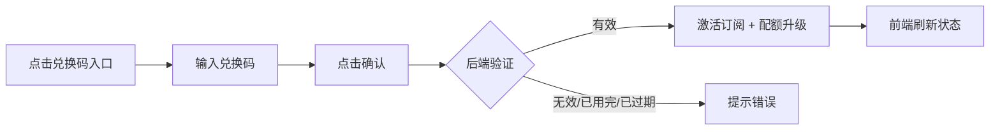
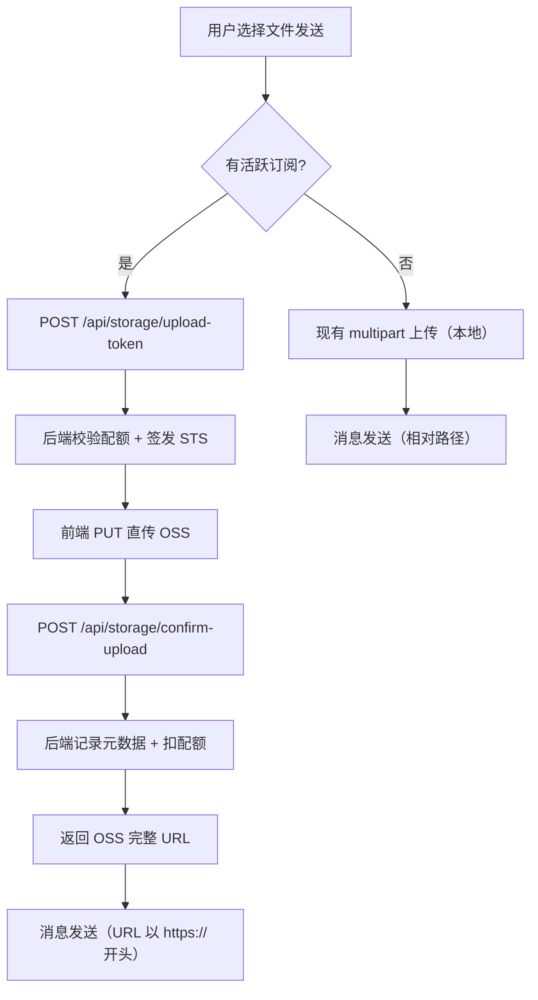
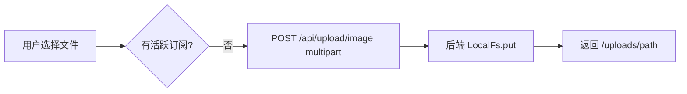
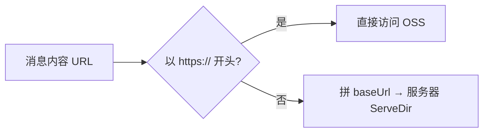

# 云空间 OSS 存储 + 订阅兑换 — 功能分析

## 概述

为付费用户接入阿里云 OSS 存储，实现前端 STS Token 直传，文件不过服务器。通过兑换码激活订阅，验证整条链路：兑换 → 订阅激活 → OSS 上传可用。普通用户保持现有本地上传逻辑不变。

前置依赖：[cloud/v0.0.1](../v0.0.1/analysis.md)（文件管理基础）、[cloud/v0.0.2](../v0.0.2/analysis.md)（桌面端适配）

---

## 一、交互链

### 场景 1：兑换码激活订阅

**用户故事**：作为用户，我想输入兑换码激活云空间 Pro 订阅，以便获得更大的存储空间和 OSS 直传能力。

用户在云空间页或设置页点击"兑换码"入口，弹出输入框，输入兑换码后点击确认。后端验证兑换码有效性，激活订阅，前端收到成功响应后刷新订阅状态和配额。

### 场景 2：付费用户上传文件（OSS 直传）

**用户故事**：作为已订阅的付费用户，我想在发送图片/视频/文件时自动走 OSS 直传，以便享受更快的上传速度和更大的存储空间。

付费用户发送媒体消息时，前端检测到有活跃订阅 → 先请求后端获取 STS Token → 拿到临时凭证后直接 PUT 文件到 OSS → 上传成功后通知后端确认（记录元数据 + 扣配额）→ 消息中存储 OSS 完整 URL。

### 场景 3：普通用户上传文件（不变）

**用户故事**：作为免费用户，我的上传体验完全不变，依然走现有的服务端 multipart 上传。

### 场景 4：查看付费用户上传的文件

**用户故事**：作为任何用户，我查看付费用户发送的文件时，URL 以 https:// 开头，直接从 OSS 公网加载，无需经过服务器。

前端现有逻辑已兼容：`_resolveUrl` 判断 URL 以 `https://` 开头则直接使用，否则拼 baseUrl。不需要改动。

---

## 二、逻辑树

### 事件流：兑换码激活

| 时刻 | 事件 | 处理 | 产生的新事件 |
|------|------|------|-------------|
| T1 | 用户提交兑换码 | POST /api/subscriptions/redeem | — |
| T2 | 后端查 redeem_codes | 检查：存在 + used_count < max_uses + 未过期 | — |
| T3 | 验证通过 | 创建 user_subscriptions 记录（active, expires_at=now+duration_days） | — |
| T4 | 更新 redeem_codes.used_count | used_count += 1 | — |
| T5 | 重新计算配额 | 100MB + SUM(活跃订阅 storage_bytes) → 更新 user_storage_quota | WS STORAGE_QUOTA_UPDATE |
| T6 | 返回成功 | 返回新的订阅状态 + 配额信息 | 前端刷新 |

### 事件流：OSS 直传上传

| 时刻 | 事件 | 处理 | 产生的新事件 |
|------|------|------|-------------|
| T1 | 前端请求 upload-token | POST /api/storage/upload-token（file_name, size, mime_type） | — |
| T2 | 后端验证订阅状态 | 查 user_subscriptions 有活跃订阅 | — |
| T3 | 后端验证配额 | used + size <= quota | — |
| T4 | 签发 STS Token | 调阿里云 STS AssumeRole，限制 path prefix `users/{uid}/` | — |
| T5 | 返回凭证 | access_key_id, access_key_secret, security_token, bucket, endpoint, object_key | — |
| T6 | 前端 PUT 到 OSS | 用临时凭证直传文件 | — |
| T7 | 前端确认上传 | POST /api/storage/confirm-upload（object_key, size, mime_type, hash） | — |
| T8 | 后端验证文件存在 | 调 OSS HeadObject 确认 | — |
| T9 | 后端记录元数据 | 插入 file_objects + 扣减配额 | WS STORAGE_QUOTA_UPDATE |
| T10 | 返回完整 URL | `https://{bucket}.{endpoint}/{object_key}` | — |

### 事件流：upload-token 拒绝（异常路径）

| 时刻 | 事件 | 处理 | 产生的新事件 |
|------|------|------|-------------|
| T1 | 前端请求 upload-token | POST /api/storage/upload-token | — |
| T2 | 后端检查 | 无活跃订阅 → 403 "需要订阅" | — |
| T2' | 后端检查 | 配额不足 → 403 "QUOTA_EXCEEDED" | — |
| T3 | 前端收到 403 | 回退到本地 multipart 上传 / 提示配额不足 | — |

### 状态流转

| 实体 | 触发事件 | 前状态 | 后状态 |
|------|---------|--------|--------|
| user_subscriptions | 兑换码兑换成功 | 无记录 | status=active, expires_at=now+30d |
| user_subscriptions | 到期 | active | expired |
| user_storage_quota | 订阅激活 | quota=100MB | quota=100MB+1GB |
| user_storage_quota | 订阅到期 | quota=1.1GB | quota=100MB |
| redeem_codes | 被使用 | used_count=N | used_count=N+1 |
| file_objects | confirm-upload | 无记录 | 新增记录（storage_backend='oss'） |

---

## 三、功能编号与网络定位

### 本次新增节点

| 编号 | 功能节点 | 层级 | 简介 |
|------|---------|------|------|
| I-29 | OSS 存储后端 | 基础设施 | OssBackend 实现 StorageBackend trait，对接 S3 兼容协议 |
| I-30 | STS Token 签发 | 基础设施 | 调阿里云 STS AssumeRole，生成限时限路径的临时凭证 |
| D-48 | 订阅计划管理 | 领域 | subscription_plans + user_subscriptions CRUD |
| D-49 | 兑换码兑换 | 领域 | 验证兑换码 → 创建订阅 → 配额升级 |
| D-50 | OSS 上传确认 | 领域 | confirm-upload：验证文件存在 + 记录元数据 + 扣配额 |
| P-83 | 兑换码输入页 | 前端业务 | 输入兑换码 + 验证 + 刷新订阅状态 |
| F-27 | OSS 直传上传器 | 前端基础 | 获取 STS Token → PUT OSS → confirm 的封装 |

### 前置依赖

| 依赖节点 | 依赖方式 | 是否已有 |
|----------|---------|---------|
| I-22 StorageBackend 抽象 | 新增 OssBackend 实现 | ✅ trait 已定义 |
| I-23 文件元数据服务 | confirm-upload 复用元数据记录逻辑 | ✅ |
| I-25 WS 配额通知 | 兑换成功后推送配额变更 | ✅ |
| D-43 用户云配额管理 | 订阅激活/到期时更新 quota_bytes | ✅ |
| P-79 云空间 Tab | 兑换码入口 + 订阅状态展示 | ✅ |

### 边界接口

| 接口/协议 | 定义方 | 消费方 | 说明 |
|-----------|--------|--------|------|
| POST /api/subscriptions/redeem | app-subscription | 前端兑换码页 | 兑换码激活订阅 |
| GET /api/subscriptions/status | app-subscription | 前端（判断上传方式） | 查询订阅状态 |
| POST /api/storage/upload-token | app-storage | 前端 OSS 上传器 | 签发 STS 临时凭证 |
| POST /api/storage/confirm-upload | app-storage | 前端 OSS 上传器 | 确认上传完成 |
| 阿里云 STS AssumeRole | 阿里云 | app-storage（后端） | 获取临时 AK/SK/Token |
| 阿里云 OSS PUT Object | 阿里云 | 前端 OSS 上传器 | 直传文件 |

---

## 四、结论

### 开发顺序建议

**后端优先**：
1. 订阅模块（subscription_plans + user_subscriptions + redeem_codes + 兑换接口）
2. OSS 后端（OssBackend + STS 签发 + confirm-upload 接口）
3. 后端测试

**前端跟进**：
4. OSS 直传上传器封装
5. 兑换码 UI
6. 上传流程分流（有订阅走 OSS，无订阅走本地）

### 复杂度集中点

- **STS Token 签发**：需要正确配置阿里云 RAM 角色 + Policy（限制 bucket + path prefix + 时效）
- **confirm-upload 安全**：后端必须 HeadObject 验证文件真实存在，防止伪造
- **前端上传分流**：需要在上传前异步查询订阅状态，缓存结果避免每次都请求
- **缩略图处理**：OSS 模式下缩略图由前端生成后一起直传（两次 PUT），不再走后端 ImageProcessor

### 暂不实现

- iOS 内购（下版本，本期用兑换码验证链路）
- 到期自动降级（后端定时任务，下版本）
- 配额奖励表（签到/邀请，下版本）
- CDN 加速（先跑通基础链路）
- 大文件分片上传（50MB 限制够用）
